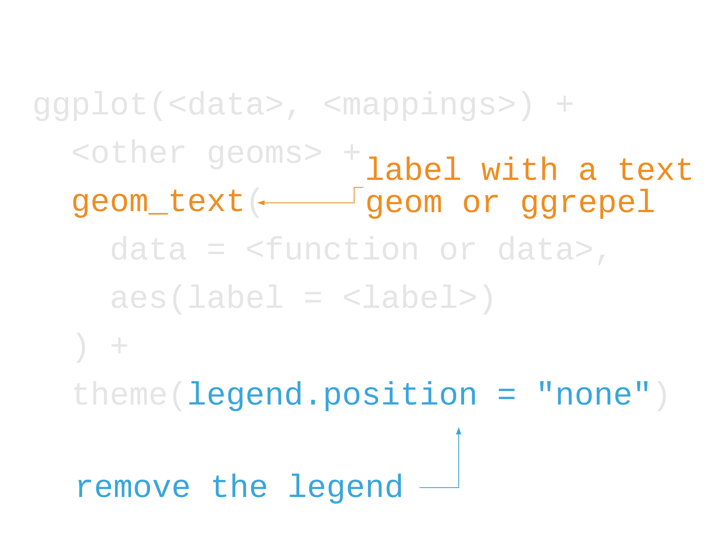
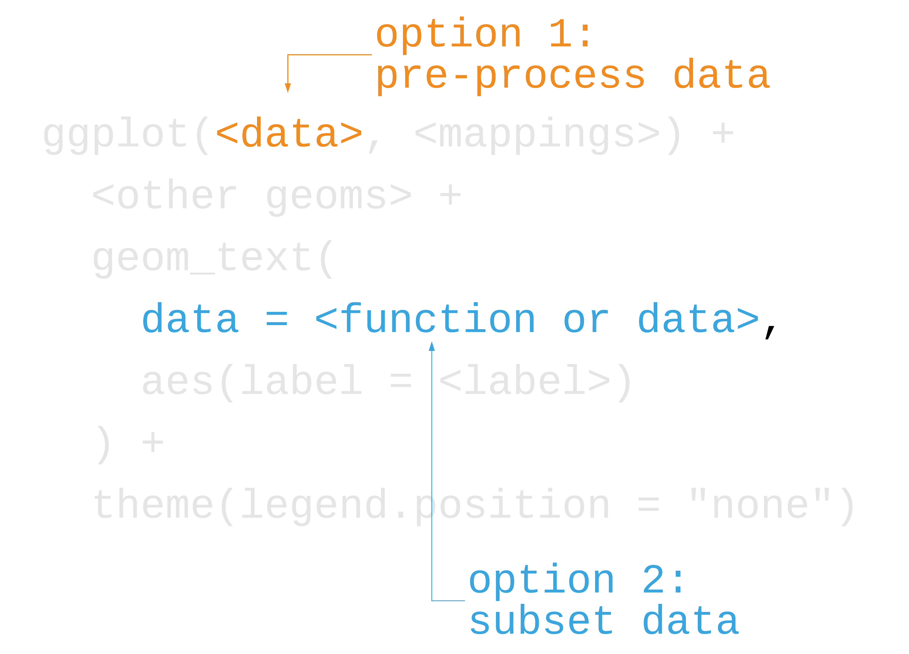
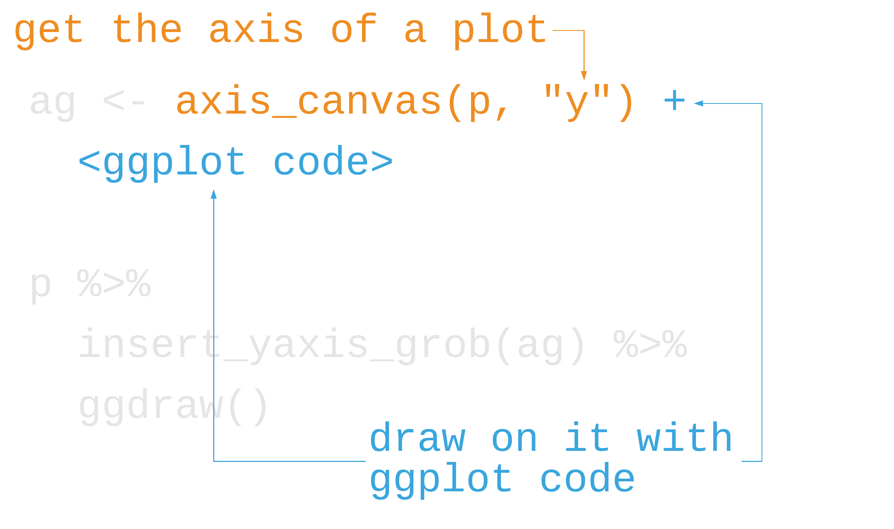
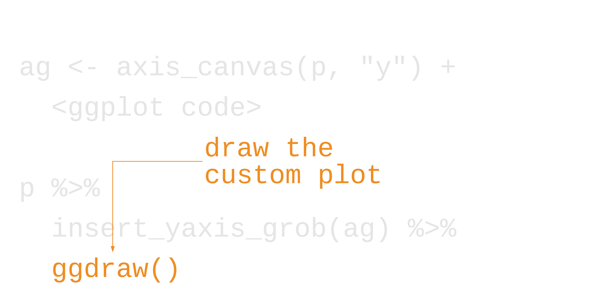
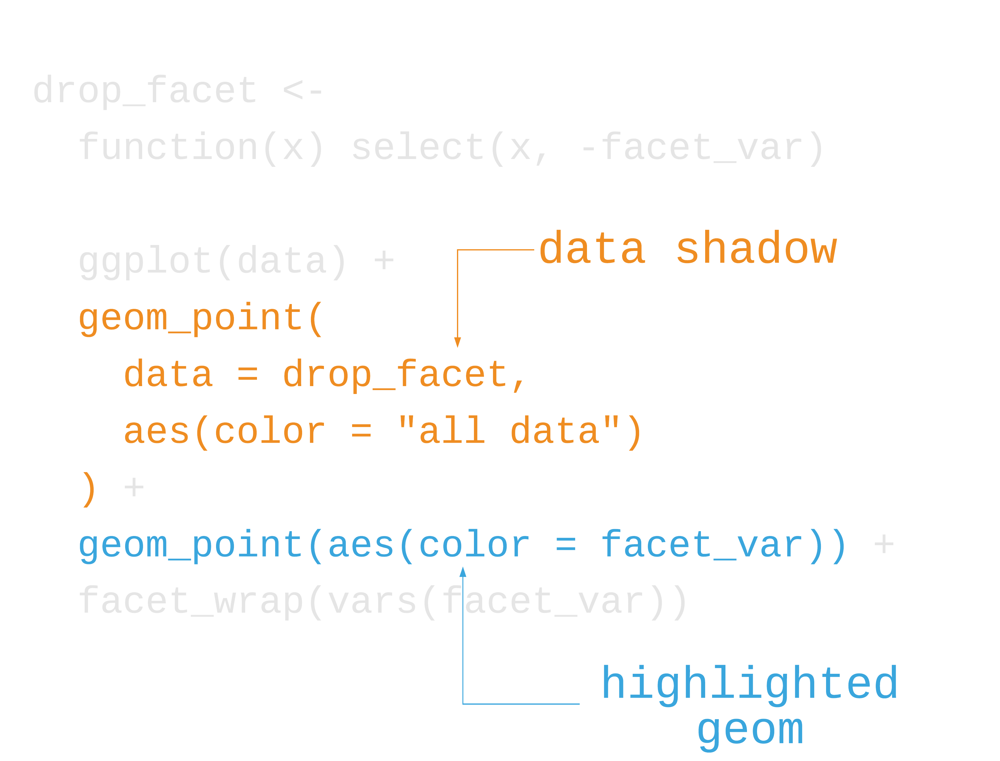
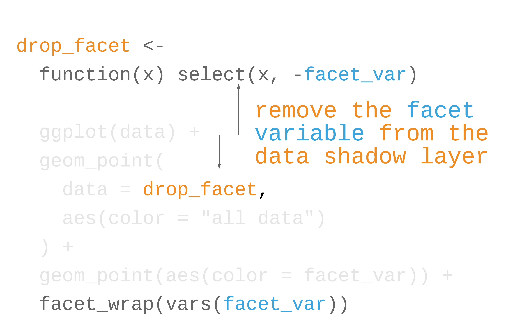
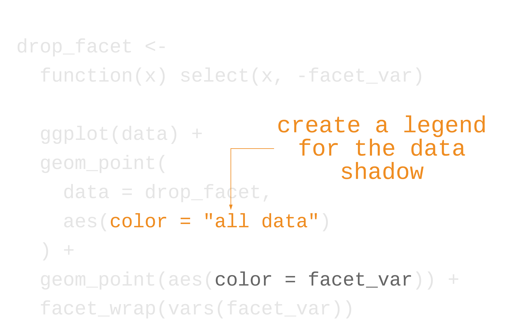
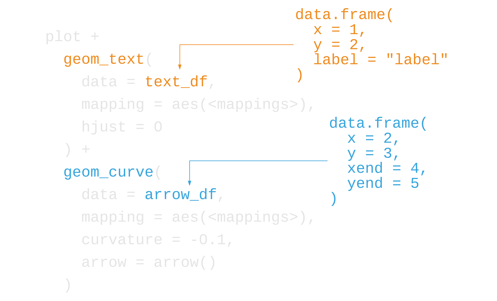
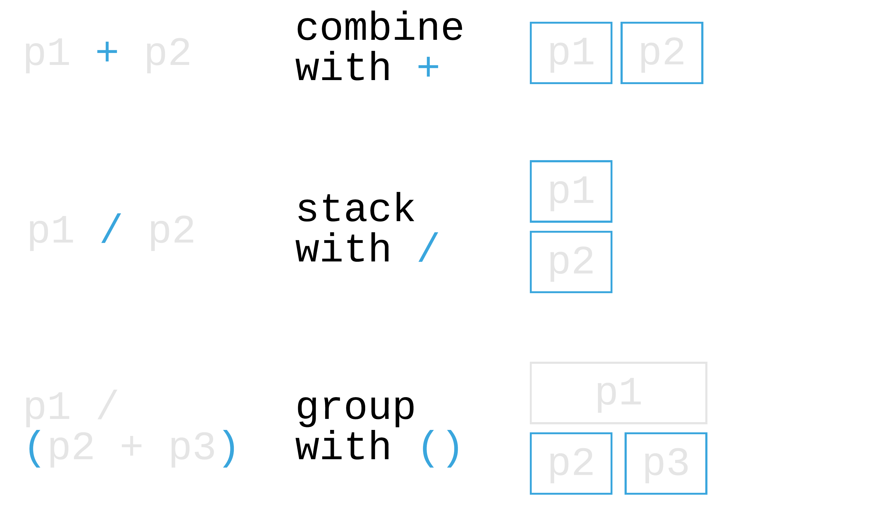
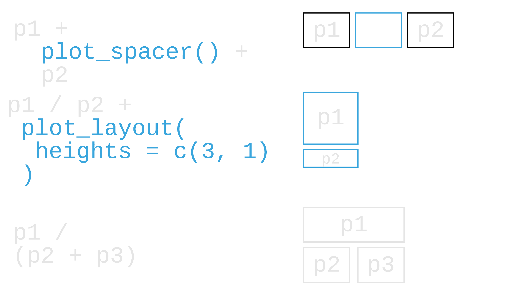

class: middle, inverse

```{r setup, include=FALSE}
options(htmltools.dir.version = FALSE, tibble.max_extra_cols = 6, tibble.width = 60)
knitr::opts_chunk$set(
  warning = FALSE, 
  message = FALSE, 
  dev = "ragg_png",
  fig.align = "center", 
  dpi = 320, 
  fig.height = 4.5
)

library(tidyverse)
library(gapminder)
```

## "We need to do everything we can to help our readers understand the meaning of our visualizations and see the same patterns in the data that we see. This usually means less is more. *Simplify your figures* as much as possible. *Remove all features that are tangential to your story*"
### &mdash; Claus O. Wilke

---

class: center, inverse, takeaways

## **act one: focus and declutter**

---

class: center, inverse, takeaways

## ~~act one: focus and declutter~~
## **act two: narrate and put in context**

---


class: middle, center, inverse

## **The cast of characters**

---

class: inverse

## Packages

1. `ggplot2`
1. `gghighlight`
1. `cowplot`
1. `ggtext`
1. `prismatic`
1. `patchwork`
---


class: inverse

## data

1. `emperors` (`data/emperors.csv`)
1. `gapminder` (`library(gapminder)`)
1. `nyc_squirrels` (`data/nyc_squirrels.csv` + `data/central_park/`)
1. `diabetes` (`data/diabetes.csv`)
1. `la_heat_income` (`data/los-angeles.geojson`)

---

## Themes

```{r, echo = FALSE, fig.height = 4.2}
df <- data.frame(x = 1:5, y = 1:5)
lbl <- function(x) facet_wrap(vars(!!x))

theme_plot <- ggplot(df, aes(x, y)) +
  coord_equal()

theme_plot + theme_minimal(14) + theme(panel.grid.minor = element_blank()) + lbl("theme_minimal(14) + \ntheme(panel.grid.minor = element_blank())")
```

---

## Themes: cowplot

```{r, echo = FALSE, fig.height = 4}
theme_plot + cowplot::theme_minimal_grid() + lbl("cowplot::theme_minimal_grid()")
```

---

## Themes: cowplot

```{r, echo = FALSE, fig.height = 4}
theme_plot + cowplot::theme_minimal_hgrid() + lbl("cowplot::theme_minimal_hgrid()")
```

---

## Themes: cowplot

```{r, echo = FALSE, fig.height = 4}
theme_plot + cowplot::theme_minimal_vgrid() + lbl("cowplot::theme_minimal_vgrid()")
```

---

## Themes: cowplot

```{r, echo = FALSE, fig.height = 4}
usa_data <- map_data("usa")
ggplot(usa_data, aes(long, lat)) +
  geom_polygon(fill = "grey90") +
  cowplot::theme_map() +
  coord_map() +
  lbl("cowplot::theme_map()")
```


---

## Palettes

```{r, echo=FALSE, fig.height=3}
prismatic::color(ggokabeito::palette_okabe_ito()) |> plot()
```

## Okabe-Ito (`ggokabeito::palette_okabe_ito()`)

---

## Palettes

```{r, echo=FALSE, fig.height=3}
prismatic::color(viridis::inferno(8)) |> plot()
```

## viridis inferno (`viridis::inferno()`)

---

## Palettes

```{r, echo=FALSE, fig.height=3}
prismatic::color(paste0("grey", c(10, 25, 35, 50, 60, 70, 80, 90))) |> plot()
```

## greys (`"grey**"`, `grey(.**)`)

---

class: middle, inverse, center

## **act one: focus and declutter**

--

## **or: reducing mental burden in figures**

---

class: inverse, center

## How do we reduce mental burden in our plots?

---

class: inverse, center

## How do we reduce mental burden in our plots?
## **simplify aesthetics and highlight**

---

```{r}
emperors <- read_csv(file.path("data", "emperors.csv"))

emperors
```

---

```{r, emperors_unordered, eval = FALSE}
emperors |>
  count(cause) |> #<<
  ggplot(aes(x = n, y = cause)) +
  geom_col() + #<<
  geom_text( #<<
    aes(label = n, x = n - .25), #<<
    color = "white",
    size = 5,
    hjust = 1
  ) +
  cowplot::theme_minimal_vgrid(16) +
  theme(
    axis.title.y = element_blank(),
    legend.position = "none"
  ) +
  xlab("number of emperors")
```

---

```{r, ref.label="emperors_unordered", echo = FALSE}

```

---

```{r emperors_ordered, eval = FALSE}
emperors |>
  count(cause) |>
  arrange(n) |> #<<
  mutate(cause = fct_inorder(cause)) |> #<<
  ggplot(aes(x = n, y = cause)) +
  geom_col() +
  geom_text(
    aes(label = n, x = n - .25),
    color = "white",
    size = 5,
    hjust = 1
  ) +
  cowplot::theme_minimal_vgrid(16) +
  theme(
    axis.title.y = element_blank(),
    legend.position = "none"
  ) +
  xlab("number of emperors")
```

---

```{r, ref.label="emperors_ordered", echo = FALSE}
```

---

```{r emperors_highlighted_prep}
emperors_assassinated <- emperors |>
  count(cause) |>
  arrange(n) |>
  mutate(
    assassinated = ifelse(cause == "Assassination", TRUE, FALSE), #<<
    cause = fct_inorder(cause)
  )
```

---

```{r emperors_highlighted, eval = FALSE}
emperors_assassinated |>
  ggplot(aes(x = n, y = cause, fill = assassinated)) + #<<
  geom_col() +
  geom_text(
    aes(label = n, x = n - .25),
    color = "white",
    size = 5,
    hjust = 1
  ) +
  cowplot::theme_minimal_vgrid(16) +
  theme(
    axis.title.y = element_blank(),
    legend.position = "none"
  ) +
  scale_fill_manual( #<<
    name = NULL, #<<
    values = c("#B0B0B0D0", "#D55E00D0") #<<
  ) +
  xlab("number of emperors")
```

---

```{r, ref.label="emperors_highlighted", echo = FALSE}
```


---

## Your Turn 1 

```{r, echo=FALSE}
emperor_killers_unsorted <- emperors |>
  # group the least common killers to "other"
  mutate(killer = fct_lump(killer, 10)) |>
  count(killer)

emperor_killers_unsorted |>
  ggplot(aes(x = n, y = killer)) +
  geom_col() +
  geom_text(
    aes(label = n, x = n - .25),
    color = "white",
    size = 5,
    hjust = 1
  ) +
  cowplot::theme_minimal_vgrid(16) +
  theme(
    axis.title.y = element_blank()
  ) +
  xlab("number of emperors")
```


---

## Your Turn 1 

#### Read in the emperors data (no need to change this part of the code)
#### Sort the data using `arrange()` by the number of each type of killer
#### Take a look at the data up until this point. Pick something you find interesting that you want to highlight. Then, in `mutate()`, create a new variable that is `TRUE` if `killer` matches the category you want to highlight and `FALSE` otherwise
#### Use the variable you just created in the `fill` aesthetic of the ggplot call
#### Finally, use `scale_fill_manual()` to add the fill colors. Set `values` to `c("#B0B0B0D0", "#D55E00D0")`.

---

```{r}
emperor_killers <- emperors |>
  # group the least common killers to "other"
  mutate(killer = fct_lump(killer, 10)) |>
  count(killer) |>
  arrange(n) #<<
```

---

```{r, highlight.output = 8}
emperor_killers
```

---

```{r, emperor_killers, eval=FALSE}
lightning_plot <- emperor_killers |>
  mutate(
    lightning = ifelse(killer == "Lightning", TRUE, FALSE), #<<
    # use `fct_inorder()` to maintain the way we sorted the data
    killer = fct_inorder(killer)
  ) |>
  ggplot(aes(x = n, y = killer, fill = lightning)) + #<<
  geom_col() +
  geom_text(
    aes(label = n, x = n - .25),
    color = "white",
    size = 5,
    hjust = 1
  ) +
  cowplot::theme_minimal_vgrid(16) +
  theme(
    axis.title.y = element_blank(),
    legend.position = "none"
  ) +
  scale_fill_manual(values = c("#B0B0B0D0", "#D55E00D0")) + #<<
  xlab("number of emperors")

lightning_plot
```

---

```{r, ref.label="emperor_killers", echo = FALSE}
```

---

class: inverse, center

# Use color to focus attention

<br>

# *1 2 3 4* **5** *6 7 8 9*

---

class: inverse, center

# Use color to focus attention

<br>

# ~~1 2 3 4 5 6 7 8 9~~

<br>

# ~~1 2~~ *3* ~~4 5 6 7 8 9~~

---

# ggtext: Improved text rendering in ggplot2

```{r}
library(ggtext)
```

## Use markdown in ggplot2 with `element_markdown()`
## Allows styled text anywhere!
## Can also insert images

---

```{r emperors_highlighted_ggtext1, eval = FALSE}
library(glue)
library(ggtext)

emperors_assassinated <- emperors_assassinated |>
  mutate(
    cause = glue( #<<
      "<span style='color:{ifelse( \\#<<
      cause == 'Assassination', \\#<<
      '#D55E00D0', \\#<<
      '#B0B0B0D0')}'> \\#<<
      {cause} \\#<<
      </span>" #<<
    ), #<<
    cause = fct_inorder(cause)
  )
```

```{r emperors_highlighted_ggtext2, echo = FALSE}
library(glue)
library(ggtext)

emperors_assassinated <- emperors_assassinated |>
  mutate(
    cause = glue(
      "<span style='color:{ifelse( \\
      cause == 'Assassination', \\
      '#D55E00D0', \\
      '#B0B0B0D0')}'> \\
      {cause} \\
      </span>"
    ),
    cause = fct_inorder(cause)
  )
```

---

```{r emperors_highlighted2, eval = FALSE}
emperors_assassinated |>
  ggplot(aes(x = n, y = cause, fill = assassinated)) +
  geom_col() +
  geom_text(
    aes(label = n, x = n - .25),
    color = "white",
    size = 5,
    hjust = 1
  ) +
  cowplot::theme_minimal_vgrid(16) +
  theme( #<<
    axis.text.y = element_markdown(), #<<
    axis.title.y = element_blank(),
    legend.position = "none",
  ) +
  scale_fill_manual(
    name = NULL,
    values = c("#B0B0B0D0", "#D55E00D0")
  ) +
  xlab("number of emperors")
```

---

```{r, ref.label="emperors_highlighted2", echo = FALSE}
```


---

class: inverse, center

## How do we reduce mental burden in our plots?
## ~~simplify aesthetics and highlight~~
## **design figures without legends**

---

```{r}
library(gapminder)
gapminder
```

---

```{r scatterplot_legend, eval=FALSE}
gapminder |>
  filter(year == 2007) |>
  ggplot(aes(log(gdpPercap), lifeExp)) + #<<
  geom_point( #<<
    aes(color = country), #<<
    size = 3.5,
    alpha = .9
  ) +
  theme_minimal(14) +
  theme(panel.grid.minor = element_blank()) +
  labs(
    x = "log(GDP per capita)",
    y = "life expectancy"
  )
```

---

class: center

```{r, ref.label="scatterplot_legend", echo = FALSE}
```

---

class: inverse, center

# Direct labeling 

1. Label data directly (maybe a subset)
2. Remove the legend
3. Use proximity and similarity (e.g. same color)

---

```{r, out.width="95%", echo = FALSE}
knitr::include_graphics("img/direct_labeling.png")
``` 

---

```{r, out.width="95%", echo = FALSE}

```

---

```{r, out.width="95%", echo = FALSE}

```


---

background-image: url(http://hexb.in/hexagons/ggrepel.png)
background-position: 90% 52%

# ggrepel: Repel overlapping text

```{r}
library(ggrepel)
```

--

## `geom_text_repel()`
<br>
## `geom_label_repel()`

---

```{r scatterplot_all_lbl, eval=FALSE}
gapminder |>
  filter(year == 2007) |>
  ggplot(aes(log(gdpPercap), lifeExp)) +
  geom_point(
    size = 3.5,
    alpha = .9,
    shape = 21,
    col = "white",
    fill = "#0162B2"
  ) +
  geom_text_repel(aes(label = country)) + #<<
  theme_minimal(14) +
  theme(panel.grid.minor = element_blank()) +
  labs(
    x = "log(GDP per capita)",
    y = "life expectancy"
  )
```

---

```{r, ref.label="scatterplot_all_lbl", echo = FALSE}
```

---

## Your Turn 2


### Use `sample()` to select 10 random countries to plot (run the `set.seed()` line first if you want the same results)
### In the `mutate()` call, check if `country` is one of the countries in `ten_countries`. If it's not, make the label an empty string (""),
### Add the text repel geom from ggrepel. Set the `label` aesthetic using the variable just created in `mutate()`

---

```{r}
library(gapminder)
library(ggrepel)

set.seed(42)

ten_countries <- gapminder$country |>
  levels() |>
  sample(10) #<<

ten_countries
```

---

```{r}
p1 <- gapminder |>
  filter(year == 2007) |>
  mutate(
    label = ifelse( #<<
      country %in% ten_countries, #<<
      as.character(country), #<<
      "" #<<
    ) #<<
  ) |>
  ggplot(aes(log(gdpPercap), lifeExp)) +
  geom_point(
    size = 3.5,
    alpha = .9,
    shape = 21,
    col = "white",
    fill = "#0162B2"
  )
```

---

```{r your_turn_2, eval = FALSE}
scatter_plot <- p1 +
  geom_text_repel( #<<
    aes(label = label), #<<
    size = 4.5,
    max.overlaps = Inf, #<<
    box.padding = .3, #<<
    force = 1, #<<
    min.segment.length = 0 #<<
  ) +
  theme_minimal(14) +
  theme(
    legend.position = "none",
    panel.grid.minor = element_blank()
  ) +
  labs(
    x = "log(GDP per capita)",
    y = "life expectancy"
  )

scatter_plot
```

---

```{r, ref.label="your_turn_2", echo = FALSE}
```

---

```{r your_turn_2_no_overlap, echo = FALSE}
p1 +
  geom_text_repel(
    aes(label = label),
    size = 4.5,
    box.padding = .3,
    force = 1,
    min.segment.length = 0
  ) +
  theme_minimal(14) +
  theme(
    legend.position = "none",
    panel.grid.minor = element_blank()
  ) +
  labs(
    x = "log(GDP per capita)",
    y = "life expectancy"
  )
```
---

```{r geom_text, eval = FALSE}
p1 +
  geom_text( #<<
    data = function(x) filter(x, country == "Gabon"), #<<
    aes(label = country),
    size = 4.5,
    hjust = 0, #<<
    nudge_x = .06 #<<
  ) +
  theme_minimal(14) +
  theme(
    legend.position = "none",
    panel.grid.minor = element_blank()
  ) +
  labs(
    x = "log(GDP per capita)",
    y = "life expectancy"
  )
```
---

```{r, ref.label="geom_text", echo = FALSE}
```

---

class: inverse, center

## How do we reduce mental burden in our plots?
## ~~simplify aesthetics and highlight~~
## ~~design figures without legends~~
## **hack geoms and legends and even the plot itself**

---

# Inserting plot objects into the axis

```{r marginal_hist_intro, eval = FALSE}
library(cowplot)
```

---

# Inserting plot objects into the axis

```{r marginal_hist, eval = FALSE}
library(cowplot)
marginal_histogram <- axis_canvas(scatter_plot, "y") + #<<
  geom_histogram( #<<
    data = gapminder |> filter(year == 2007),
    bins = 40,
    aes(y = lifeExp),
    fill = "#0162B2E6",
    color = "white"
  )

scatter_plot |>
  insert_yaxis_grob(marginal_histogram) |> #<<
  ggdraw() #<<
```

---

```{r, ref.label="marginal_hist", echo = FALSE}
```

---

```{r, out.width="95%", echo = FALSE}

``` 


---

```{r, out.width="95%", echo = FALSE}

``` 

---

```{r, out.width="95%", echo = FALSE}
knitr::include_graphics("img/axis_grob_insert.png")
```

---

```{r, out.width="95%", echo = FALSE}

```


---

## Your Turn 3

```{r, echo = FALSE}
gapminder |>
  group_by(continent, year) |>
  summarise(lifeExp = mean(lifeExp)) |>
  ggplot(aes(year, lifeExp, col = continent)) +
  geom_line(linewidth = 1) +
  theme_minimal_hgrid() +
  scale_color_manual(values = continent_colors) +
  scale_x_continuous(expand = expansion()) +
  labs(y = "life expectancy")
```

---

## Your Turn 3


#### Calculate the placement of the labels: in the `summarize()` call, create a variable called `y` that is the maximum `lifeExp` value for every continent For the labels, we'll use the continent names, which will be retained automatically. 

#### Remove the legend from the line plot. There are [several ways to do so in ggplot2](http://www.cookbook-r.com/Graphs/Legends_%28ggplot2%29/#removing-the-legend). I like setting `legend.position = "none"` in `theme()`.

#### `axis_canvas(line_plot, axis = "y")` creates a new ggplot2 canvas based on the y axis from `line_plot`. Add a text geom (using `+` as you normally would). In the text geom: set data to `direct_labels`; in `aes()`, set `y = y`, `label = continent`; Outside of `aes()` set `x` to `0.05` (to add a little buffer); Make the size of the text `4.5`; Set the horizontal justification to `0`

#### Use `insert_yaxis_grob()` to take `lineplot` and insert `direct_labels_axis`. 

#### Draw the new plot with `ggdraw()`

---

```{r}
library(cowplot)

# get the mean life expectancy by continent and year
continent_data <- gapminder |>
  group_by(continent, year) |>
  summarise(lifeExp = mean(lifeExp))

direct_labels <- continent_data |>
  group_by(continent) |>
  summarize(y = max(lifeExp)) #<<
```

---

```{r}
line_plot <- continent_data |>
  ggplot(aes(year, lifeExp, col = continent)) +
  geom_line(linewidth = 1) +
  theme_minimal_hgrid() +
  theme(legend.position = "none") + #<<
  scale_color_manual(values = continent_colors) +
  scale_x_continuous(expand = expansion()) +
  labs(y = "life expectancy")
```

---


```{r, your_turn_3, eval = FALSE}
direct_labels_axis <- axis_canvas(line_plot, axis = "y") +
  geom_text( #<<
    data = direct_labels,
    aes(y = y, label = continent),
    x = .05,
    size = 4.5,
    hjust = 0
  )

p_direct_labels <- insert_yaxis_grob(line_plot, direct_labels_axis) #<<

ggdraw(p_direct_labels) #<<
```

---

```{r, ref.label="your_turn_3", echo = FALSE}
```

---

# geomtextpath

```{r, geomtextpath, eval = FALSE}
library(geomtextpath) #<<
set.seed(787)
continent_data |>
  ggplot(aes(year, lifeExp, col = continent)) +
  geom_textline( #<<
    aes(label = continent), #<<
    hjust = rnorm(60, .5, .3), #<<
    vjust = -0.6, #<<
    linewidth = 1 #<<
  ) + #<<
  theme_minimal_hgrid() +
  scale_color_manual(values = continent_colors) +
  scale_x_continuous(expand = expansion()) +
  labs(y = "life expectancy") + 
  theme(legend.position = "none")
```

---

```{r, ref.label="geomtextpath", echo = FALSE}
```

---

class: inverse, center

## How do we reduce mental burden in our plots?
## ~~simplify aesthetics and highlight~~
## ~~design figures without legends~~
## ~~hack geoms and legends and even the plot itself~~
## **use facets and data shadows to plot overlapping data**

---

class: inverse, center

# Using facets to declutter data

1. Facets (or small multiples) are direct labeling for subsets
2. Put them into context with data shadows

---

```{r}
nyc_squirrels <- read_csv(file.path("data", "nyc_squirrels.csv")) #<<
central_park <- sf::read_sf(file.path("data", "central_park")) #<<
```

--

```{r squirrels_no_facet, eval = FALSE}
nyc_squirrels |>
  drop_na(primary_fur_color) |>
  ggplot() +
  geom_sf(data = central_park, color = "grey85") + #<<
  geom_point( #<<
    aes(x = long, y = lat, color = primary_fur_color), #<<
    size = .8 #<<
  ) + #<<
  cowplot::theme_map(16) +
  ggokabeito::scale_color_okabe_ito(name = "primary fur color")
```


---

```{r ref.label="squirrels_no_facet", echo=FALSE}
```

---

```{r squirrels_facet, eval = FALSE}
nyc_squirrels |>
  drop_na(primary_fur_color) |>
  ggplot() +
  geom_sf(data = central_park, color = "grey85") +
  geom_point(
    aes(x = long, y = lat, color = primary_fur_color),
    size = .8
  ) +
  facet_wrap(vars(primary_fur_color)) + #<<
  cowplot::theme_map(16) +
  theme(legend.position = "none") + #<<
  ggokabeito::scale_color_okabe_ito()
```

---

```{r ref.label="squirrels_facet", echo=FALSE}
```

---

```{r squirrels_facet_shadow, eval = FALSE}
label_colors <-
  c("all squirrels" = "grey75", "highlighted group" = "#0072B2")

nyc_squirrels |>
  drop_na(primary_fur_color) |>
  ggplot() +
  geom_sf(data = central_park, color = "grey85") +
  geom_point( #<<
    data = function(x) select(x, -primary_fur_color), #<<
    aes(x = long, y = lat, color = "all squirrels"), #<<
    size = .8 #<<
  ) + #<<
  geom_point(
    aes(x = long, y = lat, color = "highlighted group"), #<<
    size = .8
  ) +
  cowplot::theme_map(16) +
  theme(
    legend.position = "bottom",
    legend.justification = "center"
  ) +
  facet_wrap(vars(primary_fur_color)) +
  scale_color_manual(name = NULL, values = label_colors) +
  guides(color = guide_legend(override.aes = list(size = 3)))
```

---

```{r ref.label="squirrels_facet_shadow", echo=FALSE}
```

---

```{r, out.width="95%", echo = FALSE}
knitr::include_graphics("img/data_shadows.png")
``` 


---

```{r, out.width="95%", echo = FALSE}

``` 

---

```{r, out.width="95%", echo = FALSE}

```

---

```{r, out.width="95%", echo = FALSE}

```


---

## Your Turn 4

```{r, echo = FALSE}
diabetes <- read_csv(file.path("data", "diabetes.csv"))

density_colors <- c(
  "male" = "#56B4E9",
  "female" = "#009E73",
  "all participants" = grey(.85)
)

diabetes |>
  drop_na(glyhb, gender) |>
  ggplot(aes(glyhb)) +
  geom_density(aes(fill = gender, color = gender)) +
  scale_x_log10(name = "glycosylated hemoglobin a1c") +
  scale_color_manual(name = NULL, values = density_colors) +
  scale_fill_manual(name = NULL, values = density_colors) +
  theme_minimal_hgrid(16) +
  theme(legend.position = "bottom", legend.justification = "center")
```

---

## Your Turn 4
#### Run the code below and take a look at the resulting plot.
#### In the `ggplot()` function, add `y = after_stat(count)` to `aes()`
#### Add an additional `geom_density()` to the plot. This should go *before* the existing `geom_density()` so that it shows up in the background.
#### In the new `geom_density()`, set the `data` argument to be a function. This function should take a data frame and remove gender (which we're about to facet on).
#### Use `aes()` to set `color` and `fill`. Both should equal "all participants", *not* `gender`.
#### Use `facet_wrap()` to facet the plot by `gender`.

---

```{r your_turn_4, eval = FALSE}
diabetes |>
  drop_na(glyhb, gender) |>
  ggplot(aes(glyhb, y = after_stat(count))) + #<<
  geom_density( #<<
    data = function(x) select(x, -gender), #<<
    aes(fill = "all participants", color = "all participants") #<<
  ) + #<<
  geom_density(aes(fill = gender, color = gender)) +
  facet_wrap(vars(gender)) + #<<
  scale_x_log10(name = "glycosylated hemoglobin a1c") +
  scale_color_manual(name = NULL, values = density_colors) +
  scale_fill_manual(name = NULL, values = density_colors) +
  theme_minimal_hgrid(16) +
  theme(legend.position = "bottom", legend.justification = "center")
```

---

```{r ref.label="your_turn_4", echo = FALSE}
```

---

```{r your_turn4_bonus, eval = FALSE}
title <- glue(
  "Among <b style='color:{density_colors[3]}'>\\
 all participants</b>, there were more \\
 <b style='color:{density_colors[2]}'>females</b>\\
 than <b style='color:{density_colors[1]}'>\\
 males</b>"
)

previous_plot +
  theme(
    legend.position = "none",
    plot.title.position = "plot", #<<
    plot.title = element_textbox_simple(size = 14) #<<
  ) +
  ggtitle(title) #<<
```
---

```{r, echo = FALSE}
title <- glue(
  "Among <b style='color:{density_colors[3]}'>\\
 all participants</b>, there were more \\
 <b style='color:{density_colors[2]}'>females</b> \\
 than <b style='color:{density_colors[1]}'>\\
 males</b>"
)

diabetes |>
  drop_na(glyhb, gender) |>
  ggplot(aes(glyhb, y = after_stat(count))) +
  geom_density(
    data = function(x) select(x, -gender),
    aes(fill = "all participants", color = "all participants")
  ) +
  geom_density(aes(fill = gender, color = gender)) +
  facet_wrap(vars(gender)) +
  scale_x_log10(name = "glycosylated hemoglobin a1c") +
  scale_color_manual(name = NULL, values = density_colors) +
  scale_fill_manual(name = NULL, values = density_colors) +
  theme_minimal_hgrid(16) +
  theme(
    legend.position = "none",
    plot.title.position = "plot",
    plot.title = element_textbox_simple(size = 14)
  ) +
  ggtitle(title)
```

---

# gghighlight: Highlight geoms

```{r}
library(gghighlight)
```

## `gghighlight(predicate)`
## Works with points, lines, and histograms
## Facets well

---

## Your Turn 5

```{r, echo = FALSE}
africa <- gapminder |>
  filter(continent == "Africa") |>
  # sort by life expectancy in 1952
  arrange(year, desc(lifeExp)) |>
  mutate(country = fct_inorder(factor(country)))

africa |>
  ggplot(aes(year, lifeExp, color = country, group = country)) +
  geom_line(linewidth = 1.2, alpha = .9, color = "#E58C23") +
  theme_minimal(base_size = 14) +
  theme(
    legend.position = "none",
    panel.grid.major.x = element_blank(),
    panel.grid.minor = element_blank()
  ) +
  labs(y = "life expectancy", caption = "sorted by life expectancy in 1952") +
  xlim(1950, 2015)
```

---

## Your Turn 5

#### Take a look at the first few paragraphs of code. First, we're subsetting only African countries and sorting them by their life expectancy in 1952. Then, we're pivoting the data to be able to compare life expectancy in 1992 to 2007, creating a new variable, `le_dropped`, that is `TRUE` if life expectancy was higher in 1992. Then, we join `le_dropped` back to the data so we can use it in `gghighlight()`. Run the code at each step.

####  Remove the legend from the plot using the `legend.position` argument in `theme()`. Take a look at the base plot.

####  Use `gghighlight()` to add direct labels to the plot. For the first argument, tell it which lines to highlight using `le_dropped`. Also add the arguments `use_group_by = FALSE` and `unhighlighted_params = list(color = "grey90")`. 

####  Add `use_direct_label = FALSE` to `gghighlight()` and then facet the plot (using `facet_wrap()`) by country


---


```{r, echo=FALSE}
library(gghighlight)

africa <- gapminder |>
  filter(continent == "Africa") |>
  # sort by life expectancy in 1952
  arrange(year, desc(lifeExp)) |>
  mutate(country = fct_inorder(factor(country)))

# find the African countries that had better life expectancy in 1992 compared to 2007
life_expectancy_dropped <- africa |>
  pivot_wider(country, names_from = year, values_from = lifeExp) |>
  transmute(country, le_dropped = `1992` > `2007`)

# join `le_dropped` to each observation for each country
africa <- left_join(africa, life_expectancy_dropped, by = "country")
```


```{r, echo=FALSE}
le_line_plot <- africa |>
  ggplot(aes(year, lifeExp, color = country, group = country)) +
  geom_line(linewidth = 1.2, alpha = .9, color = "#E58C23") +
  theme_minimal(base_size = 13) +
  theme(
    legend.position = "none",
    panel.grid.major.x = element_blank(),
    panel.grid.minor = element_blank()
  ) +
  labs(y = "life expectancy", caption = "sorted by life expectancy in 1952") +
  xlim(1950, 2015)
```


```{r gghighlight1, eval = FALSE}
le_line_plot +
  gghighlight(
    le_dropped,
    use_group_by = FALSE,
    unhighlighted_params = list(color = "grey90")
  )
```

---

```{r ref.label="gghighlight1", echo = FALSE}
```

---


```{r gghighlight2, eval = FALSE}
le_line_plot +
  gghighlight(
    le_dropped,
    use_group_by = FALSE,
    use_direct_label = FALSE,
    unhighlighted_params = list(color = "grey90")
  ) +
  facet_wrap(vars(country))
```

---

```{r ref.label="gghighlight2", echo = FALSE, fig.height=5.25}
```

---

class: middle, inverse, center

## **intermission: working with colors**

---

background-image: url(https://raw.githubusercontent.com/EmilHvitfeldt/prismatic/master/man/figures/logo.png)
background-position: 90% 55%

# prismatic: manipulate colors in R

```{r}
library(prismatic)
```

---

## Visualize palettes

```{r, fig.height=3}
library(ggokabeito)
library(prismatic)
palette_okabe_ito() |> #<<
  color() |> #<<
  plot() #<<
```

---

## Darken and lighten colors

```{r, fig.height=3}
palette_okabe_ito() |>
  clr_darken() |> #<<
  plot()
```

---

## Saturate and desaturate colors

```{r, fig.height=3}
palette_okabe_ito() |>
  clr_desaturate() |> #<<
  plot()
```

---

## Set transparency

```{r, fig.height=3}
palette_okabe_ito() |>
  clr_alpha(.5) |> #<<
  plot()
```

---

## Simulate colorblindness

```{r, fig.height=3}
palette_okabe_ito() |>
  clr_deutan() |> #<<
  plot()
```

---

## Simulate colorblindness

```{r, fig.height=3}
rainbow(8) |> #<<
  color() |> 
  plot()
```

---

## Simulate colorblindness

```{r, fig.height=3}
rainbow(8) |>
  clr_deutan() |> #<<
  plot()
```

---

class: middle, inverse, center

## **act two: narrate and put in context**

--

## **or: storytelling with data visualization**

---

class: middle, inverse, center

## How do we augment plots to explain?

---

class: middle, inverse, center

## How do we augment plots to explain?
## **Annotate plots using text geoms and arrows**

---

## Squirrels and dogs

```{r dog_sighting_df}
dog_sighting <- nyc_squirrels |>
  mutate(dog = str_detect(other_activities, "dog")) |>
  filter(dog)
```

---

```{r, dog_sighting1}
lbl <- "All other dog sightings
involved a squirrel hiding or
being chased. This squirrel,
however, was actively teasing
a dog."

dog_plot <- nyc_squirrels |>
  ggplot() +
  geom_sf(data = central_park, color = "grey80") +
  geom_point(aes(x = long, y = lat), size = .8) +
  geom_point(
    data = dog_sighting,
    aes(
      x = long,
      y = lat,
      color = "squirrel interacting\nwith a dog"
    ),
    size = 1.5
  )
```

---

```{r, dog_sighting2, eval = FALSE}
dog_plot +
  ggrepel::geom_label_repel( #<<
    data = filter(
      dog_sighting,
      str_detect(other_activities, "teasing") #<<
    ),
    aes(x = long, y = lat, label = lbl),
    nudge_x = .015,
    size = 3.5,
    lineheight = .8,
    segment.color = "grey70"
  ) +
  cowplot::theme_map() +
  theme(legend.position = c(.05, .9)) +
  scale_color_manual(name = NULL, values = "#FB1919")
```

---

```{r, ref.label="dog_sighting2", echo=FALSE, fig.height=5.25}
```


---

```{r, lightning_label, eval = FALSE}
label <- "Carus, Roman emperor from 282–283,
allegedly died of a lightning strike while
campaigning against the Empire of Iranians.
He was succeded by his sons, Carinus, who
died in battle, and Numerian, whose cause
of death is unknown."

lightning_plot +
  geom_label( #<<
    data = data.frame(x = 5.8, y = 5, label = label), #<<
    aes(x = x, y = y, label = label),
    hjust = 0,
    lineheight = .8,
    inherit.aes = FALSE,
    label.size = NA
  ) +
  geom_curve( #<<
    data = data.frame(x = 5.6, y = 5, xend = 1.2, yend = 5), #<<
    mapping = aes(x = x, y = y, xend = xend, yend = yend),
    colour = "grey75",
    size = 0.5,
    curvature = -0.1,
    arrow = arrow(length = unit(0.01, "npc"), type = "closed"),
    inherit.aes = FALSE
  )
```


---

```{r, ref.label="lightning_label", echo=FALSE}
```

---

class: inverse, center, middle

# We won't use it today, but the **ggannotate** package has an add-in to help place annotations with less trial and error

---

```{r, out.width="95%", echo = FALSE}
knitr::include_graphics("img/annotating_ggplots.png")
``` 

---

```{r, out.width="95%", echo = FALSE}

```

---

## Your Turn 6

```{r, echo = FALSE}
la_heat_income <- sf::read_sf(file.path("data", "los-angeles.geojson"))
kelvin2farenheit <- function(k) (9 / 5) * (k - 273) + 32

base_map <- la_heat_income |>
  mutate(temp = kelvin2farenheit(X_median)) |>
  ggplot() +
  geom_sf(aes(fill = temp), color = "white", linewidth = .2) +
  cowplot::theme_map() +
  theme(legend.position = c(.9, .2)) +
  scale_fill_viridis_c(option = "inferno")

base_map
```

---

## Your Turn 6

#### Run the first code chunk and take a look at the map of surface heat in Los Angeles.

#### In the second code chunk, we need to create two new data frames to draw the annotations and arrows. Pick a name for each.

#### Add `geom_text()` and `geom_curve()` to `base_map`. Give each geom the relevant data that you just named in (2).

#### Let's clean up the geoms a bit. Reduce the `lineheight` of the text geom to `0.8`. Then, add arrows to the curve geom usiing the `arrow()` function. Give it two arguments: `length = unit(0.01, "npc")` and `type = "closed"`. Run the plot.

#### One of the labels is being clipped because it runs off the main plotting panel. Add `coord_sf(clip = "off")` to prevent clipping the text.

---

```{r, echo = FALSE}
west_label <- "The coolest corridor, from Santa Monica
to Griffith Park, was also the richest,
with higher median household income
than the rest of Los Angeles"

east_label <- "Census tracts in the north and southeast
of Los Angeles were its hottest. Like a lot
of US cities, these are also the places
where its poorest residents live."
```

```{r, fig.height=5.25}
text_labels <- tibble::tribble( #<<
  ~x,      ~y,    ~label,
  -118.90, 34.00, west_label,
  -118.20, 34.22, east_label
)

arrows <- tibble::tribble( #<<
  ~x, ~y, ~xend, ~yend,
  -118.73, 34.035, -118.60, 34.10,
  -118.21, 34.195, -118.35, 34.18,
  -118.08, 34.185, -118.15, 34.10
)
```

---

```{r your_turn_6, eval = FALSE}
base_map +
  geom_text( #<<
    data = text_labels, #<<
    aes(x, y, label = label),
    hjust = 0,
    vjust = 0.5,
    lineheight = .8
  ) +
  geom_curve( #<<
    data = arrows, #<<
    aes(x = x, y = y, xend = xend, yend = yend),
    colour = "grey75",
    size = 0.3,
    curvature = -0.1,
    arrow = arrow(length = unit(0.01, "npc"), type = "closed")
  ) +
  coord_sf(clip = "off") #<<
```

---

```{r, echo = FALSE}
base_map +
  geom_text( #<<
    data = text_labels, #<<
    aes(x, y, label = label),
    hjust = 0,
    vjust = 0.5,
    size = 2.25,
    lineheight = .8
  ) +
  geom_curve( #<<
    data = arrows, #<<
    aes(x = x, y = y, xend = xend, yend = yend),
    colour = "grey75",
    size = 0.3,
    curvature = -0.1,
    arrow = arrow(length = unit(0.01, "npc"), type = "closed")
  ) +
  coord_sf(clip = "off") #<<
```

---

class: middle, inverse, center

## How do we augment plots to explain?
## ~~Annotate plots using text geoms and arrows~~
## **Combine plots to build a cohesive narrative**

---

class: inverse, center

## Combine plots to tell a story

1. Build plots up from simpler to more complex
2. Don't use the same type of plot in each panel
3. Use consistent color

---

background-image: url(https://raw.githubusercontent.com/thomasp85/patchwork/master/man/figures/logo.png)
background-position: 90% 55%

# patchwork: Compose ggplots

```{r}
library(patchwork)
```

---

```{r, out.width="95%", echo = FALSE}
knitr::include_graphics("img/patchwork.png")
``` 

---

```{r, out.width="95%", echo = FALSE}

```

---

```{r, out.width="95%", echo = FALSE}

```

---

## Your Turn 7

```{r, echo=FALSE}
plot_colors <- c(female = "#009E73", male = "#0072B2")

label_frames <- function(lbl) paste(lbl, "\nframe")

theme_multiplot <- function(base_size = 14, ...) {
  theme_minimal(base_size = base_size, ...) %+replace%
    theme(
      panel.grid.major.x = element_blank(),
      panel.grid.minor = element_blank(),
      legend.position = "none"
    )
}

diabetes_complete <- diabetes |>
  drop_na(waist, hip, gender, frame, glyhb)
```


```{r, echo=FALSE}
plot_a <- diabetes_complete |>
  ggplot(aes(waist / hip, fill = gender)) +
  geom_density(
    col = "white",
    alpha = .7,
    size = .75
  ) +
  theme_multiplot() +
  scale_fill_manual(values = plot_colors) +
  annotate(
    "text",
    x = c(.75, .98),
    y = c(5, 5.70),
    label = names(plot_colors),
    color = plot_colors,
    size = 5
  ) +
  labs(tag = "A")
```


```{r, echo=FALSE}
plot_b <- diabetes_complete |>
  ggplot(aes(fct_rev(frame), waist / hip, fill = gender, col = gender)) +
  geom_boxplot(
    outlier.color = NA,
    alpha = .8,
    width = .5
  ) +
  theme_multiplot() +
  theme(axis.title.x = element_blank()) +
  scale_x_discrete(labels = label_frames) +
  labs(tag = "B")
```


```{r, echo=FALSE}
plot_c <- diabetes_complete |>
  ggplot(aes(waist / hip, glyhb, col = gender)) +
  geom_point(
    shape = 21,
    col = "white",
    fill = "grey80",
    size = 2.5
  ) +
  geom_smooth(
    method = "lm",
    formula = y ~ x,
    se = FALSE,
    size = 1.1
  ) +
  theme_minimal(base_size = 14) +
  theme(
    legend.justification = c(1, 0),
    legend.direction = "horizontal",
    panel.grid.minor = element_blank()
  ) +
  facet_wrap(~ fct_rev(frame), labeller = as_labeller(label_frames)) +
  scale_y_log10(breaks = c(3.5, 5.0, 7.0, 10.0, 14.0)) +
  scale_color_manual(name = "", values = plot_colors) +
  guides(color = guide_legend(override.aes = list(size = 5))) +
  labs(y = "hemoglobin a1c")
```


```{r, echo=FALSE}
library(patchwork)
(plot_a + plot_b) / plot_c
```

---

#### Run the first code chunk. `label_frames()` will help us label the `frame` variable better. `theme_multiplot()` is the theme we'll add to each plot. We'll use `diabetes_complete` for the plots (removing the missing values of the variables we're plotting produce the same plots as `diabetes` would, but it prevents ggplot2 from warning us that it's dropping the data internally). Nothing to change here!
#### Run the code for `plot_a` and take a look. Nothing to change here, either! 
#### The colors in `plot_b` don't match `plot_a`. Add `scale_color_manual()` to make the colors consistent. 
#### Also add `scale_fill_manual()`. For the fill colors, we'll add a bit of transparency. Use `clr_alpha(plot_colors, .69)` to make them slightly transparent.
#### This plot doesn't have a `tag` label like the other two plots. Add one to the `labs()` call.
#### The legend isn't working well, but let's take advantage of it. We'll move the legend to *above* the plot by setting `legend.position` to `c(1, 1.25)` in `theme()`. We wont' be able to see it in `plot_c`, but it will show up in the combined plot!

#### Finally, combine the 3 plots using patchwork. Have `plot_a` and `plot_b` on top and `plot_c` on the bottom.

---

```{r plot_b, eval=FALSE}
plot_b <- diabetes_complete |>
  ggplot(
    aes(fct_rev(frame),
      waist / hip,
      fill = gender,
      col = gender
    )
  ) +
  geom_boxplot(
    outlier.color = NA,
    alpha = .8,
    width = .5
  ) +
  theme_multiplot() +
  theme(axis.title.x = element_blank()) +
  scale_color_manual(values = plot_colors) + #<<
  scale_fill_manual(values = clr_alpha(plot_colors, .69)) + #<<
  scale_x_discrete(labels = label_frames) +
  labs(tag = "B")

plot_b
```

---

```{r, ref.label="plot_b", echo = FALSE}
```

---
<div style = 'font-size: 73%'>
```{r plot_c, eval=FALSE}
plot_c <- diabetes_complete |>
  ggplot(aes(waist / hip, glyhb, col = gender)) +
  geom_point(
    shape = 21,
    col = "white",
    fill = "grey80",
    size = 2.5
  ) +
  geom_smooth(
    method = "lm",
    formula = y ~ x,
    se = FALSE,
    size = 1.1
  ) +
  theme_minimal(base_size = 14) +
  theme(
    legend.position = c(1, 1.25), #<<
    legend.justification = c(1, 0),
    legend.direction = "horizontal",
    panel.grid.minor = element_blank()
  ) +
  facet_wrap(~ fct_rev(frame), labeller = as_labeller(label_frames)) +
  scale_y_log10(breaks = c(3.5, 5.0, 7.0, 10.0, 14.0)) +
  scale_color_manual(name = "", values = plot_colors) +
  guides(color = guide_legend(override.aes = list(size = 5))) +
  labs(y = "hemoglobin a1c", tag = "C") #<<

plot_c
```
</span>
---

```{r, ref.label="plot_c", echo = FALSE}
```

---

```{r your_turn_7, eval = FALSE}
library(patchwork)
(plot_a + plot_b) / plot_c #<<
```

---

```{r, ref.label="your_turn_7", echo = FALSE, fig.height=5.25}
```

---

class: inverse, center

# Resources
## [Fundamentals of Data Visualization](https://serialmentor.com/dataviz/) by Claus O. Wilke
## [Storytelling with Data](http://www.storytellingwithdata.com/) by Cole Nussbaumer Knaflic 
## [Better Presentations](https://policyviz.com/better-presentations/) by Jonathan Schwabish

