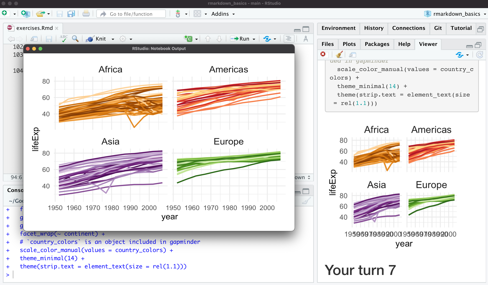
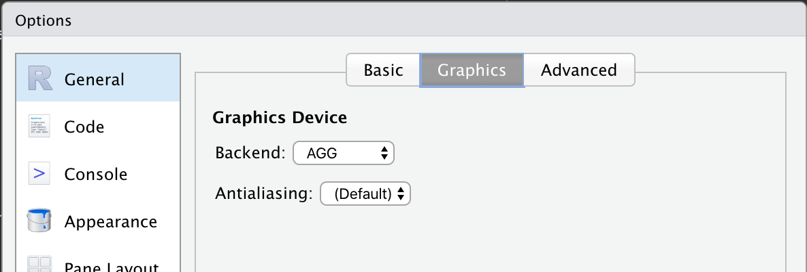

```{r}
#| label: setup
#| include: false
options(
  tibble.max_extra_cols = 6,
  tibble.width = 60
)

library(tidyverse)
library(gapminder)
library(here)
diabetes <- read_csv("diabetes.csv")
```

```{r}
#| out-width: 100%
#| echo: false

```

## What goes into a figure?

### **Absolute size**: physical dimensions (inches, cm, etc)

### **Pixel size**: no inherent size!

### **Resolution**: pixels per inch (ppi) or dots per inch (dpi); links absolute & pixel size

### **Pointsize**: absolute text size (1 pt = 1/72 inch)

### **Plot theming and aesthetics**: choices about text size, line size, margins, and so on.

## Essential options

|              |                                                                |
|--------------|----------------------------------------------------------------|
| `fig-height` | Rendered figure height (in)                                    |
| `fig-width`  | Rendered figure width (in)                                     |
| `fig-asp`    | Rendered figure aspect ratio (use with ONE of height or width) |
| `fig-dpi`        | Resolution                                                     |
| `out-height` | Figure container height (in); knitr only                                   |
| `out-width`  | Figure container width (in); knitr only                                  |


## Tweaking figure options

```{r}
#| out-width: 70%
#| echo: false
knitr::include_graphics("https://media.giphy.com/media/kFuavIYvRQZGg/giphy.gif")
```

## Getting a figure to look good in your IDE, Word, and slides

```{r}
#| out-width: 50%
#| echo: false
knitr::include_graphics("https://media.giphy.com/media/B2FBiUjiYiSMzJzmlL/giphy.gif")
```

## A few reasonable defaults in your YAML

```{yaml}
---
fig-width: 6
fig-asp: 0.618
fig-dpi: 320
---
```

## A few reasonable defaults in your YAML (knitr-specific)

```{yaml}
---
knitr:
  opts_chunk:
    dev: "ragg_png"
    out-width: "80%"
    fig-retina: 2
    fig-align: "center"
    fig-show: "hold"
    fig.path: "folder/prefix-"
---
```

#### Inspired by [R for Data Science](https://r4ds.had.co.nz/graphics-for-communication.html#figure-sizing) and [Jumping Rivers](https://www.jumpingrivers.com/blog/knitr-default-options-settings-hooks/)

## Plot scaling

```{r}
#| eval: false
ggplot(mpg, aes(displ, hwy)) + geom_point()
```

------------------------------------------------------------------------

::: columns
::: {.column width="50%"}
### `figure-width = 4`

```{r}
#| fig-width: 4.0
#| echo: false
ggplot(mpg, aes(displ, hwy)) + geom_point()
```

### `figure-width = 8`

```{r}
#| fig-width: 8.0
#| echo: false
ggplot(mpg, aes(displ, hwy)) + geom_point()
```
:::

::: {.column width="50%"}
### `figure-width = 6`

```{r}
#| fig-width: 6.0
#| echo: false
ggplot(mpg, aes(displ, hwy)) + geom_point()
```

### `figure-width = 10`

```{r}
#| fig-width: 10.0
#| echo: false
ggplot(mpg, aes(displ, hwy)) + geom_point()
```
:::
:::

## A note on plotting in Python

* For consistent figures, consider a higher-level abstraction like Seaborn or Plotnine
* matplotlib powers both! Knowing it is still useful for customizations
* With great power etc. etc.

## Colorblind friendly palettes: Okabe-Ito

```{r}
#| echo: false
scales::show_col(ggokabeito::palette_okabe_ito())
```

## Colorblind friendly palettes: viridis

```{r}
#| echo: false
scales::show_col(scales::pal_viridis()(16), cex_label = .85)
```

## Resources {background-color="#23373B"}

### [Quarto: Figures](https://quarto.org/docs/authoring/figures.html): Quarto documentation figures

### [Quarto: Article Layout](https://quarto.org/docs/authoring/article-layout-html): Quarto documentation article layout

### [Taking Control of Plot Scaling](https://www.tidyverse.org/blog/2020/08/taking-control-of-plot-scaling): A detailed blog on understanding scaling

# Bonus: scaling ggplot2 {background-color="#23373B"}

## Scaling saved files

### `
ggsave()
`: Set the `
scale
` option

### `
ragg::agg_png()
`: Set the `
scaling
` option

#### *Warning: these arguments work differently from one another!*

## ragg: AGG Graphic Devices {.large}

{.absolute top="0" right="0" width="140"}

. . .

Faster than grDevices or Cairo

. . .

Better system font access and text rendering

. . .

System independent rendering

## Setting ragg as your default in RStudio

`
``
{
  r
}
#| out-width: 90%
#| echo: false

```

This sets the default for the *viewer*, not Quarto

## What affects ggplot2 sizing? {background-color="#23373B"}

1.  geoms
2.  themes
3.  scales and axes
4.  clipping

## Theme sizing

. . .

ggplot2 themes all have a `base_size` argument, e.g.
`theme_minimal(base_size = 14)`

. . .

Consider well-proportioned cowplot themes, e.g. \*`theme_minimal_grid()`

. . .

## Expanding scales (`fig-width = 4`)

```{r}
#| fig-width: 4.0
#| echo: false
library(ggdag, warn.conflicts = FALSE)
ggdag(butterfly_bias()) +
  theme_dag()
```

##

```{r}
#| fig-width: 4.0
#| code-line-numbers: "|4-5"
#| output-location: slide
library(ggdag, warn.conflicts = FALSE)
ggdag(butterfly_bias()) +
  theme_dag() +
  scale_x_continuous(expand = expansion(.2)) +
  scale_y_continuous(expand = expansion(.2))
```

##  {.small}

```{r}
#| code-line-numbers: "|3,6"
p <- gapminder |>
  filter(year == 2007) |>
  slice_max(lifeExp, n = 25) |>
  mutate(country = fct_rev(fct_inorder(fct_drop(country)))) |>
  ggplot(aes(lifeExp, country)) +
  geom_point(size = 3, color = "steelblue") +
  geom_text(aes(label = country), hjust = 0, nudge_x = .1, size = 3.5) +
  theme_minimal(16) +
  theme(
    axis.title.y = element_blank(),
    axis.text.y = element_blank(),
    panel.grid.minor = element_blank(),
    panel.grid.major.y = element_blank()
  ) +
  xlab("Life Expectancy in 2007")
```

##

```{r}
p
```

##

```{r}
#| code-line-numbers: "2"
p +
  xlim(NA, 83)
```

##

```{r}
#| code-line-numbers: "3"
p +
  xlim(NA, 83) +
  coord_cartesian(clip = "off")
```
