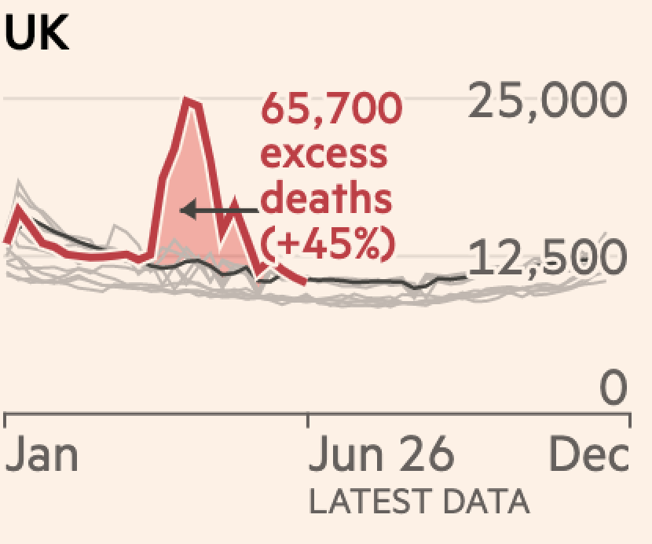

```{r setup, include=FALSE}
# knit options
knitr::opts_chunk$set(
  echo = TRUE,
  eval = FALSE
)
knitr::opts_knit$set(
  width = 78,
  progress = FALSE
)
```

# Exercise

The purpose of this exercise is to make a publication-ready plot using your `dplyr` and `ggplot2` skills. Open article from the Financial Times, called "2020-07-24-excess_mortality.pdf". 

Read the article and have a look at the figure titled, *Death rates have climbed far above historical averages in many countries that have faced Covid-19 outbreaks*. 

The data you need is "`ft_excess_deaths.csv`" in the `data` folder. You'll have 1 hour to see what you can come up with in groups or individually!

You got this. Don't worry about making it exactly, try and see how far you can get. You're encouraged to work together if you want to and exchange tips/tricks you figured out. At the bottom of this document, the "Resources" section may have a few helpful things to check out.


First, load the packages you need.

```{r}
library(tidyverse)
```

## Import the data

Import the .csv file below into `excess_deaths` using `read_csv()`

```{r import-ft_excess_deaths}
ft_excess_deaths <- ________("data/ft_excess_deaths.csv")
# TODO: maybe move as.numeric and factor code here?
```

### View the data 

Use `glimpse()` to view the `excess_deaths` data. 

```{r glimpse}
glimpse(______)
```

The skimr package has a function called `skim()`, which is a useful way to take a quick look at your data. Load the skimr package, then call `skim()` on `ft_excess_deaths.`

```{r skimr}
library(______)
_________
```


What are the variables measuring? The authors included a data dictionary in the [README file](https://github.com/Financial-Times/coronavirus-excess-mortality-data/blob/master/README.md) associated with these data: 

```
## Data definitions

For each jurisdiction and each weekly or monthly period, the data contains the 
following fields:

* `country`: the country to which the data applies  
* `region`: where applicable, the subnational or administrative region. This   
   duplicated `country` for national-level data  
* `period`: the period for which the data is collected. This can be “week” or   
   “month”; data reported daily has been aggregated into weeks   
* `year`: the year within which the period ends. The is the same as the year   
   element of the `date` field.  
* `month`: the month within which the period ends. This is the same as the   
   month element of the `date` field.   
* `week`: week number is either taken exactly from countries’ own data, or is  
   calculated using the following method: for countries reporting daily data, 
   we take the most recent run of seven days in the data to be the most recent
   week, and then aggregate each prior seven-day run into a new week, with any
   trailing period fewer than seven days at start of January clipped off  
* `date`: the date at which the week ends  
* `deaths`: historical daily, weekly or monthly numbers of all-cause deaths for
   as far back as we have been able to obtain this data  
* `expected_deaths`: the median value of this data for the equivalent period in
   years from 2015 to 2019   
* `excess_deaths`: difference between `deaths` and `expected deaths` (negative
   values indicate fewer deaths than the recent historical average)
* `excess_deaths_pct`: `excess_deaths` as a percentage of `expected_deaths`   
```

### How many countries are in this dataset?

Use `count()` to determine how many countries are in the `country`.

```{r count-countries}
count(ft_excess_deaths, _______)
```


## Start small 

Let's start by building a single plot like the ones in the FT graphic. Below is a graph for "UK" only (press green play button to see the image):

```{r latest-data, out.height="70%", out.width="70%", fig.align='center', echo=FALSE, eval=TRUE}

```

In order to build this graph, we will need to filter `ft_excess_deaths` to only the data for `"UK"` and store it in `uk_excess_deaths`. 

```{r create-uk_excess_deaths}
uk_excess_deaths <- ft_excess_deaths %>% ____________
```

### What can we learn from the labels? 

Take another look at the image of the UK plot. The labels and subtitles tells us that we're looking at three metrics: 1) the number of deaths from all causes in 2020, and the number of deaths from previous years (lines in gray), and the historical average (black line).

We're going to build this graph from the `uk_excess_deaths`, and then apply what we've learned to the entire `ft_excess_deaths` dataset. 

## Building the plot layer-by-layer

Each section below covers how to build the FT plot, one layer at a time. 

### Layer 1: Deaths from recent years

The first layer we will build is the lines for 'recent years', which we will call `uk_excess_deaths_prior` and it includes all years prior to 2020. These show up in the original plot as light grey lines in the background of the excess mortaility geom.

```{r create-uk_excess_deaths_prior}
uk_excess_deaths_prior <- uk_excess_deaths %>%
  filter(__________)

# how many years do we have data for? What do we expect to see?
distinct(uk_excess_deaths_prior, year)
```

Our final plot will have `deaths` on the `y` axis, and `week`s across the `x`. Let's calculate the average number of `deaths` per week and year by grouping the dataset by `week` and `year`, then summarizing mean `deaths`. We will store the result in `uk_excess_deaths_prior_wk`.

```{r create-uk_excess_deaths_prior_wk}
uk_excess_deaths_prior_wk <- uk_excess_deaths_prior %>%
  group_by(_____, ______) %>%
  summarize(deaths = mean(______, na.rm = TRUE))

# view the first six rows of the data 
head(uk_excess_deaths_prior_wk)
```

#TODO: NOT SURE ABOUT THIS

We need to format the variables so they're easier to plot. 

- `week` should be numeric on the `x` 

- `year` should be a separate gray line for each prior `year`, so we need this to be a factor

```{r uk_excess_deaths_prior-week-year}
uk_excess_deaths_prior_wk <- uk_excess_deaths_prior_wk %>%
  mutate(week = as.numeric(_____), year = factor(______))
```

We need to make sure the lines in the graph will represent different years. 

Map `x` to `week`, `y` to `deaths`, and `group` to `year`, then add `geom_line()`. Make sure to connect your geom with the labels using `+`

```{r check-years}
ggplot(
  uk_excess_deaths_prior_wk, 
  aes(_______, _______, _______)
) +
  _______ 
  labs(
    x = "Date", 
    y = "Deaths",
    title = "Death rates in UK compared to historical averages",
    subtitle = "Number of deaths per week from all causes  vs. recent years"
  )
```

These will be our previous year lines. Now we can plot the mean `deaths` per `week` grouped by `year` for the `"UK"` and store it in `gg_uk_recent_years`.

In `geom_line()`, add `color = "grey75"` and make the lines slightly transparent with `alpha = 0.6`.

```{r gg_uk_recent_years}
gg_uk_recent_years <- ggplot(
  uk_excess_deaths_prior_wk, 
  aes(x = week, y = deaths, group = year)
) +
  geom_line(______, _______) +
  labs(
    x = "Date", 
    y = "Deaths",
    title = "Death rates in UK compared to historical averages",
    subtitle = "Number of deaths per week from all causes  vs. recent years"
  )

gg_uk_recent_years
```

### Layer 2: Excess deaths (2020)

The second layer will be mean deaths per week and year in 2020 (since the coronavirus pandemic). 

We'll build this data layer similar to the one above but for 2020. This time we will also get the mean `deaths` and the mean `expected_deaths`. 

Filter the data to only include 2020. Then, group by week and year. Finally, summarize the data using `mean()`. Make sure to add the "na.rm = TRUE" argument to `mean()`, as above.

# TODO: CHECK THESE FACTORS

```{r create-uk_excess_deaths2020_wk}
# create uk_excess_deaths2020_wk
uk_excess_deaths2020_wk <- uk_excess_deaths %>%
  ________ %>% 
  ________ %>%
  ________(
    deaths = ________,
    expected_deaths = ________
  ) %>%
  mutate(
    week = as.numeric(week),
    year = factor(year)
  )
```

Now, we'll add another layer to the existing ggplot2 object (`gg_uk_recent_years`), but we'll change the aesthetics for this layer to `x = week`, `y = deaths`, `group = year` (inside the `geom_line()`) . 

Set the `x`, `y`, and `group` aesthetics. Outside `aes()`, set the `color` as `"firebrick"`. Then, take a look at the plot. 

```{r gg_uk_excess_deaths-uk_labs}
gg_uk_excess_deaths <- gg_uk_recent_years +
  geom_line(
    data = uk_excess_deaths2020_wk,
    aes(_______, _______, _______), 
    color = _______
  )

gg_uk_excess_deaths
```

### Layer 3: Total excess deaths (shading)

The third layer uses the same data we've created above, but with a `geom_ribbon()`. 

Once again, we'll set the aesthetics inside the geom (`geom_ribbon(data = (aes())`). 

We want the the bottom of the ribbon area (`ymin`) to be the mean `expected_deaths`, and the top of the ribbon area (`ymax`) to extend to the top of the mean `deaths` variable.

Outside the `aes()`, we will also set the `fill` to `"tomato"` and the `alpha` to `0.5`.

```{r gg_uk_total_excess_deaths}
gg_uk_total_excess_deaths <- gg_uk_excess_deaths +
  _______(
    data = uk_excess_deaths2020_wk,
    aes(ymin = _______, ymax = _______), 
    fill = "tomato", 
    alpha = 0.5
  )
  
gg_uk_total_excess_deaths
```

### Layer 4: Historical averages 

The final layer will be the historical average (the `mean` for **all** `year`s in the `"UK"` before `2020`).

Let's create the grouped data `uk_excess_deaths_wk`. First, filter out the 2020 data. Then group the data by week (not year!).

```{r create-uk_excess_deaths_wk}
uk_excess_deaths_wk <- uk_excess_deaths %>%
  # these are historical, so we will remove the 2020 data
  _______(year != _______) %>%
  # note this group by is not by week and year, just week!
  _______(_______) %>%
  # historical average = mean deaths for the previous years
  summarize(deaths = mean(deaths, na.rm = TRUE)) %>% 
  mutate(week = as.numeric(week))
```

Now we can plot the historical average line, but we need to make sure we aren't inheriting any aesthetics from the previous layers (they are expecting a year variable we don't have in the `uk_excess_deaths_wk` data), so we add `inherit.aes = FALSE` to the `geom_line()` function. This line will have `week` on the `x`, and `deaths` on the `y`. The `color` argument will be placed outside `aes()`, and it should be set to `"black"`.

```{r gg_uk_historical_average}
gg_uk_historical_average <- gg_uk_total_excess_deaths +
  # what kind of geom should this be?
  _______(
    data = uk_excess_deaths_wk,
    aes(_______, _______),
    color = _______
    inherit.aes = FALSE # TODO: Check this is needed
  ) 

gg_uk_historical_average 
```

### Layer 5: Add text annotations

The FT graph has a text annotation on the `"UK"` plot, which displays the excess deaths and percent. Our data looks slightly different than the data in the FT graph, but the trends is nearly identical. 

We're going to use `annotate()` to add the annotations on the graph (for ease, we'll assume the numbers in FT graph is correct rather than calculating them ourselves).

`annotate()` is a way of using geoms to draw anywhere on your plot. We won't use `aes()` for this function! If you get lost here, read the help page for `annotate()` by running ?annotate in the console.

1. Add `annotate()` to `gg_uk_historical_average`. Don't forget to connect them with `+`!
2. Set the `geom` argument to "text" (under the hood, this is calling the very useful `geom_text()` function)
3. Set `x` to `25` and `y` to `4000` (these are where the annotation will show up, so you can play with them as you wish) 
4. Set the `label` argument to `"65,700\nexcess\ndeaths\n(+45%)"`. (PS: wondering what's up with the "\n" thing? The labels require a little formatting for new lines; ggplot2 (and many other software) will insert a new line anywhere you write "\n")
5. Use the same `color`, "firebrick", as the 2020 line

```{r gg_text_annotations}
gg_text_annotations <- ____________
  ____________
  
gg_text_annotations
```

For the arrow, we'll add a second annotation with `annotate()` with the segment geom. Again, we won't use `aes()`; we'll just give the arguments directly to `annotate()`

1. Add `annotate()` to `gg_text_annotations`. Don't forget to connect them with `+`!
2. Set `geom` to "segment". Like the text annotation, this links the annotation to the underlying function `geom_segment()`
3. Set `x` to `22` and `xend` to `17`, 
4. Set `y` to `4000` and `yend` to `4001`
5. Set the `arrow` argument to `arrow(length = unit(0.3, "cm"))`. This is a function that creates an arrowhead shape.
6. Set `color` to `"black"`

```{r gg_arrow_segment}
# add the arrows 
gg_arrow_segment <- ____________
  ____________

gg_arrow_segment 
``` 

### Add theme

We're pretty close! Interestingly, the Financial Times team has its own R package, [`ftplottools`](https://github.com/Financial-Times/ftplottools), for use in their articles. ftplottools includes a ggplot2 theme function, `ft_theme()`, similar to the original plot's theme.

Load ftplottools with `library(), then add `ft_theme()` to `gg_arrow_segment`.

```{r ft_theme}
# Finish your plot with a theme!

```

## Rinse, repeat

Now that we've created a graph for a single country that looks similar to the FT graph, we can apply the same process to all the countries in the data. From this point on, you'll use what you've learned so far in the course and in this assignment to make a plot similar to what we saw in the article. Change the skeleton code in the next two sections to make the plot yourself!

### Create the data layers 

For the UK data, we made three data sets that we used in the plot. We'll need to make them for the entire dataset now. We'll end up with three datasets: `excess_deaths_prior_wk`, `excess_deaths2020_wk`, and `ft_excess_deaths_wk`. Use the code you wrote for the UK data above as a basis for making these datasets using the skeleton code below.

```{r facet-data}
excess_deaths_prior_wk <- ft_excess_deaths %>%
  filter() %>% 
  group_by() %>%
  summarize() %>%
  # TODO: check this 
  mutate(
    week = as.numeric(week),
    year = factor(year)
  )

excess_deaths2020_wk <- ft_excess_deaths %>%
  filter() %>%
  group_by() %>%
  summarize() %>% 
  # TODO: check this
  mutate(
    week = as.numeric(week),
    year = factor(year)
  )

ft_excess_deaths_wk <- ft_excess_deaths %>%
  filter() %>%
  group_by() %>%
  summarize() %>% 
  #TODO: Check this
  mutate(week = as.numeric(week))
```

### Creating the plot and adding facets

To create a plot similar to the one in the FT times, we'll need to duplicate each layer in the line graph for all 21 countries in the `excess_deaths_prior_wk` data. We can do this easily by adding `facet_wrap()`!

When we facet our data by `country`, we will want to allow each facet have differing x and y axes (since each country has different baseline mortality), so we'll add the `scales = "free"` argument.

As a reminder, `facet_wrap()` usually looks something like this: `facet_wrap(vars(variable_name), scales = "free")`

For ease, we won't add the text annotations to this plot, although ggplot2 can certainly handle it. 

Fill in the skeleton code to create a facetted plot.

```{r gg_by_country}
gg_by_country <- ggplot(
  data = excess_deaths_prior_wk,
  aes() 
) +
  # Add the grey historical lines (layer 1)
  geom_line() +
  # Add the 2020 mortality line (layer 2)
  geom_line() +
  # Add the excess mortality shading (layer 3)
  geom_ribbon() +
  # Add the historical mean mortality line (layer 4)
  geom_line() +
  # Use facet_wrap() to facet this plot by country. Set the scales to "free"
  facet_wrap() +
  # Add appropriate labels to the plot
  labs()
```

Alright, let's take a look!

```{r gg_by_country-final, fig.height=5, fig.width=7}
gg_by_country + 
  ft_theme()
```

You did it! You can stop here, and only up to this point will be graded. Below this point, you'll have the opportunity to try out themes a bit more, if you like. At the bottom of the document, you'll find several resources related to this exercise.

### Bonus: Add a custom theme

Want a little more challenge? Try making your own theme to add to your plot. 

Instead of `ft_theme(), use `theme()` to make the following changes to the graph. As a reminder, many of the `theme()` arguments take `element_()` functions. For help, check out the [themes chapter](https://ggplot2-book.org/polishing.html) of the ggplot2 book.

1. Change the color of the `plot.background` and `panel.background` by setting `fill` to `"#FFF1E5"` inside `element_rect()`, 
2. Change the color of the `panel.grid` to `"grey90"` inside `element_line()`
3. Change the `axis.text` and `axis.title` font size to `7` and `11`, and the family to `"Courier"` inside `element_text()`
4. Change the font size to fifteen and family to `"Verdana"` for the `plot.title`  inside `element_text()`, 
5. Remove the `panel.border` and `strip.background` with `element_blank()`

```{r my_theme}
my_theme <- theme(
  
) 
```

Let's take a look!

```{r gg_by_country-my_theme-labs,  fig.height=5, fig.width=7}
gg_by_country + 
  my_theme
```

Custom theming is a rich area in ggplot2. Many community members have created their own extensions with beautiful themes, as well. One great set of themes for scientific publications is in the [cowplot package](https://wilkelab.org/cowplot/articles/themes.html). [ggthemes](https://github.com/jrnold/ggthemes) and [hrbrthemes](https://github.com/hrbrmstr/hrbrthemes) also have many interesting and pretty themes. 

## More resources 

* Read more about manually changing the axes in the [themes](https://ggplot2-book.org/polishing.html) chapter in the [`ggplot2` book](https://ggplot2-book.org/).
* Learn more about facets: https://ggplot2.tidyverse.org/reference/facet_wrap.html
* The FT package: https://github.com/Financial-Times/ftplottools 
* Building "small multiples", plots with many facets: https://kieranhealy.org/blog/archives/2020/03/27/a-covid-small-multiple/
