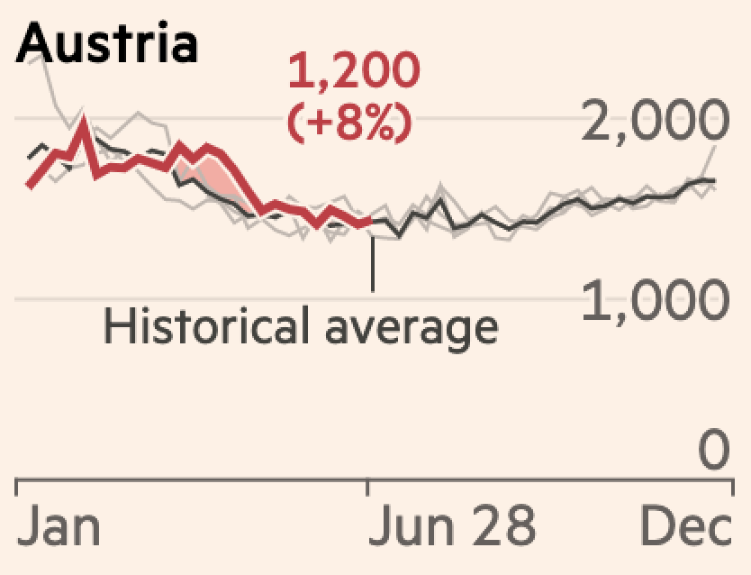
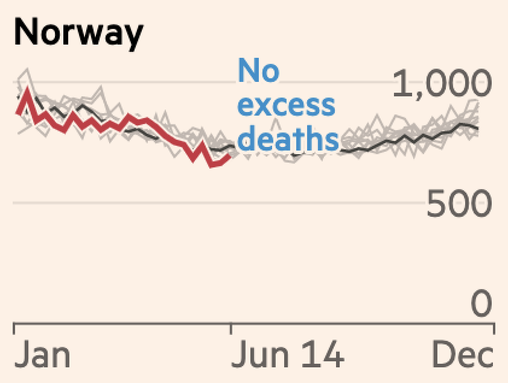

### *Exercise*

#### The purpose of this exercise is to re-create a publication-ready plot using your `dplyr` and `ggplot2` skills.

#### Open the Financial Times article, [Coronavirus tracked: the latest figures as countries start to reopen](https://www.ft.com/content/a26fbf7e-48f8-11ea-aeb3-955839e06441)

#### There is also a PDF of the article titled, "*2020-07-24-excess_mortality.pdf*"

####  The data you need is "data/ft_excess_deaths.csv"

####  You'll have 1 hour to see what you can come up with in groups or individually!

---

### Financial Times Figure

```{r ft-covid-19-jul-recreate, out.width="80%", fig.align='center', echo=FALSE}
knitr::include_graphics("img/ft-covid-19-jul-recreate.png")
```


---

## You got this.

### Don't worry about making it exactly, try and see how far you can get. 

### You're encouraged to work together if you want to and exchange tips/tricks you figured out. 

---

## Questions to guide you:

--

### What is the author trying to show us?

--

### What is the intended message? 

--

### What can we learn from the subtitles?

--

```{r ft-covid-19-jul-recreate-alt-text-01, out.width="80%", fig.align='center', echo=FALSE}

```

--

```{r ft-covid-19-jul-recreate-alt-text-02, out.width="80%", fig.align='center', echo=FALSE}

```

---

## Questions to guide you:

### What can we learn from the labels?

```{r latest-data, out.height="50%", out.width="50%", fig.align='center', echo=FALSE}
knitr::include_graphics("img/latest-data.png")
```

---

## Questions to guide you:

### What can we learn from the labels?

```{r historical-average, out.height="50%", out.width="50%", fig.align='center', echo=FALSE}

```


---

## Questions to guide you:

### What can we learn from the labels?


```{r no-excess-deaths, out.height="50%", out.width="50%", fig.align='center', echo=FALSE}

```


---

## I'll leave these here

#### https://cran.r-project.org/web/packages/ggrepel/vignettes/ggrepel.html

#### http://colorbrewer2.org

### You may need to use some `dplyr` skills from the first session

---

## Here is a figure with data from the previous month

```{r ft-covid-19-jun-recreate, out.width="80%", fig.align='center', echo=FALSE}
knitr::include_graphics("img/ft-covid-19-jun-recreate.jpeg")
```
