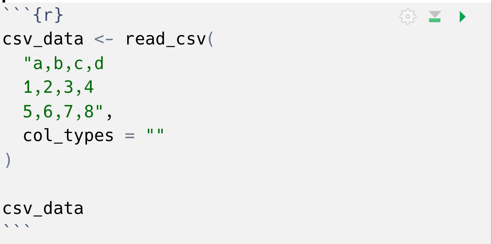
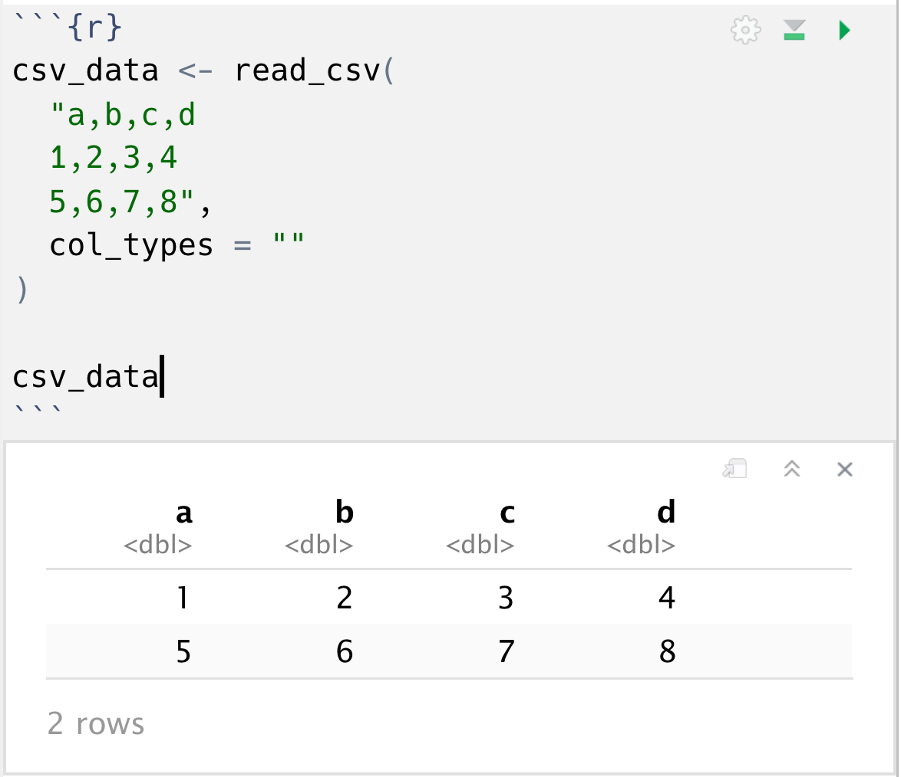

# **This course is hands on!** {background-color="#23373B"}

# Each section has an exercises file: *`exercises.qmd`* {background-color="#23373B"}

## `exercises.qmd`

```{r, out.height="100%", out.width="100%", echo = FALSE}
knitr::include_graphics("img/overview.png")
```

## Code chunks

```{r, out.height="75%", out.width="75%", echo = FALSE}

```

## Running code chunks

```{r, out.height="70%", out.width="70%", echo = FALSE}

```

## Outputting to the console

```{r, out.height="70%", out.width="70%", echo = FALSE}
knitr::include_graphics("img/console_code_chunks.png")
```

## Project contents

```
├── 01-dplyr_5verbs
│   ├── cheatsheet_dplyr_5verbs.pdf
│   ├── diabetes.csv
│   ├── exercises.qmd
│   ├── slides.pdf
```

