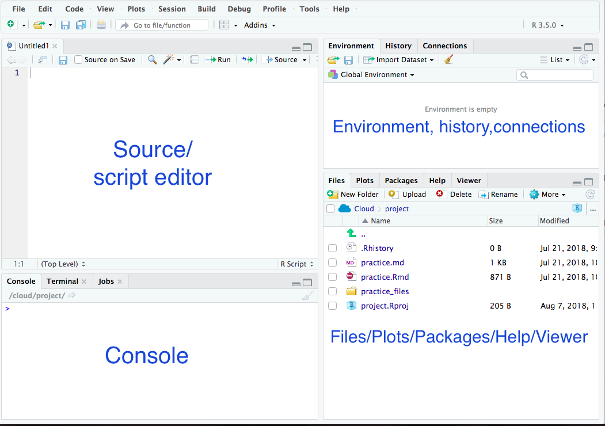
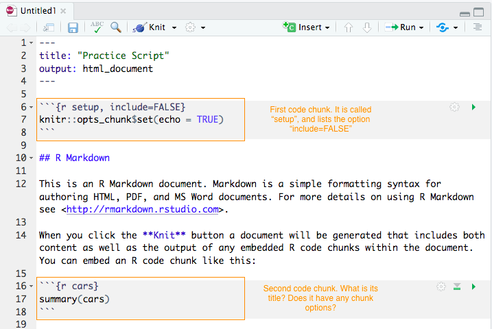

*(Getting started guide adapted from my co-teacher, [Dr. Corinne Riddel](https://corinne-riddell.github.io/))*

### Getting started

We are very excited to meet you during the workshop! Because we only
have a limited time to share a lot of material, it is very important that you
follow these instructions before the workshop to download R and RStudio onto your
laptop and become acquainted with them. We won't have time for this during the workshop 
so please take some time in the coming days to do the following:

i) Download and install R from http://cran.r-project.org. Simply click the link
to download R for Mac or Windows. If you already have R, consider updating to 
the latest version.

ii) Download and install the free version of RStudio from https://www.rstudio.com/products/rstudio/download/. 

iii) Open up RStudio and type the following lines of code into the console (bottom left window):

```{r, eval=F}
install.packages(c("tidyverse", "remotes"))
```

This code installs two R packages named `tidyverse` and `remotes`. The `tidyverse` packages is a package
of packages! It includes the several that we highlight in detail during the workshop, including `dplyr` and `ggplot2`. Each package is a library of functions that are used for data science. 

`remotes` is not part of the Tidyverse but will help us install other materials we will be using.

```{r, eval=F}
remotes::install_github("USCbiostats/uscrbootcamp")
uscrbootcamp::install_bootcamp()
```

### What is R?

- R is a programming language. We will use it to manipulate, visualize, and 
analyze data. 
- If you've never programmed before, that is okay. These instructions show you the basics 
and ensure you know how to do everything you need to know for the workshop.

### Why program in R?

- Because it is programming, you can easily save all your steps 
    - Easy to re-run/duplicate.
    - Easy to extend.
    
- R is free and open source. This means that anyone can install and use it, 
making it more accessible that SAS and Stata.

- R is flexible and ever-evolving. 

### What is RStudio?

RStudio is an integrated development environment (IDE). RStudio makes it easier
to program in R. Without RStudio, all we would see when we open R is a console
where we enter our lines of code.

### Getting up and running in RStudio

Open RStudio on your laptop. By default, RStudio displays four panes shown below:

```{r, echo=F, out.width="400px"}

```

Today, you will complete exercises to become familiar with the four panes.

**Pane 1. Console (bottom left pane)** This is where you input code to be processed. 
Numeric output will display in the Console.

- **Exercise 1:** Practice using the console like a calculator. Click inside the console, type `2+2` and hit enter. Make sure you can add (+), subtract (-), multiply (*), divide (/), and take powers (^). Use round brackets for PEMDAS (or BEDMAS if you're Canadian!).
- **Exercise 2:** Suppose you were interested in calculating how much you'd earn in a month at a new job. The job pays $20 per hour and you will work 15 hours per week, but are taxed at 20%. How much money after tax will you have at the end of one month? Using the console like a calculator, calculate your answer.
- **Exercise 3:** Use the assignment operator (`<-`) to store your answer in an object called `monthly_wage`. To use the assignment operator put the new object on the left-hand side and the equation on the right-hand side. For example typing the code `a <- 2` into the console stores the value `2` in the object `a`. 

**Pane 2. Source (top left pane)** a.k.a the code editor a.k.a the script editor. While the **console** is meant to be used interactively, the **source** is a place to store multiple lines of code to develop into a full-fledged analysis. You can use keyboard shortcuts and icons to send your code from the source to the console. You can save this "code book" and open it later. You can also open someone else's code in this window.

- **Exercise 4:** Create your first script. Click File > New File > R Markdown. Name the file "Practice Script". A new file will open with an **R Markdown** template. Notice that the "title" shown on line 1 is what you named your file. **R Markdown** lets you weave together plain text (sentences for human consumption) and code (sentences for computer consumption). The code is embedded in **R code chunks** beginning and ending with a set of three back ticks (```). The beginning set of ticks also includes an "r" to denote that we are providing R code and an optional title that is used to describe the contents of the code chunk. After the comma we can include optional **chunk options** that we will discuss later. The image below shows the first 19 lines of code of the default-generated R Markdown file and describes the code chunks:

```{r code-chunk-description, echo = F, out.width="400px"}

```

- **Exercise 4:** Read the text in the Practice script you created. Push the button labeled **Knit**. Save the file as "Practice Script". Compare the file that is generated when you hit "Knit" (it should open in a pop-up window) with the script shown in the code editor.
    - See Figure 2.1 on this website: http://socviz.co/gettingstarted.html. From Figure 2.1, notice what is typed in markdown vs. what the output looks like.
- **Exercise 5:** Delete lines 5 through 28 of the practice script markdown file. This should leave only the header information (the top four lines including the "---" at the top and bottom). Knit your file and see what appears in the Viewer window. 
- **Exercise 6:** Update the title of your file (line 1) to "Report on wages" by typing into the source. Then, starting on line 6 write: "To calculate my monthly wage, I multiplied the hourly rate by the number of hours worked and multiplied this product by the number of weeks in a month. Finally, I multiplied by 80% to account for taxes. Now, Knit your file again.
- **Exercise 7:** Add a code chunk to the file at line 10. To do this, click the place in the template you'd like to add your chunk, and then click the **Insert** button and choose R from the dropdown menu. The keyboard shortcut for this is `option + cmd + i` on Mac OS and `Ctrl + Alt + i` on PC. 
- **Exercise 8:** Write the code `monthly_wage <- 20 * 15 * 4 * 0.8` inside the code chunk. Name the code chunk "calculate wage" (see the second figure to remind yourself how to title the chunk). 
- **Exercise 9:** On the next line (inside the code chunk) write `monthly_wage`. When we execute this line, we are asking R to display the value that we assigned to the monthly wage variable. Execute the code chunk by pressing its green arrow or placing your cursor on the line of code and hitting `cmd + enter` on Mac or `Ctrl + enter` on PC.

**Pane 3. Environment/History/Connections:** What is in the environment tab right now? It is letting you know about the **objects** that we saved in the **Environment**. When we load in a data set, we will also be able to see its object here too. For data sets, there is an icon we can push to view all the data. Now click the History tab. What is it? Click a line of code and hit the "To Console" or "To Source" buttons. What happens? The History is a great way to recall a line of code that you may have typed directly in the console but hadn't saved in the code editor and would like to use again. We will ignore the connections tab.

**Pane 4. Files/Plots/Packages/Help/Viewer** These tabs are all useful! The file tab is a basic file viewer. What files are in your folder? The Plots tab displays any plots you've created using code executed in the console. The packages tab shows you the R packages installed (as a list) and those loaded are checked off. We will talk more about R packages in the next section. The Help tab is used to search the help files. The Viewer tab is used to view other types of output (often html output), like the file we created when we knit the R markdown file.
    
### What is an R package?

- An R package is a set of **functions** that someone has put together. For example, the package `ggplot2` is a set of functions to make plots, the package `dplyr` is a set of functions to manipulate datasets, such as functions to rename and create new variables.
- When you load R, a basic set of packages are loaded. R developers have created more than 10,000 additional packages that you can download from **CRAN** (The Comprehensive R Archive Network), the main repository of R packages.

Earlier in these exercises, we installed two packages. To access the code within them, we use the `library` function to load their libraries. Type the following lines of code into the console to load these libraries. 

```{r load-library-example, eval = F}
library(dplyr)
library(ggplot2)
```

The tidyverse package is a meta-package that will load the 8 core packages of the tidyverse. You've already loaded two, dplyr and ggplot2. Try running the code below and see what the output is.

```{r load-tidyverse, eval = F}
library(tidyverse)
```

When you load tidyverse packages, you may see a "conflicts" section that tell you about functions that are being masked. These aren't errors; they are saying that there are functions defined in some packages that also exist somewhere else. We'll discuss that in a moment.

### What is a function

You can identify a function because it will always end with a set of round brackets `()`. Another name for **function** is **command**. `library()` is a **function** call. What is inside its round brackets is an **argument** of the **function**. Many functions take multiple arguments. Above, we are using the function to load the `dplyr` package on the first line and the `ggplot2` package on the second line.

### What happens when you load a package? 

Click the packages tab (In the right bottom panel) and scroll down to the package name that you loaded. It should now be checked to indicate that it is loaded. Sometimes when you load a package, a message will display. You don't need to worry about understanding these messages for now, but here is a description if you're interested (don't worry if you don't understand, it isn't important right now and will make more sense as you learn R):
- Pink output (called messages) tell you that the package is being attached (i.e., loaded). It also lists objects that are **masked** from other packages. This means that R already had loaded packages called `stats` and `base` and they have functions with the same names as functions in the`dplyr` package. Now that we loaded `dplyr`, its functions take precedence. If we want to use the `filter()` function from the `stats` package we have to write `stats::filter()`, where the package name preceding the double colons tells you which version of the function you want to use.

### Help! 

Each function comes with a help page telling you what it does and what arguments you need to provide the function. There are two ways to ask to see the help page of a function:

```{r help-when-you-know-function-name, eval = F}
help("library")
?library
```

When we execute either of the above lines of code, the Help tab will open and navigate to the help page for the function `library()`. Calling a help page in this way is most useful if you know the name of the function you'd like to use but forget exactly how to use the function. It's ok if you don't yet understand the details in the help pages; we'll get there. If you want to better understand how help pages are set up, see http://socviz.co/appendix.html#a-little-more-about-r

If you would like help, but can't remember then name of the function you need help with, you can type a double question mark before a word that is related to the function you are looking for:

```{r help-on-a-general-topic, eval = F}
??histogram
```

This shows you all the packages and their functions which discuss histograms. For example `ggplot2::geom_freqpoly()`, means that there is a function `geom_freqpoly()` from the `ggplot2` package that is used to make histograms. You can click through the functions until you find the one you're looking for.

Finally, Google is your best friend. Generally speaking, many answers to your questions will live on a website called Stack Overflow. Another helpful site to search is RStudio Community. 

### References

These are the materials I referenced to make these slides. You can look at them but note that I avoided the material that isn't relevant to us (and might be confusing for newly-minted learners) 

- https://www.computerworld.com/article/2884322/application-development/learn-r-programming-basics-with-our-pdf.html

- http://alyssafrazee.com/2014/01/02/introducing-R.html

