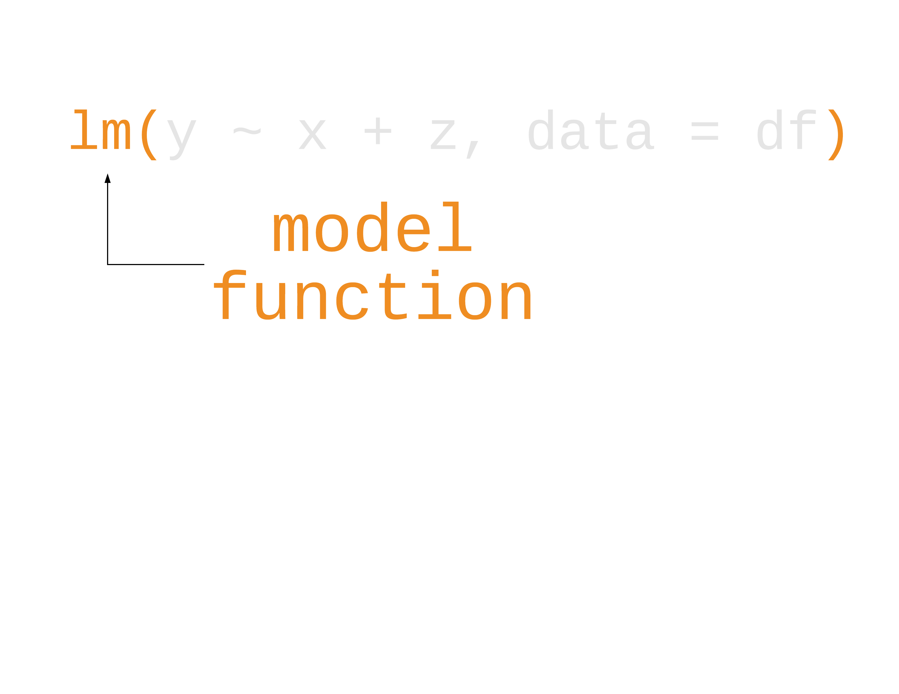
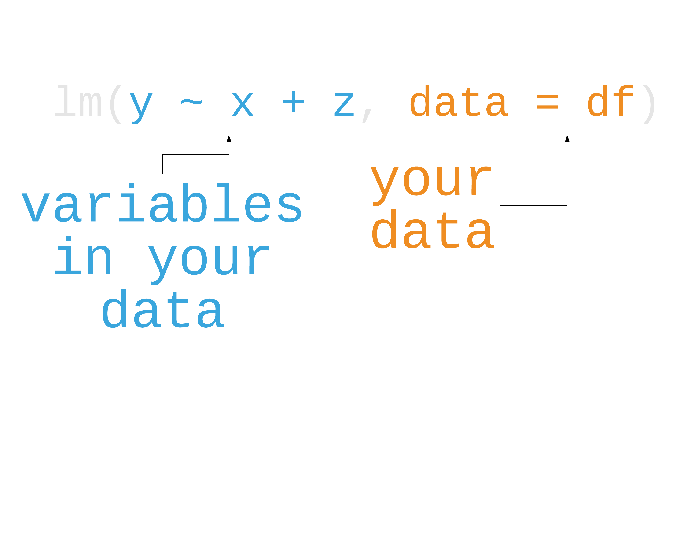
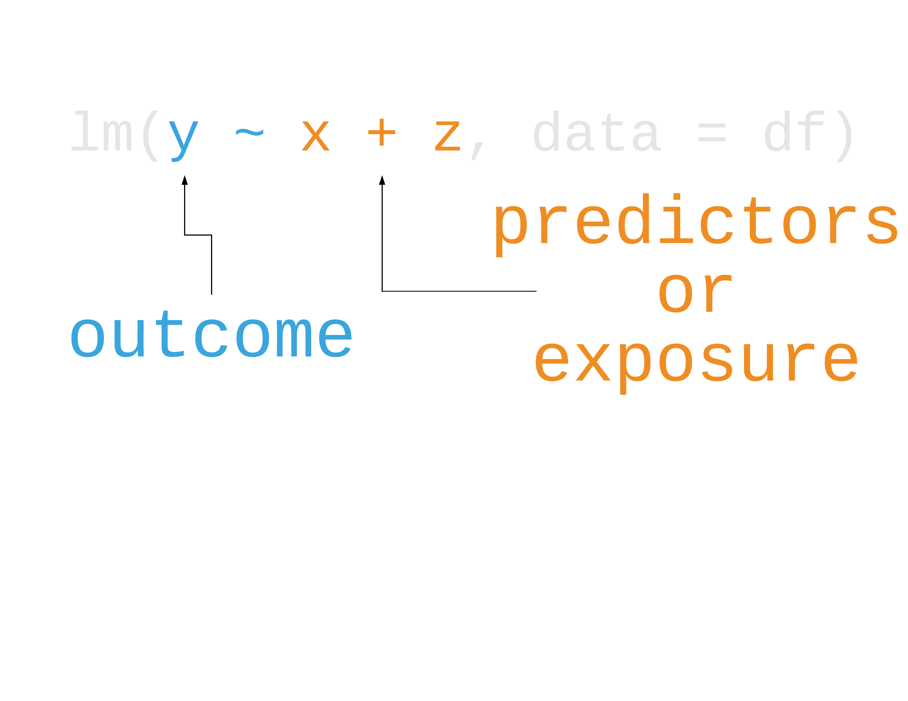

class: inverse, middle, center

```{r setup, include=FALSE}
options(htmltools.dir.version = FALSE, tibble.max_extra_cols = 6, tibble.width = 60)
knitr::opts_chunk$set(warning = FALSE, message = FALSE, fig.align = "center", dpi = 320)
library(tidyverse)
```

# *`r emojifont::emoji("warning")` This is not a course in a regression*

---

## Modeling in R

```{r, out.height="100%", out.width="100%", echo = FALSE}

```

---

## Modeling in R

```{r, out.height="100%", out.width="100%", echo = FALSE}

```

---

## Modeling in R

```{r, out.height="100%", out.width="100%", echo = FALSE}

```

---

## Modeling in R

```{r, out.height="100%", out.width="100%", echo = FALSE}

```

---

## Modeling in R

## **`lm()`** = *Linear Regression (OLS)*

---

## Modeling in R

## ~~`lm()` = Linear Regression (OLS)~~

## **`glm()`** = *Generalized Linear Model (default family = Gaussian)*

---

## Modeling in R

```{r, eval=FALSE}
lm(price ~ carat, data = diamonds)
```

---

## Modeling in R

```{r}
lm(price ~ carat, data = diamonds)
```


---

## Modeling in R

```{r, eval=FALSE}
lm(price ~ carat, data = diamonds) %>% 
  summary() #<<
```

---

## Modeling in R

```{r, echo=FALSE}
lm(price ~ carat, data = diamonds) %>% 
  summary()
```

---

## Modeling in R

```{r, echo=FALSE, highlight.output=c(5, 9:12, 17)}
lm(price ~ carat, data = diamonds) %>% 
  summary()
```

---

background-image: url(http://hexb.in/hexagons/broom.png)
background-position: 90% 10%

## `broom`: tidy models

## `tidy()` 

## `glance()`

## `augment()`

---

background-image: url(http://hexb.in/hexagons/broom.png)
background-position: 90% 10%

## `broom`: tidy models

## **`tidy()`** = *model coefficients*

## ~~`glance()`~~

## ~~`augment()`~~

---

background-image: url(http://hexb.in/hexagons/broom.png)
background-position: 90% 10%

## `broom`: tidy models

## ~~`tidy()`~~ 

## **`glance()`** = *model fit*

## ~~`augment()`~~

---

background-image: url(http://hexb.in/hexagons/broom.png)
background-position: 90% 10%

## `broom`: tidy models

## ~~`tidy()`~~ 

## ~~`glance()`~~

## **`augment()`** = *model predictions*

---

background-image: url(http://hexb.in/hexagons/broom.png)
background-position: 90% 10%

## `broom`: tidy models

## ~~`tidy()`~~

## ~~`glance()`~~

## ~~`augment()`~~

### **NOT** a core member of the tidyverse. Need to load with `library(broom)`

---

## Modeling in R

```{r, eval=FALSE}
library(broom)
lm(price ~ carat, data = diamonds) %>% 
  tidy() #<<
```

---

## Modeling in R

```{r, highlight.output=1:2}
library(broom)
lm(price ~ carat, data = diamonds) %>% 
  tidy()
```

---

## Modeling in R

```{r, eval=FALSE}
lm(price ~ carat, data = diamonds) %>% 
  glance() #<<
```

---

## Modeling in R

```{r, highlight.output=1:2}
lm(price ~ carat, data = diamonds) %>% 
  glance()
```

---

## Modeling in R

```{r, eval=FALSE}
lm(price ~ carat, data = diamonds) %>% 
  augment() #<<
```

---

## Modeling in R

```{r, highlight.output=1:2}
lm(price ~ carat, data = diamonds) %>% 
  augment()
```

---

## Try it yourself

## Work your way through the exercises. If anything in particular is giving you trouble, we'll work through it together.

---

class: inverse, center

# Resources
## [R for Data Science](http://r4ds.had.co.nz/): A comprehensive but friendly introduction to the tidyverse. Free online.
## [UCLA IDRE](https://stats.idre.ucla.edu/other/dae/): Useful resources on modeling in R and other languages
