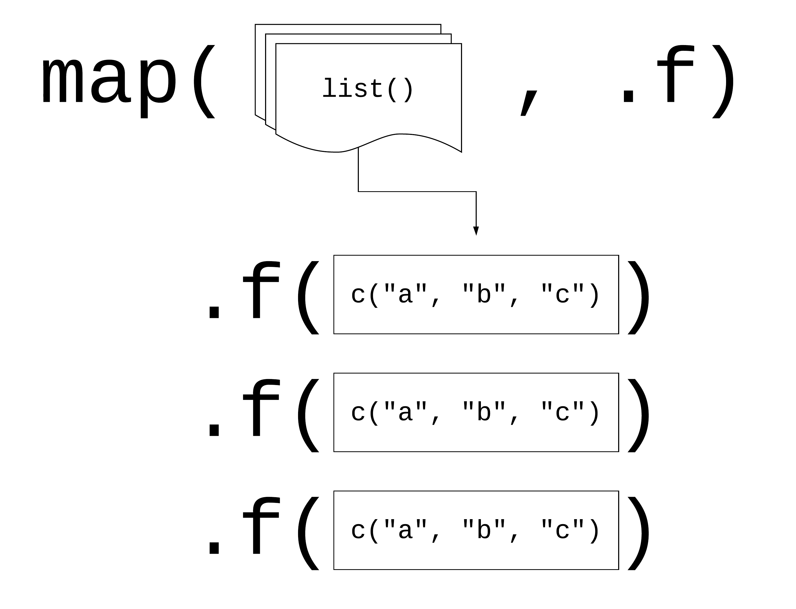
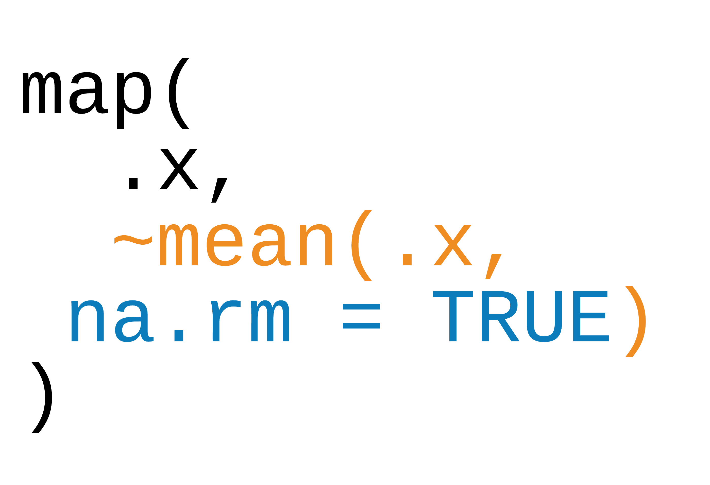
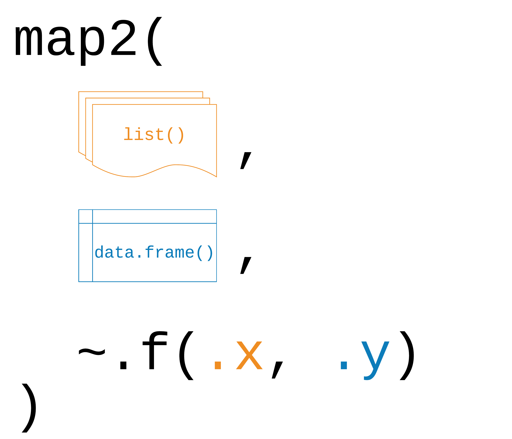
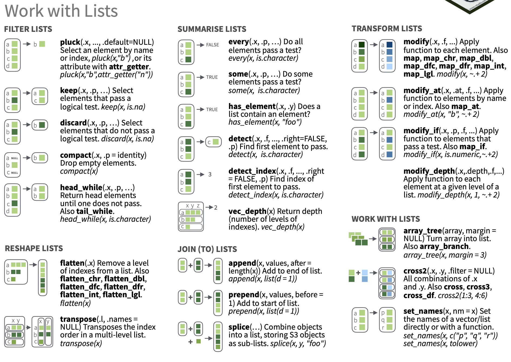
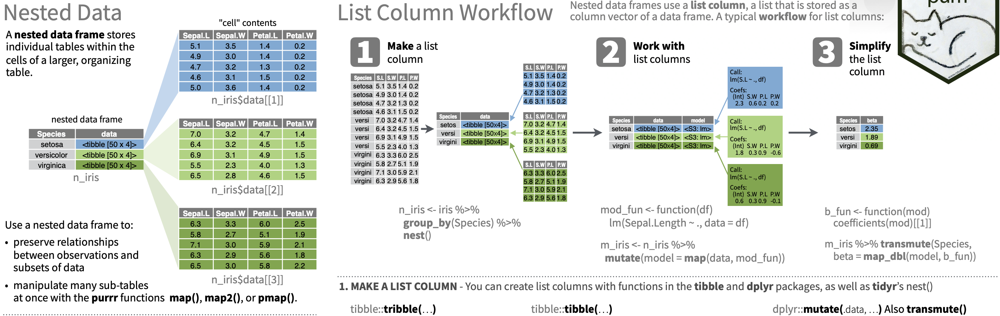

```{r setup, include=FALSE}
options(htmltools.dir.version = FALSE)
knitr::opts_chunk$set(warning = FALSE, message = FALSE, fig.align = "center", dpi = 320, fig.height = 4)
library(tidyverse)
set.seed(1234)
diabetes <- read_csv("diabetes.csv")
```

background-image: url(http://hexb.in/hexagons/purrr.png)
background-position: 90% 26%

# purrr: A functional programming toolkit for R 

<br/><br/><br/>

## Complete and consistent set of tools for working with functions and vectors

---
class: inverse, middle

# Problems we want to solve:
1. Making code clear
2. Making code safe
3. Working with lists and data frames

---

# Lists, vectors, and data.frames (or tibbles)

```{r slide-04}
c(char = "hello", num = 1)
```

---

# lists can contain any object

```{r slide-05}
list(char = "hello", num = 1, fun = mean)
```

---

## Your Turn 1

```{r slide-6-yt}
measurements <- list(
  blood_glucose = rnorm(10, mean = 140, sd = 10), 
  age = rnorm(5, mean = 40, sd = 5), 
  heartrate = rnorm(20, mean = 80, sd = 15)
)
```

### There are two ways to subset lists: dollar signs and brackets. Try to subset `blood_glucose` from `measurements` using these approaches. Are they different? What about `measurements[["blood_glucose"]]`?

---

## Your Turn 1

.small[

```{r slide-07-1}
measurements["blood_glucose"]
```

```{r slide-07-2}
measurements$blood_glucose
```

```{r slide-07-3}
measurements[["blood_glucose"]]
```

]

---

#  data frames are lists

```{r slide-08}
x <- list(char = "hello", num = 1)
as.data.frame(x)
```

---

#  data frames are lists

```{r slide-09}
library(gapminder)
head(gapminder$pop)
```

---

#  data frames are lists

```{r slide-10, eval = FALSE}
gapminder[1:6, "pop"]
```

---

#  data frames are lists

```{r slide-11}
gapminder[1:6, "pop"]
```

---

#  data frames are lists

```{r slide-12}
head(gapminder[["pop"]])
```

---

# programming with functions

### View source code of a function

```{r slide-13-00}
mean
```


```{r slide-13-01}
sd
```


---

# programming with functions

### functions are objects and can be assigned to variables

```{r slide-14-00}
f <- mean
```

```{r slide-14-01}
f
```

```{r slide-14-02}
identical(x = mean, y = f)
```


---

```{r slide-15-dplyr_across, out.height="100%", out.width="100%", echo = FALSE}
knitr::include_graphics("img/dplyr_across.png")
```

.pull-right[Art by Allison Horst]

---

## `mutate(across())`

--

```{r slide-16-mutate-across-concept-map, eval=FALSE}
mutate(
  <DATA>, 
  across(c(<VARIABLES>), list(<NAMES> = <FUNCTIONS>)) #<<
)
```

---

## `mutate(across())`

```{r slide-17-mutate-across-example, eval=FALSE}
mutate(
  diamonds, 
  across(c("carat", "depth"), list(sd = sd, mean = mean)) #<<
)
```

---

## `mutate(across())`

```{r slide-18-1-mutate-across-example-code, eval=FALSE}
mutate(
  diamonds, 
  across(c("carat", "depth"), list(sd = sd, mean = mean)) #<<
)
```

.small[


```{r slide-18-2-mutate-across-example-output, highlight.output = c(2,14), echo=FALSE}
mutate(
  diamonds, 
  across(c("carat", "depth"), list(sd = sd, mean = mean))
)
```

]

---

## `mutate(across(where()))`

--

```{r slide-19-mutate-across-where-example, eval=FALSE}
mutate(
  gapminder, 
  across(where(is.numeric), list(mean = mean, median = median)) #<<
)
```


---

## `mutate(across(where()))`

```{r slide-20-1-mutate-across-where-example-code, eval=FALSE}
mutate(
  gapminder, 
  across(where(is.numeric), list(mean = mean, median = median)) #<<
)
```


.small[

```{r slide-20-2-mutate-across-where-example-output, highlight.output = c(2, 14, 15), echo=FALSE}
mutate(
  gapminder, 
  across(where(is.numeric), list(mean = mean, median = median)) #<<
)
```

]


---

## Review: `tidyselect`

### 'Behind the scenes' workhorse for `dplyr::select()`,  `dplyr::pull()`, and `tidyr::pivot_` functions

### `starts_with()`, `ends_with()`, `contains()`, `matches()`, etc.

--

.pull-left[

.small[

```{r slide-21-left-tidyselect}
# column names contain a word
select(diabetes, ends_with("ht"))
```

]

]

--

.pull-right[

.small[

```{r slide-21-right-tidyselect}
# regular expression
select(diabetes, matches("\\d")) 
```

]

]

---

## `mutate(across())` & `summarise()`

### Perform group-wise summaries with `mutate(across())`, `group_by()` and `summarise()`

```{r slide-22-mutate-across-summarise-concept-map, eval=FALSE}
<DATA> %>% 
  group_by(<GROUPING VAR>) #<<
  summarise(across(c(<VARIABLES>), list(<NAMES> = <FUNCTIONS>))) 
```

---

## `mutate(across())` & `summarise()`

### Combine with `tidyselect()` helpers

```{r slide-23-mutate-across-tidyselect-summarise-concept-map, eval=FALSE}
<DATA> %>% 
  group_by(<GROUPING VAR>) 
  summarise(across(contains(<VARIABLES>), list(<NAMES> = #<<
      <FUNCTIONS>))) 
```

---

## `mutate(across())` & `summarise()`

```{r slide-24-code, eval=FALSE}
gapminder %>% 
  group_by(continent) %>% 
  summarise(across(c("lifeExp", "gdpPercap"), list(med = median, #<<
      iqr = IQR))) #<<
```

--

```{r slide-24-output, echo=FALSE, highlight.output = c(2)}
gapminder %>% 
  group_by(continent) %>% 
  summarise(across(c("lifeExp", "gdpPercap"), list(med = median, 
      iqr = IQR)))
```

---

## `mutate(across())` & `summarise()`


### New column names are created with `_[function name]`

```{r slide-25-code, eval=FALSE, highlight.output = c(2)}
gapminder %>% 
  group_by(continent) %>% 
  summarise(across(c("lifeExp", "gdpPercap"), list(med = median, #<<
      iqr = IQR))) #<<
```

--

```{r slide-25-output, echo=FALSE, highlight.output = c(2)}
gapminder %>% 
  group_by(continent) %>% 
  summarise(across(c("lifeExp", "gdpPercap"), list(med = median, #<<
      iqr = IQR))) #<<
```

---

## `mutate(across())` & `summarise()`

### Control output names with `.names` argument 

```{r slide-26-code, eval=FALSE}
gapminder %>% 
  group_by(continent) %>% 
  summarise(across(c("lifeExp", "gdpPercap"), list(med = median, #<<
      iqr = IQR) .names = "{.fn}_{.col}")) #<<
```

--

```{r slide-26-output, echo=FALSE, highlight.output = c(2)}
gapminder %>% 
  group_by(continent) %>% 
  summarise(across(c("lifeExp", "gdpPercap"), list(med = median, #<<
           iqr = IQR), .names = "{.fn}_{.col}")) #<<
```

---

## `mutate(across())` & `summarise()`

### `tidyselect()` helpers and named columns

```{r slide-27-mutate-across-summarise-code, eval=FALSE}
diabetes %>% 
  group_by(gender) %>% 
  summarise(across(starts_with("bp"), mean)) #<<
```

--

```{r slide-27-mutate-across-summarise-code-02, eval=FALSE}
diabetes %>% 
  group_by(gender) %>% 
  summarise(across(starts_with("bp"), list(mean = mean), #<<
      na.rm = TRUE, .names = "{.fn}_{.col}")) #<<
```

--

```{r slide-27-mutate-across-summarise-highlight, echo=FALSE, highlight.output=c(2)}
diabetes %>% 
  group_by(gender) %>% 
  summarise(across(starts_with("bp"), list(mean = mean), 
      na.rm = TRUE, .names = "{.fn}_{.col}"))
```

---

## Your Turn 2

### Use `starts_with()` from `tidyselect()` to calculate the average `bp` columns in `diabetes`, grouped by `gender`. Name the new columns `bp_` + `mean` 

### hint: `{.fn}` will give you the function name, and `{.col}` will give you the column name


---

## Your Turn 2

```{r YT2-summarise-across}
diabetes %>% 
  group_by(gender) %>% 
  summarise(across(starts_with("bp"), list(mean = mean), 
      na.rm = TRUE, .names = "{.col}_{.fn}"))
```


---

#  vectorized functions don't work on lists

```{r slide-30-1, include=FALSE}
set.seed(1234)
```

```{r slide-30-2, error=TRUE, eval = FALSE}
sum(rnorm(10))
```

---

#  vectorized functions don't work on lists

```{r slide-31-1, include=FALSE}
set.seed(1234)
```

```{r slide-31-2, error=TRUE}
sum(rnorm(10))
```

---

#  vectorized functions don't work on lists

```{r slide-32-1-set-seed, include=FALSE}
set.seed(1234)
```

```{r slide-32-2, error=TRUE}
sum(rnorm(10))
```

```{r slide-32-3, error=TRUE, eval = FALSE}
sum(list(x = rnorm(10), y = rnorm(10), z = rnorm(10)))
```

---

#  vectorized functions don't work on lists

```{r slide-33-1, include=FALSE}
set.seed(1234)
```

```{r slide-33-2, error=TRUE}
sum(rnorm(10))
```

```{r slide-33-3, error=TRUE}
sum(list(x = rnorm(10), y = rnorm(10), z = rnorm(10)))
```

---

background-image: url(http://hexb.in/hexagons/purrr.png)
background-position: 95% 2%

# map(.x, .f)

--

## .x: a vector, list, or data frame

--

## .f: a function

--

## Returns a list

---

# Using map()

```{r slide-35-using-map, eval = FALSE}
library(purrr)
x_list <- list(x = rnorm(10), y = rnorm(10), z = rnorm(10))

map(x_list, mean)
```

---

# Using map()

```{r slide-36-using-map, eval = FALSE}
library(purrr)
x_list <- list(x = rnorm(10), y = rnorm(10), z = rnorm(10)) #<<

map(x_list, mean)
```


---

# Using map()

```{r slide-37-using-map, eval = FALSE}
library(purrr)
x_list <- list(x = rnorm(10), y = rnorm(10), z = rnorm(10))

map(x_list, mean) #<<
```


---

# Using map()

```{r slide-38-using-map}
library(purrr)
x_list <- list(x = rnorm(10), y = rnorm(10), z = rnorm(10))

map(x_list, mean)
```

---

```{r slide-39-using-map, echo=FALSE, out.width="50%", out.height="50%"}
knitr::include_graphics("img/purrr_list.png")
```

---

```{r slide-40, echo=FALSE}

```

---

```{r slide-41, echo=FALSE}
knitr::include_graphics("img/purr_x_input.png")
```

---

## Your Turn 3

### Read the code in the first chunk and predict what will happen 
### Run the code in the first chunk. What does it return?

```{r YT3-slide-40, eval=FALSE}
list(
  blood_glucose = sum(measurements$blood_glucose),
  age = sum(measurements$age),
  heartrate = sum(measurements$heartrate)
)
```

### Now, use `map()` to create the same output.

---

## Your Turn 3

```{r YT3-slide-41}
map(measurements, sum)
```

---

## using `map()` with data frames

--

```{r slide-42, eval=FALSE}
library(dplyr)
gapminder %>% 
  select(where(is.numeric)) %>%
  map(sd)
```

---

## using `map()` with data frames

```{r slide-43, eval=FALSE}
library(dplyr)
gapminder %>% #<<
  select(where(is.numeric)) %>%  #<<
  map(sd)
```

---

## using `map()` with data frames

```{r slide-44, eval=FALSE}
library(dplyr)
gapminder %>% 
  select(where(is.numeric)) %>%
  map(sd) #<<
```

---

## using `map()` with data frames

```{r slide-45}
library(dplyr)
gapminder %>% 
  select(where(is.numeric)) %>%
  map(sd)
```

---

## Your Turn 4

### Pass diabetes to `map()` and map using `class()`. What are these results telling you?

---

## Your Turn 4


```{r YT4-map-diabetes-class}
head(
  map(diabetes, class), #<<
  3
)
```

---

## `group_map()` 

### Apply a function across a grouping variable and return a list of grouped tibbles

```{r slide-50-01, eval=FALSE}
diabetes %>% 
  group_by(gender) %>% #<<
  group_map(~ broom::tidy(lm(weight ~ height, data = .x)))
```

--

.small[

```{r slide-50-02, echo=FALSE, highlight.output=c(1,8)}
diabetes %>% 
  group_by(gender) %>% #<<
  group_map(~ broom::tidy(lm(weight ~ height, data = .x)))
```

]

---

## `group_modify()`

###  Apply a function across grouped tibbles and return grouped tibbles

```{r slide-51-01, eval=FALSE}
diabetes %>% 
  group_by(gender) %>% #<<
  group_modify(~ broom::tidy(lm(weight ~ height, data = .x)))
```

--

```{r slide-51-02, echo=FALSE, highlight.output=c(2)}
diabetes %>% 
  group_by(gender) %>% #<<
  group_modify(~ broom::tidy(lm(weight ~ height, data = .x)))
```


---

## Your Turn 5 

### Use group_modify() and lm() to model chol (the outcome) with ratio, grouped by location

---

## Your Turn 5 


```{r YT5-slide-53-code, eval=FALSE}
diabetes %>% 
  group_by(location) %>% #<<
  group_modify(~ broom::tidy(lm(chol ~ ratio, data = .x)))
```

--

```{r YT5-slide-53-output, echo=FALSE, highlight.output=c(2)}
diabetes %>% 
  group_by(location) %>% #<<
  group_modify(~ broom::tidy(lm(chol ~ ratio, data = .x)))
```


---

#  Review: writing functions

```{r slide-54, eval = FALSE}
x <- x^2
x <- scale(x)
x <- max(x)
```

---

#  Review: writing functions

```{r slide-55, eval = FALSE}
x <- x^2
x <- scale(x)
x <- max(x)

y <- x^2
y <- scale(y)
y <- max(y)

z <- z^2
z <- scale(x)
z <- max(z)
```

---


#  Review: writing functions

```{r slide-56, eval = FALSE}
x <- x^2
x <- scale(x)
x <- max(x)

y <- x^2 #<<
y <- scale(y)
y <- max(y)

z <- z^2
z <- scale(x) #<<
z <- max(z)
```

---

#  Review: writing functions

```{r slide-57, eval = FALSE}
x <- x^3 #<<
x <- scale(x)
x <- max(x)

y <- x^2 #<<
y <- scale(y)
y <- max(y)

z <- z^2 #<<
z <- scale(x)
z <- max(z)
```

---

#  Review: writing functions

```{r slide-58, eval = FALSE}
.f <- function(x) {
  x <- x^3
  x <- scale(x)
  
  max(x)
}

.f(x)
.f(y)
.f(z)
```

---

class: inverse, center, middle, takeaway

# **If you copy and paste your code three times, it's time to write a function**

---

## Your Turn 6

### Write a function that returns the mean and standard deviation of a numeric vector.
### Give the function a name
### Find the mean and SD of `x`
### Map your function to `measurements`

---

## Your Turn 6

```{r YT6-slide-61, eval=FALSE}
mean_sd <- function(x) {
  x_mean <- mean(x)
  x_sd <- sd(x)
  tibble(mean = x_mean, sd = x_sd)
}
  
map(measurements, mean_sd)
```
---

## Your Turn 6

```{r YT6-slide-62, echo=FALSE}
mean_sd <- function(x) {
  x_mean <- mean(x)
  x_sd <- sd(x)
  tibble(mean = x_mean, sd = x_sd)
}
  
map(measurements, mean_sd)
```

---


class: inverse
# Three ways to pass functions to `map()`
1. pass directly to `map()`
2. use an anonymous function
3. use ~

---

```{r slide-64-purr_f_input1.png, echo=FALSE}
knitr::include_graphics("img/purr_f_input1.png")
```

---

```{r slide-65-purr_f_input2.png, echo=FALSE}
knitr::include_graphics("img/purr_f_input2.png")
```

---

```{r slide-66-purr_f_input3.png, echo=FALSE}

```

---

```{r slide-67-code, eval = FALSE}
map(gapminder, ~length(unique(.x)))
```

---

```{r slide-68-output}
map(gapminder, ~length(unique(.x)))
```

---

# Returning types

|  map |  returns |
|:--|:--|
|`map()` | list |
|`map_chr()` | character vector |
|`map_dbl()` | double vector (numeric) |
|`map_int()` | integer vector |
|`map_lgl()` | logical vector |
|`map_dfc()` | data frame (by column) |
|`map_dfr()` | data frame (by row) |

---

# Returning types

```{r map_int-slide-70, eval = FALSE}
map_int(gapminder, ~length(unique(.x)))
```

---

# Returning types

```{r map_int-slide-71}
map_int(gapminder, ~length(unique(.x)))
```

---

## Your Turn 7

### Do the same as #4 above but return a vector instead of a list. 

---

## Your Turn 7

.small[

```{r YT7-73}
map_chr(diabetes, class)
```

]

---

## Your Turn 8

### Check `diabetes` for any missing data. 

### Using the ~.f(.x) shorthand, check each column for any missing values using `is.na()` and `any()`
### Return a logical vector. Are any columns missing data? What happens if you don't include `any()`? Why?
### Try counting the number of missing, returning an integer vector

---

## Your Turn 8

.small[

```{r YT8-map_lgl-any}
map_lgl(diabetes, ~any(is.na(.x)))
```

]

---

## Your Turn 8

.small[

```{r YT8-map_lgl-sum}
map_int(diabetes, ~sum(is.na(.x)))
```
]

---

## Your Turn 9

### Turn diabetes into a list split by location using the split() function. Check its length.
### Fill in the model_lm function to model chol (the outcome) with ratio and pass the .data argument to lm()
### map model_lm to diabetes_list so that it returns a data frame (by row).

---

## Your Turn 9

```{r YT9-slide-78, eval=FALSE}
diabetes_list <- split(diabetes, diabetes$location) #<<
length(diabetes_list)
model_lm <- function(.data) {
  mdl <- lm(chol ~ ratio, data = .data) #<<
  # get model statistics
  broom::glance(mdl)
}

map(diabetes_list, model_lm) #<<
```

---

## Your Turn 9

.small[

```{r YT9-slide-79, echo=FALSE}
diabetes_list <- split(diabetes, diabetes$location)
length(diabetes_list)
model_lm <- function(.data) {
  mdl <- lm(chol ~ ratio, data = .data)
  # get model statistics
  broom::glance(mdl)
}

map(diabetes_list, model_lm)
```

]

---

# map2(.x, .y, .f)

--

## .x, .y: a vector, list, or data frame

--

## .f: a function

--

## Returns a list


---

```{r map2-img-slide-81, echo=FALSE, out.width="80%", out.height="80%"}
knitr::include_graphics("img/purr_x2_input.png")
```

---

```{r map2-img-slide-82, echo=FALSE, out.width="80%", out.height="80%"}
knitr::include_graphics("img/purr_x2_input_warn.png")
```

---

```{r map2-img-slide-83, echo=FALSE, out.width="80%", out.height="80%"}

```

---

# map2()

```{r map2_dbl-slide-84, eval=FALSE}
means <- c(-3, 4, 2, 2.3)
sds <- c(.3, 4, 2, 1)
  
map2_dbl(means, sds, rnorm, n = 1)
```

---

# map2()

```{r map2_dbl-slide-85, eval=FALSE}
means <- c(-3, 4, 2, 2.3)
sds <- c(.3, 4, 2, 1)
  
map2_dbl(means, sds, rnorm, n = 1) #<<
```

---

# map2()

```{r map2_dbl-slide-86}
means <- c(-3, 4, 2, 2.3)
sds <- c(.3, 4, 2, 1)
  
map2_dbl(means, sds, rnorm, n = 1)
```

---

## Your Turn 10

### Split the gapminder dataset into a list by country

### Create a list of models using map(). For the first argument, pass gapminder_countries. For the second, use the ~.f() notation to write a model with lm(). Use lifeExp on the left hand side of the formula and year on the second. Pass .x to the data argument.

### Use map2() to take the models list and the data set list and map them to predict(). Since we're not adding new arguments, you don't need to use ~.f().

---

## Your Turn 10

```{r YT10-slide-88,eval=FALSE}
gapminder_countries <- split(gapminder, gapminder$country) #<<
models <- map(gapminder_countries, ~ lm(lifeExp ~ year, data = .x))
preds <- map2(models, gapminder_countries, predict)
head(preds, 3)
```

---

## Your Turn 10

```{r YT10-slide-89,eval=FALSE}
gapminder_countries <- split(gapminder, gapminder$country)
models <- map(gapminder_countries, ~ lm(lifeExp ~ year, data = .x)) #<<
preds <- map2(models, gapminder_countries, predict)
head(preds, 3)
```

---

## Your Turn 10

```{r YT10-slide-90, eval=FALSE}
gapminder_countries <- split(gapminder, gapminder$country)
models <- map(gapminder_countries, ~ lm(lifeExp ~ year, data = .x))
preds <- map2(models, gapminder_countries, predict) #<<
head(preds, 3)
```

---

## Your Turn 10

```{r YT10-slide-91, echo = FALSE}
gapminder_countries <- split(gapminder, gapminder$country)
models <- map(gapminder_countries, ~ lm(lifeExp ~ year, data = .x))
preds <- map2(models, gapminder_countries, predict)
map(head(preds, 3), head)
```

---

class: middle, center

| input 1 | input 2 | returns |
|:--|:--|
|`map()` | `map2()` | list |
|`map_chr()` | `map2_chr()` |  character vector |
|`map_dbl()` | `map2_dbl()` |  double vector (numeric) |
|`map_int()` | `map2_int()` |  integer vector |
|`map_lgl()` | `map2_lgl()` |  logical vector |
|`map_dfc()` | `map2_dfc()` |  data frame (by column) |
|`map_dfr()` | `map2_dfr()` |  data frame (by row) |

---

# Other mapping functions

## **pmap()** and friends: take n lists or data frame with argument names
---

# Other mapping functions

## ~~pmap() and friends: take n lists or data frame with argument names~~
## **walk()** and friends: for side effects like plotting; returns input invisibly
---

# Other mapping functions

## ~~pmap() and friends: take n lists or data frame with argument names~~
## ~~walk() and friends: for side effects like plotting; returns input invisibly~~
## **imap()** and friends: includes counter `i`
---

# Other mapping functions

## ~~pmap() and friends: take n lists or data frame with argument names~~
## ~~walk() and friends: for side effects like plotting; returns input invisibly~~
## ~~imap() and friends: includes counter `i`~~
## **map_if()**, **map_at()**: Apply only to certain elements

---

class: middle, center

| input 1 | input 2 |  input n | returns |
|:--|:--|
|`map()` | `map2()` | `pmap()` | list |
|`map_chr()` | `map2_chr()` | `pmap_chr()` | character vector |
|`map_dbl()` | `map2_dbl()` | `pmap_dbl()` |   double vector (numeric) |
|`map_int()` | `map2_int()` | `pmap_int()` |   integer vector |
|`map_lgl()` | `map2_lgl()` | `pmap_lgl()` |   logical vector |
|`map_dfc()` | `map2_dfc()` | `pmap_dfc()` |   data frame (by column) |
|`map_dfr()` | `map2_dfr()` | `pmap_dfr()` |   data frame (by row) |
|`walk()` | `walk2()` | `pwalk()` | input (side effects!) |

---

## `group_walk()`

### Use `group_walk()` for side effects across groups 

```{r group_walk}
temp <- "temporary_folder"
fs::dir_create(temp)
gapminder %>%
  group_by(continent) %>%
  group_walk( #<<
    ~ write_csv( #<<
      .x,
      file = file.path(.,  paste0(.y$continent, ".csv"))
    )
  )
```

--

```{r temp-dir_tree, echo=FALSE}
fs::dir_tree(temp, pattern = "csv$")
```

```{r remove-temp, include=FALSE}
unlink(temp, recursive = TRUE, force = TRUE)
```


---

## Your turn 11

#### Create a new directory using the fs package. Call it "figures".

#### Write a function to plot a line plot of a given variable in gapminder over time, faceted by continent. Then, save the plot (how do you save a ggplot?). For the file name, paste together the folder, name of the variable, and extension so it follows the pattern `"folder/variable_name.png"`

#### Create a character vector that has the three variables we'll plot: "lifeExp", "pop", and "gdpPercap".

#### Use `walk()` to save a plot for each of the variables

---

## Your turn 11

```{r YT11-slide-100, eval = FALSE}
fs::dir_create("figures")

ggsave_gapminder <- function(variable) {
  #  we're using `aes_string()` so we don't need the 
  #  curly-curly syntax
  p <- ggplot(
    gapminder, 
    aes_string(x = "year", y = variable, color = "country")
  ) + 
    geom_line() + 
    scale_color_manual(values = country_colors) + 
    facet_wrap(vars(continent.)) + 
    theme(legend.position = "none")
    
  ggsave(
    filename = paste0("figures/", variable, ".png"), 
    plot = p, 
    dpi = 320
  )
}
```


---

## Your turn 11

```{r YT11-slide-101, eval = FALSE}
vars <- c("lifeExp", "pop", "gdpPercap")
walk(vars, ggsave_gapminder)
```


---

# Base R

| base R | purrr |
|:--|:--|
|`lapply()` | `map()` |
|`vapply()` | `map_*()` |
|`sapply()` | ? |
|`x[] <- lapply()` | `map_dfc()` |
|`mapply()` | `map2()`, `pmap()` |

---

class: inverse

# Benefits of purrr
1. Consistent 
2. Type-safe
3. ~f(.x)

---

## Loops vs functional programming

```{r slide-104-loops-vs-fp-01, eval=FALSE}
x <- rnorm(10)
y <- map(x, mean)
```

```{r slide-104-loops-vs-fp-02, eval=FALSE}
x <- rnorm(10)
y <- vector("list", length(x))
for (i in seq_along(x)) {
  y[[i]] <- mean(x[[i]])
}
```

---

## Loops vs functional programming

```{r slide-105-loops-vs-fp-01, eval=FALSE}
x <- rnorm(10)
y <- map(x, mean)
```

```{r slide-105-loops-vs-fp-02, eval=FALSE}
x <- rnorm(10) 
y <- vector("list", length(x)) #<<
for (i in seq_along(x)) {
  y[[i]] <- mean(x[[i]]) 
}
```

---

## Loops vs functional programming

```{r slide-106-loops-vs-fp-01, eval=FALSE}
x <- rnorm(10)
y <- map(x, mean)
```

```{r slide-106-loops-vs-fp-02, eval=FALSE}
x <- rnorm(10)
y <- vector("list", length(x)) 
for (i in seq_along(x)) {#<<
  y[[i]] <- mean(x[[i]]) 
}
```

---

## Loops vs functional programming

```{r slide-107-loops-vs-fp-01, eval=FALSE}
x <- rnorm(10)
y <- map(x, mean)
```

```{r slide-107-loops-vs-fp-02, eval=FALSE}
x <- rnorm(10)
y <- vector("list", length(x)) 
for (i in seq_along(x)) { 
  y[[i]] <- mean(x[[i]]) #<<
}
```

---

class: center, middle, inverse

# **Of course someone has to write loops. It doesn’t have to be you.**
# **—Jenny Bryan**


---

# Working with lists and nested data

```{r slide-109-cheatsheet_lists.png, echo=FALSE}

```

---

# Working with lists and nested data

```{r slide-110-cheatsheet_nested.png, echo=FALSE}

```

---

# Adverbs: Modify function behavior

```{r slide-111-cheatsheet_adverbs.png, echo=FALSE}
knitr::include_graphics("img/cheatsheet_adverbs.png")
```

---

class: inverse, center

# Learn more!
## [Jenny Bryan's purrr tutorial](https://jennybc.github.io/purrr-tutorial/): A detailed introduction to purrr. Free online.
## [R for Data Science](http://r4ds.had.co.nz/): A comprehensive but friendly introduction to the tidyverse. Free online.
## [RStudio Primers](https://rstudio.cloud/learn/primers): Free interactive courses in the Tidyverse
