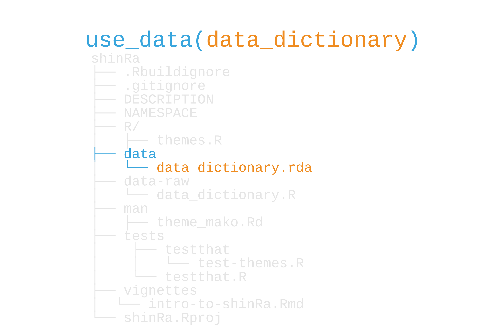
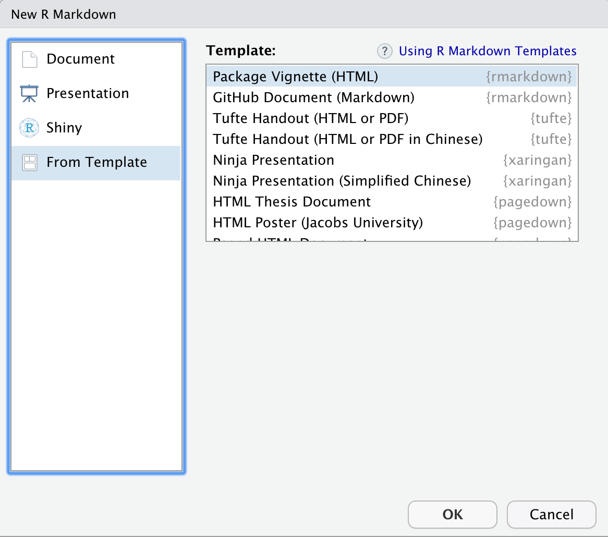
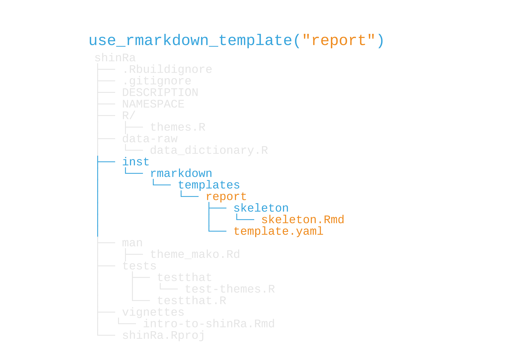
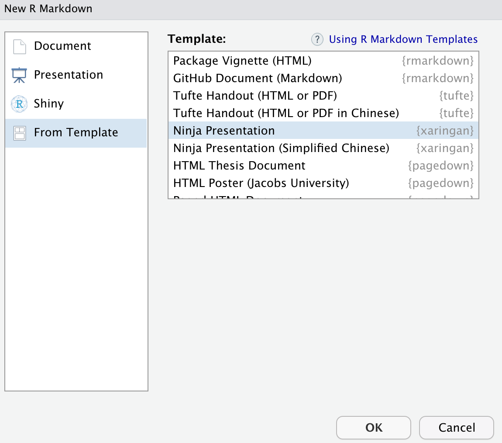
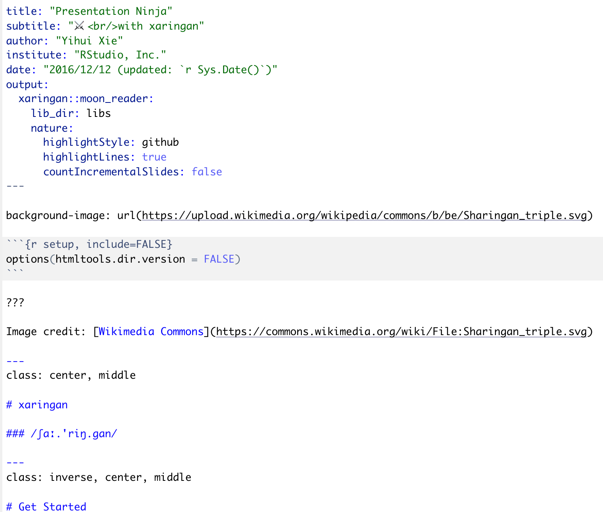
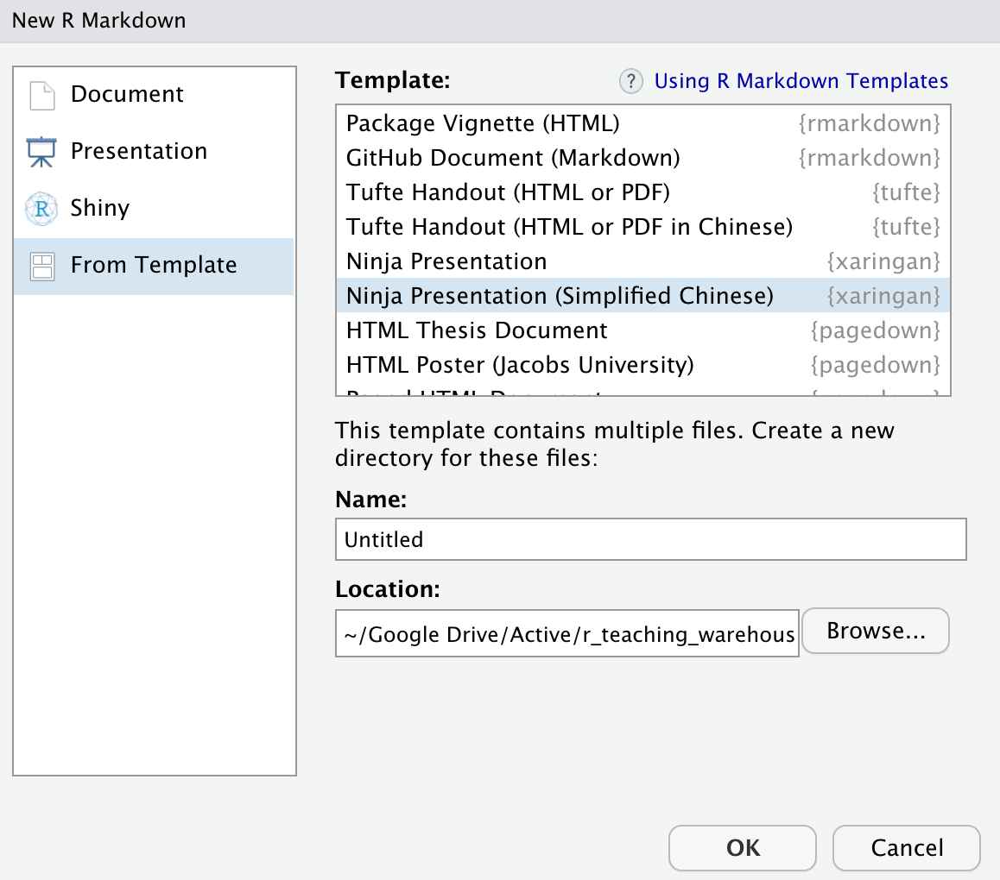
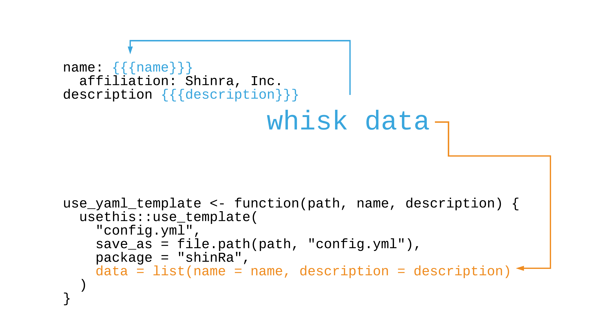

```{r setup, include=FALSE}
options(htmltools.dir.version = FALSE, tibble.max_extra_cols = 6, tibble.width = 60)
knitr::opts_chunk$set(warning = FALSE, message = FALSE, fig.align = "center", dpi = 320, fig.height = 4)
library(tidyverse)

library(usethis)
library(devtools)

#  clean up usethis output
hook_message <- knitr::knit_hooks$get('message')
process_usethis_messages <- function(x, options) {
  x <- x %>% 
    str_remove_all("\n|##") %>% 
    str_trim() %>% 
    str_split("✔ ") %>% 
    pluck(1) %>% 
    discard(~.x == "") %>% 
    paste0("## ✔ ", .) %>% 
    str_trunc(width = 60)
  
  hook_message(x, options)
}
knitr::knit_hooks$set(message = process_usethis_messages)

users_per_sector <- 
  tibble::tibble(
    sector = 1:8,
    users = c(1000, 2034, 4594, 2304, 8093, 1200, 300, 2398)
  )

data_dictionary <- 
  tibble::tibble(
    database = "daily_active_users",
    variable = c("users", "sector"),
    description = c("Active reactor-using households", "Midgar Sector #"),
  )
```

# What else can I do with an R package?

---

# What else can I do with an R package?

## **Store data and files**

---

# What else can I do with an R package?

## ~~Store data and files~~
## **Create R Markdown and other templates**

---
# What else can I do with an R package?

## ~~Store data and files~~
## ~~Create R Markdown and other templates~~
## **Launch and store Shiny apps**

---

# Data in packages

## data in ggplot2

```{r, echo = FALSE}
get_data <- function(pkg) {
  x <- data(package = pkg)
  dplyr::as_tibble(x$results) %>% 
    dplyr::select(data = Item, description = Title)
}

get_data("ggplot2")
```

---

# Data packages

--

## data in [babynames](https://github.com/hadley/babynames)

```{r, echo = FALSE}
get_data("babynames")
```

---

background-image: url(https://raw.githubusercontent.com/malcolmbarrett/claremontrun/master/man/figures/logo.png)
background-position: 90% 10%
background-size: 20%

# Data packages

## data in [claremontrun](https://github.com/malcolmbarrett/claremontrun)

```{r, echo = FALSE}
get_data("claremontrun")
```

---

class: inverse

# Add data to your package 

1. Include raw data and cleaning scripts using `use_data_raw()`
2. Clean the data in the file created above, then use `use_data()`
3. For non-exported data, `use_data(internal = TRUE)`
4. [Document your data](https://r-pkgs.org/data.html#data-data)

---

# Data dictionary

```{r}
data_dictionary <- 
  tibble::tibble(
    database = "daily_active_users",
    variable = c("users", "sector"),
    description = c(
      "Active reactor-using households", 
      "Midgar Sector #"
    ),
  )
```

---

```{r, out.height="100%", out.width="100%", echo = FALSE}
knitr::include_graphics("img/checkpoint_data_raw.png")
```

---

## `use_data_raw("data_dictionary")`: `data_dictionary.R`

```{r, eval = FALSE}
## code to prepare `data_dictionary` dataset goes here

usethis::use_data(data_dictionary, overwrite = TRUE)
```

---

## `use_data_raw("data_dictionary")`: `data_dictionary.R`

```{r, eval = FALSE}
## code to prepare `data_dictionary` dataset goes here

data_dictionary <-  #<<
  tibble::tibble( #<<
    database = "daily_active_users", #<<
    variable = c("users", "sector"), #<<
    description = c( #<<
      "Active reactor-using households",  #<<
      "Midgar Sector #" #<<
    ), #<<
  ) #<<

usethis::use_data(data_dictionary, overwrite = TRUE)
```

---


## `use_data_raw("data_dictionary")`: `data_dictionary.R`

```{r, eval = FALSE}
## code to prepare `data_dictionary` dataset goes here

data_dictionary <- 
  tibble::tibble(
    database = "daily_active_users",
    variable = c("users", "sector"),
    description = c(
      "Active reactor-using households", 
      "Midgar Sector #"
    ),
  )

usethis::use_data(data_dictionary, overwrite = TRUE) #<<
```

---

```{r, out.height="100%", out.width="100%", echo = FALSE}

```

---

```{r, eval = FALSE}
library(shinRa)
data_dictionary
```

```{r, echo = FALSE}
data_dictionary
```

---
## Your Turn 1

#### Let's create a data dictionary for avalanche and add the results to a vignette. First, run `use_data_raw()`. Call the data "data_dictionary". In the data processing file, put this code before the `use_data()` line. Then, source the script. This will run `use_data()` for you.

#### Open `R/tables.R`. Add a function called `gt_data_dictionary()` that wraps `data_dictionary` in `gt::gt()`. You can use `gt_donations()` as a starting point for the new function.

#### Re-document and re-build the package.

#### Open `vignettes/data-dictionary.Rmd`. On line 24, run `gt_data_dictionary()` and knit the vignette.

---

## Your Turn 1

```{r, eval=FALSE}
use_data_raw("data_dictionary")
source("data-raw/data_dictionary.R")
```

```{r, eval=FALSE}
#' Create gt table for the data dictionary
#'
#' @return a `gt` table
#' @export
gt_data_dictionary <- function() {
  gt::gt(data_dictionary)
}
```

---

class: inverse

# Including data for tests

1. Hard-code it in a `helper-` or `test-` file.
2. Put a (small) file in `tests/testthat`
3. Use internal data (`use_data(internal = TRUE)`) 
4. Use exported data (`use_data()`) 

---

# R Markdown Templates

--

```{r, out.height="70%", out.width="70%", echo = FALSE}

```

---


```{r, out.height="100%", out.width="100%", echo = FALSE}

```

---


# xaringan template

```{r, out.height="70%", out.width="70%", echo = FALSE}

```

---

# xaringan template: **`template.yaml`**

```yaml
name: Ninja Presentation
description: >
  Create a presentation using the xaringan package based 
  on remark.js.
create_dir: false
```

---

# xaringan template: **`skeleton.Rmd`**

```{r, out.height="60%", out.width="60%", echo = FALSE}

```

---


# xaringan Chinese template: **`template.yaml`**

```yaml
name: Ninja Presentation (Simplified Chinese)
description: >
  Create a presentation using the xaringan package based 
  on remark.js.
* create_dir: true
```

---

# xaringan Chinese template 

```{r, eval = FALSE}
## inst/rmarkdown/templates/xaringan_zh-CN/skeleton/
## ├── skeleton.Rmd
## └── zh-CN.css
```

---


# xaringan Chinese template

```{r, out.height="70%", out.width="70%", echo = FALSE}

```

---

## Your Turn 2

#### Create a new R Markdown template called "avalanche-report" using `use_rmarkdown_template()`. For the `template_description` argument, set it to: "A weekly report of AVALANCHE activities." 
#### Inside the `exercises/` folder, there is a file called `report.Rmd`. Copy and paste its contents into `inst/rmarkdown/templates/avalanche-report/skeleton/skeleton.Rmd`, which you just created.
#### Re-build the package (`build()` or `Cmd/Ctrl + Shift + B`).
#### Create a new R Markdown document using `File > New File > R Markdown...`. Then, find your template under the "From Template" tab. Open it.

---

## Your Turn 2

```{r, eval = FALSE}
use_rmarkdown_template(
  "template_description", 
  "A weekly report of AVALANCHE activities."
)
```

---

# On `inst/`

### We can put *any* arbitrary file in `inst/`.

---

# On `inst/`

### ~~We can put any arbitrary file in `inst/`.~~
### Be careful not to name the folders the same as any of the top-level package folders, e.g. `R/` or `data/`.

---

# On `inst/`

### ~~We can put any arbitrary file in `inst/`.~~
### ~~Be careful not to name the folders the same as any of the top-level package folders, e.g. `R/` or `data/`.~~
### Access content with *`system.file()`* or *`fs::path_package()`*

---

## `system.file()`

```{r, eval = FALSE}
system.file(
  file.path("rmarkdown", "templates", "report.Rmd"), #<<
  package = "shinRa", 
  mustWork = TRUE
)
```

---

## `system.file()`

```{r, eval = FALSE}
system.file(
  file.path("rmarkdown", "templates", "report.Rmd"), 
  package = "shinRa", 
  mustWork = TRUE
)
```

```{r, echo = FALSE}
"path/to/shinRa/rmarkdown/templates/report.Rmd"
```


---

# Other templates

---


# Other templates

## **Analysis workflows or projects**

---

# Other templates

## ~~Analysis workflows or projects~~
## **More detailed R Markdown templates**

---

# Other templates

## ~~Analysis workflows or projects~~
## ~~More detailed R Markdown templates~~
## **YAML and other configuration files**

---

# Templates with usethis

## `use_cran_comments()`

---

# Templates with usethis

## `use_cran_comments()`

```{r}
use_cran_comments <- function(open = interactive()) {
  check_is_package("use_cran_comments()")
    use_template(
      "cran-comments.md", 
      data = list(rversion = glue("{version$major}.{version$minor}")), 
      ignore = TRUE, 
      open = open
    )
}
```

---

# Templates with usethis

## `use_cran_comments()`

```{r}
use_cran_comments <- function(open = interactive()) {
  check_is_package("use_cran_comments()")
    use_template( #<<
      "cran-comments.md", #<<
      data = list(rversion = glue("{version$major}.{version$minor}")), 
      ignore = TRUE, 
      open = open
    )
}
```

---

# `use_template()` and `inst/templates`

--

```{r, echo = FALSE}
system.file("templates", package = "usethis") %>% 
  fs::dir_info() %>%
  mutate(path = basename(path)) %>% 
  select(path, type)
```

---

# `cran-comments.md`

```{r}
# ## Test environments
# * local R installation, R {{{ rversion }}} #<<
# * ubuntu 16.04 (on travis-ci), R {{{ rversion }}} #<<
# * win-builder (devel)
# 
# ## R CMD check results
# 
# 0 errors | 0 warnings | 1 note
# 
# * This is a new release.
```


---

## whisker

--

```{r, eval=FALSE}
whisker::whisker.render(
"## Test environments
 * local R installation, R {{{ rversion }}}  #<<
 * ubuntu 16.04 (on travis-ci), R {{{ rversion }}}  #<<
 * win-builder (devel)

 ## R CMD check results

 0 errors | 0 warnings | 1 note

 * This is a new release.",
data = list(rversion = glue::glue("{version$major}.{version$minor}")) #<<
)
```

---


## whisker

```{r, echo = FALSE, highlight.output=2:3}
whisker::whisker.render(
"## Test environments
 * local R installation, R {{{ rversion }}} 
 * ubuntu 16.04 (on travis-ci), R {{{ rversion }}} 
 * win-builder (devel)

 ## R CMD check results

 0 errors | 0 warnings | 1 note

 * This is a new release.",
data = list(rversion = glue::glue("{version$major}.{version$minor}")) #<<
) %>% 
  cat()
```

---

## Creating a template: `inst/templates/config.yml`

--

```{r, eval=FALSE}
edit_template("config.yml")

# run without arguments to open a menu of existing templates
edit_template()
```

--

In `config.yml`:

```yaml
name: {{{name}}}
  affiliation: Shinra, Inc.
description: {{{description}}}
```

---

```{r, out.height="100%", out.width="100%", echo = FALSE}
knitr::include_graphics("img/checkpoint_data_raw.png")
```


---

## Wrapping `use_template()`

```{r}
use_yaml_template <- function(path, name, description) {
  usethis::use_template(
    "config.yml",
    save_as = file.path(path, "config.yml"),
    package = "shinRa",
    data = list(name = name, description = description)
  )
}
```

---

```{r, out.height="100%", out.width="100%", echo = FALSE}
knitr::include_graphics("img/template_functions.png")
```

---

```{r, out.height="100%", out.width="100%", echo = FALSE}

```

---

```{r, eval=FALSE}
use_yaml_template(
  ".", 
  "Malcolm Barrett", 
  "A project to analyze reactor data"
)
```

--

```{r, echo=FALSE, message=TRUE}
dir <- tempdir()
fs::dir_create(dir)
usethis::write_over(file.path(dir, "config.yml"), "nothing to see here", quiet = FALSE)
```


--

```yaml
name: Malcolm Barrett
  affiliation: Shinra, Inc.
description: A project to analyze reactor data
```

---

## Your Turn 3

#### Let's create a usethis-style function to help set up analysis projects. In the folder `exercises/templates/`, there are three files: "packages.R", "analysis.R", and "report.Rmd". Open them up and take a look. Note that `report.Rmd` has some whisker variables in the YAML!

#### Copy the files to `inst/templates` by running this code in the console: `fs::dir_copy("exercises/templates/", "inst/templates")`

#### Open `R/create_analysis.R`. `create_analysis()` is going to help us set up the project directory, but we need to complete it. In lines 22, 23, and 25, add the template names: "packages.R", "analysis.R", and "report.Rmd".

#### Remember that "report.Rmd" has data to whisk. We need to tell it what to pass to the final file. The `data` argument takes a named list. For this argument, write: `list(author = author, title = title)`.

#### Below `create_analysis()` is a helper function, `usethis::use_template()`, to create files from templates. Change the `package` argument to "avalanchr".

#### Re-build your package and run `create_analysis()` in the console.

---

## Your Turn 3

```{r, eval = FALSE}
create_analysis <- function(path = ".", folder = "avalanche_analysis", author = "Author", title = "Untitled Analysis") {
  analysis_path <- fs::path(path, folder)
  if (fs::dir_exists(analysis_path)) fs::dir_delete(analysis_path)

  usethis::ui_done("Writing {usethis::ui_path(folder)}")
  fs::dir_create(analysis_path)

  use_avalanche_template("packages.R", folder = folder)#<<
  use_avalanche_template("analysis.R", folder = folder)#<<
  use_avalanche_template(
    "report.Rmd",#<<
    folder = folder,
    data = list(author = author, title = title)#<<
  )

  invisible(analysis_path)
}
```

---

## Your Turn 3

```{r, eval = FALSE}
use_avalanche_template <- function(template, folder, data = list()) {
  usethis::use_template(
    template = template,
    save_as = fs::path(folder, template),
    data = data,
    package = "avalanchr"#<<
  )
}
```

```{r, eval = FALSE}
create_analysis()
```

---

# Shiny apps

--

### Add shiny app to `inst/shinyapps/` (or something similar)

---

# Shiny apps
### ~~Add shiny app to `inst/shinyapps/` (or something similar)~~
### Then, use an R function like this to launch it:

--

```{r, eval=FALSE}
launch_app <- function(app) {
  app_dir <- system.file(
    "shinyapps", 
    app, 
    package = "shinRa", 
    mustWork = TRUE
  )
  shiny::runApp(app_dir)
}
```

---

# Shiny apps
### ~~Add shiny app to `inst/shinyapps/` (or something similar)~~
### Then, use an R function like this to launch it:

```{r, eval=FALSE}
launch_app <- function(app) {
  app_dir <- system.file( #<<
    "shinyapps", #<<
    app, #<<
    package = "shinRa", 
    mustWork = TRUE
  )
  shiny::runApp(app_dir)
}
```

---

# Shiny apps
### ~~Add shiny app to `inst/shinyapps/` (or something similar)~~
### Then, use an R function like this to launch it:

```{r, eval=FALSE}
launch_app <- function(app) {
  app_dir <- system.file(
    "shinyapps", 
    app, 
    package = "shinRa", 
    mustWork = TRUE
  )
  shiny::runApp(app_dir) #<<
}
```
--

See ["Supplementing your R package with a Shiny app"](https://deanattali.com/2015/04/21/r-package-shiny-app/) for more.

---

## Your Turn 4

#### There is an app in the `examples/` folder called `plot_app/`. It has two Shiny files: `ui.R` and `server.R`.
#### Run `use_package("shiny")`
#### Create a folder in `inst/` called `shinyapps`
#### Create an R file with `use_r()` called "launch_app".
#### Write a function to launch the app
#### Add a roxygen skeleton and add a title and describe any parameters you used (if you used any)
#### Re-build your package and launch the app with your function

---

## Your Turn 4

```{r, eval = FALSE}
#' Launch Reactor Data Shiny App
#'
#' @return a shiny app
#' @export
launch_app <- function() {
  app_dir <- system.file(
    "shinyapps",
    "shiny_reactor_report",
    package = "avalanchr",
    mustWork = TRUE
  )

  shiny::runApp(app_dir)
}
```

```{r, eval = FALSE}
launch_app()
```

---

# With `inst/`, the world is yours

---

# With `inst/`, the world is yours

## Source files with `inst/scripts` and `sys.source()`

---

# With `inst/`, the world is yours

## ~~Source files with `inst/scripts` and `sys.source()`~~
## Add citations to `inst/CITATION` (`use_citation()`)

---

# With `inst/`, the world is yours

## ~~Source files with `inst/scripts` and `sys.source()`~~
## ~~Add citations to `inst/CITATION` (`use_citation()`)~~
## Much more. See [R Packages, ed 2](https://r-pkgs.org/inst.html)

---

# Ignoring files at the top-level

--

## **`use_build_ignore()`**: don't include when building R package

---

# Ignoring files at the top-level

## ~~`use_build_ignore()`: don't include when building R package~~
## **`use_git_ignore()`**: don't commit (credentials, certain rendered files, etc)
---

# Ignoring files at the top-level

## ~~`use_build_ignore()`: don't include when building R package~~
## ~~`use_git_ignore()`: don't commit (credentials, certain rendered files, etc)~~
## Try **`git_vaccinate()`**

---

# RStudio Add-ins

## Small shiny apps using `miniui` and RStudio. 
## Create one with **`use_addin()`**

--

See ["Shiny Gadgets"](https://shiny.rstudio.com/articles/gadgets.html) and ["Designing Gadget UI"](https://shiny.rstudio.com/articles/gadget-ui.html)

