background-image: url(https://i.imgur.com/CVIZGyY.jpg)
background-position: top
background-size: 100%
class: inverse, shadow

```{r setup, include=FALSE}
options(htmltools.dir.version = FALSE, tibble.max_extra_cols = 6, tibble.width = 60)
knitr::opts_chunk$set(warning = FALSE, message = FALSE, fig.align = "center", dpi = 320, fig.height = 4)
library(tidyverse)

library(usethis)
library(devtools)

#  clean up usethis output
hook_message <- knitr::knit_hooks$get('message')
process_usethis_messages <- function(x, options) {
  x <- x %>% 
    str_remove_all("\n|##") %>% 
    str_trim() %>% 
    str_split("✔ ") %>% 
    pluck(1) %>% 
    discard(~.x == "") %>% 
    paste0("## ✔ ", .) %>% 
    str_trunc(width = 100)
  
  hook_message(x, options)
}
knitr::knit_hooks$set(message = process_usethis_messages)

users_per_sector <- 
  tibble::tibble(
    sector = 1:8,
    users = c(1000, 2034, 4594, 2304, 8093, 1200, 300, 2398)
  )
```

```{r, css_theme, echo=FALSE}
htmltools::includeCSS("https://raw.githubusercontent.com/malcolmbarrett/kakashi/master/kakashi.css")
```

# My Organization's First R package
## Document R Code
## `rstudio::conf(2020L)`

---

class: middle, center

```{r, out.height="100%", out.width="100%", echo = FALSE}
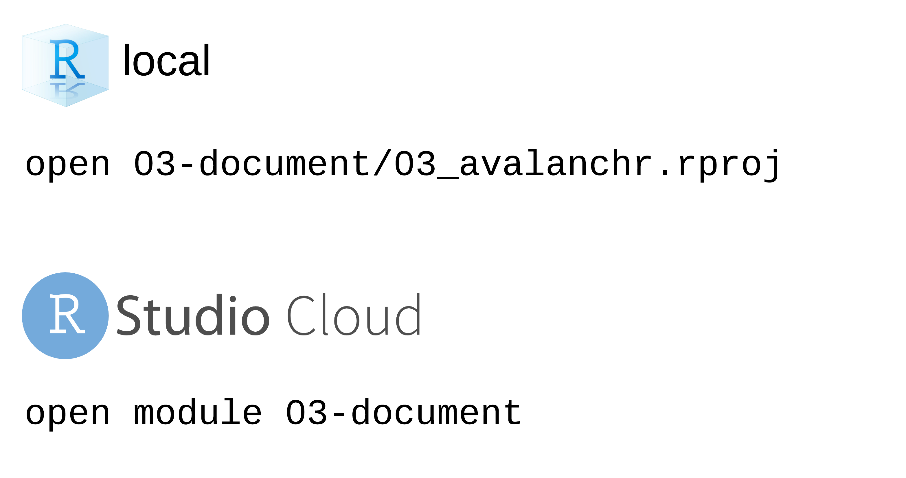
```

---

# ?mean

--

```{r, out.height="100%", out.width="100%", echo = FALSE}
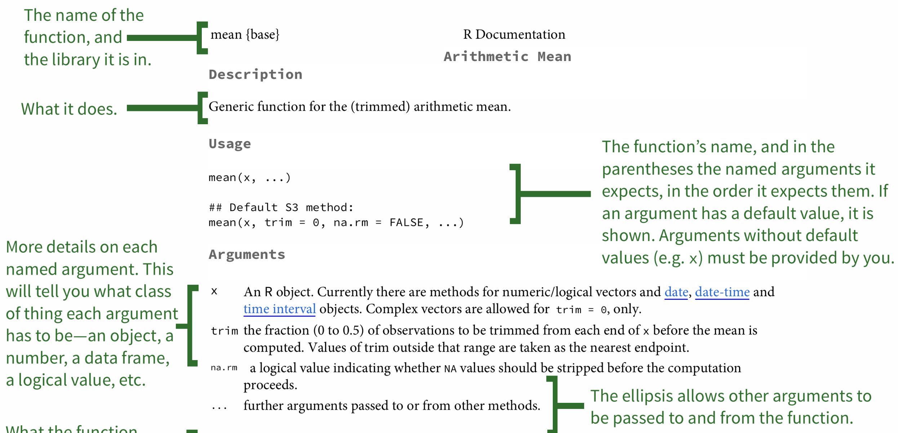
```

.pull-right[Image by [Kieran Healy](https://socviz.co/appendix.html#a-little-more-about-r)]

---

background-image: url(http://hexb.in/hexagons/roxygen2.png)
background-position: 90% 10%

## roxygen2: In-Line Documentation for R

---

background-image: url(http://hexb.in/hexagons/roxygen2.png)
background-position: 90% 10%

## roxygen2: In-Line Documentation for R

.pull-left[
## Write documentation *with* your functions
]
---

background-image: url(http://hexb.in/hexagons/roxygen2.png)
background-position: 90% 10%

## roxygen2: In-Line Documentation for R

.pull-left[
## ~~Write documentation with your functions~~

## render with **`document()`**
]

---

# Insert roxygen skeleton

## **`Code > Insert Roxygen Skeleton`**

---

# Insert roxygen skeleton

## ~~`Code > Insert Roxygen Skeleton`~~
## **Ctrl/Cmd + Shift + Alt/Opt + R**

--

```{r, out.height="50%", out.width="50%", echo = FALSE}
knitr::include_graphics("https://media.giphy.com/media/PkdsC1Qpw68erLum2M/giphy.gif")
```

---

```{r, out.height="100%", out.width="100%", echo = FALSE}

```

---

```{r, out.height="100%", out.width="100%", echo = FALSE}
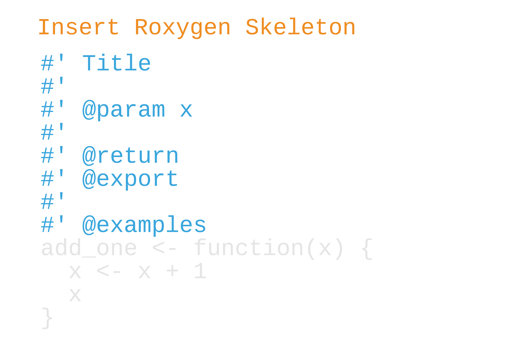
```

---

```{r, out.height="100%", out.width="100%", echo = FALSE}
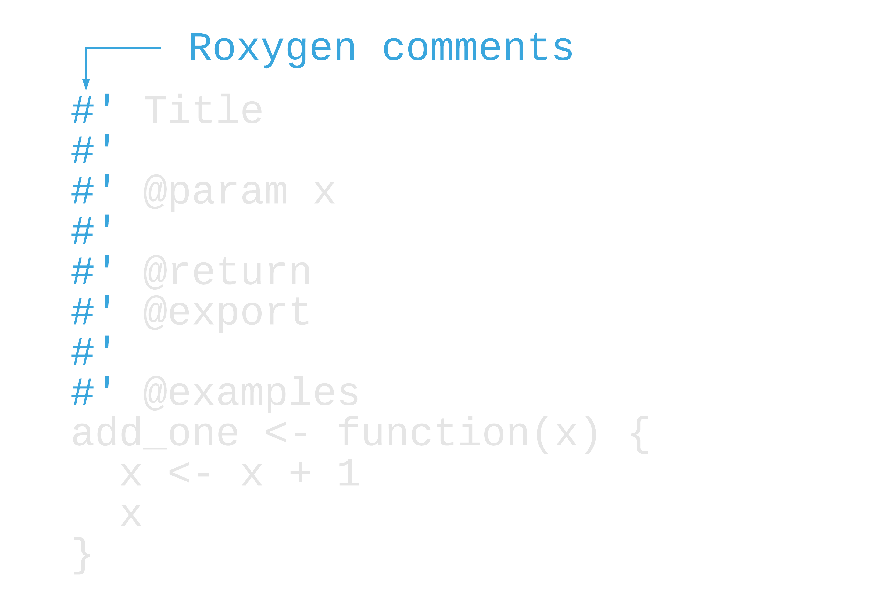
```

---

```{r, out.height="100%", out.width="100%", echo = FALSE}
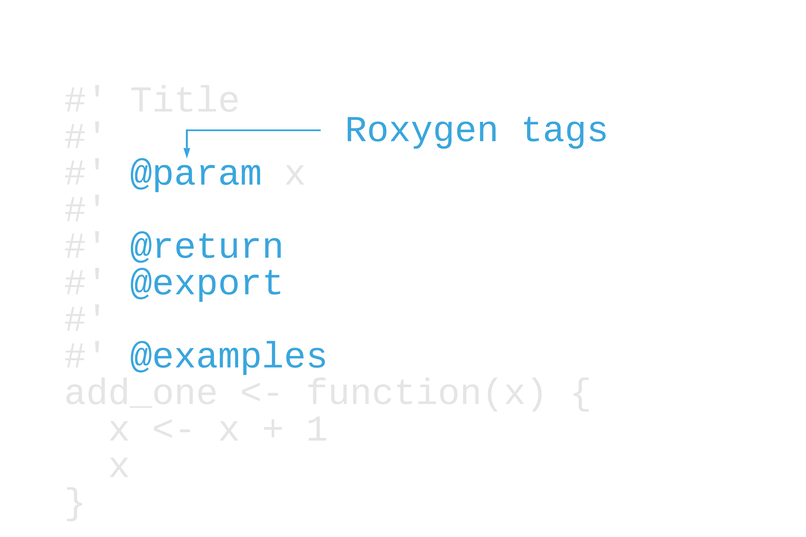
```

---

```{r, out.height="100%", out.width="100%", echo = FALSE}
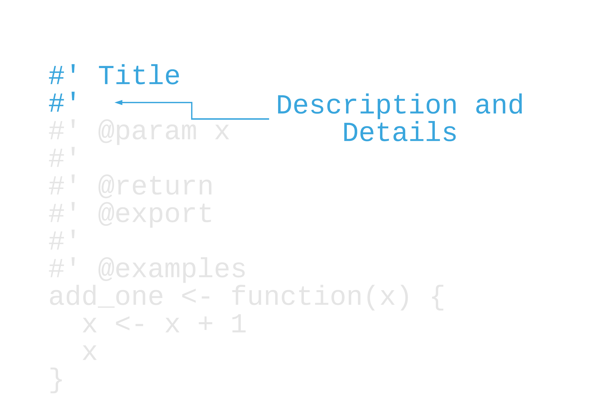
```

---

```{r, out.height="100%", out.width="100%", echo = FALSE}
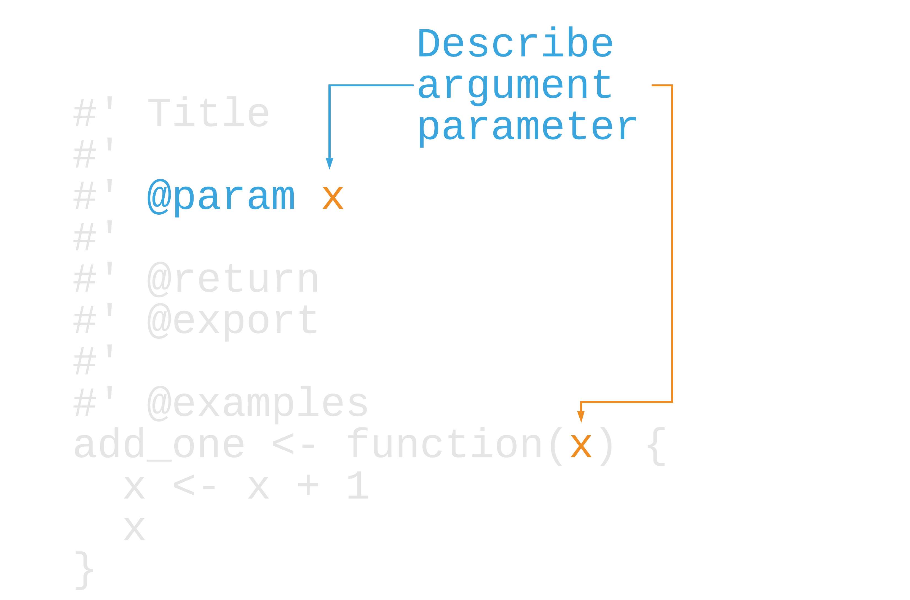
```

---

```{r, out.height="100%", out.width="100%", echo = FALSE}
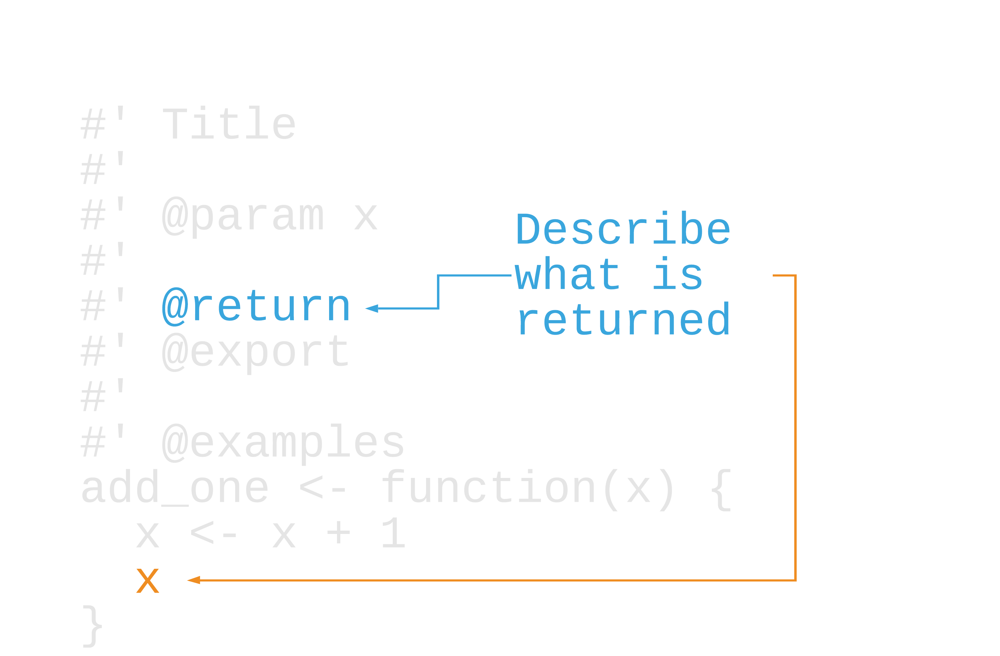
```

---

```{r, out.height="100%", out.width="100%", echo = FALSE}
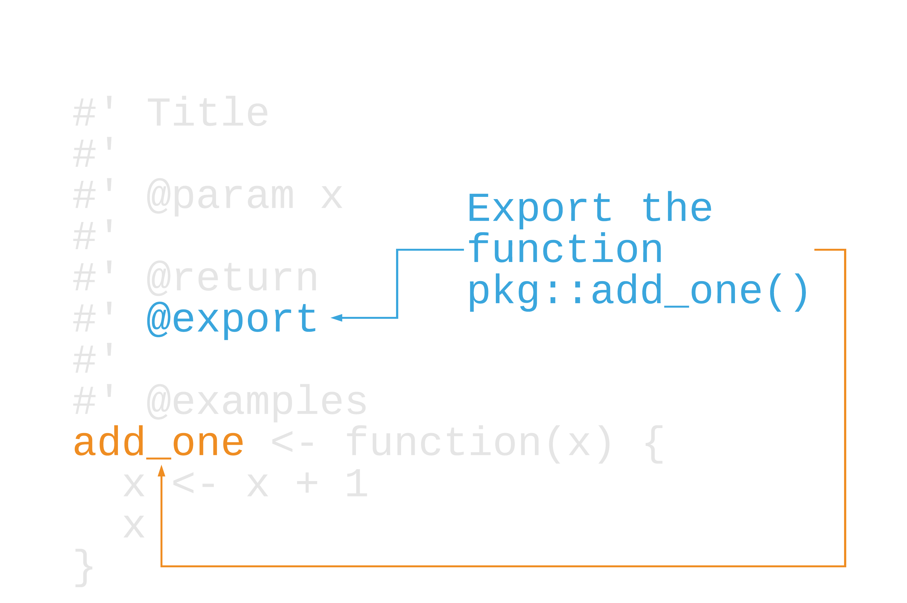
```

---

```{r, out.height="100%", out.width="100%", echo = FALSE}
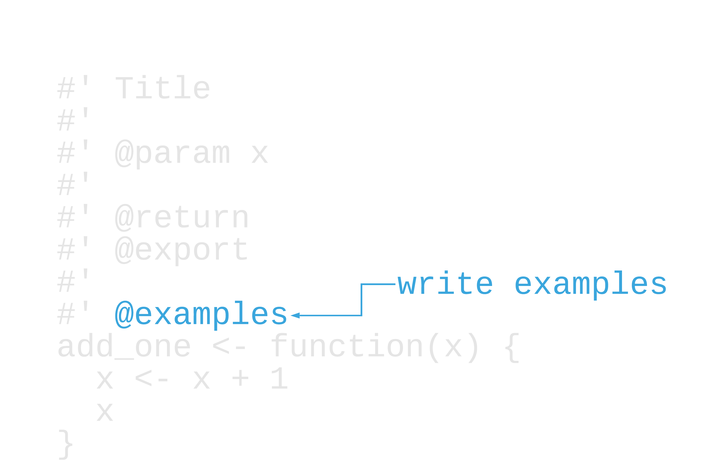
```

---

```{r, out.height="100%", out.width="100%", echo = FALSE}

```

---

# Write roxygen, run `document()`

---

# Write roxygen, run `document()`

```{r, eval = FALSE}
theme_mako <- function(base_size = 14) {
  ggplot2::theme_dark(base_size = base_size) + 
    ggplot2::theme(
      panel.background = ggplot2::element_rect(fill = "#0D98BA")
    )
}
```

---

# Write roxygen, run `document()`

```{r, eval = FALSE}
#' A dark theme with a mako-like background
#'
#' @param base_size base font size
#'
#' @return a ggplot2 theme
#' @export
#'
#' @examples
#'
#' ggplot2::quickplot(iris$Sepal.Length) + theme_mako()
#'
theme_mako <- function(base_size = 14) {
  ggplot2::theme_dark(base_size = base_size) + 
    ggplot2::theme(
      panel.background = ggplot2::element_rect(fill = "#0D98BA")
    )
}
```

---

```{r, out.height="100%", out.width="100%", echo = FALSE}
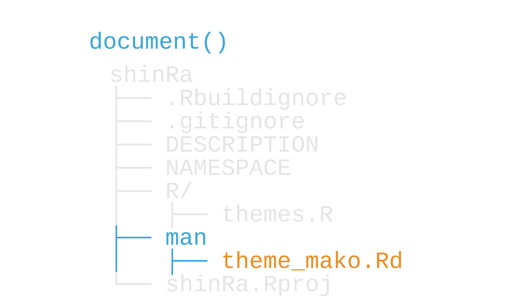
```

---

## `man/theme_mako.Rd`

.small[
```{r}
## % Generated by roxygen2: do not edit by hand #<<
## % Please edit documentation in R/themes.R #<<
## \name{theme_mako}
## \alias{theme_mako}
## \title{A dark theme with a mako-like background}
## \usage{
## theme_mako(base_size = 14)
## }
## \arguments{
## \item{base_size}{base font size}
## }
## \value{
## a ggplot2 theme
## }
## \description{
## A dark theme with a mako-like background
## }
## \examples{
## 
## ggplot2::quickplot(iris$Sepal.Length) + theme_mako()
## 
## }
```
]

---

## ?theme_mako

--

```{r, out.height="90%", out.width="90%", echo = FALSE}
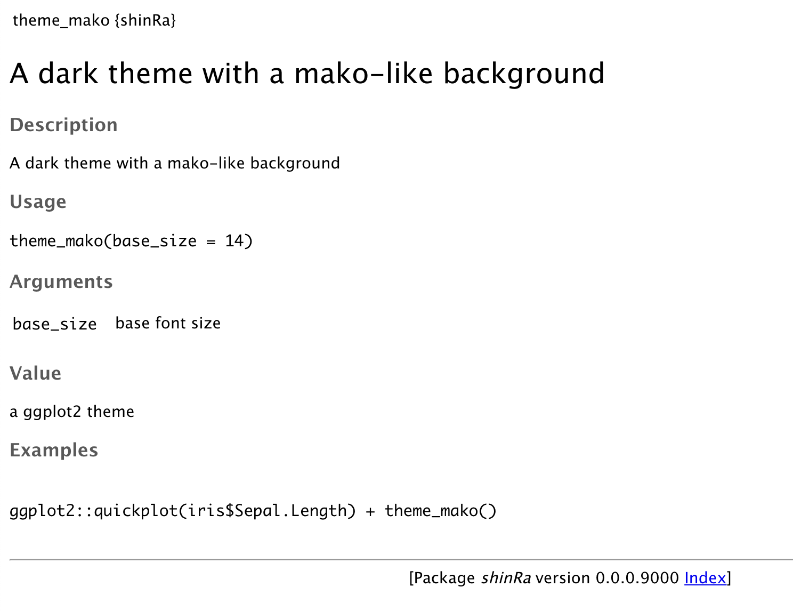
```

---

# Syntax

## LaTeX like. See more at https://r-pkgs.org/man.html

## `use_roxygen_md()` lets you write in Markdown. See more at https://roxygen2.r-lib.org/articles/rd-formatting.html 

---

## Your Turn 1

#### Open the NAMESPACE file. What do you see?
#### Let's add documentation. Run `use_roxygen_md()`
#### Open `r/themes.R`. Insert a roxygen skeleton for `theme_avalanche()`.
#### Change the title to "AVALANCHE ggplot2 themes"
#### Hit Enter/Return twice after the title.  Make sure the new lines start with `#'`. Add this text: "Minimalistic ggplot themes for use on AVALANCHE reports."
#### Run `document()` or press `Ctrl/Cmd + Shift + D`. Read the help page for your function with `?theme_avalanche`.
#### Finally, look at the NAMESPACE file again. What changed?

---

## Your Turn 1

```{r, eval=FALSE}
exportPattern("^[^\\.]")
```
---

## Your Turn 1

```{r, eval=FALSE}
#' AVALANCHE ggplot2 themes #<<
#' 
#' Minimalistic ggplot themes for use on AVALANCHE reports. #<<
#'
#' @param base_size 
#' @param ... 
#'
#' @return
#' @export
#'
#' @examples
theme_avalanche <- function(base_size = 14, ...) {
  ggplot2::theme_minimal(base_size = base_size, ...) +
    ggplot2::theme(panel.grid.minor = ggplot2::element_blank())
}
```


---

## Your Turn 1

```{r, eval=FALSE}
# Generated by roxygen2: do not edit by hand

export("%>%")
export(db_con)
export(get_resident_data)
export(theme_avalanche)
export(theme_avalanche_h)
export(theme_avalanche_v)
import(data.table)
importFrom(magrittr,"%>%")
```

---

# Argument descriptions

```{r, eval=FALSE}
#' [other roxygen code]
#' @param x The name of a database to retrieve #<<
get_data <- function(x) {
  # code to get data
}
```

---

# Argument descriptions: @inheritParams

```{r, eval=FALSE}
#' [other roxygen code]
#' @param x The name of a database to retrieve
get_data <- function(x) {
  # code to get data
}

#' [other roxygen code]
filter_table <- function(x) {#<<
  tbl <- get_data(x) #<<
  # code to filter data
}
```

---

# Argument descriptions: @inheritParams

```{r, eval=FALSE}
#' [other roxygen code]
#' @param x The name of a database to retrieve
get_data <- function(x) {
  # code to get data
}

#' [other roxygen code]
#' @inheritParams get_data #<<
filter_table <- function(x) {
  tbl <- get_data(x)
  # code to filter data
}
```

---

# Examples 

## Examples can be any kind of R code

--

```{r, eval=FALSE}
#' [other roxygen code]
#' @examples #<<
#' #<<
#' library(dplyr) #<<
#' get_data("daily_actice_users") %>% #<<
#'   filter(date == lubridate::today()) #<<
get_data <- function(x) {
  # code to get data
}
```

---

# Examples 

## ~~Examples can be any kind of R code~~

```{r, eval=FALSE}
#' [other roxygen code]
#' @examples 
#' 
#' library(dplyr) #<<
#' get_data("daily_actice_users") %>% 
#'   filter(date == lubridate::today())  #<<
get_data <- function(x) {
  # code to get data
}
```

## **But any packages used need to be imported or suggested!**

---

# Examples

## If you don't want to run examples, wrap them in `dontrun{}` or `donttest{}`

```{r, eval=FALSE}
#' [other roxygen code]
#' @examples 
#'
#' dontrun{ #<<
#'   get_data("daily_active_users") #<<
#' } #<<
get_data <- function(x) {
  # code to get data
}
```

---

## Your Turn 2 

### Let's keep working on the documentation for `theme_avalanche()`:
#### Remove `@param base_size` and replace it with: @inheritParams ggplot2::theme_minimal
#### For `@param ...`, add: Additional arguments passed to [ggplot2::theme_minimal()]
#### For `@return`, add: a ggplot theme.
#### For `@examples`, add two line breaks (make sure the new lines have roxygen comments!). Add this code: `ggplot2::qplot(iris$Sepal.Length) + theme_avalanche()`
#### Rebuild the documentation and check the help page.

---

## Your Turn 2

```{r, eval = FALSE}
#' AVALANCHE ggplot2 themes
#'
#' Minimalistic ggplot themes for use on AVALANCHE reports.
#'
#' @inheritParams ggplot2::theme_minimal #<<
#' @param ... Additional arguments passed to [ggplot2::theme_minimal()] #<<
#'
#' @return a ggplot theme. #<<
#' @export
#'
#' @examples
#'
#' ggplot2::qplot(iris$Sepal.Length) + theme_avalanche() #<<
#'
theme_avalanche <- function(base_size = 14, ...) {
  ggplot2::theme_minimal(base_size = base_size, ...) +
    ggplot2::theme(panel.grid.minor = ggplot2::element_blank())
}

```


---


```{r, out.height="70%", out.width="70%", echo = FALSE}
knitr::include_graphics("img/build-reload-opts-2.png")
```


.pull-right[Image from [R Packages, ed. 2](https://r-pkgs.org/man.html)]


---

class: inverse

# [Quoth Jenny Bryan](https://github.com/jennybc/code-smells-and-feels):

1. Use functions.
2. A few little functions >> a monster function
3. Small well-named helper >> commented code

---

## Helper functions

```{r, eval=FALSE}
plot_daus <- function(daily_users) {
  daily_users <- daily_users %>%
    dplyr::mutate(date = as.Date(time)) %>%
    dplyr::group_by(date)
    dplyr::select(user_id) %>%
    dplyr::distinct() %>%
    dplyr::summarize(n = dplyr::n()) 
  
  ggplot2::ggplot(ggplot2::aes(daily_users, x, n)) + 
    ggplot2::geom_col()
}
```

---

## Helper functions

```{r, eval=FALSE}
plot_daus <- function(daily_users) {
  daily_users <- count_daus(daily_users) #<<
  
  ggplot2::ggplot(ggplot2::aes(daily_users, x, n)) + 
    ggplot2::geom_col()
}

count_daus <- function(daily_users) { #<<
  daily_users %>%
    dplyr::mutate(date = as.Date(time)) %>%
    dplyr::group_by(date)
    dplyr::select(user_id) %>%
    dplyr::distinct() %>%
    dplyr::summarize(n = dplyr::n()) 
}
```

---

## Show of Hands

## Which of these functions will be added to NAMESPACE?

```{r, eval=FALSE}
#' Plot daily active users
#' 
#' @param ...
#' @export 
plot_daus <- function(...) {
  # ... code to plot daily active users
}

#' Count daily active users
#' 
#' @param ...
count_daus <- function(...) {
  # ... code to count daily active users
}
```

---

## Show of Hands

## Which of these functions will be added to NAMESPACE?

```{r, eval=FALSE}
#' Plot daily active users
#' 
#' @param ...
#' @export #<<
plot_daus <- function(...) {
  # ... code to plot daily active users
}

#' Count daily active users
#' 
#' @param ...
count_daus <- function(...) {
  # ... code to count daily active users
}
```

---

## Exported functions vs internal functions

## **`@export`** = **`shinRa::plot_daus()`**

--

## *`library(shinRa)`*
## *`plot_daus()`* ✔️ 

---

## Exported functions vs internal functions

## **NO `@export`** = **`shinRa:::count_daus()`**

--

## *`library(shinRa)`*
## *`count_daus()`* 🤔🤔🤔🤔🤔🤔  
---

class: inverse

# Strategies for documenting helper functions:

1. Don't document them 🤷
2. @keyword internal
3. @nomd

---

# Joining documentation

--

```{r, eval=FALSE}
#' [other roxygen code]
#' @param x The name of a database to retrieve 
get_data <- function(x) { #<<
  # code to get data
}

#' [other roxygen code]
#' @param x @inheritParam get_data 
filter_table <- function(x) { #<<
  tbl <- get_data(x)
  # code to filter data
}
```

---

# Joining documentation

```{r, eval=FALSE}
#' [other roxygen code]
#' @param x The name of a database to retrieve 
get_data <- function(x) { 
  # code to get data
}

#' @rdname get_data #<<
#' @export #<<
filter_table <- function(x) { 
  tbl <- get_data(x)
  # code to filter data
}
```

---

# Joining documentation

```{r, eval=FALSE}
#' [other roxygen code]
#' @param x The name of a database to retrieve 
#' @name data_helpers #<< 
NULL #<< 

#' @rdname data_helpers #<<
#' @export 
get_data <- function(x) { 
  # code to get data
}

#' @rdname data_helpers #<<
#' @export 
filter_table <- function(x) { 
  tbl <- get_data(x)
  # code to filter data
}
```

---

# Joining documentation

```{r, eval=FALSE}
#' [other roxygen code]
#' @param x The name of a database to retrieve 
#' @name data_helpers 
NULL 

#' @rdname data_helpers 
#' @export #<<
get_data <- function(x) { 
  # code to get data
}

#' @rdname data_helpers 
#' @export #<<
filter_table <- function(x) { 
  tbl <- get_data(x)
  # code to filter data
}
```

---


## Your Turn 3

#### In `R/themes.R`, join the documentation of `theme_avalanche_h()` and `theme_avalanche_v()` to `theme_avalanche()` by replacing the roxygen code for the first two functions with "#' @rdname theme_avalanche". 
#### Make sure both functions still have an export tag, as well!
#### Re-render the documentation and read the help page for `?theme_avalanche_h()`

---


## Your Turn 3

```{r, eval=FALSE}
#' @rdname theme_avalanche #<<
#' @export #<<
theme_avalanche_h <- function(base_size = 14, ...) {
  ggplot2::theme_minimal(base_size = base_size, ...) +
    ggplot2::theme(
      panel.grid.minor = ggplot2::element_blank(),
      panel.grid.major.x = ggplot2::element_blank()
    )
}

#' @rdname theme_avalanche #<<
#' @export #<<
theme_avalanche_v <- function(base_size = 14, ...) {
  ggplot2::theme_minimal(base_size = base_size, ...) +
    ggplot2::theme(
      panel.grid.minor = ggplot2::element_blank(),
      panel.grid.major.y = ggplot2::element_blank()
    )
}
```


---

# Package documentation

## `use_package_doc()`

```{r, include=FALSE, R.options = list(usethis.description = NULL), message=FALSE}
dir <- tempfile()
fs::dir_create(dir)
create_package(file.path(dir, "shinRa"), open = FALSE, rstudio = TRUE)
```

```{r, echo=FALSE, R.options = list(usethis.description = NULL), message=TRUE}
withr::with_dir(file.path(dir, "shinRa"), use_package_doc())

unlink(dir)
```

---

## `help("tidyr")`

```{r, out.height="70%", out.width="70%", echo = FALSE}
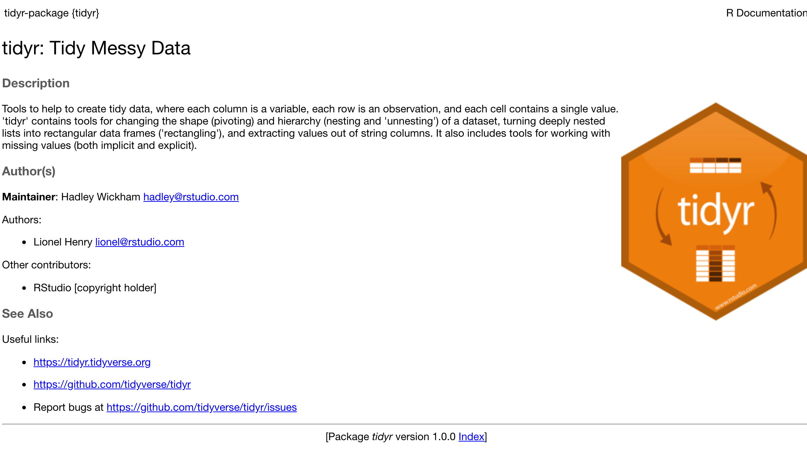
```

---

background-image: url(https://raw.githubusercontent.com/r-lib/pkgdown/master/man/figures/logo.png)
background-position: 90% 10%

# pkgdown

---

background-image: url(https://raw.githubusercontent.com/r-lib/pkgdown/master/man/figures/logo.png)
background-position: 90% 10%

# pkgdown

.pull-left[
## `use_pkgdown()`
## Renders documentation, README, vignettes, and more as a website.
]

---

background-image: url(http://hexb.in/hexagons/roxygen2.png)
background-position: 90% 10%

.pull-left[
# Here's a good example...

## https://roxygen2.r-lib.org/
## There are a lot more documentation tricks.
## Read the vignettes!
]
