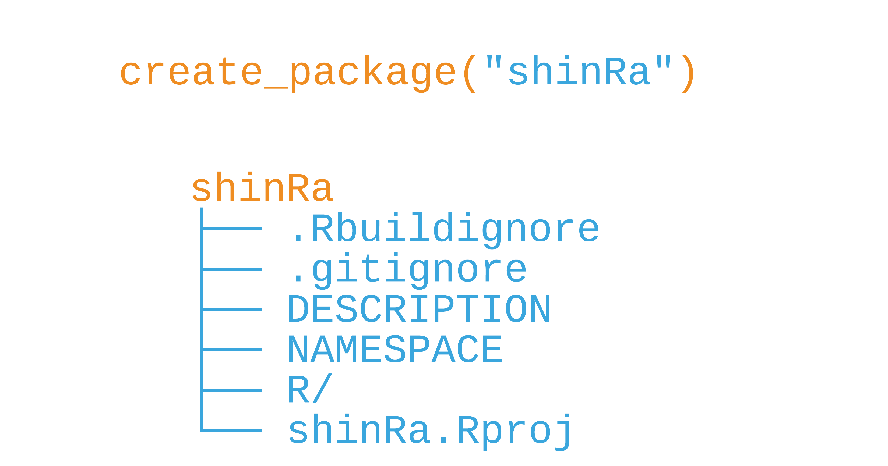
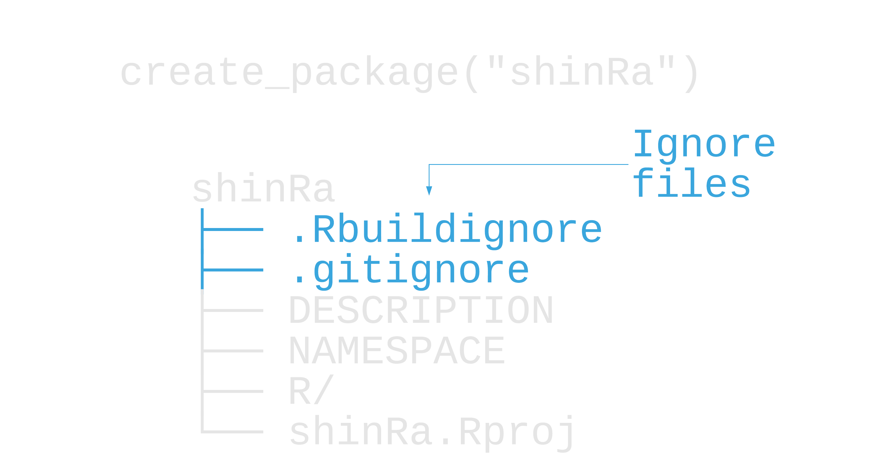
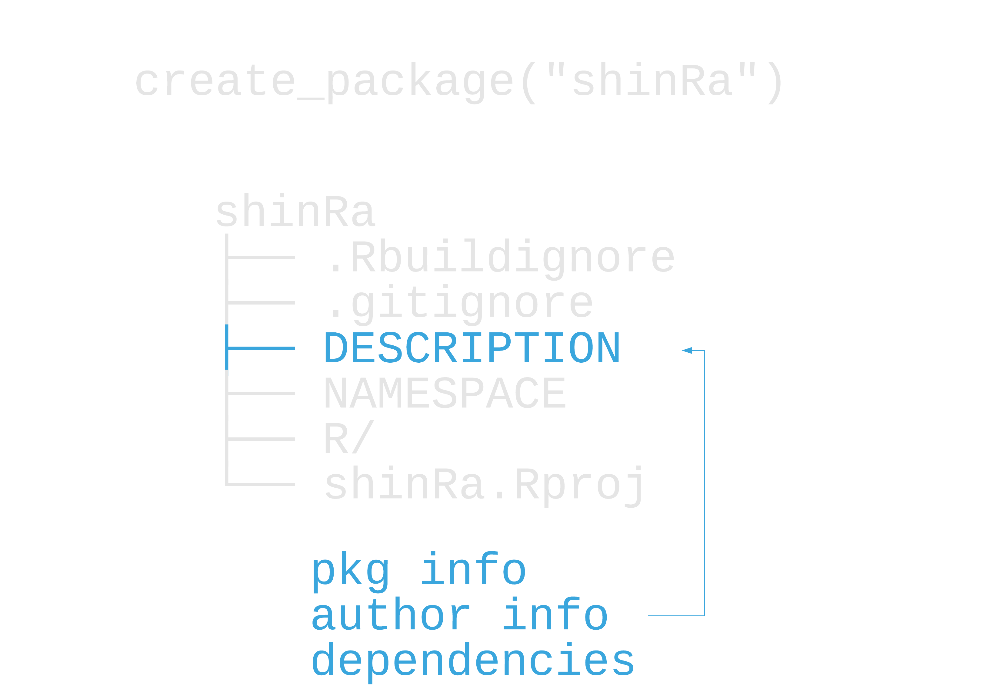
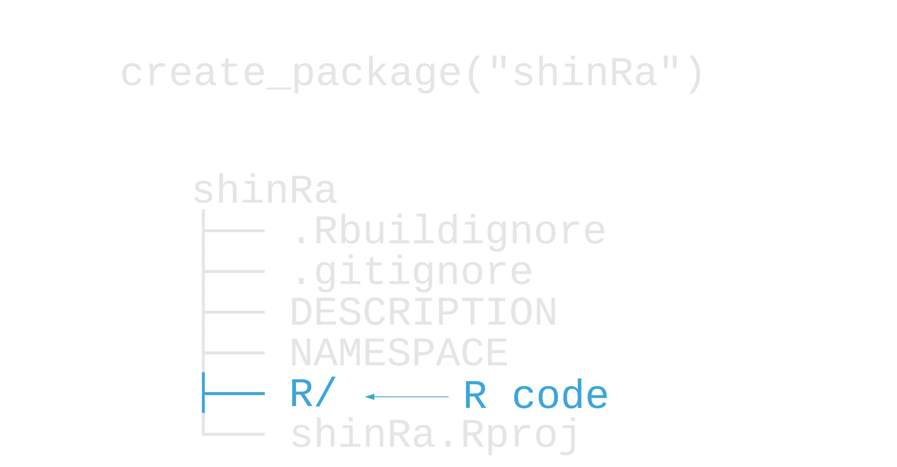
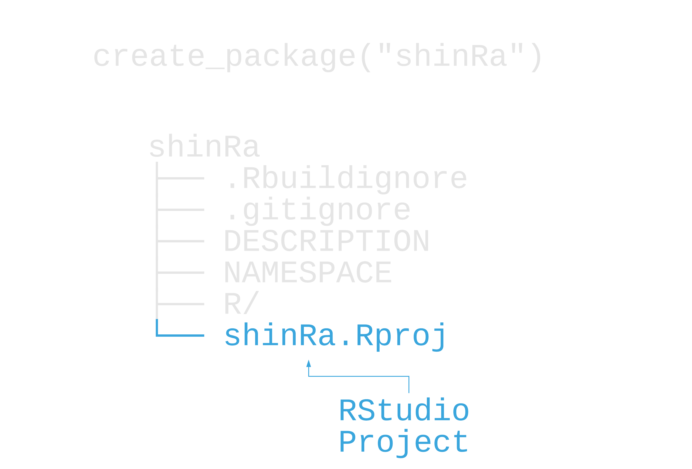
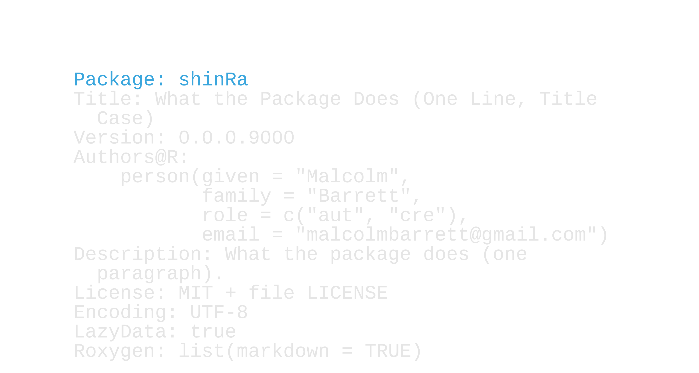
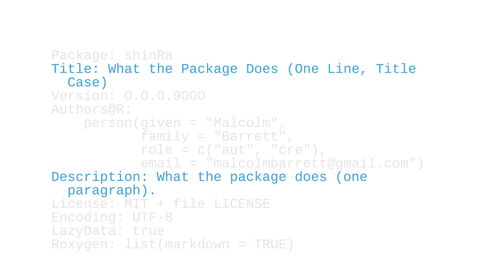
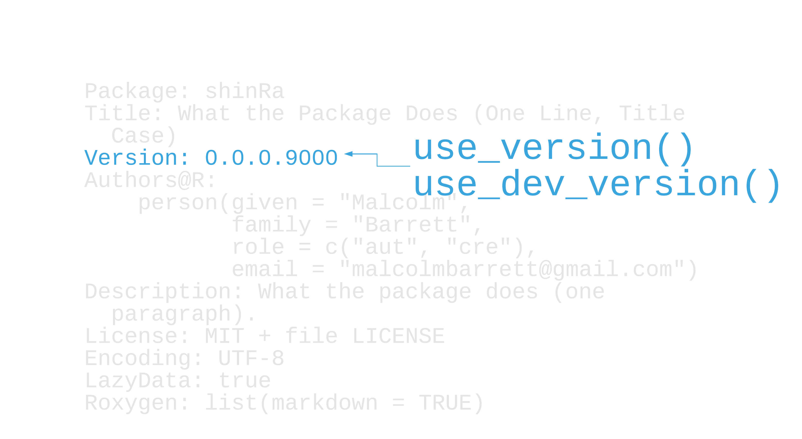
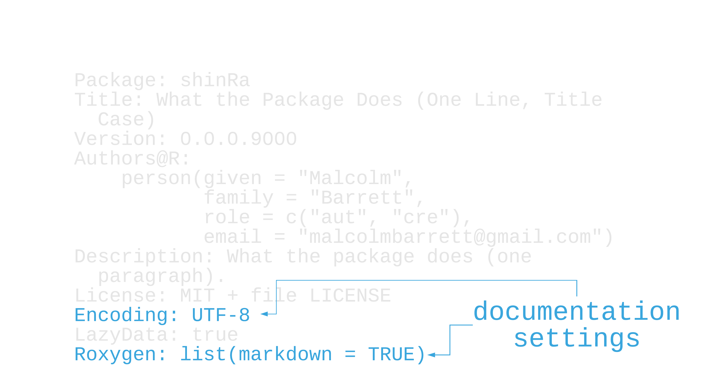
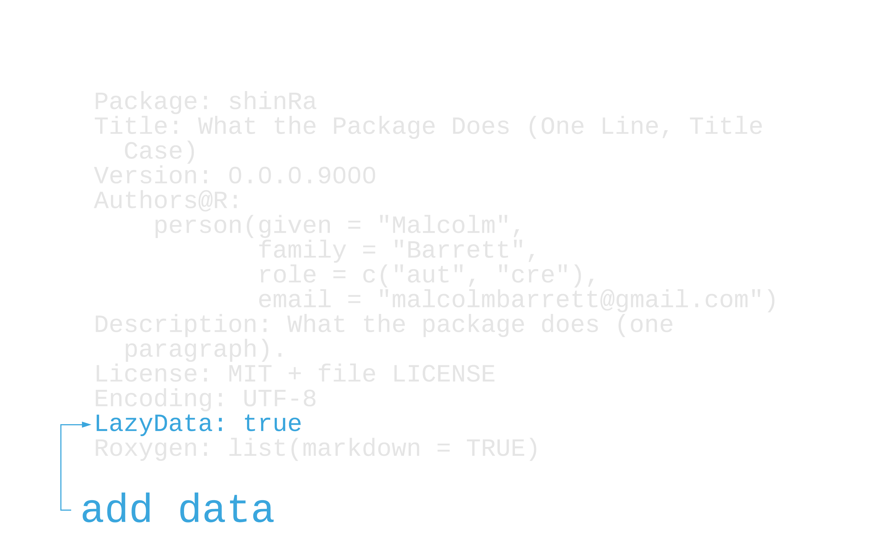

background-image: url(http://hexb.in/hexagons/devtools.png)
background-position: 90% 3%
background-size: 15%

```{r setup, include=FALSE}
options(htmltools.dir.version = FALSE, tibble.max_extra_cols = 6, tibble.width = 60)
knitr::opts_chunk$set(warning = FALSE, message = FALSE, fig.align = "center", dpi = 320, fig.height = 4)
library(tidyverse)
library(usethis)
library(devtools)

#  clean up usethis output
hook_message <- knitr::knit_hooks$get('message')
process_usethis_messages <- function(x, options) {
  x <- x %>% 
    str_remove_all("\n|##") %>% 
    str_trim() %>% 
    str_split("✔ ") %>% 
    pluck(1) %>% 
    discard(~.x == "") %>% 
    paste0("## ✔ ", .) %>% 
    str_trunc(width = 100)
  
  hook_message(x, options)
}
knitr::knit_hooks$set(message = process_usethis_messages)
```

# [devtools](https://devtools.r-lib.org/)

---

background-image: url(http://hexb.in/hexagons/devtools.png)
background-position: 90% 3%
background-size: 15%

# [devtools](https://devtools.r-lib.org/)

## Tools to make an R developer's life easier
## We'll be using functions like *`load_all()`*, *`build()`*, *`document()`*, *`test()`*, and *`check()`*.

---

background-image: url(https://raw.githubusercontent.com/r-lib/usethis/master/man/figures/logo.png)
background-position: 90% 3%
background-size: 15%

# [usethis](https://usethis.r-lib.org/)

## Set up commonly used 📦 components
## We'll be using functions like *`create_package()`*, *`use_r()`*, *`use_test()`*, and many more.

---

background-image: url(img/hex-shinRa.png)
background-position: 90% 3%
background-size: 15%

# shinRa

## An R package for the data science team at the Shinra Electric Power Company, also known as Shinra, Inc. 

## What will it do? Custom ggplot2 themes, reports, data connections and filtering, and more.

---

#  `create_package("shinRa")`

```{r, eval=FALSE}
library(usethis)
create_package("shinRa")
```

---

```{r, eval=FALSE}
library(usethis)
create_package("shinRa")
```

.small[
```{r, echo=FALSE, R.options = list(usethis.description = NULL), message=TRUE}
dir <- tempfile()
fs::dir_create(dir)
create_package(file.path(dir, "shinRa"), open = FALSE, rstudio = TRUE)
fs::dir_tree(file.path(dir, "shinRa"))
```
]

---

```{r, out.height="100%", out.width="100%", echo = FALSE}

```

---

```{r, out.height="100%", out.width="100%", echo = FALSE}

```

---

```{r, out.height="100%", out.width="100%", echo = FALSE}

```

---

```{r, out.height="100%", out.width="100%", echo = FALSE}
knitr::include_graphics("img/create_package_namespace.png")
```

---

```{r, out.height="100%", out.width="100%", echo = FALSE}

```

---

```{r, out.height="100%", out.width="100%", echo = FALSE}

```

---

## Your Turn 1

#### Load usethis and devtools if you haven't.

#### Open the DESCRIPTION file and take a look. It's very generic!

#### Run `edit_r_profile()`. Copy and paste this code into your R profile, but change it to your name and email. If you would like to add your ORCID ID see `?use_description` for an example for an example that includes that.

#### Then, restart your R session (Session > Restart R). 

if you don't want to change your R profile, you can just run the code in the console without running `edit_r_profile()` or restarting

#### When you've restarted, run `use_description()` to replace the DESCRIPTION file.

#### Open the DESCRIPTION file and take a look around.

---

## Your Turn 1: Stretch Goal

#### Read the help page for `use_usethis()`. If there are any of these that you'd like available in all interactive sessions, run the function to get the related code and add it to your R Profile.

---

background-image: url(img/hex-avalanchr.png)
background-position: 90% 10%
background-size: 30%

# avalanchr
.pull-left[
## An R package for the data science team for the AVALANCHE ecological insurgency organization.
]

---

```{r, out.height="100%", out.width="100%", echo = FALSE}

```

---

```{r, out.height="100%", out.width="100%", echo = FALSE}

```

---

class: inverse

# Valid package names:
.large[
1. Consist of letters, numbers, or periods.
2. Start with a letter.
3. Do *not* end with a period
]
---

class: center, middle, inverse

# **Use the [available](https://github.com/r-lib/available) package to check your package name**


---

## Naming your package

```{r}
available::suggest("Shinra Electric Power")
```

--

## Also see ["Naming Things"](https://www.njtierney.com/post/2018/06/20/naming-things/)

---

## Is the name available?

```{r, eval = FALSE}
available::available("package.name")
```

--

```{r, out.height="80%", out.width="80%", echo = FALSE}
knitr::include_graphics("img/available.png")
```

.pull-left[Image from the [available repository](https://github.com/r-lib/available)]

---

```{r, out.height="100%", out.width="100%", echo = FALSE}

```

---

```{r, out.height="90%", out.width="90%", echo = FALSE}
knitr::include_graphics("img/cran-package.png")
```

.pull-right[image from [R Packages, ed. 2](https://r-pkgs.org/description.html)]

---

```{r, out.height="100%", out.width="100%", echo = FALSE}
knitr::include_graphics("img/description_author.png")
```

---

# Adding an author with desc

--

```{r, eval = FALSE}
desc::desc_add_author(#<<
  given = "Rufus", 
  family = "Shinra",
  role = "ctb", 
  email = "rufus@shinrainc.com",
  comment = list("ORCID-ID" = "902348-439034")
)
```

---

# Adding an author with desc

```{r, eval = FALSE}
desc::desc_add_author(
  given = "Rufus", #<<
  family = "Shinra",  #<<
  role = "ctb", 
  email = "rufus@shinrainc.com", #<<
  comment = list("ORCID-ID" = "902348-439034")
)
```
---

# Adding an author with desc

```{r, eval = FALSE}
desc::desc_add_author(
  given = "Rufus",
  family = "Shinra",  
  role = "ctb", 
  email = "rufus@shinrainc.com", 
  comment = list("ORCID-ID" = "902348-439034") #<<
)
```

---

# Adding an author with desc

```{r, eval = FALSE}
desc::desc_add_author(
  given = "Rufus",
  family = "Shinra",  
  role = "ctb", #<<
  email = "rufus@shinrainc.com", 
  comment = list("ORCID-ID" = "902348-439034") 
)
```

---

# R package roles

|  Code|  Role|
|--:|--:|
|  cre |  Maintainer |
|  aut | Author |
|  ctb | Contributer |
|  cph | Copyright-holder |

Full list: http://www.loc.gov/marc/relators/relaterm.html

---

## Your Turn 2

#### Add a new author to `avalanchr` using `desc::desc_add_author()`. Set `given` to "Barret", `family` to "Wallace", and `role` to "aut". 
#### In DESCRIPTION, change the title to "Tools for the Avalanche Data Science Team"
#### Change the Description field to "A set of tools to use within the Avalance Data Science team. This package contains functions for connecting to data bases, R markdown templates, ggplot2 themes, and more."
#### Run `use_tidy_description()` to clean up the file. 

---

```{r, out.height="100%", out.width="100%", echo = FALSE}
knitr::include_graphics("img/description_license.png")
```

---

# `use_*_licence()`

--

## **`use_mit_license("Company Name")`**. Check the help page for more.

---

# `use_*_licence()`

## ~~`use_mit_license("Company Name")`. Check the help page for more.~~
### Help with open-source licenses: https://choosealicense.com/
### Help with proprietary licenses: http://www.binpress.com/license-generator/

---

## Proprietary licenses

### `use_proprietary_license("Shinra, Inc")`

```
License: file LICENSE
```

```
Proprietary 

Do not distribute outside of Shinra, Inc.
```

<br><br>
--

### See also ["Copyright in Closed-Source R Packages: The Right Way"](https://unconj.ca/blog/copyright-in-closed-source-r-packages-the-right-way.html)


---

## Your Turn 3

## Run `use_mit_license("AVALANCHE")`. What changed?

---

## Your Turn 3: Stretch Goal

## Add "AVALANCHE" as an author with the role of copyright holder.
## Change the license to use the proprietary license above.

---

```{r, out.height="100%", out.width="100%", echo = FALSE}

```

---

```{r, out.height="100%", out.width="100%", echo = FALSE}

```

---

```{r, out.height="100%", out.width="100%", echo = FALSE}

```

---

# Setting up git and GitHub

---

# Setting up git and GitHub
## **`use_git()`**, **`use_github()`**

---

# Setting up git and GitHub
## ~~`use_git()`, `use_github()`~~
## **`create_from_github()`** to clone
---

# Setting up git and GitHub
## ~~`use_git()`, `use_github()`~~
## ~~`create_from_github()` to clone~~
## **`pr_init()` and friends** to do pull requests

---

# Setting up git and GitHub
## ~~`use_git()`, `use_github()`~~
## ~~`create_from_github()` to clone~~
## ~~`pr_init()` and friends to do pull requests~~
## Other usethis functions for setting up GitHub, e.g. labels, issues, contributing guidelines, etc
