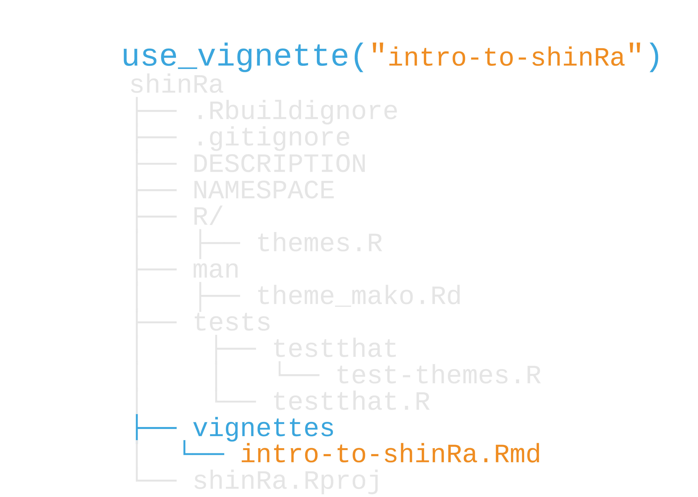
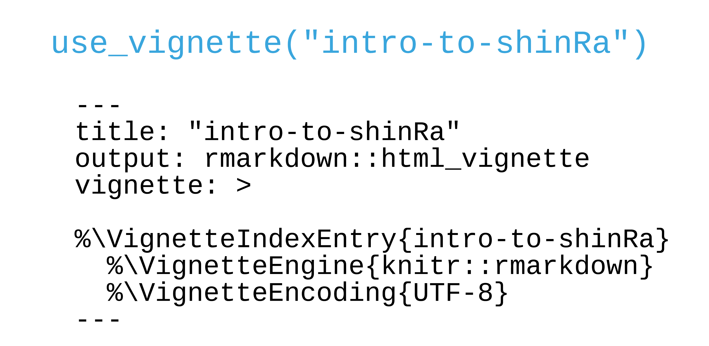
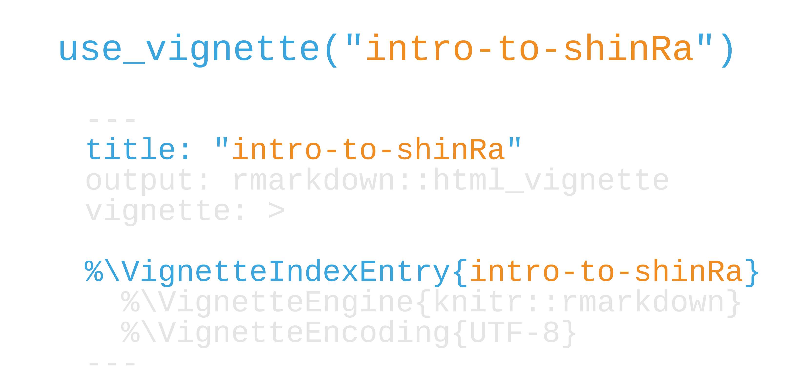
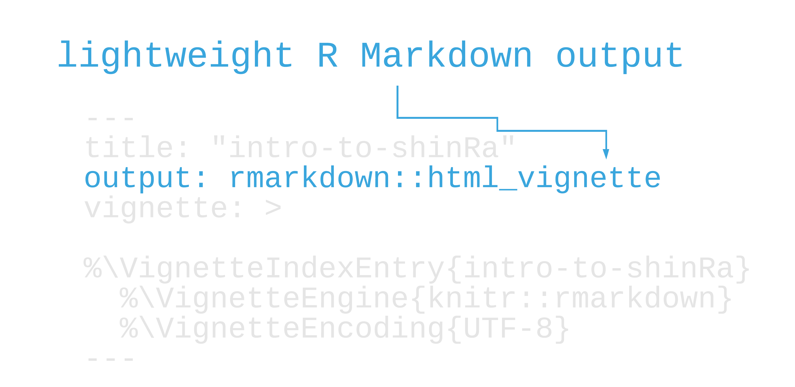
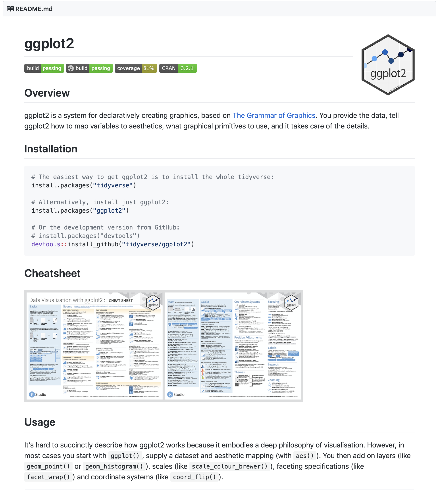
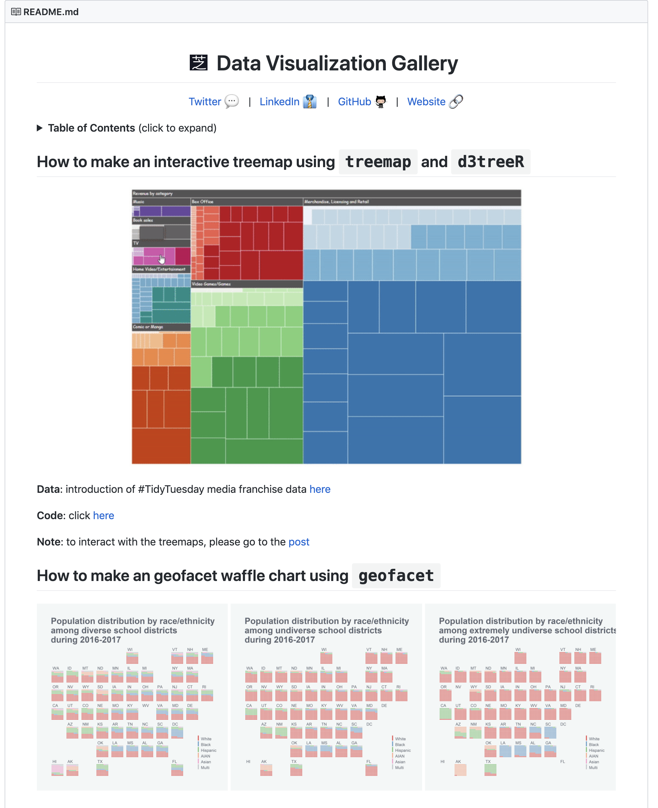

## Your Turn 1: Consider

```{r setup, include=FALSE}
options(htmltools.dir.version = FALSE, tibble.max_extra_cols = 6, tibble.width = 60)
knitr::opts_chunk$set(warning = FALSE, message = FALSE, fig.align = "center", dpi = 320, fig.height = 4)
library(tidyverse)

library(usethis)
library(devtools)

#  clean up usethis output
hook_message <- knitr::knit_hooks$get('message')
process_usethis_messages <- function(x, options) {
  x <- x |> 
    str_remove_all("\n|##") |> 
    str_trim() |> 
    str_split("✔ ") |> 
    pluck(1) |> 
    discard(~.x == "") |> 
    paste0("## ✔ ", .) |> 
    str_trunc(width = 65)
  
  hook_message(x, options)
}
knitr::knit_hooks$set(message = process_usethis_messages)

users_per_sector <- 
  tibble::tibble(
    sector = 1:8,
    users = c(1000, 2034, 4594, 2304, 8093, 1200, 300, 2398)
  )
```

## What do you do when you want to learn a new package?

---

class: inverse

# Learning new packages

1. Examples
1. Vignettes/pkgdown
1. README
1. Blog posts
1. Books

---

class: inverse

# Learning new packages
 
1. **Examples**
1. Vignettes/pkgdown
1. README
1. Blog posts
1. Books

---

class: inverse

# Learning new packages

1. Examples
1. **Vignettes/pkgdown**
1. **README**
1. Blog posts
1. Books

---

class: center, middle

# Guiding users

|  document |  scope|
|--:|--:|
|  Vignettes | User-friendly, deeper introductions and complex topics |
|  README | Simple introduction, installation. Get users going |
|  Documentation <br>and examples | Granular, function-specific details and examples  |

---

# Examples revisted

--

## If you don't want to run examples, wrap them in `\dontrun{}` or `\dontrun{}`

```{r, eval=FALSE}
#' [other roxygen code]
#' @examples 
#'
#' \dontrun{ #<<
#'   get_data("daily_active_users") #<<
#' } #<<
get_data <- function(x) {
  # code to get data
}
```

---

# Examples revisted

## Don't mess around with the user's directory. Use `tempfile()` or withr if you need to.

```{r, eval=FALSE}
withr::with_tempdir(...)
```

---

```{r, message = TRUE}
withr::with_tempdir(create_package("temp.package"))
```

---

# Vignettes

--

## Long-form documentation, written in [R Markdown](https://rmarkdown.rstudio.com/): `use_vignette()`

---

# Vignettes

## ~~Long-form documentation, written in R Markdown: `use_vignette()`~~
## Great for general introductions and complex topics you don't want buried in the documentation

---

# Vignettes

## ~~Long-form documentation, written in R Markdown: `use_vignette()`~~
## ~~Great for general introductions and complex topics you don't want buried in the documentation~~
## Get rendered on pkgdown sites. See also `use_article()`

---

```{r, out.height="100%", out.width="100%", echo = FALSE}

```

---

```{r, out.height="100%", out.width="100%", echo = FALSE}

```

---

```{r, out.height="100%", out.width="100%", echo = FALSE}

```

---

```{r, out.height="100%", out.width="100%", echo = FALSE}

```

---

# Need a Markdown refresher?

--

### Interactive, 10-20 min tutorial: https://commonmark.org/help/tutorial/

--

### The R Markdown [website](https://rmarkdown.rstudio.com/) or [book](https://bookdown.org/yihui/rmarkdown/)

---

## Your Turn 2

#### Open `vignettes/intro-to-avalanchr.Rmd`.
#### Let's add some more content before we knit this vignette. Lines 27-29 have an R Markdown code chunk. On line 28, fill in the blank with this code: `db_con("residents_per_sector")`
#### Let's also add some examples of the summarizing and plotting functions. On line 57, fill in the blank with `count_donations()`. On line 62, use `plot_donations()`
#### Knit the vignette. If you're having trouble finding some of your functions, try re-loading or documenting and re-building.

---

# README

--

## **A quick overview of your package**

---

# README

## ~~A quick overview of your package~~
## **A good place for installation instructions**

---

# README

## ~~A quick overview of your package~~
## ~~A good place for installation instructions~~
## **Becomes the homepage for a pkgdown site**

---

# README

## ~~A quick overview of your package~~
## ~~A good place for installation instructions~~
## ~~Becomes the homepage for a pkgdown site~~
## *`use_readme_md()`* or *`use_readme_rmd()`*

---

class: inverse

# What should I put in the README?

1. Badges (`?use_badge()`), where applicable.
2. Installation instructions
3. A few examples
4. Maybe: how to contribute (`use_tidy_contributing()`)


---
.pull-left[
## R Packages: [ggplot2's README](https://github.com/tidyverse/ggplot2)
]

.pull-right[
```{r, out.height="100%", out.width="100%", echo = FALSE}

```
]

---

.pull-left[
## Other READMEs: [Zhi Yang's TidyTuesday repo](https://github.com/zhiiiyang/tidytuesday)
]

.pull-right[
```{r, out.height="100%", out.width="100%", echo = FALSE}

```
]

---

.pull-left[
## Other READMEs: [Zhi Yang's TidyTuesday repo](https://github.com/zhiiiyang/tidytuesday)
## Check out ["Building a Better README"](https://blog.sourcerer.io/building-a-better-readme-d5053a7bc341)
]

.pull-right[
```{r, out.height="100%", out.width="100%", echo = FALSE}

```
]

---

## Your Turn 3

### Run `use_readme_rmd()` to setup a README. Knit the file and take a look.
### Let's add some badges. Run `use_lifecycle_badge("experimental")` and `use_cran_badge()`. Then, re-knit.

---

# Spell check with the [spelling](https://docs.ropensci.org/spelling/) package

## `use_spell_check()`

