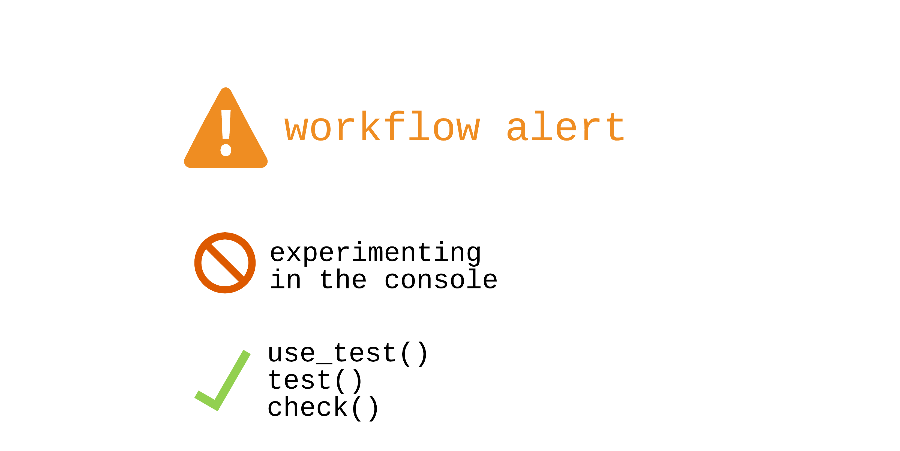
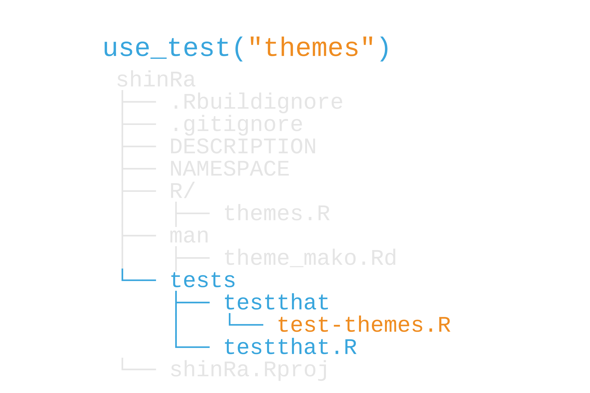

background-image: url(https://i.imgur.com/CVIZGyY.jpg)
background-position: top
background-size: 100%
class: inverse, shadow


```{r setup, include=FALSE}
options(htmltools.dir.version = FALSE, tibble.max_extra_cols = 6, tibble.width = 60)
knitr::opts_chunk$set(warning = FALSE, message = FALSE, fig.align = "center", dpi = 320, fig.height = 4)
library(tidyverse)

library(usethis)
library(devtools)

#  clean up usethis output
hook_message <- knitr::knit_hooks$get('message')
process_usethis_messages <- function(x, options) {
  x <- x %>% 
    str_remove_all("\n|##") %>% 
    str_trim() %>% 
    str_split("✔ ") %>% 
    pluck(1) %>% 
    discard(~.x == "") %>% 
    paste0("## ✔ ", .) %>% 
    str_trunc(width = 100)
  
  hook_message(x, options)
}
knitr::knit_hooks$set(message = process_usethis_messages)

users_per_sector <- 
  tibble::tibble(
    sector = 1:8,
    users = c(1000, 2034, 4594, 2304, 8093, 1200, 300, 2398)
  )
```

```{r, css_theme, echo=FALSE}
htmltools::includeCSS("https://raw.githubusercontent.com/malcolmbarrett/kakashi/master/kakashi.css")
```


# My Organization's First R package
## Test R Code
## `rstudio::conf(2020L)`

---

class: middle, center

```{r, out.height="100%", out.width="100%", echo = FALSE}

```

---

class: inverse, center, middle

# **It’s not that you don’t test your code, it’s that you don’t automate your tests.**
.pull-right[—Hadley Wickham]

---

background-image: url(http://hexb.in/hexagons/testthat.png)
background-position: 90% 10%

## testthat: Unit tests for R
<br><br>

---

background-image: url(http://hexb.in/hexagons/testthat.png)
background-position: 90% 10%

## testthat: Unit tests for R

.pull-left[
## Automate tests (*`use_test()`*) using expectations
]

---

background-image: url(http://hexb.in/hexagons/testthat.png)
background-position: 90% 10%

## testthat: Unit tests for R

.pull-left[
## ~~Automate tests (`use_test()`) using expectations~~
## Run tests with *`test()`*, *`test_file()`*, *`Cmd/Ctrl + Shift + T`*.
]

---

background-image: url(http://hexb.in/hexagons/testthat.png)
background-position: 90% 10%

## testthat: Unit tests for R

.pull-left[
## ~~Automate tests (`use_test()`) using expectations~~
## ~~Run tests with `test()`, `test_file()`, `Cmd/Ctrl + Shift + T`.~~
## Also runs during R CMD Check (*`check()`*)
]
---

```{r, out.height="100%", out.width="100%", echo = FALSE}

```

---

```{r, out.height="100%", out.width="100%", echo = FALSE}

```

---

# Test files

## `test/testthat/test-themes.R`

```{r, eval = FALSE}
test_that("theme works", {#<<
  expect_true(ggplot2::is.theme(theme_mako()))
  expect_error(theme_mako(base_size = "14"))
})
```

---

# Test files

## `test/testthat/test-themes.R`

```{r, eval = FALSE}
test_that("theme works", {
  expect_true(ggplot2::is.theme(theme_mako()))#<<
  expect_error(theme_mako(base_size = "14"))
})
```
---

# Test files

## `test/testthat/test-themes.R`

```{r, eval = FALSE}
test_that("theme works", {
  expect_true(ggplot2::is.theme(theme_mako()))
  expect_error(theme_mako(base_size = "14"))#<<
})
```
---

# Test files

## `test/testthat/test-themes.R`

```{r, eval = FALSE}
test_that("theme works", {
  expect_true(ggplot2::is.theme(theme_mako())) 
  expect_error(theme_mako(base_size = "14"))
})
```

```{r, eval = FALSE}
test()
```

--

```{r, eval = FALSE}
## Loading shinRa
## Testing shinRa
## ✓ |  OK F W S | Context
## ✓ |   2       | themes
## 
## ══ Results ════════════════════════
## OK:       2
## Failed:   0
## Warnings: 0
## Skipped:  0
```


---

# Test files

## `test/testthat/test-themes.R`

```{r, eval = FALSE}
test_that("theme works", {
  expect_true(ggplot2::is.theme(theme_mako()))
  expect_error(theme_mako(base_size = "14"))
  expect_equal(theme_mako(), ggplot2::theme_dark()) #<<
})
```


---

```{r, eval = FALSE}
test()
```

.small[
```{r, eval = FALSE}
Loading shinRa
✓ |  OK F W S | Context
x |   2 1     | themes
────────────────────────────────────
test-themes.R:4: failure: theme works
theme_mako() not equal to ggplot2::theme_dark().
Component “line”: Component “size”: Mean relative difference: 0.2142857
Component “rect”: Component “size”: Mean relative difference: 0.2142857
Component “text”: Component “size”: Mean relative difference: 0.2142857
Component “axis.title.x”: Component “margin”: Mean relative difference: 0.2142857
Component “axis.title.x.top”: Component “margin”: Mean relative difference: 0.2142857
Component “axis.title.y”: Component “margin”: Mean relative difference: 0.2142857
Component “axis.title.y.right”: Component “margin”: Mean relative difference: 0.2142857
Component “axis.text.x”: Component “margin”: Mean relative difference: 0.2142857
Component “axis.text.x.top”: Component “margin”: Mean relative difference: 0.21
```
]

---

# Test files

## `test/testthat/test-themes.R`

```{r, eval = FALSE}
test_that("theme works", {
  expect_true(ggplot2::is.theme(theme_mako()))
  expect_error(theme_mako(base_size = "14"))
  expect_equal(theme_mako(), ggplot2::theme_dark())
})
```


---

# Expectations (`expect_*()`)

|  function|  expectation|
|--:|--:|
|  `expect_equal(x, y)` | the same, more or less |
|  `expect_identical(x, y)` | the exact same |
|  `expect_message/warning/error(x, y)` | a message, warning, or error |
|  `expect_true(x)` | `TRUE` |
|  `expect_is(x, y)` | `x` is class `y` |

--

MANY more. See [https://r-pkgs.org/tests.html](https://r-pkgs.org/tests.html)

---

## Your Turn 1

#### Use `use_test()` to create a new file. Call it "resident_connection"
#### Change the test description (the first argument of `test_that()`)  to "connection is returning valid data"
#### In the `test_that()` function, remove the default expectations. Replace them with this code

#### Re-load your package.

#### Press the "Run tests" button in RStudio (above the script pane) or run `test_file("tests/testthat/test-resident_connection.R")` in the console.

---

## Your Turn 1

```{r, eval=FALSE}
use_test("resident_connection")
```

### In `test-resident_connection.R`

```{r, eval=FALSE}
test_that("connection is returning valid data", {
  # `resident_data` is a tibble, isn't empty, and has the right columns
  resident_data <- get_resident_data()
  expect_is(resident_data, c("tbl_df", "tbl", "data.frame"))
  expect_gt(nrow(resident_data), 0)
  expect_named(resident_data, c("sector", "residents"))

  # `resident_data_dt` is a data.table
  resident_data_dt <- get_resident_data(data_table = TRUE)
  expect_is(resident_data_dt, c("data.table", "data.frame"))
})

```


---

## Your Turn 2

### Run all the tests in the package using `test()`. Fix the broken tests.
### Hint: The bug is in `R/summarize_data.R`
### Re-run the tests until all of them pass

---

## Your Turn 2

```{r, eval=FALSE}
segment_reactor_output <- function(reactor_num, data_table = FALSE) {
  reactor_output <- hack_shinra_data(data_table = data_table)

  dplyr::filter(reactor_output, .data$reactor == reactor_num) #<<
}
```

---

class: center, middle, inverse

# *`use_r()`* 🤝 **`use_test()`**

---

# Organizing tests (VERY soft guidelines)

---

# Organizing tests (VERY soft guidelines)

## One *test file* for each R file

---

# Organizing tests (VERY soft guidelines)

## ~~One test file for each R file~~
## One *test* for every behavior tested

---

# Organizing tests (VERY soft guidelines)

## ~~One test file for each R file~~
## ~~One test for every behavior tested~~
## One *expectation* for every aspect of the test

---

# What should I test? (VERY soft guidelines)

---

# What should I test? (VERY soft guidelines)

## *External* behavior.

---

# What should I test? (VERY soft guidelines)

## ~~External behavior.~~
## Don't bother with simple code (unless it's not that simple after all 😬)

---

class: center, middle, inverse

# Find a *bug*, write a **test**

---

# Skipping tests (`skip_*()`)

|  function|
|--:|
|  `skip()` |
|  `skip_if()` |
|  `skip_on_cran()` |
|  `skip_on_travis()` |
|  `skip_on_os()` |

--

MANY more. See `?testthat::skip`

---

# R CMD Check

---

# R CMD Check

## **The gold standard**

---

# R CMD Check

## ~~The gold standard~~
## **Builds pkg and docs, checks code quality, runs examples, runs tests, and more!**
---

# R CMD Check

## ~~The gold standard~~
## ~~Builds pkg and docs, checks code quality, runs examples, runs tests, and more!~~
## **`check()` or `Cmd/Ctrl + Shift + E`**

--

See all the details at [https://r-pkgs.org/r-cmd-check.html](https://r-pkgs.org/r-cmd-check.html)

---


class: center, middle, inverse

# **check early, check often**

---

## Your Turn 3

### Run `check()` or `Cmd/Ctrl + Shift + E`
### Fix the warnings. Re-run `check()` until you get a clean bill of health.
### Hint: `segment_reactor_output()` is in `R/summarize_data.R`
---

## Your Turn 3

```{r, eval=FALSE}
use_package("dplyr")
```

.small[
```{r, eval=FALSE}
#' Segment Shinra reactor data
#'
#' @param reactor_num The reactor number to segment by.
#' @inheritParams hack_shinra_data #<<
#'
#' @return a tibble or data.table filtered by `reactor_num`
#' @export
#'
#' @examples
#'
#' segment_reactor_output(7)
#'
segment_reactor_output <- function(reactor_num, data_table = FALSE) {
  reactor_output <- hack_shinra_data(data_table = data_table)

  dplyr::filter(reactor_output, .data$reactor == reactor_num)
}
```
]
---

class: center, middle

# R CMD Check Results

|  result |  meaning | fix required for CRAN? |
|--:|--:|--:|
|  Error |  A severe problem. Always fix. |  Yes |
|  Warning |  A probable problem. Almost always fix. |  Yes |
|  Note | A potential issue. Strive to fix. |  More or less |

---

class: center, middle

# ~~R CMD Check Results~~

|  result |  ~~meaning~~ | ~~fix required for CRAN?~~ |
|--:|--:|--:|
|  Error |  ~~A severe problem. Always fix.~~ |  ~~Yes~~ |
|  Warning |  ~~A probable problem. Almost always fix.~~ |  ~~Yes~~ |
|  Note | ~~A potential issue. Strive to fix.~~ |  ~~More or less~~ |


## Shoot for all 0s under almost all circumstances!

---

class: center, middle

# Types of test files 

|  type |  file | run |
|--:|--:|--:|
|  test | `test-*.R`  | alphabetical order  |
|  helper | `helper-*.R`  | before tests, from `load_all()` |
|  setup | `setup-*.R`  | before tests, not from `load_all()`  |
|  teardown `teardown-*.R`  | after tests |

--

## All located in `tests/testthat/`

---


## Your Turn 4

#### Both `test-count-donations.R` and `test-tables.R` use `donations_test_data`. Let's move it to a helper file. First, create the file with `fs::file_create("tests/testthat/helper-donations_data.R")`. Open it manually or use `edit_file()`.

#### Move the code to create `donations_test_data` into `helper-donations_data.R`.

#### Remove the `donations_test_data` code from the two test files.

#### Run the tests.

---

## Your Turn 4

```{r, eval=FALSE}
fs::file_create("tests/testthat/helper-donations_data.R")
```

### In `tests/testthat/helper-donations_data.R`

```{r, eval=FALSE}
donations_test_data <- data.frame(
  donor_id = 1:15,
  sector = c(7L, 2L, 8L, 6L, 5L, 5L, 8L, 1L, 5L, 4L, 4L, 3L, 7L, 5L, 8L),
  donation = c(
    529.58, 16.64, 410.88, 448.73, 211.62, 642.53, 410.93,
    707.38, 30.19, 573.02, 286.31, 734.73, 971.81, 30, 465.92
  )
)
```

---

# Test Coverage

## Lines of code tested (via the [covr](https://covr.r-lib.org/) R pkg)

---

# Test Coverage

## ~~Lines of code tested (via the [covr](https://covr.r-lib.org/) R pkg)~~
## `use_coverage()` (via [codecov](https://codecov.io/), [coveralls](https://coveralls.io/))
## `test_coverage()`

---

# Continuous Integration (CI)

## Run R CMD Check with every commit
## Travis, Appveyor, others

---

# Continuous Integration (CI)

## ~~Run R CMD Check with every commit~~
## ~~Travis, Appveyor, others~~
## `use_travis()`, `use_appveyor()`, etc

---

# GitHub Actions

## All of the above and more!
## Newer service 

---

# GitHub Actions

## ~~All of the above and more!~~
## ~~Newer service~~
## `use_github_actions_*()`

---

class: inverse

# Resources

## Advanced R, ch. 22: ["Debugging"](https://adv-r.hadley.nz/debugging.html)

