background-image: url(https://i.imgur.com/CVIZGyY.jpg)
background-position: top
background-size: 100%
class: inverse, shadow


```{r setup, include=FALSE}
options(htmltools.dir.version = FALSE, tibble.max_extra_cols = 6, tibble.width = 60)
knitr::opts_chunk$set(warning = FALSE, message = FALSE, fig.align = "center", dpi = 320, fig.height = 4)
library(tidyverse)
library(usethis)
library(devtools)

#  clean up usethis output
hook_message <- knitr::knit_hooks$get('message')
process_usethis_messages <- function(x, options) {
  x <- x %>% 
    str_remove_all("\n|##") %>% 
    str_trim() %>% 
    str_split("✔ ") %>% 
    pluck(1) %>% 
    discard(~.x == "") %>% 
    paste0("## ✔ ", .) %>% 
    str_trunc(width = 100)
  
  hook_message(x, options)
}
knitr::knit_hooks$set(message = process_usethis_messages)

residents_per_sector <- 
  data.frame(
    sector = 1:8,
    users = c(1000, 2034, 4594, 2304, 8093, 1200, 300, 2398)
  )
```


```{r, css_theme, echo=FALSE}
htmltools::includeCSS("https://raw.githubusercontent.com/malcolmbarrett/kakashi/master/kakashi.css")
```

# My Organization's First R package
## Write R Code
## `rstudio::conf(2020L)`

---

class: middle, center

```{r, out.height="100%", out.width="100%", echo = FALSE}

```

---

class: middle, center, inverse

# **Writing Functions: Review**

---

## Writing functions

```{r, out.height="100%", out.width="100%", echo = FALSE}
knitr::include_graphics("img/writing_functions.png")
```


---

```{r, out.height="100%", out.width="100%", echo = FALSE}
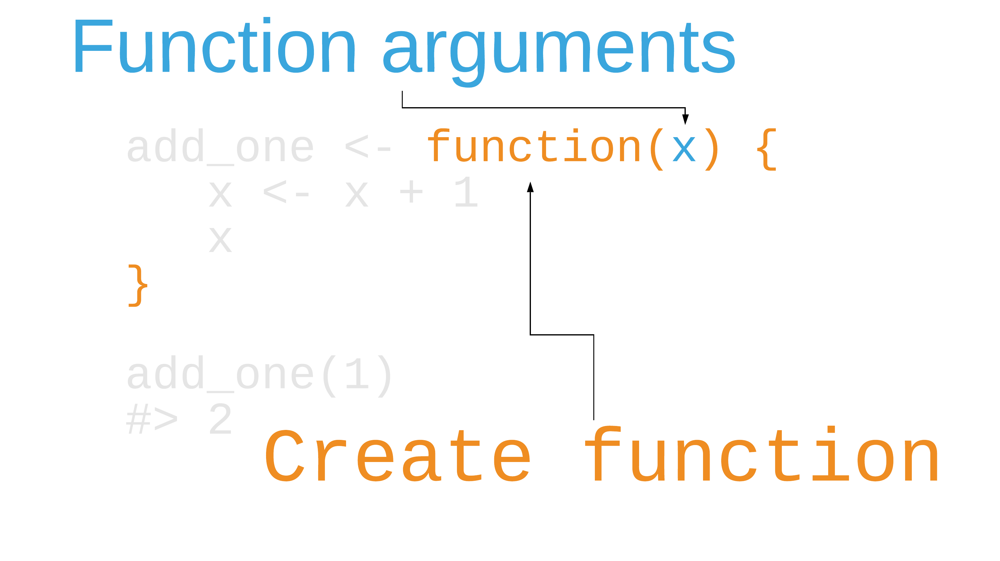
```


---

```{r, out.height="100%", out.width="100%", echo = FALSE}
knitr::include_graphics("img/writing_functions_body_name.png")
```

---

```{r, out.height="100%", out.width="100%", echo = FALSE}
knitr::include_graphics("img/writing_functions_inputs_output.png")
```

---

## Your Turn 1

#### Re-write this ggplot2 theme as a function. Call it `theme_avalanche_h()`.

#### Run this code to test that your function works

---

## Your Turn 1

.small[
```{r yourturn1, eval = FALSE}
theme_avalanche_h <- function() { #<<
  theme_minimal(base_size = 14) +  #<<
    theme(panel.grid.minor = element_blank(), panel.grid.major.y = element_blank()) #<<
} #<<

residents_per_sector <- 
  data.frame(
    sector = as.factor(1:8),
    residents = c(1000, 2034, 4594, 2304, 8093, 1200, 300, 2398)
  )

ggplot(residents_per_sector, aes(forcats::fct_reorder(sector, residents), residents)) +
  geom_col() + 
  coord_flip() + 
  xlab("sector") + 
  theme_avalanche_h()
```
]
---

```{r yourturn1_sol, eval=TRUE, echo=FALSE, ref.label="yourturn1"}
```

---

class: center, middle, inverse

# **We're going to start writing functions to our package, not the global environment. This will require a change in workflow!**

---

# `use_r("file_name")`

--

## Write a new file to `R/`

---

```{r, out.height="100%", out.width="100%", echo = FALSE}
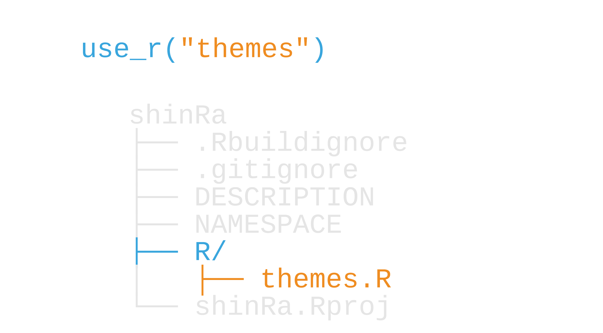
```

---

class: center, middle

```{r, out.height="100%", out.width="100%", echo = FALSE}
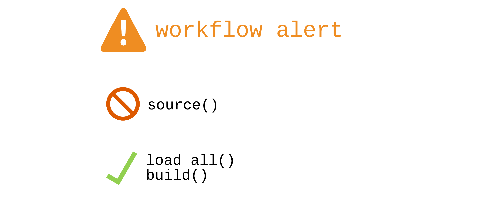
```

---

# devtools: loading vs. building

## **`load_all()`**: fast, all functions available
## **`build()`**: builds and installs the package

---

# ~~devtools: loading vs. building~~

## ~~`load_all()`: fast, all functions available~~
## ~~`build()`: builds and installs the package~~

<br>

# *Keyboard shortcuts*
## `load_all()`: **`CMD/CTRL + Shift + L`**
## `build()`: **`CMD/CTRL + Shift + B`**

---

class: center, middle

```{r, out.height="60%", out.width="60%", echo = FALSE}
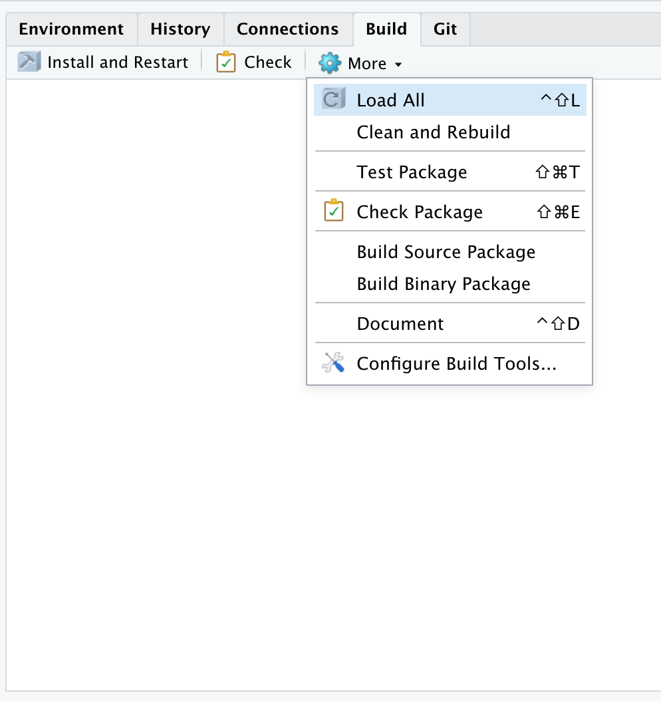
```

---

class: center, middle

## Our new workflow

```{r, out.height="60%", out.width="60%", echo = FALSE}

```

---

## Your Turn 2

#### Create a new file with `use_r()` called "db_con"
#### Put this function in the file and save it
#### Use `load_all()` to load the package function.
#### Run this code to make sure it works:

---

## Your Turn 2

```{r, eval=FALSE}
use_r("db_con")
```

--

### in `R/db_con.R`:

```{r, eval=FALSE}
db_con <- function(dbname = "residents_per_sector") {
  dbname <- match.arg(dbname)
  # We will set up real database connections later. For now, 
  # we'll just return some hard-coded data instead.
  data.frame(
    sector = as.factor(1:8),
    residents = c(1000, 2034, 4594, 2304, 8093, 1200, 300, 2398)
  )
}
```

---

## Your Turn 2

```{r, echo = FALSE}
db_con <- function(dbname = "residents_per_sector") {
  dbname <- match.arg(dbname)
  # We will set up real database connections later. For now, 
  # we'll just return some hard-coded data instead.
  data.frame(
    sector = as.factor(1:8),
    residents = c(1000, 2034, 4594, 2304, 8093, 1200, 300, 2398)
  )
}

ggplot(
  db_con(), 
  aes(forcats::fct_reorder(sector, residents), residents)
) +
  geom_col() + 
  coord_flip() + 
  xlab("sector") 
```

---

class: inverse

# Using other packages

1. Import a package with `use_package()`
2. Use the package with `pkg::fun()`
3. **DO NOT** use `library()`. Avoid it completely while developing.

---

class: center

```{r, out.height="100%", out.width="100%", echo = FALSE}
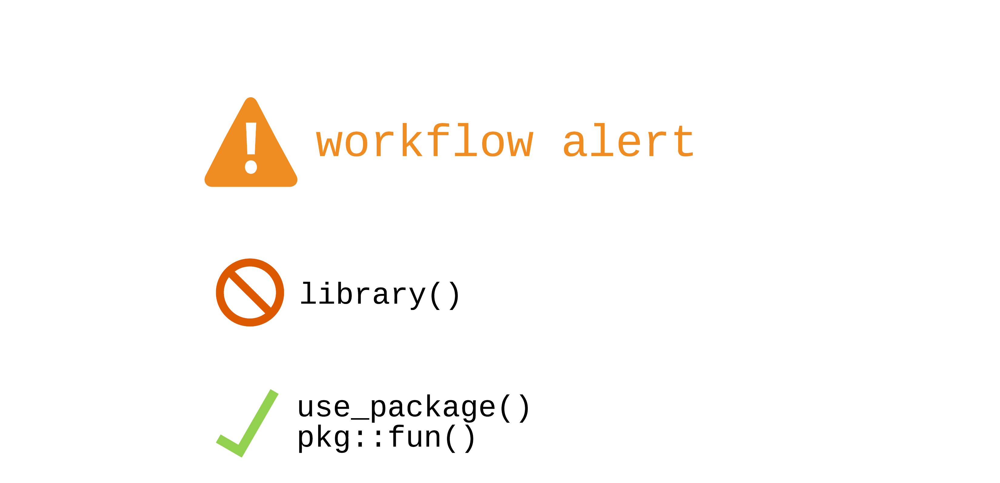
```

---

```{r, out.height="100%", out.width="100%", echo = FALSE}
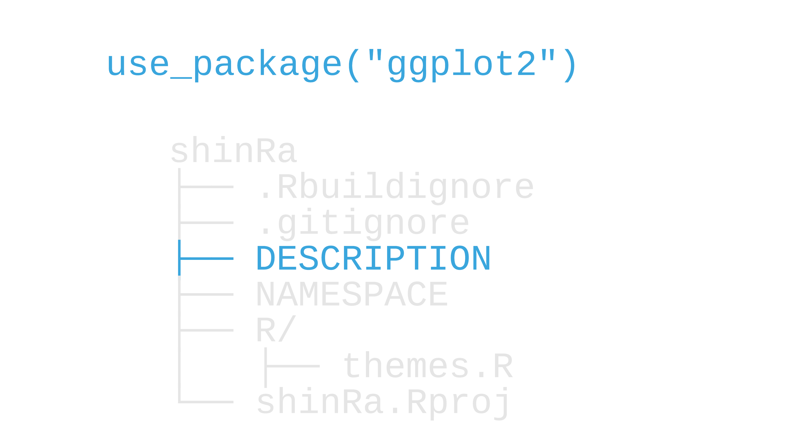
```

---

```{r, out.height="100%", out.width="100%", echo = FALSE}
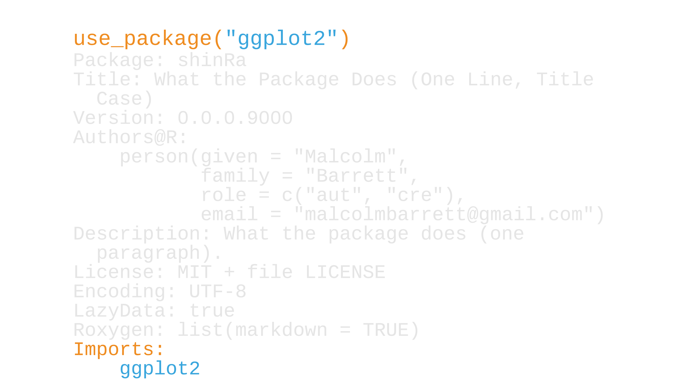
```

---

```{r, out.height="100%", out.width="100%", echo = FALSE}
knitr::include_graphics("img/description_minversion.png")
```

---

```{r, out.height="100%", out.width="100%", echo = FALSE}
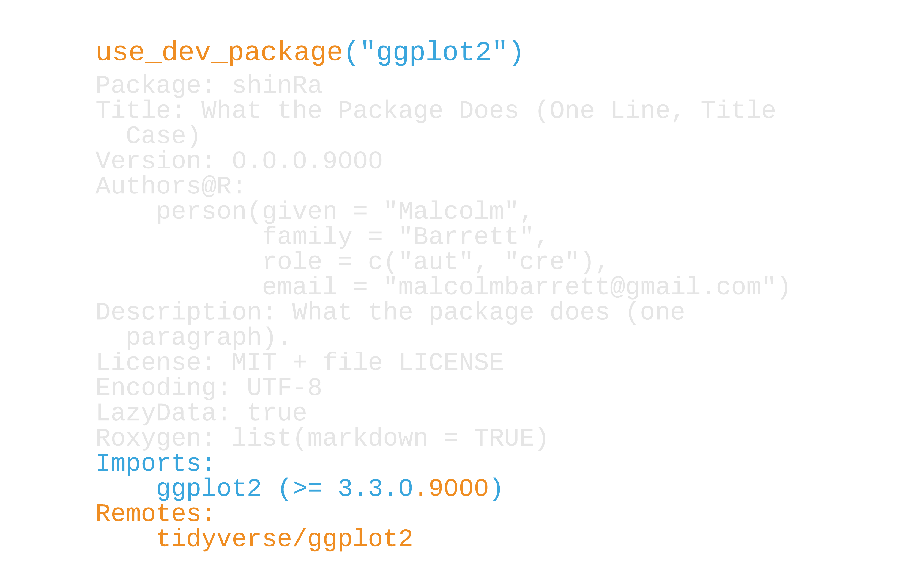
```

---

```{r, out.height="100%", out.width="100%", echo = FALSE}
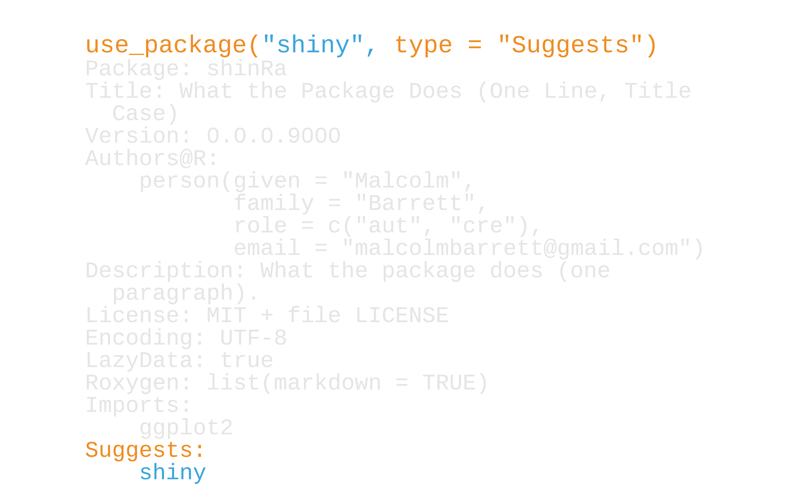
```

---

# Testing for suggested packages

```{r, eval=FALSE}
if (requireNamespace("shiny", quietly = TRUE)) {
  # ... shiny code
}
```

---

```{r, out.height="100%", out.width="100%", echo = FALSE}
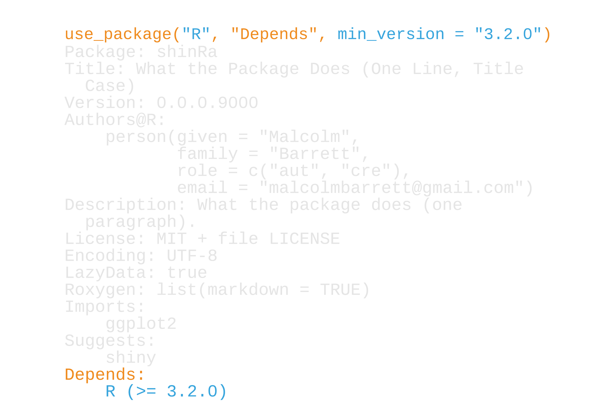
```

---

```{r, out.height="100%", out.width="100%", echo = FALSE}
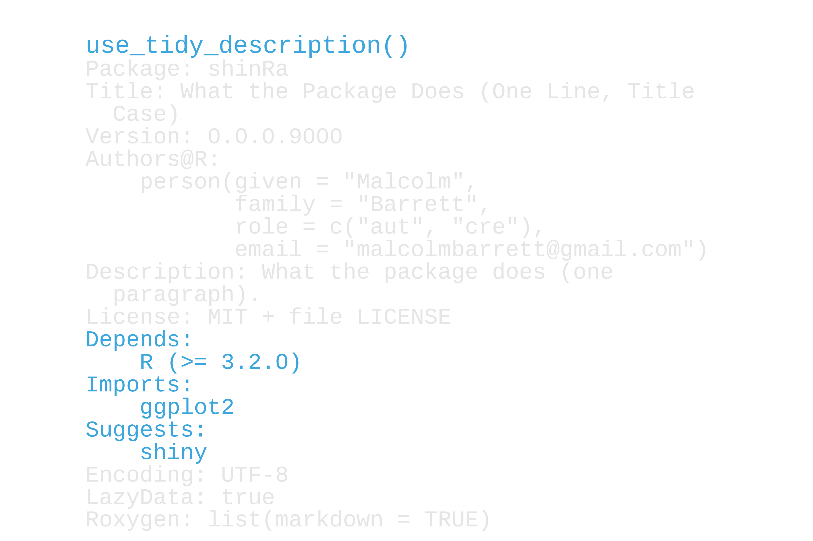
```

---

## Your Turn 3

#### Fix the code in `R/themes.R` to use `ggplot2::` instead of `library(ggplot2)`
#### Run `use_package("ggplot")` to add ggplot2 to `Imports`
#### Re-load the package (`Cmd/Ctrl+Shift+L`) and run this code to make sure it works

---

## Your Turn 3

```{r, eval = FALSE}
use_package("ggplot2")
```

--

### in `R/themes.R`:

```{r}
theme_avalanche <- function() {
  ggplot2::theme_minimal(base_size = 14) + #<<
    ggplot2::theme(panel.grid.minor = ggplot2::element_blank()) #<<
}
```

---

## Your Turn 3

```{r, echo = FALSE}
ggplot(
  db_con(), 
  aes(forcats::fct_reorder(sector, residents), residents)
) +
  geom_col() + 
  coord_flip() + 
  xlab("sector") +
  theme_avalanche()
```

---

# Packages so good they get their own functions 

---

# Packages so good they get their own functions 

## `use_tibble()`
## `use_data_table()`
## `use_pipe()`
## `use_rcpp*()`

---

## Your Turn 4

#### We need roxygen2 for this exercise. We'll learn more about it in the next module. For now, just run `use_roxygen_md()`
#### Run `use_tibble()` and `use_data_table()`
#### In `R/get_data.R`, edit the function to be able to return a data table: Add the argument `data_table = FALSE`. If `data_table` is `TRUE`, convert the data frame with `data.table::as.data.table()`
#### Run this code to make sure it works

---

## Your Turn 4

```{r, eval=FALSE}
use_roxygen_md()
use_tibble() 
use_data_table()
```

```{r}
get_resident_data <- function(data_table = FALSE) { #<<
  residents_per_sector <- db_con("residents_per_sector")

  if (data_table)  #<<
    return(data.table::as.data.table(residents_per_sector)) #<<

  tibble::as_tibble(residents_per_sector)
}
```

---

## Your Turn 4

```{r, echo=FALSE}
res_data <- get_resident_data(data_table = TRUE)

stopifnot(data.table::is.data.table(res_data))

res_data
```

```{r}
data.table::is.data.table(res_data)
```


---

## Your Turn 4: Stretch goal

#### Run `use_pipe()` to add the magrittr pipe to your package. What changed?

---

## Organizing `.R` files

---

## Organizing `.R` files

## *Less than 1:1, more than all:1*

---

## Organizing `.R` files

## ~~Less than 1:1, more than all:1~~
## *`utils.R`*

---

## Organizing `.R` files

## ~~Less than 1:1, more than all:1~~
## ~~`utils.R`~~
## *`zzz.R`*, *`.onLoad`*

See [R Packages, ed. 2](https://r-pkgs.org/r.html#when-you-do-need-side-effects) for more.

