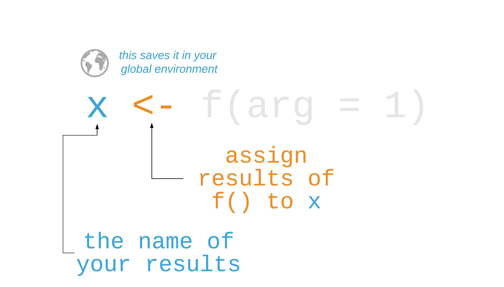
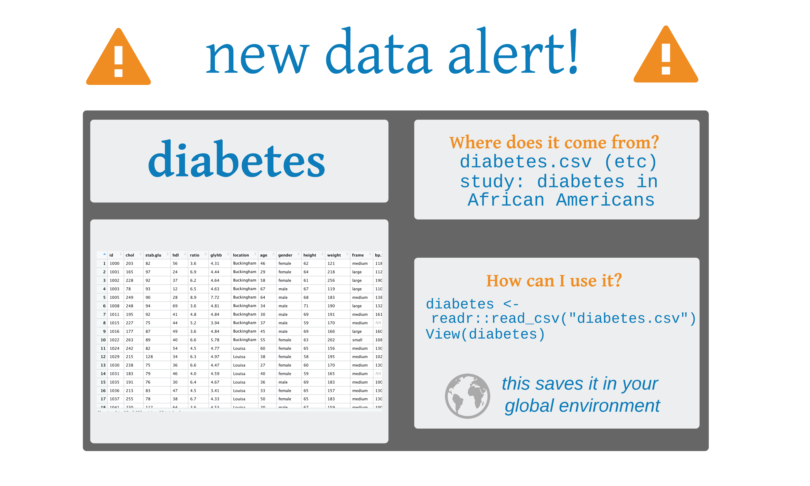

```{r setup, include=FALSE}
options(htmltools.dir.version = FALSE, tibble.max_extra_cols = 6, tibble.width = 60)
knitr::opts_chunk$set(warning = FALSE, message = FALSE, fig.align = "center", dpi = 320)
library(tidyverse)
```

background-image: url(http://hexb.in/hexagons/readr.png)
background-position: 93% 10%

## **readr**

Function       | Reads
-------------- | --------------------------
`read_csv()`   | Comma separated values
`read_csv2()`  | Semi-colon separate values
`read_delim()` | General delimited files
`read_fwf()`   | Fixed width files
`read_log()`   | Apache log files
`read_table()` | Space separated files
`read_tsv()`   | Tab delimited values

---
## Importing Data

```{r eval = FALSE}
dataset <- read_csv("file_name.csv")
dataset
```

---

## R functions

```{r, out.height="100%", out.width="100%", echo = FALSE}
knitr::include_graphics("img/function_call.png")
```

---

## R functions

```{r, out.height="100%", out.width="100%", echo = FALSE}
knitr::include_graphics("img/function_call_fname.png")
```

---

## R functions

```{r, out.height="100%", out.width="100%", echo = FALSE}

```

---

## Your Turn 1

### Find diabetes.csv on your computer. Then read it into an object. Then view the results.

---

## Your Turn 1

### Find diabetes.csv on your computer. Then read it into an object. Then view the results.

```{r}
diabetes <- read_csv("diabetes.csv")
```

---
class: middle

```{r, out.height="100%", out.width="100%", echo = FALSE}

```

---

```{r}
diabetes
```

---

## Tibbles

## **`data.frames`** are the basic form of rectangular data in R (columns of variables, rows of observations)

---

## Tibbles

## ~~`data.frames` are the basic form of rectangular data in R (columns of variables, rows of observations"~~

## `read_csv()` reads the data into a **`tibble`**, a modern version of the data frame. 

---

## Tibbles

## ~~`data.frames` are the basic form of rectangular data in R (columns of variables, rows of observations"~~

## ~~`read_csv()` reads the data into a `tibble`, a modern version of the data frame.~~

## a tibble **is** a data frame
---

## Missing values

## It's common to use codes for **missing values** (-99, 8888)

---

## Missing values

## ~~It's common to use codes for missing values (-99, 8888)~~

## The **`na`** option can change these values to `NA` 

---

```{r, highlight.output = 4:5}
read_csv(
  "a,b,c,d
  1,-99,3,4
  5,6,-99,8", 
  na = "-99" #<<
)
```

---

## Parsing data types

## The read functions in readr try to *guess* each data type, but sometimes it's *wrong* 

---

## Parsing data types

## ~~The read functions in readr try to guess each data type, but sometimes it's wrong~~

## To tell readr how to parse the columns, add the argument **`col_types`** to `read_csv()`

---

## Parsing data types

## ~~The read functions in readr try to guess each data type, but sometimes it's wrong~~

## To tell readr how to parse the columns, add the argument **`col_types`** to `read_csv()`

```{r eval = FALSE}
diabetes <- read_csv(
  "diabetes.csv",
  col_types = list(id = col_character()) #<<
)
```

---

## Parsing data types
.pull-left[
## Or use a string for each variable type: **`col_type = "cci"`**
]

---

## Parsing data types
.pull-left[
## ~~Or use a string for each variable type: `col_type = "cci"`~~
]

.pull-right[
 letter |  type
:--|:--
`c` | character 
`i` | integer
`n` | number
`d` | double
`l` | logical
`D` | date
`T` | date time
`t` | time
`?` | guess the type
`_` or `-` | skip the column
]
---

# Your Turn 2

## Set the 4 column types to be: integer, double, character, and unknown (guess)

```{r, eval = FALSE}
read_csv(
  "a,b,c,d
  1,2,3,4
  5,6,7,8", 
  col_types = ""
)
```

---

# Your Turn 2

## Set the 4 column types to be: integer, double, character, and unknown (guess)

```{r}
read_csv(
  "a,b,c,d
  1,2,3,4
  5,6,7,8", 
  col_types = "idc?"
)
```

---
background-image: url(http://hexb.in/hexagons/haven.png)
background-position: 90% 10%

## **haven**

Function       | Software
-------------- | --------------------------
`read_sas()`   | SAS
`read_xpt()`   | SAS
`read_spss()`  | SPSS
`read_sav()`   | SPSS
`read_por()`   | SPSS
`read_stata()` | Stata
`read_dta()`   | Stata

---
background-image: url(http://hexb.in/hexagons/haven.png)
background-position: 90% 10%

## ~~haven~~

~~Function~~       | ~~Software~~
-------------- | --------------------------
~~`read_sas()`~~ | ~~SAS~~
~~`read_xpt()`~~ | ~~SAS~~
~~`read_spss()`~~ | ~~SPSS~~
~~`read_sav()`~~ | ~~SPSS~~
~~`read_por()`~~ | ~~SPSS~~
~~`read_stata()`~~ | ~~Stata~~
~~`read_dta()`~~ | ~~Stata~~

## **haven is *not* a core member of the tidyverse. That means you need to load it with `library(haven)`**.

---

## Your Turn 3

### There are several versions of the diabetes file besides CSV. Pick a file format you or your colleagues use and import them using the corresponding function from haven.

---

## Your Turn 3

```{r}
library(haven)
diabetes <- read_sas("diabetes.sas7bdat")
```

---

## Your Turn 3

```{r}
diabetes
```

---

## Writing data

Function            | Writes
------------------- | ----------------------------------------
`write_csv()`       | Comma separated values
`write_excel_csv()` | CSV that you plan to open in Excel
`write_delim()`     | General delimited files
`write_file()`      | A single string, written as is
`write_lines()`     | A vector of strings, one string per line
`write_tsv()`       | Tab delimited values
`write_rds()`       | A data type used by R to save objects
`write_sas()`       | SAS .sas7bdat files
`write_xpt()`       | SAS transport format, .xpt
`write_sav()`       | SPSS .sav files
`write_stata()`     | Stata .dta files

---

## Writing data

Function            | Writes
------------------- | ----------------------------------------
`write_csv()`       | Comma separated values
`write_excel_csv()` | CSV that you plan to open in Excel
`write_delim()`     | General delimited files
`write_file()`      | A single string, written as is
`write_lines()`     | A vector of strings, one string per line
`write_tsv()`       | Tab delimited values
`write_rds()`       | A data type used by R to save objects
`write_sas()`       | SAS .sas7bdat files
`write_xpt()`       | SAS transport format, .xpt
`write_sav()`       | SPSS .sav files
`write_stata()`     | Stata .dta files

```{r eval = FALSE}
write_csv(diabetes, path = "diabetes-clean.csv") #<<
```
---
# Your Turn 4

## R has a few data file types, such as RDS and .Rdata. Save `diabetes` as "diabetes.Rds".

---
# Your Turn 4

## R has a few data file types, such as RDS and .Rdata. Save `diabetes` as "diabetes.Rds".

```{r, eval=FALSE}
write_rds(diabetes, "diabetes.Rds")
```
