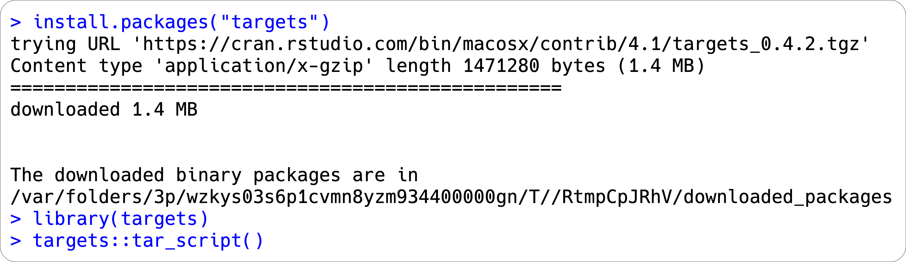
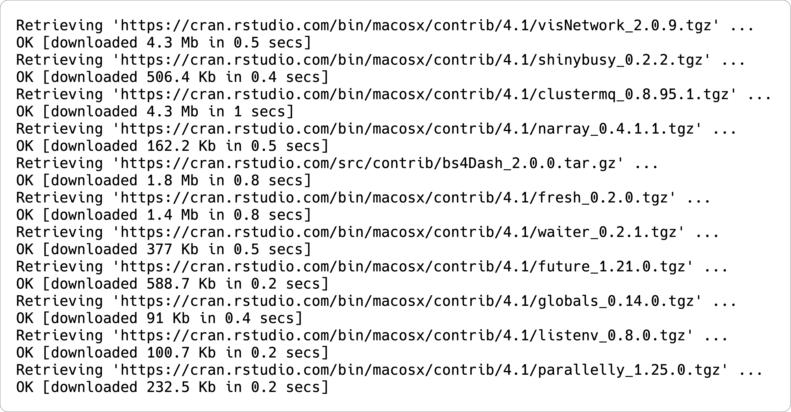
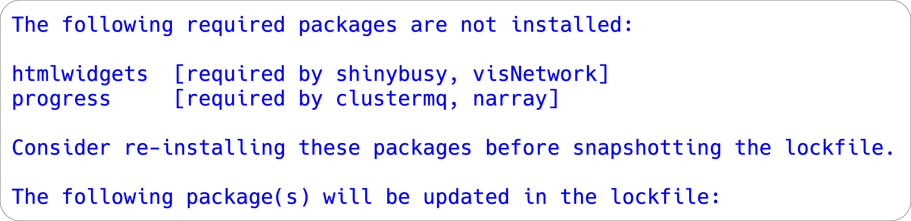
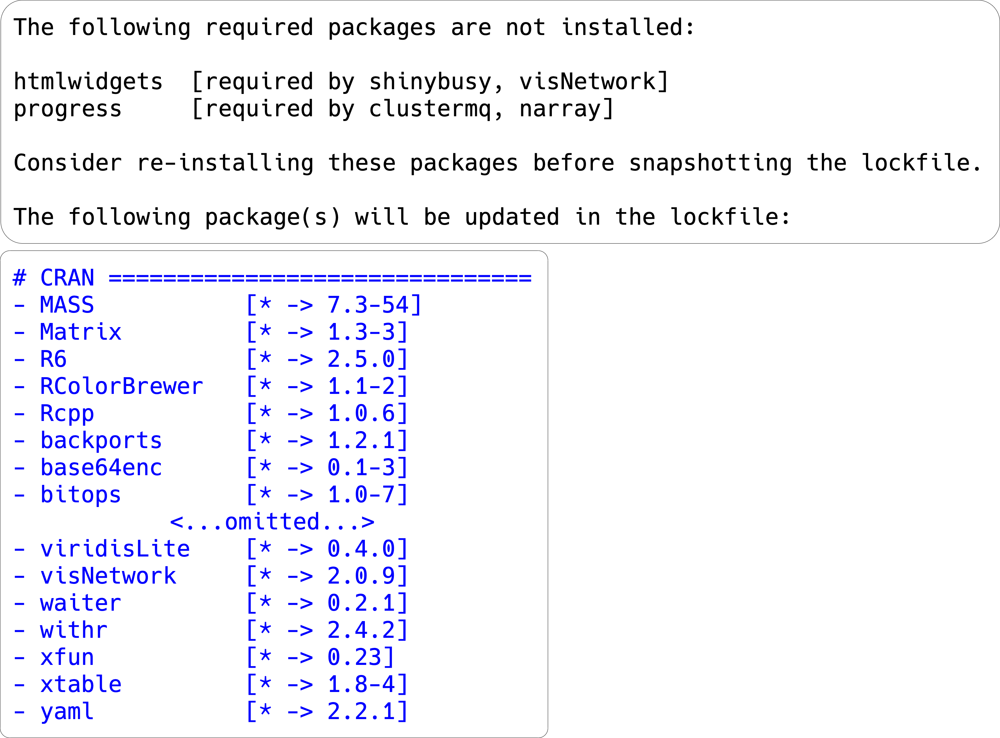

```{r setup, include=FALSE}
options(htmltools.dir.version = FALSE, tibble.max_extra_cols = 6, tibble.width = 60)
knitr::opts_chunk$set(warning = FALSE, message = FALSE, fig.align = "center", dpi = 320)
library(tidyverse)
library(gapminder)
library(here)
# xaringan::inf_mr() ----
```

---
background-image: url(img/renv.svg)
background-position: 93% 10%
background-size: 220px 220px

# *renv*

<br><br><br>

--

## `renv` is designed to improve project-level reproducibility 

--

## records the R version and the packages used in a project

--

## ensures your current code works in the future 


---
class: left, top

# *renv:* some background

### `renv` was developed to be an improvement to the [`Packrat` package](https://rstudio.github.io/packrat/)

### `packrat` stores project packages in a snapshot, which is portable to a different machine

### `renv` is a replacement with '<i>fewer surprises and better default behaviors</i>'

---
class: left, top

# What problem does `renv` solve?

## Example:

--

### You wrote some `dplyr` code

```{r , eval=FALSE}
add_rownames(data, var = "rowname")
```

--

### Updates were made to the [`dplyr` package:](https://dplyr.tidyverse.org/news/index.html#deprecated)

```
Warning message:
`add_rownames()` was deprecated in dplyr 1.0.0.
Please use `tibble::rownames_to_column()` instead.
```

--

### You don't want your code to break!!


---
class: left, top

# How `renv` solves this problem

### `renv` gives each project it's *<i>very own library of packages</i>*

### Upgrades/changes to packages only affect the packages in each `renv` project

### `renv` creates a `lockfile` that lists the packages and R version used in each project 

### The `lockfile` allows us to capture and restore packages per project


---
class: left, top

# Why use *renv*?

### 1. Each project gets it's own library (*isolated*)

### 2. The project library can be shipped with a self-contained lockfile, `renv.lock` (*portable*)

### 3. `renv.lock` can be captured with `renv::snapshot()` and used later with `renv::restore()` (*reproducible*)


---
class: left, top

## Your Turn 1

### 1. Create a new project 

##### - <i>In RStudio: File > New Project, or create one in the console with `usethis::create_project("path/to/name_of_project")`)</i>

### 2. Create a new file called `plot.R`

##### - <i>In that file, load `ggplot2` and create a plot with `quickplot(mpg$displ)`.</i>

### 3. What packages does your project depend on?

##### - <i>Make a prediction, then run `renv::dependencies()` in the console (*not* in `plot.R`!) to see if you were right.</i>

---
class: left, top

## Your Turn 1

### 4. In the console, initiate a `renv` environment with `renv::init()`

### 5. Open the file called `renv.lock`. 

--

## *<i>What is this information?</i>*

---
class: left, top

## Your Turn 1 (cont)

### <i>In RStudio: File > New Project > 'my-new-project'

```{r create-project.png, echo=FALSE, out.width='90%'}
knitr::include_graphics("img/create-project.png")
```

---
class: left, top

## Your Turn 1 (cont)

### <i>or create one in the console with:</i>
### `usethis::create_project("path/to/name_of_project")`

```{r , eval=FALSE}
usethis::create_project("~/Projects/my-new-project")
✓ Creating '~/Projects/my-new-project/'
✓ Setting active project to '~/Projects/my-new-project'
✓ Creating 'R/'
✓ Writing 'my-new-project.Rproj'
✓ Adding '.Rproj.user' to '.gitignore'
✓ Opening '~/Projects/my-new-project/' in new RStudio session
✓ Setting active project to '<no active project>'
```


---
class: left, top

## Your Turn 1 (cont)

```{r plot-dot-r-file, echo=FALSE, out.width='100%'}
knitr::include_graphics("img/plot-dot-r-file-01.png")
```

--

### *<i>What packages does your project depend on?</i>*


---
class: left, top

## Your Turn 1 (cont)

### <i>Make a prediction, then run `renv::dependencies()` in the console (*not* in `plot.R`!) to see if you were right.</i>

--


```{r renv-dependencies-01, echo=FALSE, out.width='100%'}
knitr::include_graphics("img/renv-dependencies-01.png")
```

#### - The output lists the *Source* (`plot.R`), the *Package* (`ggplot2`), if it's *Require*d and the *Version* 

#### - `Dev` by default only returns [runtime dependencies](https://rstudio.github.io/renv/reference/dependencies.html)

---
class: left, top

## Your Turn 1 (cont)

### *<i>Initiate `renv`</i>*

.pull-left[

### <i>- Find package dependencies</i>

### <i>- Create `renv` folder (`cache`)</i>

]

--

.pull-right[


```{r renv-init-01.png, echo=FALSE, out.width='100%', fig.align='center'}
knitr::include_graphics("img/renv-init-01.png")
```

]

---
class: left, top

## Your Turn 1 (cont)

### *<i>Initiate `renv`</i>*

--

.pull-left[

### <i>- List packages in project library</i>

]

--

.pull-right[

```{r renv-init-02.png, echo=FALSE, out.width='90%', fig.align='center'}
knitr::include_graphics("img/renv-init-02.png")
```

]


---
class: left, top

## Your Turn 1 (cont)

### *<i>Initiate `renv`</i>*

.pull-left[

### <i>- Write `renv.lock` file</i>

### <i>- Restart R</i>

]

--

.pull-left[

```{r renv-init-03.png, echo=FALSE, out.height='100%', out.width='100%', fig.align='center'}
knitr::include_graphics("img/renv-init-03.png")
```

]


---
class: left, top

## Your Turn 1 (cont)

### <i>what does `renv.lock` contain?

```{r renv-lock.png, echo=FALSE, out.width='100%', fig.align='center'}
knitr::include_graphics("img/renv-lock.png")
```

---
class: left, top

## Your Turn 1 (cont)

### <i>what does `renv.lock` contain?

```{r renv-lock-expl.png, echo=FALSE, out.width='100%', fig.align='center'}
knitr::include_graphics("img/renv-lock-expl.png")
```

---
class: left, top

# How `renv` works

### Global package cache shared across `renv` projects 

```{r renv-init-pkgs-01.png, echo=FALSE, out.width='50%', fig.align='center'}
knitr::include_graphics("img/renv-init-pkgs-01.png")
```

---
class: left, top

## *`renv::init()`*

### Creates local `renv` cache 

### Documents packages in `renv.lock`

```{r renv-init-pkgs-02.png, echo=FALSE, out.width='53%', fig.align='center'}
knitr::include_graphics("img/renv-init-pkgs-02.png")
```


---
class: left, top

# *`renv::dependencies()`*

--

## `library(ggplot2)`
## `targets::tar_target()`
## `require(dplyr)`
## `requireNamespace("devtools")`

---
class: left, top

# *`renv::dependencies()`*

## ~~`library(`~~**`ggplot2`**~~`)`~~
## **`targets`**~~`::tar_target()`~~
## ~~`require(`~~**`dplyr`**~~`)`~~
## ~~`requireNamespace("`~~**`devtools`**~~`")`~~

---
class: left, top

# *`renv::status()`*

### `renv::status()` checks for differences between the `renv.lock` and the current project's package library

```{r renv-status-01.png, echo=FALSE, out.width='90%', fig.align='center'}
knitr::include_graphics("img/renv-status-01.png")
```

---
class: left, top

# *`renv::snapshot()`*

### Synchronizes a project's R package dependencies in a lockfile (`renv.lock`) 


```{r renv-snapshot-01.png, echo=FALSE, out.width='60%', fig.align='center'}
knitr::include_graphics("img/renv-snapshot-01.png")
```


---
class: left, top

# Your Turn 2

### 1. Modify `plot.R`

#### - <i>In `plot.R`, modify your code to load the `patchwork` library, then replace your previous plot with `quickplot(mpg$displ) + quickplot(as.factor(mpg$cyl))`</i>

### 2. Run `renv::status()` in the console

### 3. Run `renv::snapshot()`. What's changed?

---
class: left, top

# Your Turn 2 (cont)

--

### <i>In `plot.R`, modify your code to load the `patchwork` library, then replace your previous plot with,

#### `quickplot(mpg$displ) + quickplot(as.factor(mpg$cyl))`</i>

.pull-left[

```{r plot-dot-r-03.png, echo=FALSE, out.width='100%', fig.align='center'}
knitr::include_graphics("img/plot-dot-r-file-03.png")
```

]

--

.pull-right[

```{r plot-dot-r-04.png, echo=FALSE, fig.align='center'}
knitr::include_graphics("img/plot-dot-r-file-04.png")
```


]

---
class: left, top

# Your Turn 2 (cont)

--

### <i>Check dependencies with `renv::status()`</i>

--

```{r renv-status-02.png, echo=FALSE, fig.align='center'}
knitr::include_graphics("img/renv-status-02.png")
```

---
class: left, top

# Your Turn 2 (cont)

--

### <i>Use `renv::snapshot()` to add current packages to `renv.lock`</i>

--

```{r renv-snapshot-02.png, echo=FALSE, out.width='85%', fig.align='center'}
knitr::include_graphics("img/renv-snapshot-02.png")
```

--

```{r renv-snapshot-03.png, echo=FALSE, out.width='85%', fig.align='center'}
knitr::include_graphics("img/renv-snapshot-03.png")
```

---
class: left, top

# `targets` package


--

### The [targets package](https://docs.ropensci.org/targets/) provides <i>"tangible evidence that the output aligns with the code and data"</i>

--

### <i>"implicitly nudges users toward a clean, function-oriented programming style"</i>

--

### <i>"skips costly runtime for tasks that are already up to date"</i>


---
class: left, top

## Your Turn 3

### 1. Create a new project

### 2. Load [`targets`]() and run `tar_script()` in the console

#### <i>Read `_targets.R` and predict what your dependencies are.</i>

### 3. Run `renv::dependencies()`

### 4. Run `tar_renv()` and look at `_targets_packages.R`

#### <i>What did targets do here? Why is that important? Run `renv::dependencies()` again and confirm that we can detect all of our dependencies.</i>

### 5. Run `renv::init()`

---
class: left, top

## Your Turn 3 (cont)

### `my-newest-project`

```{r my-newest-project, echo=FALSE}
knitr::include_graphics("img/my-newest-project.png")
```


---
class: left, top

## Your Turn 3 (cont)

### <i>`targets::tar_script()`

```{r install-targets.png, echo=FALSE}

```

---
class: left, top

### Your Turn 3 (cont)

```{r , eval=FALSE}
library(targets)
# This is an example _targets.R file. Every {targets} pipeline
# needs one. Use tar_script() to create _targets.R and
# tar_edit() to open it again for editing. Then, run tar_make()
# to run the pipeline and tar_read(summary) to view the results.
# Define custom functions and other global objects. This is where
# you write source(\"R/functions.R\") if you keep your functions
# in external scripts.
summ <- function(dataset) {
  summarize(dataset, mean_x = mean(x))
}
# Set target-specific options such as packages.
tar_option_set(packages = "dplyr")
# End this file with a list of target objects.
list(
  tar_target(data, data.frame(
    x = sample.int(100),
    y = sample.int(100))),
  # Call your custom functions as needed.
  tar_target(summary, summ(data)))
```


---
class: left, top

## Your Turn 3 (cont)

#### <i>Check package dependencies</i>

--

```{r renv-dependencies-02.png, echo=FALSE}
knitr::include_graphics("img/renv-dependencies-02.png")
```

---
class: left, top

## Your Turn 3 (cont)

.pull-left[

#### <i>Run `tar_renv()`</i>


```{r tar-renv.png, echo=FALSE}
knitr::include_graphics("img/tar-renv.png")
```

]

--

.pull-right[

#### <i>look at `_targets_packages.R`</i>

```{r targets-packages.png, echo=FALSE}
knitr::include_graphics("img/targets-packages.png")
```

]

---
class: left, top

# Your Turn 3 (cont)

#### <i>Run `renv::dependencies()` again and confirm that we can detect all of our dependencies.</i>

```{r renv-dependencies-03.png, echo=FALSE}
knitr::include_graphics("img/renv-dependencies-03.png")
```

---
class: left, top

# Your Turn 3 (cont)

###<i>Re-run `renv::init()`</i>

--

#### <i>1) discover package files</i>

```{r renv-init-04.png, echo=FALSE}
knitr::include_graphics("img/renv-init-04.png")
```

---
class: left, top

# Your Turn 3 (cont)

--

#### <i>2) download packages</i>

--

```{r renv-init-05.png, echo=FALSE, out.width='80%'}

```


---
class: left, top

# Your Turn 3 (cont)


.pull-left[

#### <i>3) install packages</i>

]

--

.pull-right[

```{r renv-init-06.png, echo=FALSE, out.width='85%', fig.align='center'}

```

]

---
class: left, top

# Your Turn 3 (cont)

.pull-left[

#### <i>4) identify uninstalled packages</i>

]

--

.pull-right[

```{r renv-init-07.png, echo=FALSE, out.width='100%', fig.align='center'}

```

]

---
class: left, top

# Your Turn 3 (cont)

.pull-left[

#### <i>5) list packages document in `renv.lock`</i>

]

--

.pull-right[

```{r renv-init-08.png, echo=FALSE, out.width='100%', fig.align='center'}

```

]

---
class: left, top

# Your Turn 3 (cont)

.pull-left[

#### <i>6) write `renv.lock` file and restart R</i>

]

--

.pull-right[

```{r renv-init-09.png, echo=FALSE, out.width='100%', fig.align='center'}
knitr::include_graphics("img/renv-init-09.png")
```

]

---
class: inverse, left

# Resources
### [renv: Getting started](https://rstudio.github.io/renv/articles/renv.html): A brief introduction to renv and its workflows
### [renv: Project Environments for R (blog)](https://blog.rstudio.com/2019/11/06/renv-project-environments-for-r/): An RStudio blog post introducing renv
### [renv: Project Environments for R (talk)](https://www.rstudio.com/resources/rstudioconf-2020/renv-project-environments-for-r/): A talk on renv from rstudio::conf() 2020 
