```{r setup, include=FALSE}
options(htmltools.dir.version = FALSE, tibble.max_extra_cols = 6, tibble.width = 60)
knitr::opts_chunk$set(warning = FALSE, message = FALSE, fig.align = "center", dpi = 320)
library(tidyverse)
library(gapminder)
library(here)
```

## Once upon a time (*6 months ago*), a hero (*you*) wrote some code

--

```{r , eval=FALSE}
add_rownames(data, var = "rowname")
```

--

### **But then!**

--

### Updates were made to the [`dplyr` package:](https://dplyr.tidyverse.org/news/index.html#deprecated)

```
Warning message:
`add_rownames()` was deprecated in dplyr 1.0.0.
Please use `tibble::rownames_to_column()` instead.
```

---
background-image: url(img/renv.svg)
background-position: 93% 10%
background-size: 220px 220px

# *renv*

<br><br><br>

--

## `renv` is designed to improve *project-level reproducibility *

--

## *records* and *restores* the packages used in a project

--

## Successor to [packrat](https://rstudio.github.io/packrat/)

---
class: inverse

# How does renv help?

1. Each project gets it's own library (*isolated*)

2. The project library can be shipped with a self-contained lockfile, `renv.lock` (*portable*)

3. `renv.lock` can be restored with `renv::restore()` (*reproducible*)

---

## `renv::init()`

### Creates local renv environment; *caches* packages.

---

## `renv::init()`

### ~~Creates local renv environment; caches packages.~~

### Documents packages in *`renv.lock`* 

```{r renv-init-pkgs-02.png, echo=FALSE, out.width='53%', fig.align='center'}
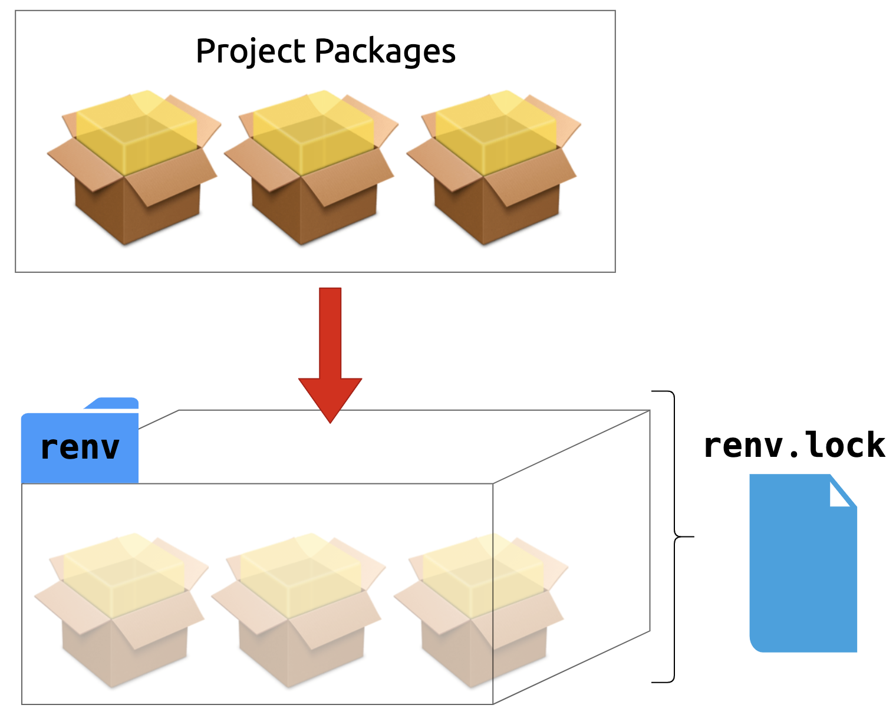
```

---

# `renv::dependencies()`

--

## `library(ggplot2)`
## `targets::tar_target()`
## `require(dplyr)`
## `requireNamespace("devtools")`

---

# `renv::dependencies()`

## ~~`library(`~~**`ggplot2`**~~`)`~~
## **`targets`**~~`::tar_target()`~~
## ~~`require(`~~**`dplyr`**~~`)`~~
## ~~`requireNamespace("`~~**`devtools`**~~`")`~~

---

## Your Turn 1

.large[
#### Create a new project 
#### Create a new file called `plot.R` In that file, load `ggplot2` and create a plot with `quickplot(mpg$displ)`.
#### What packages does your project depend on? Make a prediction, then run `renv::dependencies()` in the console (not in `plot.R`!) to see if you were right.
#### In the console, initiate a `renv` environment with `renv::init()`
#### Open the file called `renv.lock`. What is this information?
]

---

## Your Turn 1

### In RStudio: File > New Project > 'my-new-project'

```{r create-project.png, echo=FALSE, out.width='90%'}
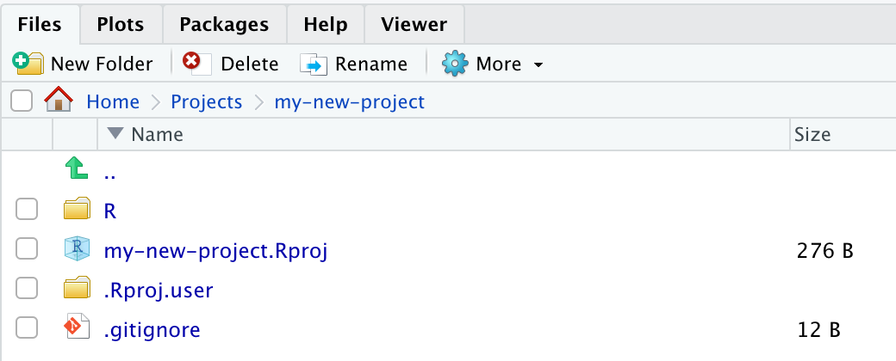
```

---

## Your Turn 1

### Or with usethis

```{r, eval=FALSE}
usethis::create_project("~/Projects/my-new-project") #<<

✓ Creating '~/Projects/my-new-project/'
✓ Setting active project to '~/Projects/my-new-project'
✓ Creating 'R/'
✓ Writing 'my-new-project.Rproj'
✓ Adding '.Rproj.user' to '.gitignore'
✓ Opening '~/Projects/my-new-project/' in new RStudio session
✓ Setting active project to 'my-last-project'
```

---

## Your Turn 1

```{r plot-dot-r-file, echo=FALSE, out.width='100%'}
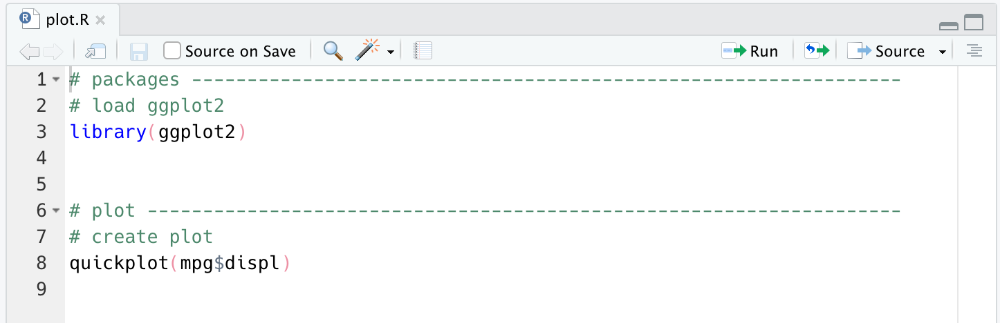
```

---

## Your Turn 1

```{r renv-dependencies-01, echo=FALSE, out.width='100%'}
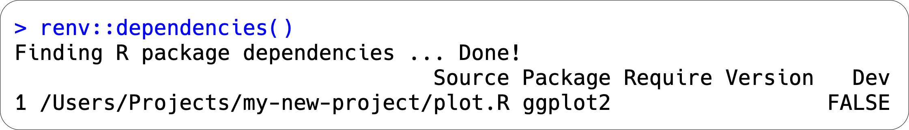
```

---

## Your Turn 1


```{r renv-init-01.png, echo=FALSE, out.width='100%', fig.align='center'}
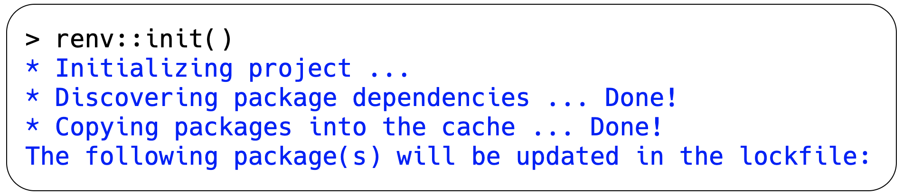
```

---


## Your Turn 1

.pull-left[

### Packages in project library

]

--

.pull-right[

```{r renv-init-02.png, echo=FALSE, out.width='90%', fig.align='center'}
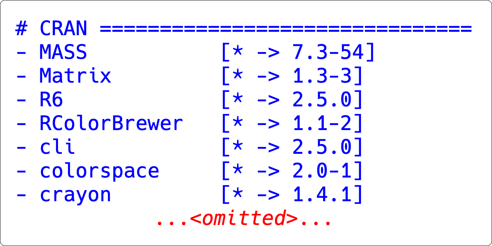
```

]

---

## Your Turn 1

```{r renv-init-03.png, echo=FALSE, out.height='100%', out.width='100%', fig.align='center'}
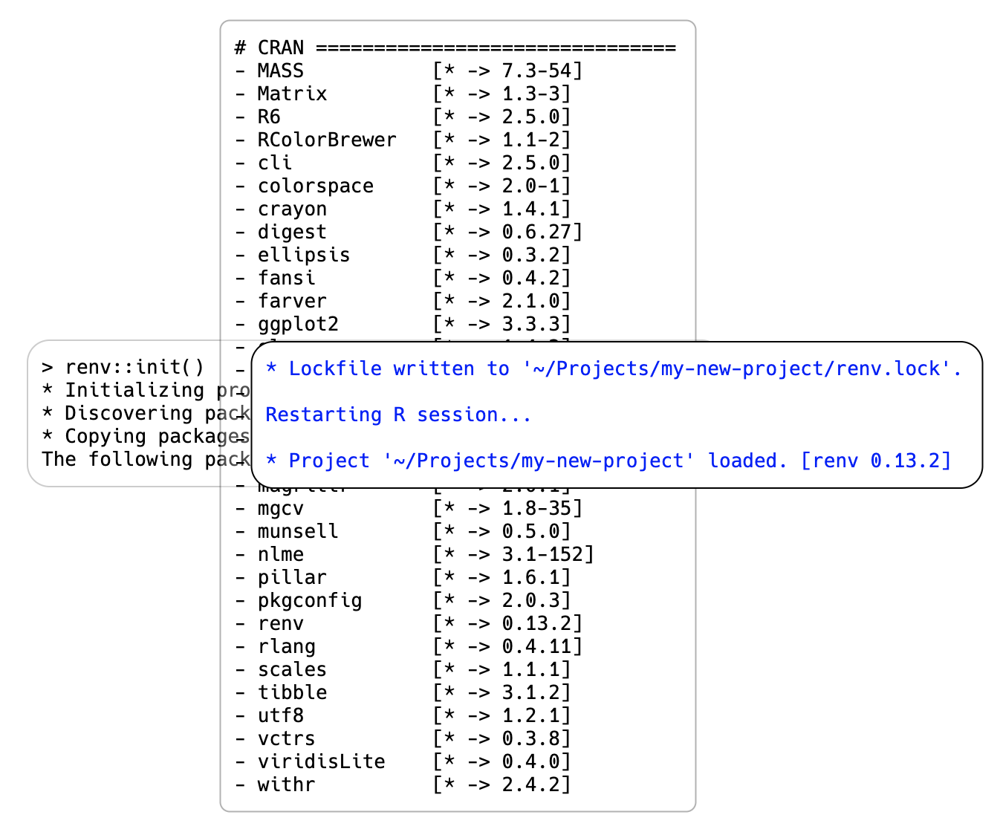
```

---

## Your Turn 1

```{r renv-lock.png, echo=FALSE, out.width='100%', fig.align='center'}
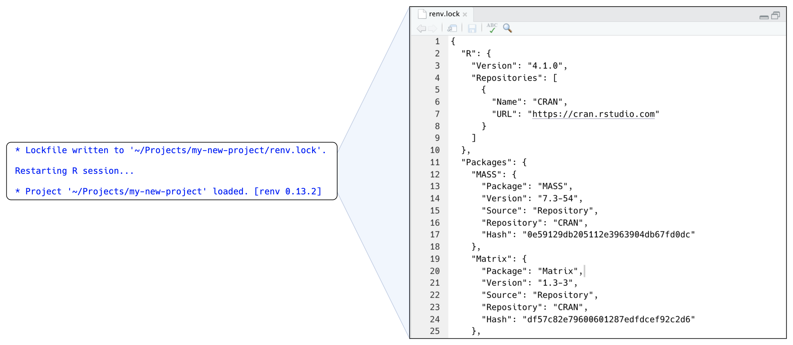
```

---

## Your Turn 1

```{r renv-lock-expl.png, echo=FALSE, out.width='100%', fig.align='center'}
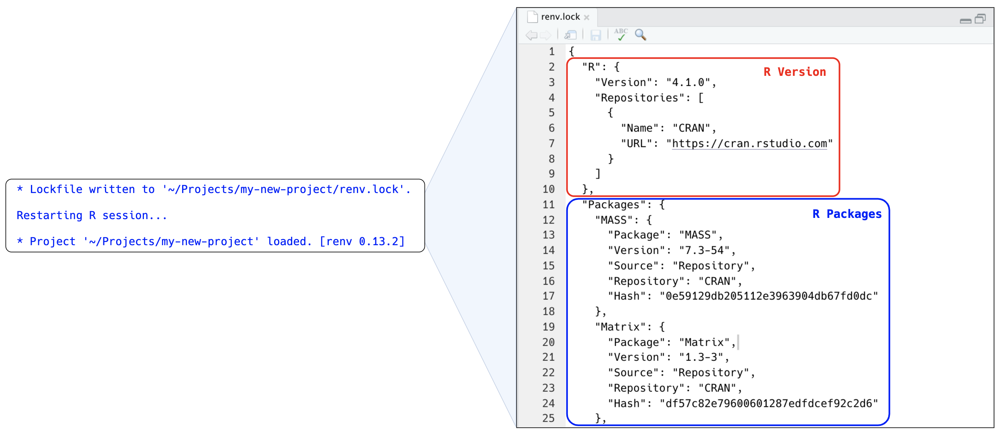
```

---

# How `renv` stores packages

--

<br/>

```{r renv-init-pkgs-01.png, echo=FALSE, out.width='50%', fig.align='center'}
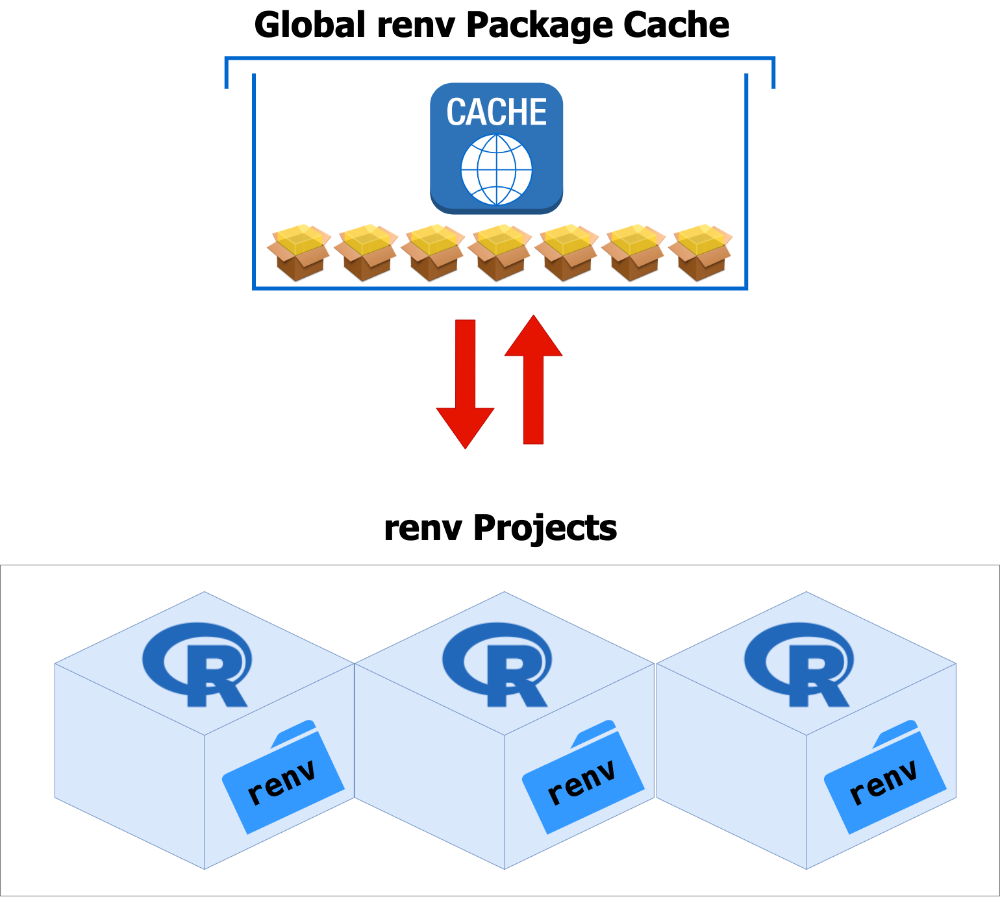
```

---

# `renv::status()`
<br/>

```{r renv-status-01.png, echo=FALSE, out.width='90%', fig.align='center'}
knitr::include_graphics("img/renv-status-01.png")
```

<br/>
--

### Checks for differences between the *`renv.lock`* and the *current project's packages*

---

# *`renv::snapshot()`*

<br/>

```{r renv-snapshot-01.png, echo=FALSE, out.width='60%', fig.align='center'}
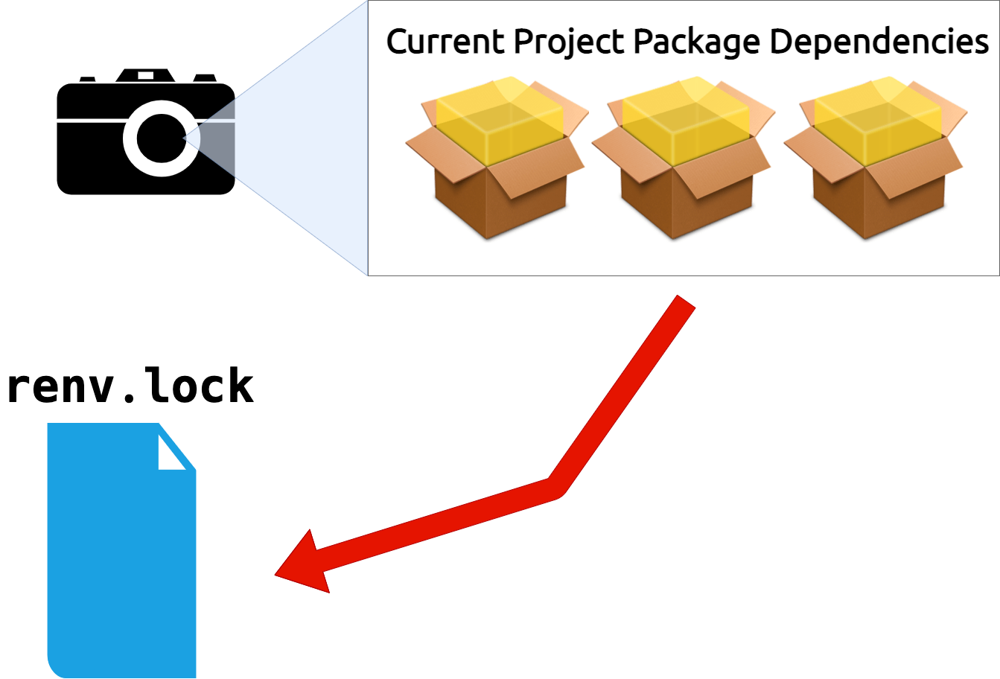
```

---

## Your Turn 2

### Modify `plot.R`In `plot.R`, modify your code to load the `patchwork` library, then replace your previous plot with `quickplot(mpg$displ) + quickplot(as.factor(mpg$cyl))`
### Run `renv::status()` in the console
### Run `renv::snapshot()`. What's changed?

---

## Your Turn 2

.pull-left[

```{r plot-dot-r-03.png, echo=FALSE, out.width='100%', fig.align='center'}
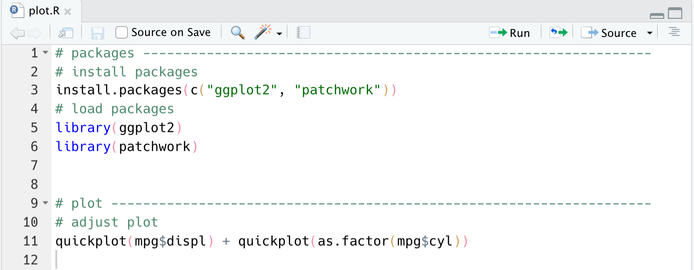
```

]

--

.pull-right[

```{r plot-dot-r-04.png, echo=FALSE, fig.align='center'}
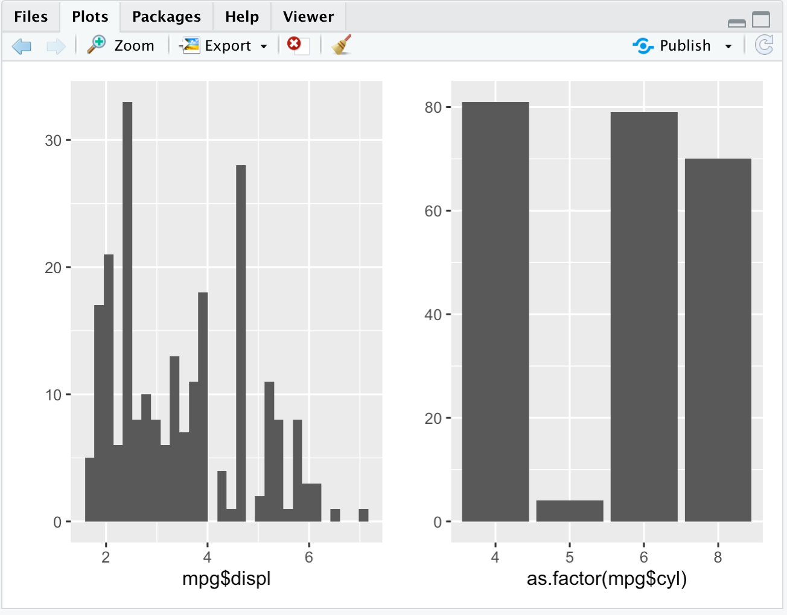
```

]

---

## Your Turn 2

```{r renv-status-02.png, echo=FALSE, fig.align='center'}
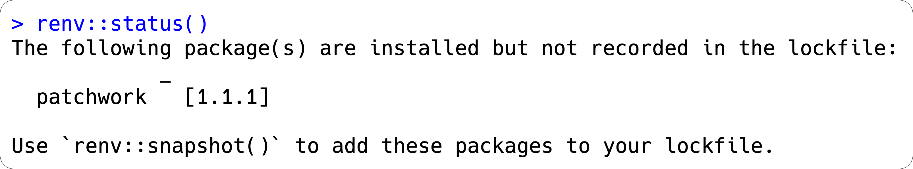
```

---


## Your Turn 2

```{r renv-snapshot-02.png, echo=FALSE, out.width='85%', fig.align='center'}
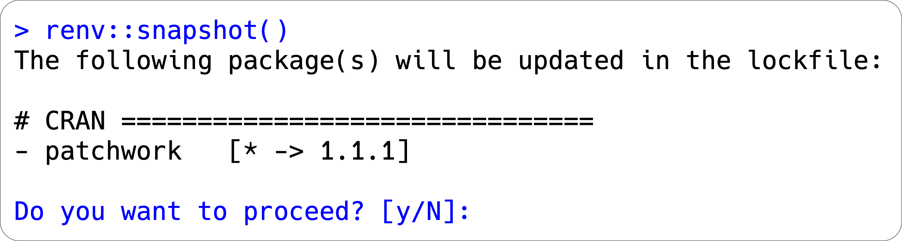
```

--

```{r renv-snapshot-03.png, echo=FALSE, out.width='85%', fig.align='center'}

```


---

class: inverse

# renv workflow

1. Create a project
2. `renv::init()`
3. Write code
4. `renv::snapshot()`
5. Iterate

---

class: inverse

# Restoring project states

1. Copy project
2. `renv::restore()`
3. That's it!

---

## Using renv with targets

--

## targets encourages *`tar_option_set(packages = "...")`*

---

## Using renv with targets
## ~~targets encourages `tar_option_set(packages = "...")`~~
## `tar_option_set()` is *efficient* but *unique to targets*

---

## Using renv with targets

## ~~`library(`~~**`ggplot2`**~~`)`~~
## **`targets`**~~`::tar_target()`~~
## ~~`require(`~~**`dplyr`**~~`)`~~
## ~~`requireNamespace("`~~**`devtools`**~~`")`~~

---

## Using renv with targets
## ~~targets encourages `tar_option_set(packages = "...")`~~
## ~~`tar_option_set()` is efficient but unique to targets~~
## *`tar_renv()`*

---

### Your Turn 3

.large[
####  Create a new project
#### Load `targets and run `tar_script()` in the console. Read `_targets.R` and predict what your dependencies are.</i>
#### Run `renv::dependencies()`
#### Run `tar_renv()` and look at `_targets_packages.R` What did targets do here? Why is that important? Run `renv::dependencies()` again and confirm that we can detect all of our dependencies.
#### Run `renv::init()`
]

---


### Your Turn 3

```{r my-newest-project, echo=FALSE}
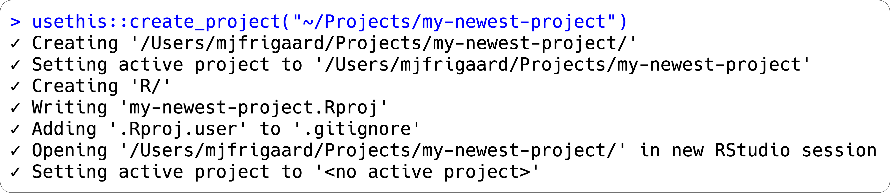
```

---

## Your Turn 3

### `tar_script()`: *`_targets.R`*

.small[
```{r, eval=FALSE}
library(targets)
# This is an example _targets.R file. Every {targets} pipeline
# needs one. Use tar_script() to create _targets.R and
# tar_edit() to open it again for editing. Then, run tar_make()
# to run the pipeline and tar_read(summary) to view the results.
# Define custom functions and other global objects. This is where
# you write source(\"R/functions.R\") if you keep your functions
# in external scripts.
summ <- function(dataset) {
  summarize(dataset, mean_x = mean(x))
}
# Set target-specific options such as packages.
tar_option_set(packages = "dplyr")
# End this file with a list of target objects.
list(
  tar_target(data, data.frame(
    x = sample.int(100),
    y = sample.int(100))),
  # Call your custom functions as needed.
  tar_target(summary, summ(data))
)
```
]

---

## Your Turn 3

```{r renv-dependencies-02.png, echo=FALSE}
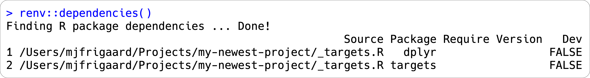
```

---

## Your Turn 3

.pull-left[

### `tar_renv()`

```{r tar-renv.png, echo=FALSE}
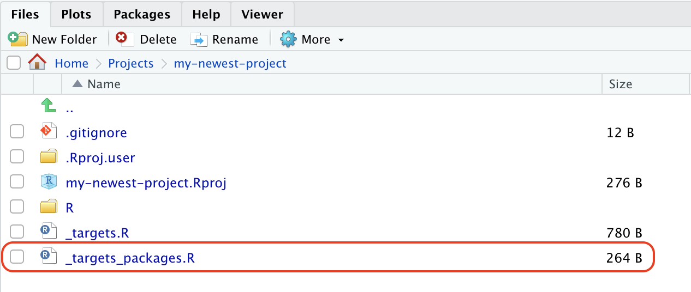
```

]

--

.pull-right[

### `_targets_packages.R`

```{r targets-packages.png, echo=FALSE}
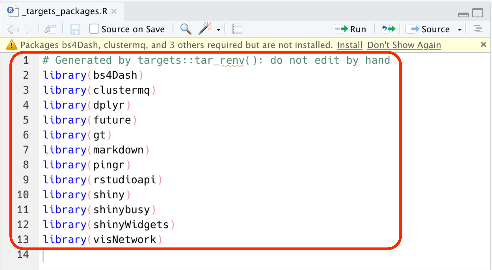
```

]

---

## Your Turn 3

```{r renv-dependencies-03.png, echo=FALSE}
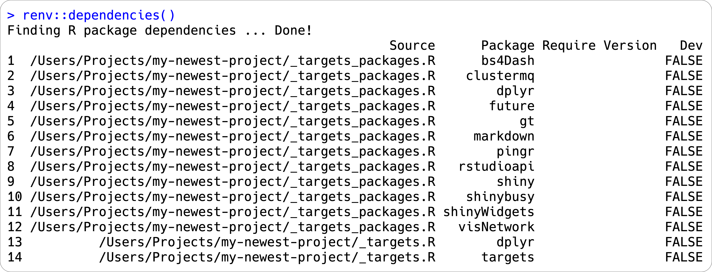
```

---

## Your Turn 3

```{r renv-init-04.png, echo=FALSE}
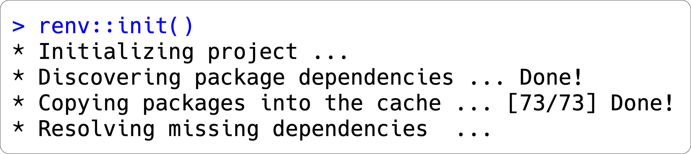
```

---

## Your Turn 3

```{r renv-init-09.png, echo=FALSE, out.width='100%', fig.align='center'}
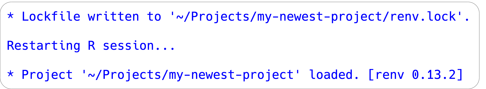
```

---

class: inverse, left

# Resources
## [renv: Getting started](https://rstudio.github.io/renv/articles/renv.html): A brief introduction to renv and its workflows
## [renv: Project Environments for R (blog)](https://blog.rstudio.com/2019/11/06/renv-project-environments-for-r/): An RStudio blog post introducing renv
## [renv: Project Environments for R (talk)](https://www.rstudio.com/resources/rstudioconf-2020/renv-project-environments-for-r/): A talk on renv from rstudio::conf() 2020 
