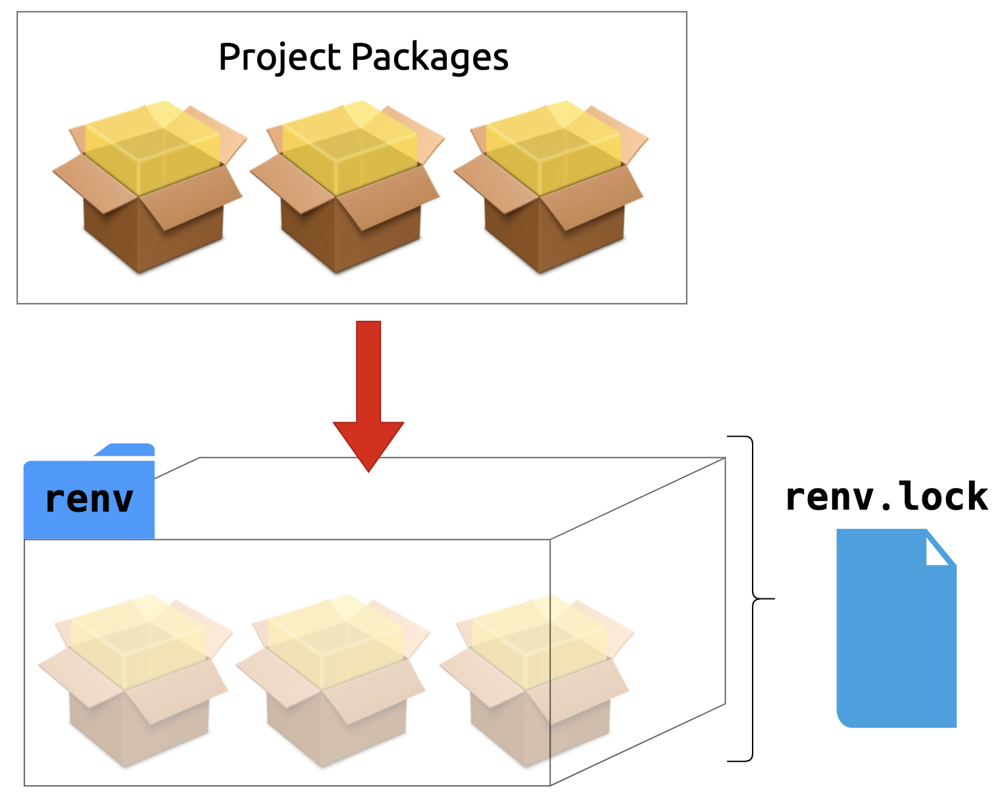
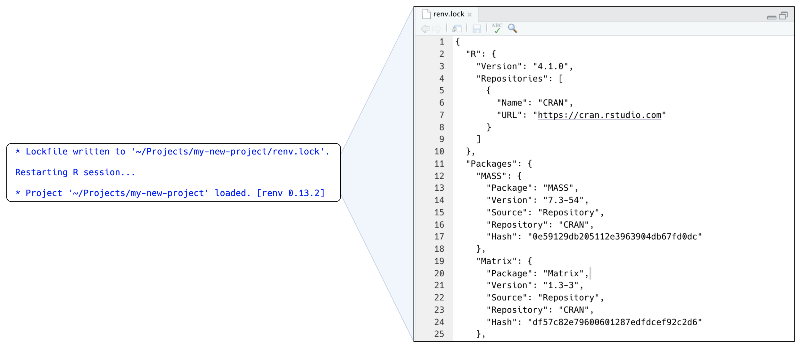
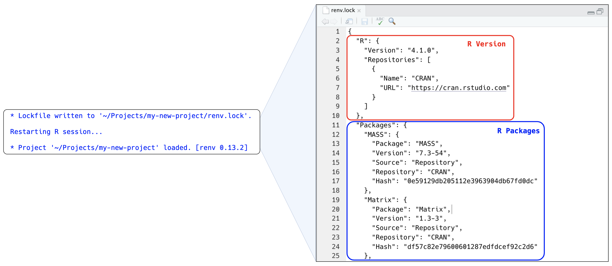
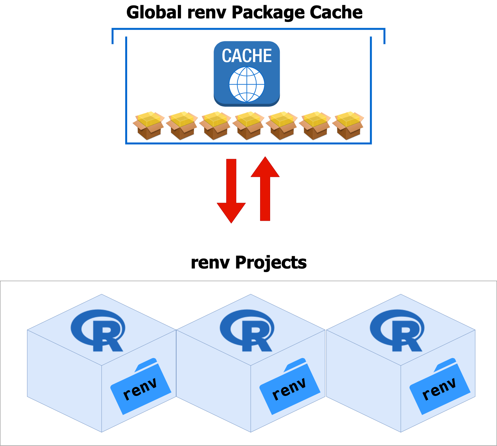
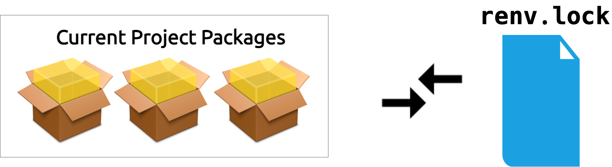
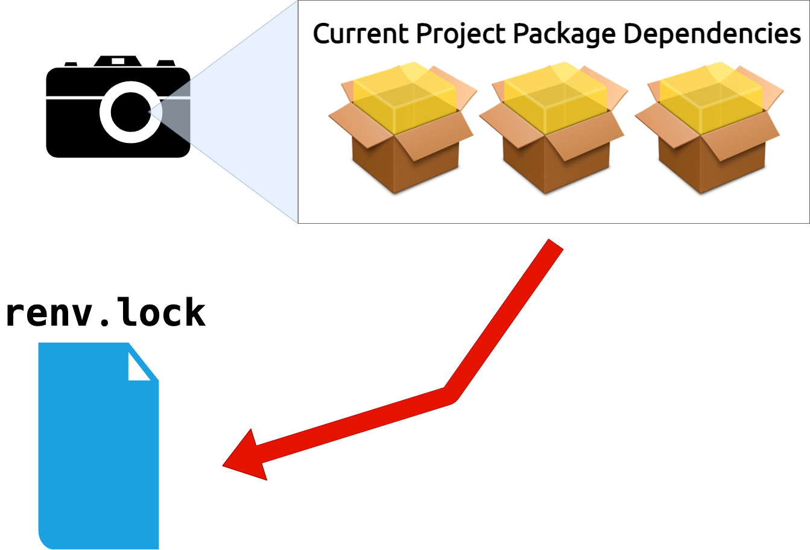
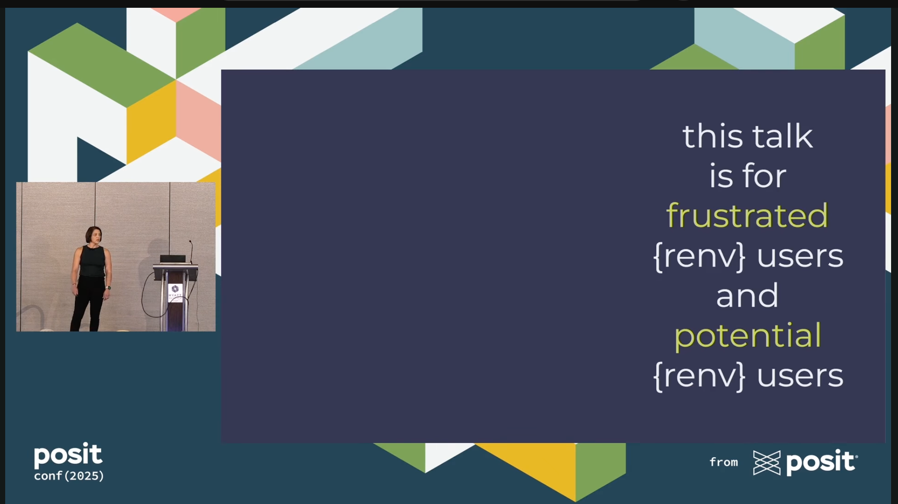
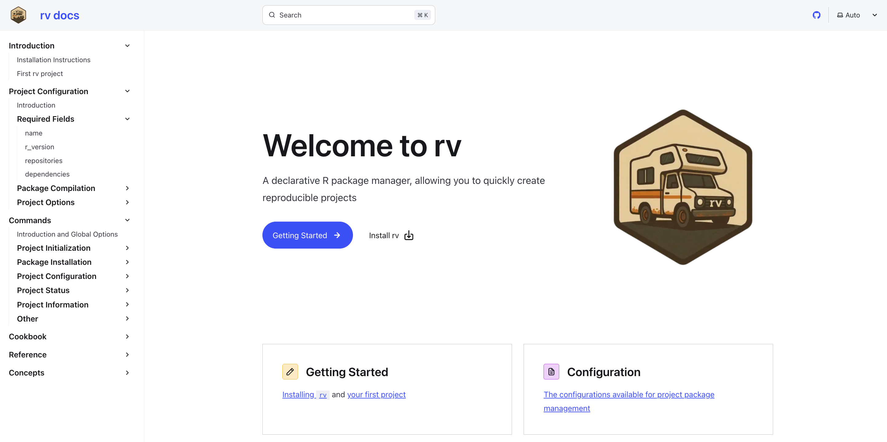
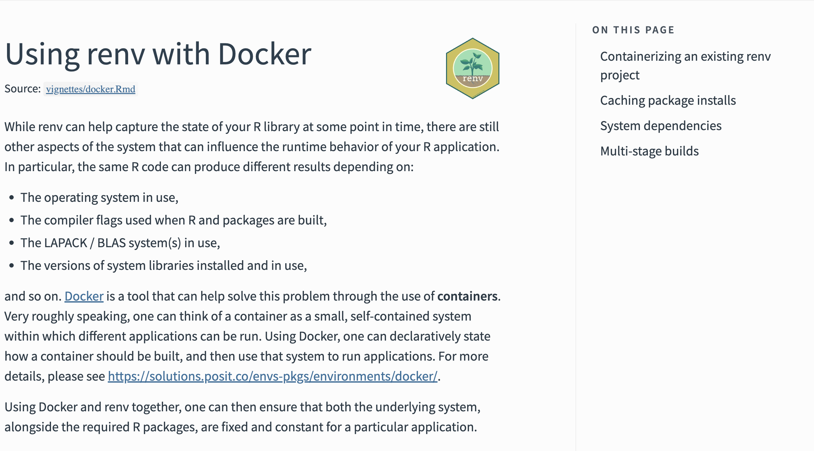

```{r}
#| label: setup
#| include: false
options(htmltools.dir.version = FALSE, tibble.max_extra_cols = 6, tibble.width = 60)
knitr::opts_chunk$set(warning = FALSE, message = FALSE, fig.align = "center", dpi = 320)
library(tidyverse)
library(gapminder)
library(here)
```

# Introduction to renv {background-color="#23373B"}

## Once upon a time (*6 months ago*), a hero (*you*) wrote some code

. . .

```{r}
#| eval: false
add_rownames(data, var = "rowname")
```

. . .

::: {.large}
**But then!**
:::

. . .

Updates were made to the [`dplyr` package:](https://dplyr.tidyverse.org/news/index.html#deprecated)

```
Warning message:
`add_rownames()` was deprecated in dplyr 1.0.0.
Please use `tibble::rownames_to_column()` instead.
```

## *renv* {background-image="img/renv.svg" background-position="93% 10%" background-size="220px 220px"}

- `renv` is designed to improve *project-level reproducibility*
- *records* and *restores* the packages used in a project
- Successor to [packrat](https://rstudio.github.io/packrat/)

## How does renv help? {background-color="#23373B"}

1. Each project gets its own library (*isolated*)
2. The project library can be shipped with a self-contained lockfile, `renv.lock` (*portable*)
3. `renv.lock` can be restored with `renv::restore()` (*reproducible*)

## renv solves one part of the puzzle

```{r}
#| echo: false
#| fig-width: 9
#| fig-height: 9
library(ggplot2)
library(ggforce)

# Okabe-Ito palette
oi_orange <- "#E69F00"
oi_skyblue <- "#56B4E9"
oi_green <- "#009E73"
oi_yellow <- "#F0E442"
oi_blue <- "#0072B2"
oi_vermillon <- "#D55E00"
oi_purple <- "#CC79A7"

theme_diagram <- theme_void() +
  theme(
    plot.margin = margin(20, 20, 20, 20),
    plot.title = element_text(face = "bold", size = 16, margin = margin(b = 10))
  )

# Rings from innermost to outermost:
#   project files (0.5) < packages (1.0) < R version (1.5) < system deps (2.0) < OS (2.5)
#
# At x = 0, ring bands in the LOWER half:
#   project files:  y in [-0.5,  0.5]  -> label at  0.0
#   packages:       y in [-1.0, -0.5]  -> label at -0.75
#   R version:      y in [-1.5, -1.0]  -> label at -1.25
#   system deps:    y in [-2.0, -1.5]  -> label at -1.75
#   OS:             y in [-2.5, -2.0]  -> label at -2.25

layers <- data.frame(
  label = c("OS", "system deps", "R version", "packages", "project\nfiles"),
  r = c(2.5, 2.0, 1.5, 1.0, 0.5),
  label_y = c(-2.25, -1.75, -1.25, -0.75, 0.0)
)

ggplot() +
  geom_circle(
    data = layers,
    aes(x0 = 0, y0 = 0, r = r),
    fill = NA,
    color = "grey40",
    linewidth = 0.4
  ) +
  geom_text(
    data = layers,
    aes(x = 0, y = label_y, label = label),
    size = 3.5,
    color = "grey30",
    family = "mono"
  ) +
  coord_fixed(xlim = c(-3, 3), ylim = c(-3, 3)) +
  theme_diagram
```

## renv solves one part of the puzzle

```{r}
#| echo: false
#| fig-width: 9
#| fig-height: 9
layers_renv <- data.frame(
  label = c("OS", "system deps", "R version", "packages", "project\nfiles"),
  r = c(2.5, 2.0, 1.5, 1.0, 0.5),
  label_y = c(-2.25, -1.75, -1.25, -0.75, 0.0),
  managed = c(FALSE, FALSE, FALSE, TRUE, TRUE)
)

ggplot() +
  geom_circle(
    data = layers_renv[!layers_renv$managed, ],
    aes(x0 = 0, y0 = 0, r = r),
    fill = NA,
    color = "grey40",
    linewidth = 0.4
  ) +
  geom_circle(
    data = layers_renv[layers_renv$managed, ],
    aes(x0 = 0, y0 = 0, r = r),
    fill = alpha(oi_green, 0.15),
    color = oi_green,
    linewidth = 0.6
  ) +
  geom_text(
    data = layers_renv,
    aes(x = 0, y = label_y, label = label),
    size = 3.5,
    color = "grey30",
    family = "mono"
  ) +
  annotate(
    "text",
    x = 2.2,
    y = 2.5,
    label = "{renv}",
    size = 5,
    fontface = "bold",
    color = oi_green,
    family = "mono"
  ) +
  coord_fixed(xlim = c(-3, 3.5), ylim = c(-3, 3)) +
  theme_diagram
```

# demo: [snoopy-spring](https://github.com/andrewheiss/snoopy-spring) {background-color="#23373B"}

## `renv::init()`

- Creates local renv environment; *caches* packages.
- Documents packages in *`renv.lock`*

## `renv::init()`

```{r}
#| label: renv-init-pkgs-02.png
#| echo: false
#| out.width: 53%
#| fig.align: center

```

## `renv.lock`

```{r}
#| label: renv-lock.png
#| echo: false
#| out.width: 100%
#| fig.align: center

```

## `renv.lock`

```{r}
#| label: renv-lock-expl.png
#| echo: false
#| out.width: 100%
#| fig.align: center

```

## R libraries: collections of specific R packages

```{r}
.libPaths()
```


## `renv::dependencies()`

:::{.nonincremental .large}
- `library(ggplot2)`
- `targets::tar_target()`
- `require(dplyr)`
- `requireNamespace("devtools")`
:::

## `renv::dependencies()`

:::{.nonincremental .large}
- <span style="color: #E5E5E5;"><code style="color: inherit;">library(</code></span><strong><code>ggplot2</code></strong><span style="color: #E5E5E5;"><code style="color: inherit;">)</code></span>
- <strong><code>targets</code></strong><span style="color: #E5E5E5;"><code style="color: inherit;">::tar_target()</code></span>
- <span style="color: #E5E5E5;"><code style="color: inherit;">require(</code></span><strong><code>dplyr</code></strong><span style="color: #E5E5E5;"><code style="color: inherit;">)</code></span>
- <span style="color: #E5E5E5;"><code style="color: inherit;">requireNamespace("</code></span><strong><code>devtools</code></strong><span style="color: #E5E5E5;"><code style="color: inherit;">")</code></span>
:::

## How `renv` stores packages

. . .

<br/>

```{r}
#| label: renv-init-pkgs-01.png
#| echo: false
#| out.width: 50%
#| fig.align: center

```

## *Your Turn 1* {.huge}

Work through Your Turn 1 in `exercises.qmd`

## `renv::status()`

```{r}
#| label: renv-status-01.png
#| echo: false
#| out.width: 90%
#| fig.align: center

```

- Checks for differences between the *`renv.lock`* and the *current project's packages*

## *`renv::snapshot()`*

```{r}
#| label: renv-snapshot-01.png
#| echo: false
#| out.width: 60%
#| fig.align: center

```

## *Your Turn 2* {.huge}

Work through Your Turn 2 in `exercises.qmd`

## renv workflow {background-color="#23373B"}

1. Create a project
2. `renv::init()`
3. Write code
4. `renv::snapshot()`
5. Iterate

## Restoring project states {background-color="#23373B"}

1. Clone and open project
2. `renv::restore()`

# Why do projects fail to restore? {background-color="#23373B"}

## Shoutout: [Practical renv by Shannon Pileggi](https://youtu.be/l01u7Ue9pIQ?si=SOKT_oDbVAXt4a3N)



## R works great today...

```{r}
#| fig-width: 7
#| fig-height: 4
#| echo: false

pkgs <- data.frame(
  label = c("R", "{renv}", "{ggplot2}"),
  y = 3:1
)

ggplot(pkgs) +
  annotate(
    "segment",
    x = 0,
    xend = 0,
    y = 0.4,
    yend = 3.6,
    color = "grey60",
    linewidth = 0.4
  ) +
  geom_point(
    aes(x = 0, y = y),
    shape = 21,
    size = 5,
    fill = oi_orange,
    color = "white",
    stroke = 1.2
  ) +
  geom_text(
    aes(x = 0.15, y = y, label = label),
    hjust = 0,
    size = 4.5,
    family = "mono"
  ) +
  annotate(
    "text",
    x = 0,
    y = 0.15,
    label = "today",
    size = 3.5,
    color = "grey40",
    family = "mono"
  ) +
  annotate(
    "segment",
    x = -0.6,
    xend = 1.5,
    y = -0.2,
    yend = -0.2,
    arrow = arrow(length = unit(0.15, "cm"), type = "closed"),
    color = "grey50",
    linewidth = 0.4
  ) +
  annotate(
    "text",
    x = 1.55,
    y = -0.2,
    label = "time",
    hjust = 0,
    size = 3.5,
    color = "grey50"
  ) +
  coord_cartesian(xlim = c(-0.8, 2.2), ylim = c(-0.5, 4)) +
  theme_diagram
```

## ...but entropy comes for us all

```{r}
#| fig-width: 8
#| fig-height: 4.5
#| echo: false

pkgs2 <- data.frame(
  label = c(
    "R",
    "{renv}",
    "{dplyr}",
    "{targets}",
    "{ggplot2}"
  ),
  x = c(-0.7, -0.35, 0.1, 0.45, 0.8),
  y = c(5, 4, 3, 2, 1)
)

ggplot(pkgs2) +
  # time arrow
  annotate(
    "segment",
    x = -1.1,
    xend = 1.8,
    y = -0.2,
    yend = -0.2,
    arrow = arrow(length = unit(0.15, "cm"), type = "closed"),
    color = "grey50",
    linewidth = 0.4
  ) +
  annotate(
    "text",
    x = 1.85,
    y = -0.2,
    label = "time",
    hjust = 0,
    size = 3.5,
    color = "grey50"
  ) +
  # date marker — vertical line through the plot
  annotate(
    "segment",
    x = 0,
    xend = 0,
    y = -0.05,
    yend = 5.5,
    color = "grey60",
    linewidth = 0.4
  ) +
  annotate(
    "text",
    x = 0,
    y = -0.55,
    label = "today",
    size = 3,
    color = "grey40",
    family = "mono"
  ) +
  # dashed verticals from each dot down to the timeline
  geom_segment(
    aes(x = x, xend = x, y = 0, yend = y - 0.15),
    color = "grey75",
    linewidth = 0.3,
    linetype = "dotted"
  ) +
  # version dots
  geom_point(
    aes(x = x, y = y),
    shape = 21,
    size = 5,
    fill = oi_orange,
    color = "white",
    stroke = 1.2
  ) +
  # labels
  geom_text(
    aes(x = x + 0.12, y = y, label = label),
    hjust = 0,
    size = 4,
    family = "mono"
  ) +
  coord_cartesian(xlim = c(-1.2, 2.5), ylim = c(-0.8, 5.5)) +
  theme_diagram
```

## Package states {.small}

- Package developers write in **source code**, then **bundle** the code to send to CRAN.
- CRAN builds **binaries** or otherwise supplies the bundle to install.
- We **install** the result with `install.packages()` and friends.
- We bring an installed package **into memory** with `library()`.

## Package states

```{r}
#| fig-width: 9
#| fig-height: 9
#| echo: false

states <- data.frame(
  label = c("source", "bundled", "binary", "installed", "in-memory"),
  x = 1:5,
  y = 0,
  stage = c("build", "build", "user", "user", "user")
)
bw <- 0.42
bh <- 0.22

arr <- data.frame(
  x = 1:4 + bw + 0.05,
  xend = 2:5 - bw - 0.05,
  y = 0,
  yend = 0
)

ggplot() +
  geom_rect(
    data = states,
    aes(
      xmin = x - bw,
      xmax = x + bw,
      ymin = y - bh,
      ymax = y + bh,
      fill = stage,
      color = stage
    ),
    linewidth = 0.4
  ) +
  scale_fill_manual(values = c(build = "#E69F0026", user = "#009E7326")) +
  scale_color_manual(values = c(build = oi_orange, user = oi_green)) +
  guides(fill = "none", color = "none") +
  geom_text(
    data = states,
    aes(x = x, y = y, label = label),
    size = 3.6,
    family = "mono",
    color = "grey20"
  ) +
  geom_segment(
    data = arr,
    aes(x = x, xend = xend, y = y, yend = yend),
    arrow = arrow(length = unit(0.1, "cm"), type = "closed"),
    color = "grey50",
    linewidth = 0.3
  ) +
  annotate(
    "text",
    x = 1.5,
    y = -0.37,
    label = "R CMD build",
    size = 3.5,
    family = "mono",
    color = "grey50"
  ) +
  annotate(
    "text",
    x = 2.5,
    y = -0.37,
    label = "R CMD INSTALL\n--build",
    size = 3.5,
    family = "mono",
    color = "grey50",
    lineheight = 0.85
  ) +
  annotate(
    "text",
    x = 3.5,
    y = -0.37,
    label = "install.packages()",
    size = 3.5,
    family = "mono",
    color = "grey50"
  ) +
  annotate(
    "text",
    x = 4.5,
    y = -0.37,
    label = "library()",
    size = 3.5,
    family = "mono",
    color = "grey50"
  ) +
  annotate(
    "segment",
    x = 1,
    xend = 3,
    y = -0.7,
    yend = -0.7,
    color = oi_orange,
    linewidth = 0.5
  ) +
  annotate(
    "text",
    x = 2,
    y = -0.85,
    label = "package build tools required\nmay need compilation",
    size = 4,
    family = "mono",
    color = oi_orange
  ) +
  annotate(
    "segment",
    x = 3,
    xend = 5,
    y = -0.7,
    yend = -0.7,
    color = oi_green,
    linewidth = 0.5
  ) +
  annotate(
    "text",
    x = 4,
    y = -0.85,
    label = "typical user path\n(no building/compilation)",
    size = 4,
    family = "mono",
    color = oi_green
  ) +
  annotate(
    "text",
    x = 3,
    y = 0.55,
    label = "CRAN / R-universe / PPM",
    size = 5,
    family = "mono",
    fontface = "bold",
    color = oi_green
  ) +
  annotate(
    "text",
    x = 3,
    y = 0.72,
    label = "pre-built binaries",
    size = 6,
    family = "mono",
    color = oi_green
  ) +
  annotate(
    "segment",
    x = 3,
    xend = 3,
    y = 0.43,
    yend = bh + 0.02,
    arrow = arrow(length = unit(0.1, "cm"), type = "closed"),
    color = oi_green,
    linewidth = 0.3
  ) +
  annotate(
    "curve",
    x = 1,
    xend = 5,
    y = bh + 0.05,
    yend = bh + 0.05,
    curvature = -0.5,
    arrow = arrow(length = unit(0.1, "cm"), type = "closed"),
    color = oi_blue,
    linewidth = 0.3,
    linetype = "dashed"
  ) +
  annotate(
    "text",
    x = 3,
    y = 1.1,
    label = "devtools::load_all()",
    size = 3,
    family = "mono",
    color = oi_blue
  ) +
  coord_cartesian(xlim = c(0.3, 5.7), ylim = c(-1.05, 1.3)) +
  theme_diagram
```

# Making resilient R environments {background-color="#23373B"}

## [rig](https://github.com/r-lib/rig): The R Installation Manager

* rig is a command line tool that you use in the terminal (not the R console) to manage R installations
* `rig add <version>`, e.g. `rig add 4.1.0` `rig add release`
* `rig default <version>`, `rig rstudio <version>`

## rig solves another part of the puzzle

```{r}
#| fig-width: 9
#| fig-height: 9
#| echo: false

layers_both <- data.frame(
  label = c("OS", "system deps", "R version", "packages", "project\nfiles"),
  r = c(2.5, 2.0, 1.5, 1.0, 0.5),
  label_y = c(-2.25, -1.75, -1.25, -0.75, 0.0),
  tool = c("none", "none", "rig", "renv", "renv")
)

ggplot() +
  # unmanaged rings (OS, system deps)
  geom_circle(
    data = layers_both[layers_both$tool == "none", ],
    aes(x0 = 0, y0 = 0, r = r),
    fill = NA,
    color = "grey40",
    linewidth = 0.4
  ) +
  # rig-managed ring (R version) — orange
  geom_circle(
    data = layers_both[layers_both$tool == "rig", ],
    aes(x0 = 0, y0 = 0, r = r),
    fill = alpha(oi_orange, 0.15),
    color = oi_orange,
    linewidth = 0.6
  ) +
  # renv-managed rings (packages, project files) — green
  geom_circle(
    data = layers_both[layers_both$tool == "renv", ],
    aes(x0 = 0, y0 = 0, r = r),
    fill = alpha(oi_green, 0.15),
    color = oi_green,
    linewidth = 0.6
  ) +
  geom_text(
    data = layers_both,
    aes(x = 0, y = label_y, label = label),
    size = 3.5,
    color = "grey30",
    family = "mono"
  ) +
  # badges
  annotate(
    "text",
    x = 2.2,
    y = 2.5,
    label = "{renv}",
    size = 5,
    fontface = "bold",
    color = oi_green,
    family = "mono"
  ) +
  annotate(
    "text",
    x = 2.2,
    y = 2.0,
    label = "rig",
    size = 5,
    fontface = "bold",
    color = oi_orange,
    family = "mono"
  ) +
  coord_fixed(xlim = c(-3, 3.5), ylim = c(-3, 3)) +
  theme_diagram
```

## Package repositories

```{r}
#| eval: false
getOption("repos")
```

```{r}
#| echo: false
structure(c(CRAN = "https://cran.rstudio.com/"), IDE = TRUE)
```

* CRAN offers binaries for Windows and Mac, typically for the latest version and the version before that
* CRAN **archives** package bundles for all versions that have been on CRAN, but these then need to be built from source

## Package repositories

```{r}
#| eval: false
install.packages(
  "data.table",
  repos = c(CRAN = "https://packagemanager.posit.co/cran/2026-02-13")
)
```

* [Posit Package Manager](https://packagemanager.posit.co/client/#/) offers binaries for many OSes as well as daily-ish snapshots
* [R-Universe](https://ropensci.org/r-universe/) and [R-Multiverse](https://r-multiverse.org/) are increasingly important community-led, GitHub-based repositories that serve binaries

## `renv::checkout(repo = ...)`

- You can change the repository your packages are installed from via `renv::checkout()`

## `renv::checkout(date = "yyyy-mm-dd")`

- `renv::checkout()` also has a fast way to checkout from Posit Package Manager's daily CRAN snapshots
- You can also look up the date an R version was released with `rversions::r_versions()` to figure out which R version was the release version on a given date

## R works great on a given day


```{r}
#| fig-width: 7
#| fig-height: 4
#| echo: false

pkgs <- data.frame(
  label = c("R", "{renv}", "{ggplot2}"),
  y = 3:1
)

ggplot(pkgs) +
  annotate(
    "segment",
    x = 0,
    xend = 0,
    y = 0.4,
    yend = 3.6,
    color = "grey60",
    linewidth = 0.4
  ) +
  geom_point(
    aes(x = 0, y = y),
    shape = 21,
    size = 5,
    fill = oi_orange,
    color = "white",
    stroke = 1.2
  ) +
  geom_text(
    aes(x = 0.15, y = y, label = label),
    hjust = 0,
    size = 4.5,
    family = "mono"
  ) +
  annotate(
    "text",
    x = 0,
    y = 0.15,
    label = "a given day",
    size = 3.5,
    color = "grey40",
    family = "mono"
  ) +
  annotate(
    "segment",
    x = -0.6,
    xend = 1.5,
    y = -0.2,
    yend = -0.2,
    arrow = arrow(length = unit(0.15, "cm"), type = "closed"),
    color = "grey50",
    linewidth = 0.4
  ) +
  annotate(
    "text",
    x = 1.55,
    y = -0.2,
    label = "time",
    hjust = 0,
    size = 3.5,
    color = "grey50"
  ) +
  coord_cartesian(xlim = c(-0.8, 2.2), ylim = c(-0.5, 4)) +
  theme_diagram
```

## Moving forward in time, all together

- `rig add release` + `rig default release`
- `checkout(date = "...", actions = c("snapshot", "restore"))` a recent date (after the most recent release)

## *Your Turn 3* {.huge}

Work through Your Turn 3 in `exercises.qmd`

# Documenting restoration {background-color="#23373B"}

## `README`

- `README`s are plain text files, often `README.md` (markdown), that describe the project
- It is traditionally included in the root directory of a project, although `README`s may be useful for subdirectories, too.
- For reproducibility, you want to include explicit instructions as to how to set up and run the project **from scratch**.

## Creating `README`s

- Create a new file yourself
- `usethis::use_readme_md()` or `usethis::use_readme_rmd()`

# example: [lemon-lucifer](https://github.com/andrewheiss/lemon-lucifer) {background-color="#23373B"}

## *Your Turn 4* {.huge}

Work through Your Turn 4 in `exercises.qmd`

# demo: [lemon-lucifer](https://github.com/andrewheiss/lemon-lucifer) {background-color="#23373B"}

# Other approaches to reproducibility in R {background-color="#23373B"}

## [rv](https://a2-ai.github.io/rv-docs/)



## [Docker](https://rstudio.github.io/renv/articles/docker.html)



# *Bonus*: using renv with targets {background-color="#23373B"}

## Using renv with targets

- targets encourages *`tar_option_set(packages = "...")`*
- `tar_option_set()` is *efficient* but *works differently* than other ways of loading packages
- Recent updates to renv also support **`tar_option_set()`**

## Using renv with targets

:::{.nonincremental .large}
- <span style="color: #E5E5E5;"><code style="color: inherit;">library(</code></span><strong><code>ggplot2</code></strong><span style="color: #E5E5E5;"><code style="color: inherit;">)</code></span>
- <strong><code>targets</code></strong><span style="color: #E5E5E5;"><code style="color: inherit;">::tar_target()</code></span>
- <span style="color: #E5E5E5;"><code style="color: inherit;">require(</code></span><strong><code>dplyr</code></strong><span style="color: #E5E5E5;"><code style="color: inherit;">)</code></span>
- <span style="color: #E5E5E5;"><code style="color: inherit;">requireNamespace("</code></span><strong><code>devtools</code></strong><span style="color: #E5E5E5;"><code style="color: inherit;">")</code></span>
:::

## Using renv with targets

- *`tar_renv()`*
- Still helpful with recent updates because of interactive and suggested packages

## *Bonus Your Turn: targets and renv* {.huge}

Work through Bonus Your Turn: targets and renv in `exercises.qmd`

## Resources {background-color="#23373B"}

### [renv: Getting started](https://rstudio.github.io/renv/articles/renv.html)

### [Practical {renv}](https://www.youtube.com/watch?v=l01u7Ue9pIQ)
