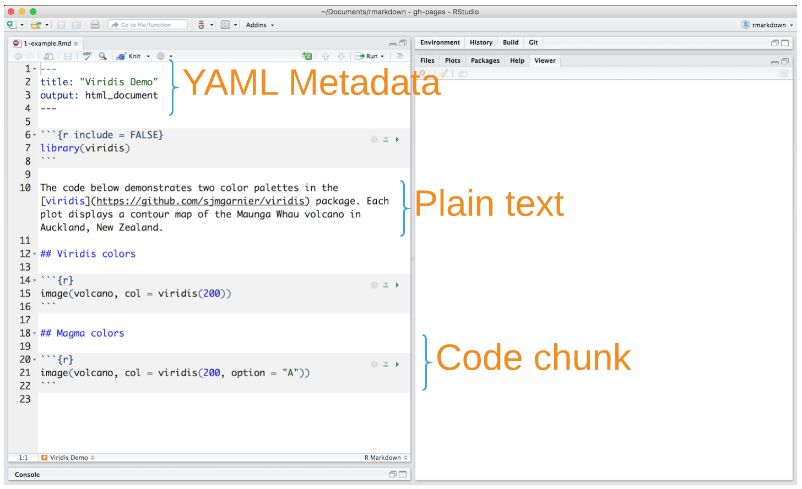
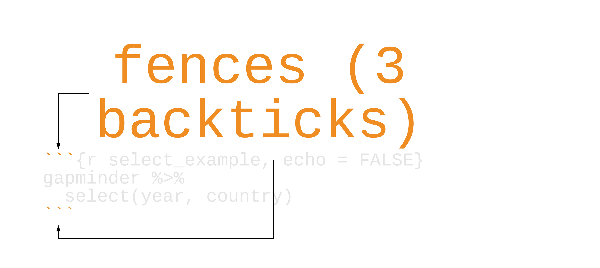
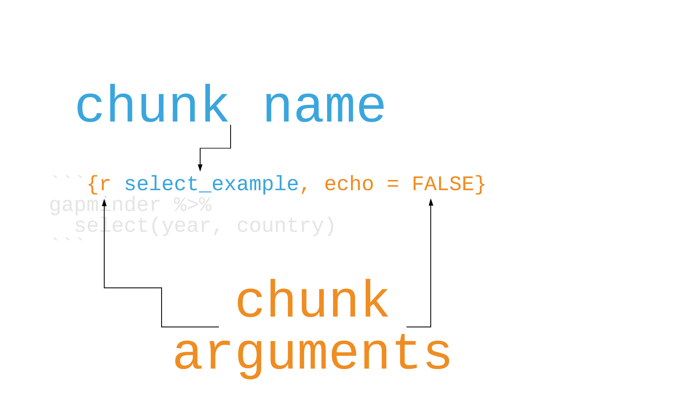
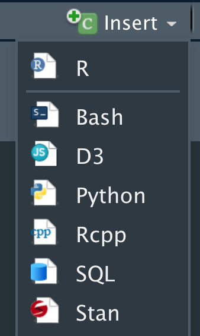
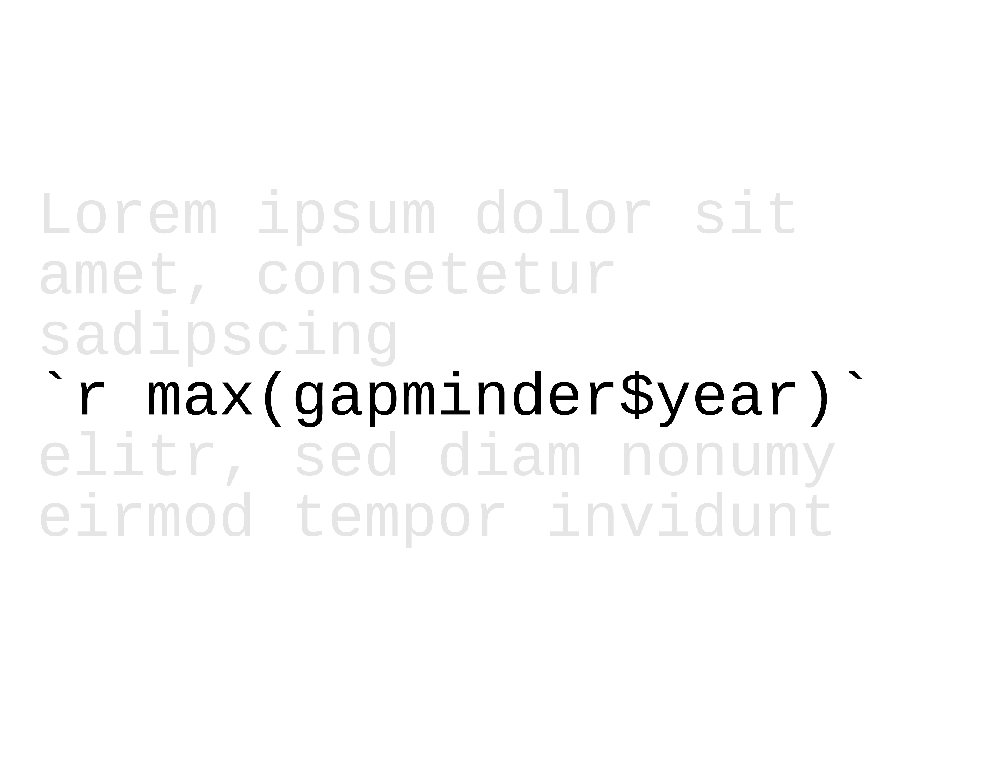
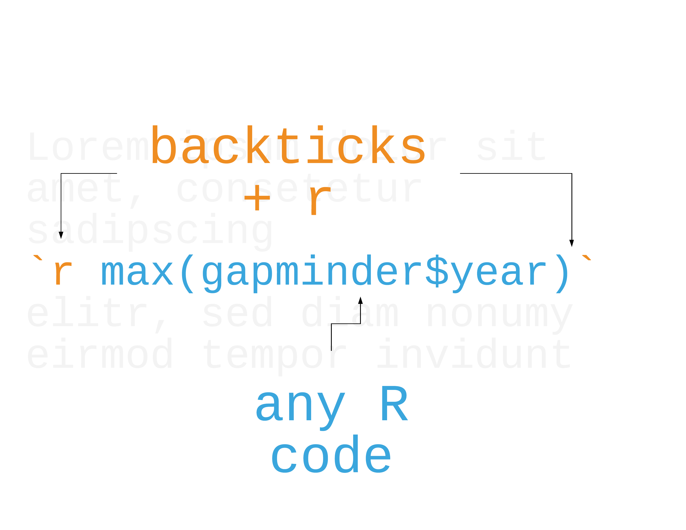
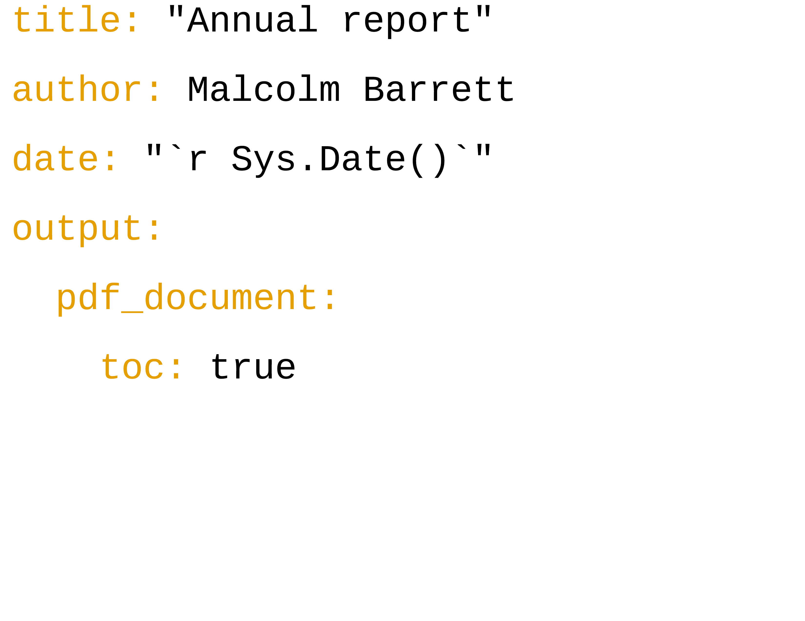
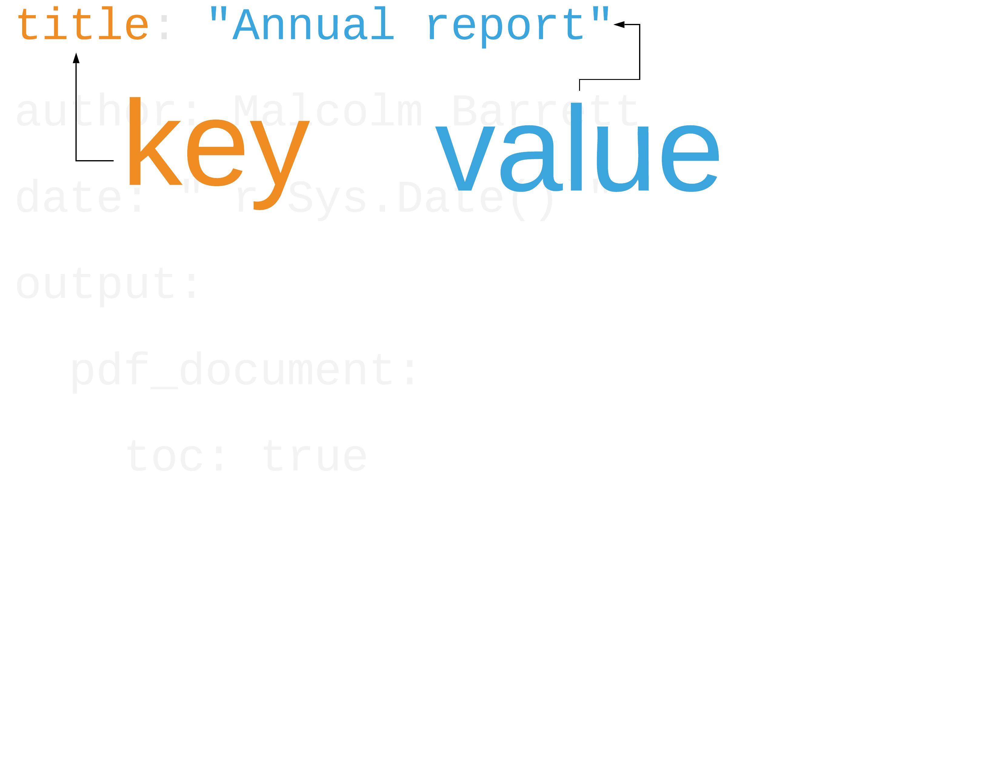
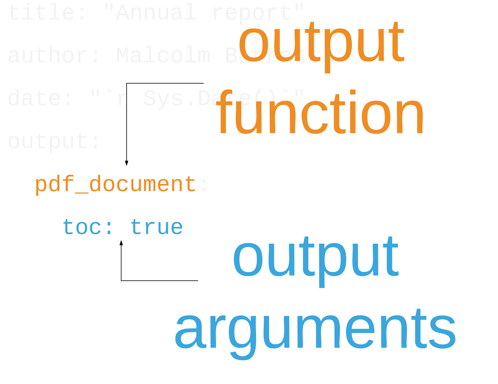
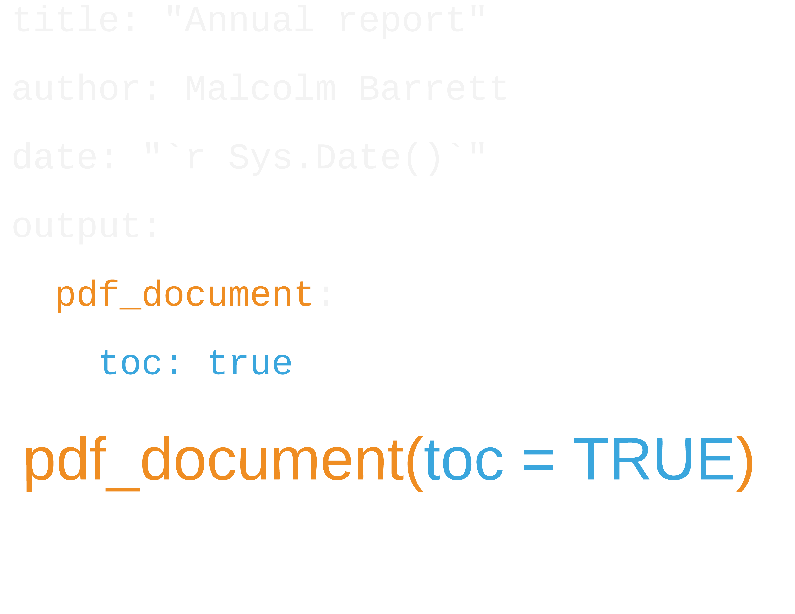

```{r setup, include=FALSE}
options(htmltools.dir.version = FALSE, tibble.max_extra_cols = 6, tibble.width = 60)
knitr::opts_chunk$set(warning = FALSE, message = FALSE, fig.align = "center", dpi = 320)
library(tidyverse)
library(gapminder)
library(here)
```


```{r, echo=FALSE, out.width="100%", out.height="100%"}
knitr::include_graphics("img/rmarkdown_wizards.png")
```

.pull-right[Artwork by @allison_horst]

---

background-image: url(http://hexb.in/hexagons/rmarkdown.png)
background-position: 93% 10%

## *R Markdown*

<br><br><br>

--

## Authoring framework: code and text in same document

--

## Reproducible: re-run your analysis

--

## Flexible: Output to different formats easily

---

background-image: url(https://lovecrafts.cdn.prismic.io/lovecrafts/01ed5aac2502cbbc4a262429747693741283bb8e_handsknitting6.jpg)
background-position: 50% 50%

class: middle, center
<br>
# <span style="color:#474747">knitting</span>

---

## Your turn 1

## Create a new R Markdown file. Go to File > New File > R Markdown. Press OK. Save the file and press the "Knit" button above.

---

class: middle

```{r, echo = FALSE, out.height="130%", out.width="130%"}

```

---

background-image: url(http://hexb.in/hexagons/rmarkdown.png)
background-position: 93% 10%

## R Markdown

## Prose
## Code
## Metadata

---
background-image: url(http://hexb.in/hexagons/rmarkdown.png)
background-position: 93% 10%

## R Markdown

## **Prose** = *Markdown*
## ~~Code~~
## ~~Metadata~~

---


# Basic Markdown Syntax

```
*italic*   **bold**

_italic_   __bold__
```

---

# Basic Markdown Syntax

```
# Header 1

## Header 2

### Header 3

```

---

# Basic Markdown Syntax

```
* Item 1
* Item 2
    + Item 2a
    + Item 2b
    
1. Item 1
2. Item 2
```

---

# Basic Markdown Syntax

```
http://example.com

[linked phrase](http://example.com)

```

---

# Basic Markdown Syntax

```


```

---

# Basic Markdown Syntax

```
$equation$

$$ equation $$
```

---

# Basic Markdown Syntax

```
superscript^2^

~~strikethrough~~
```

---

## Your turn 2

## Do the ten-twenty minute tutorial on markdown at https://commonmark.org/help/tutorial. Let us know if you need help!

---

## Your turn 3

## Use Markdown syntax to stylize the text from the [Gapminder website](https://www.gapminder.org/data/documentation/gd001/) below. Experiment with bolding, italicizing, making lists, etc.

---

background-image: url(http://hexb.in/hexagons/rmarkdown.png)
background-position: 93% 10%

## R Markdown

## ~~Prose~~
## **Code** = *R code chunks*
## ~~Metadata~~

---

### Code chunks

```{r, echo = FALSE, out.height="100%", out.width="100%"}
  
```

---

### Code chunks

```{r, echo = FALSE, out.height="100%", out.width="100%"}
  
```

---

### Code chunks

```{r, echo = FALSE, out.height="100%", out.width="100%"}
  
```

---

## Chunk options

Option       | Effect
-------------- | --------------------------
`include = FALSE`   | run the code but don't print it or results
`eval = FALSE`   | don't evaluate the code
`echo = FALSE`  | run the code and output but don't print code
`message = FALSE` | don't print messages (e.g. from a function)
`warning = FALSE`   | don't print warnings
`fig.cap = "Figure 1`   | caption output plot with "Figure 1"

--

## See the [knitr web page](https://yihui.name/knitr/options/)

---

## Engines

## 52! Including **Python**, **Julia**, **C++**, **SQL**, **SAS**, and **Stata**

---

## Insert code chunks with **`cmd/ctrl + alt/option + I`**


```{r, echo = FALSE, out.height="30%", out.width="30%"}

```

---

## Edit code chunk options

```{r, echo = FALSE, out.height="100%", out.width="100%"}
knitr::include_graphics("img/chunk_setup_gui.png")
```

---

## Your turn 4 (open **`exercises.Rmd`**)

### Create a code chunk. You can type it in manually, use the keyboard short-cut (Cmd/Ctrl + Option/Alt + I), or use the "Insert" button above. Put the following code in it:

```r
gapminder %>% 
  slice(1:5) %>% 
  knitr::kable()
```
### Knit the document

---

## Your turn 5
  
### Add `echo = FALSE` to the code chunk above and re-knit

### Remove `echo = FALSE` from the code chunk and move it to `knitr::opts_chunk$set()` in the `setup` code chunk. Re-knit. What's different about this?


--

### **Make sure to remove `knitr::opts_chunk$set(echo = FALSE)`**

---

### Inline Code

```{r, echo = FALSE, out.height="75%", out.width="75%"}

```

---

### Inline Code

```{r, echo = FALSE, out.height="75%", out.width="75%"}

```

---

### Your turn 6

### Remove `eval = FALSE` so that R Markdown evaluates the code.
### Use `summarize()` and `n_distinct()` to get the the number of unique years in gapminder and save the results as `n_years`.
### Use inline code to describe the data set in the text below the code chunk and re-knit.

---

background-image: url(http://hexb.in/hexagons/rmarkdown.png)
background-position: 93% 10%

## R Markdown

## ~~Prose~~
## ~~Code~~
## **Metadata** = *YAML*

---

# YAML Metadata

```yaml
---
author: Malcolm Barrett
title: Quarterly Report
output: 
  html_document: default
  pdf_document:
    toc: true
---
```

---


```{r, echo = FALSE, out.height="100%", out.width="100%"}

```

---

```{r, echo = FALSE, out.height="100%", out.width="100%"}

```

---

```{r, echo = FALSE, out.height="100%", out.width="100%"}
knitr::include_graphics("img/yaml_example_noted2.png")
```

---

```{r, echo = FALSE, out.height="100%", out.width="100%"}

```

---

```{r, echo = FALSE, out.height="100%", out.width="100%"}

```

---

# Output formats

Function       | Outputs
-------------- | --------------------------
`html_document()`   | HTML
`pdf_document()`  | PDF
`word_document()` | Word .docx
`odt_document()`   | .odt
`rtf_document()`   | .rtf
`md_document()`   | Markdown
`slidy_presentation()`   | Slidy Slides (HTML)
`beamer_presentation()`   | Beamer Slides (PDF)
`ioslides_presentation()`   | ioslides (HTML)
`powerpoint_presentation()`   | Powerpoint Slides

---

## Your turn 7

### Set figure chunk options such as `dpi`, `fig.width`, and `fig.height`.  Run `knitr::opts_chunk$get()` in the console to see the defaults.
### Change the YAML header above from `output: html_document` to another output type like `pdf_document` or `word_document`.
### Add your name to the YAML header using `author: Your Name`.

---

# ymlthis

## check out the ymlthis package for tools and documentation for working with YAML
## https://r-lib.github.io/ymlthis/

---

# Parameters

```yaml
---
params: 
  param1: x
  param2: y
  data: df
---
```

--

```{r, eval = FALSE}
params$param1
params$param2
params$data
```

---

### Your turn 8

###  Change the `params` option in the YAML header to use a different continent. Re-knit

```{r, eval = FALSE}
gapminder %>% 
  filter(continent == params$continent) %>% 
  ggplot(aes(x = year, y = lifeExp, group = country, color = country)) +
  geom_line(lwd = 1, show.legend = FALSE) + 
  scale_color_manual(values = country_colors) +
  theme_minimal(14) + 
  theme(strip.text = element_text(size = rel(1.1))) +
  ggtitle(paste("Continent:", params$continent))
```

---

## Bibliographies and citations

---

## Bibliographies and citations

## *Bibliography files*: **`.bib`**, **End Note**, **others**

---

## Bibliographies and citations

## ~~Bibliography files: `.bib`, End Note, others~~
## *Citation styles*: **`.csl`**


---

## Bibliographies and citations

## ~~Bibliography files: `.bib`, End Note, others~~
## ~~Citation styles: `.csl`~~

## **`[@citation-label]`**

---

## Including bibliography files in YAML

```yaml
---
bibliography: file.bib
csl: file.csl
---
```

---

### Your turn 9

### Cite the Causal Inference book in text below in the format ```[@citation-label]```. The label for the citation is `hernan_causal_2019`

###  Add the American Journal of Epidemiology CSL to the YAML using `csl: aje.csl`

---

class: middle

# Check out the citr package for easy citation insertion and .bib management

---

# Make cool stuff in R Markdown!

## bookdown
## blogdown
## these slides!

---

class: inverse, center

# Resources
## [R Markdown](https://bookdown.org/yihui/rmarkdown/): A comprehensive but friendly introduction to R Markdown and friends. Free online.
## [R for Data Science](http://r4ds.had.co.nz/): A comprehensive but friendly introduction to the tidyverse. Free online.
## [R Markdown for Scientists](https://rmd4sci.njtierney.com/): R Markdown for Scientists workshop material.
