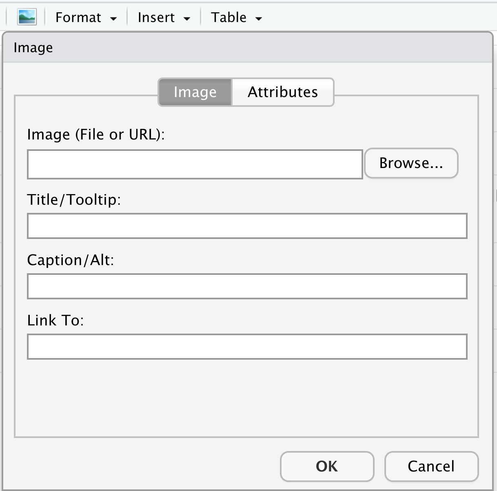

class: center, middle

```{r setup, include=FALSE}
options(htmltools.dir.version = FALSE, tibble.max_extra_cols = 6, tibble.width = 60)
knitr::opts_chunk$set(
  warning = FALSE, 
  message = FALSE, 
  dev = "ragg_png",
  dpi = 320,
  out.width = "80%",
  fig.width = 6,
  fig.asp = 0.618,
  fig.retina = 2,
  fig.align = "center",
  fig.show = "hold"
)

library(tidyverse)
library(gapminder)
library(here)
diabetes <- read_csv("diabetes.csv")
```


```{r, out.width="100%", echo=FALSE}
knitr::include_graphics("img/rstudiovrmd.png")
```

---

## What goes into a figure?

### **Absolute size**: physical dimensions (inches, cm, etc)
### **Pixel size**: no inherent size!
### **Resolution**: pixels per inch (ppi) or dots per inch (dpi); links absolute & pixel size
### **Pointsize**: absolute text size (1 pt = 1/72 inch)
### **Plot theming and aesthetics**: choices about text size, line size, margins, and so on.


---

## Essential options

| Chunk Option | Controls                                                       |
|--------------|----------------------------------------------------------------|
| `fig.height` | Rendered figure height (in)                                    |
| `fig.width`  | Rendered figure width (in)                                     |
| `fig.asp`    | Rendered figure aspect ratio (use with ONE of height or width) |
| `dpi`        | Resolution                                                     |
| `out.height` | Figure container height (in)                                   |
| `out.width`  | Figure container width (in)                                    |

See all of them at http://yihui.name/knitr/options/

---

## Tweaking figure options

```{r, out.width="70%", echo=FALSE}
knitr::include_graphics("https://media.giphy.com/media/kFuavIYvRQZGg/giphy.gif")
```

---

## Getting a figure to look good in RStudio, Word, and slides

```{r, out.width="50%", echo=FALSE}
knitr::include_graphics("https://media.giphy.com/media/B2FBiUjiYiSMzJzmlL/giphy.gif")
```


---

## A few reasonable defaults

```{r, eval=FALSE}
knitr::opts_chunk$set( #<<
  echo = FALSE, 
  dev = "ragg_png",
  dpi = 320, 
  out.width = "80%",
  fig.width = 6,
  fig.asp = 0.618,
  fig.retina = 2,
  fig.align = "center",
  fig.show = "hold"
)
```

#### Inspired by [R for Data Science](https://r4ds.had.co.nz/graphics-for-communication.html#figure-sizing) and [Jumping Rivers](https://www.jumpingrivers.com/blog/knitr-default-options-settings-hooks/)

---

## A few reasonable defaults

```{r, eval=FALSE}
knitr::opts_chunk$set(
  echo = FALSE, 
  dev = "ragg_png",
  dpi = 320, 
  out.width = "80%",
  fig.width = 6, #<<
  fig.asp = 0.618, #<<
  fig.retina = 2,
  fig.align = "center",
  fig.show = "hold"
)
```

#### Inspired by [R for Data Science](https://r4ds.had.co.nz/graphics-for-communication.html#figure-sizing) and [Jumping Rivers](https://www.jumpingrivers.com/blog/knitr-default-options-settings-hooks/)

---

## A few reasonable defaults

```{r, eval=FALSE}
knitr::opts_chunk$set(
  echo = FALSE, 
  dev = "ragg_png",
  dpi = 320, #<<
  out.width = "80%",
  fig.width = 6,
  fig.asp = 0.618,
  fig.retina = 2, #<<
  fig.align = "center",
  fig.show = "hold"
)
```

#### Inspired by [R for Data Science](https://r4ds.had.co.nz/graphics-for-communication.html#figure-sizing) and [Jumping Rivers](https://www.jumpingrivers.com/blog/knitr-default-options-settings-hooks/)

---

## A few reasonable defaults

```{r, eval=FALSE}
knitr::opts_chunk$set(
  echo = FALSE, 
  dev = "ragg_png",
  dpi = 320, 
  out.width = "80%", #<<
  fig.width = 6,
  fig.asp = 0.618,
  fig.retina = 2,
  fig.align = "center", #<<
  fig.show = "hold" #<<
)
```

#### Inspired by [R for Data Science](https://r4ds.had.co.nz/graphics-for-communication.html#figure-sizing) and [Jumping Rivers](https://www.jumpingrivers.com/blog/knitr-default-options-settings-hooks/)

---

## Plot scaling

```{r, eval = FALSE}
ggplot(mpg, aes(displ, hwy)) + geom_point()
```

---

class: center, middle

.pull-left[
### `figure.width = 4`
```{r, fig.width = 4, echo = FALSE}
ggplot(mpg, aes(displ, hwy)) + geom_point()
```


### `figure.width = 8`

```{r, fig.width = 8, echo = FALSE}
ggplot(mpg, aes(displ, hwy)) + geom_point()
```
]

.pull-right[
### `figure.width = 6`
```{r, fig.width = 6, echo = FALSE}
ggplot(mpg, aes(displ, hwy)) + geom_point()
```

### `figure.width = 10`
```{r, fig.width = 10, echo = FALSE}
ggplot(mpg, aes(displ, hwy)) + geom_point()
```
]

---

## Scaling saved files

## **`ggsave()`**: Set the `scale` option
## **`ragg::agg_png()`**: Set the `scaling` option

### Warning: these arguments work differently from one another!

---

## A few reasonable defaults

```{r, eval=FALSE}
knitr::opts_chunk$set(
  echo = FALSE, 
  dev = "ragg_png", #<<
  dpi = 320, 
  out.width = "80%", 
  fig.width = 6,
  fig.asp = 0.618,
  fig.retina = 2,
  fig.align = "center",
  fig.show = "hold"
)
```

#### Inspired by [R for Data Science](https://r4ds.had.co.nz/graphics-for-communication.html#figure-sizing) and [Jumping Rivers](https://www.jumpingrivers.com/blog/knitr-default-options-settings-hooks/)

---

background-image: url(img/ragg.svg)
background-position: 93% 10%
background-size: 200px 200px

## ragg: AGG Graphic Devices

---

background-image: url(img/ragg.svg)
background-position: 93% 10%
background-size: 200px 200px

## ragg: AGG Graphic Devices

<br><br><br>

## *Faster than grDevices or Cairo*

---

background-image: url(img/ragg.svg)
background-position: 93% 10%
background-size: 200px 200px

## ragg: AGG Graphic Devices

<br><br><br>

## ~~Faster than grDevices or Cairo~~
## *Better system font access and text rendering*

---

background-image: url(img/ragg.svg)
background-position: 93% 10%
background-size: 200px 200px

## ragg: AGG Graphic Devices

<br><br><br>

## ~~Faster than grDevices or Cairo~~
## ~~Better system font access and text rendering~~
## *System independent rendering*

---

## Setting ragg as your default in RStudio

```{r, out.width="90%", echo=FALSE}
knitr::include_graphics("img/ragg_rstudio.png")
```

--

### This sets the default for the *viewer*, not R Markdown

---

## Your Turn 1

### Using the chunk option defaults we discussed, set the global chunk options using `knitr::opts_chunk$set()`
### Knit this document, and take a look at the first three figures. Do you like how they look?
### Modify `fig.width` for each chunk until you're satisfied

---

class: inverse

# What affects ggplot2 sizing?

1. geoms
2. themes
3. scales and axes
4. clipping

---

## Theme sizing

## ggplot2 themes all have a *`base_size`* argument, e.g. *`theme_minimal(base_size = 14)`* 

---

## Theme sizing

## ~~ggplot2 themes all have a `base_size` argument, e.g. `theme_minimal(base_size = 14)`~~
## Consider well-proportioned cowplot themes, e.g. *`theme_minimal_grid()`*

---

class: middle, center

## Expanding scales (`fig.width = 4`)

```{r, fig.width=4, echo = FALSE}
library(ggdag, warn.conflicts = FALSE)
ggdag(butterfly_bias()) + 
  theme_dag()
```

---

```{r, fig.width=4, eval=FALSE}
library(ggdag, warn.conflicts = FALSE)
ggdag(butterfly_bias()) + 
  theme_dag() + 
  scale_x_continuous(expand = expansion(.2)) + #<<
  scale_y_continuous(expand = expansion(.2)) #<<
```

---

class: middle

```{r, fig.width=4, echo=FALSE}
library(ggdag, warn.conflicts = FALSE)
ggdag(butterfly_bias()) + 
  theme_dag() + 
  scale_x_continuous(expand = expansion(.2)) +  
  scale_y_continuous(expand = expansion(.2)) 
```

---

.small[
```{r}
p <- gapminder %>% 
  filter(year == 2007) %>% 
  slice_max(lifeExp, n = 25) %>% #<<
  mutate(country = fct_rev(fct_inorder(fct_drop(country)))) %>% 
  ggplot(aes(lifeExp, country)) +
  geom_point(size = 3, color = "steelblue") + #<<
  geom_text(aes(label = country), hjust = 0, nudge_x = .1, size = 3.5) + #<<
  theme_minimal(16) +
  theme(
    axis.title.y = element_blank(), 
    axis.text.y = element_blank(), 
    panel.grid.minor = element_blank(), 
    panel.grid.major.y = element_blank()
  ) +
  xlab("Life Expectancy in 2007")
```
]

---

```{r}
p
```

---

```{r}
p + 
  xlim(NA, 83) #<<
```

---

```{r}
p + 
  xlim(NA, 83) + 
  coord_cartesian(clip = "off") #<<
```

---

## Specify where R Markdown writes figures

--

## *`fig.path = "folder/prefix-"`*

---

## Specify where R Markdown writes figures

## ~~`fig.path = "folder/prefix-"`~~
## *Use with chunk names!*

---

```{r, out.width="80%", echo=FALSE}
knitr::include_graphics("img/here.png")
```

---


## Detour: The here package

## Find files from the root up, particularly with *RStudio projects*
## `here("data", "file.csv")`

---


## Detour: The here package

## ~~Find files from the root up, particularly with RStudio projects~~
## ~~`here("data", "file.csv")`~~

## *Really convenient with Rmd, which sets a local directory*

#### See [Why should I use the here package when I'm already using projects?](https://malco.io/2018/11/05/why-should-i-use-the-here-package-when-i-m-already-using-projects/)

---

## *How do I create an RStudio Project again?*

## In RStudio: *`File > New Project`*

---

## *How do I create an RStudio Project again?*

## ~~In RStudio: `File > New Project`~~
## Or, in the console: *`usethis::create_project("path/to/project")`*

---

.large[
```
my_project
|-- data
    |-- data.csv
|-- figures
    |-- figure1.png
|-- reports
    |-- manuscript.Rmd
|-- R
    |-- read_data.R
|-- my_project.Rproj
```
]

---

.large[
```
my_project
|-- data
    |-- data.csv
|-- figures
    |-- figure1.png
|-- reports
*   |-- manuscript.Rmd
|-- R
*   |-- read_data.R
|-- my_project.Rproj
```
]

## *`source("../R/read_data.R")`*
## *`read_csv("data/data.csv")`*
## *`ggsave("../figures/figure1.png")`*
---
.large[
```
my_project
|-- data
    |-- data.csv
|-- figures
    |-- figure1.png
|-- reports
*   |-- manuscript.Rmd
|-- R
*   |-- read_data.R
|-- my_project.Rproj
```
]

## *`source(here("R", "read_data.R"))`*
## *`read_csv(here("data", "data.csv"))`*
## *`ggsave(here("figures", "figure1.png"))`*

---

## Why here?

## *Works from the project up*

---

## Why here?

## ~~Works from the project up~~
## *Robust to other ways people open and run your code*

---

## Why here?

## ~~Works from the project up~~
## ~~Robust to other ways people open and run your code~~
## *Writes paths safely across operating systems*

---

## Your Turn 2

### Load the here package in the setup chunk. In the setup chunk, globally set `fig.path` to "figures/figure-" using `here()`. This will tell knitr to create figures in the "figures" folder with a prefix of "figures-".
### Knit this document and take a look at the images in the `figures` folder.

---

## Cross-referencing figures

## A bookdown output format, e.g. *`bookdown::html_document2`*
## A figure caption (*`fig.cap = "Plot title"`*)
## A named code chunk (*`{r chunk-name}`*)

---

## Cross-referencing figures

## ~~A bookdown output format, e.g. `bookdown::html_document2`~~
## ~~A figure caption (`fig.cap = "Plot title"`)~~
## ~~A named code chunk (`{r chunk-name}`)~~

## Reference with **`\@ref(fig:chunk-name)`**

---

## Cross-referencing figures

## ~~A bookdown output format, e.g. `bookdown::html_document2`~~
## ~~A figure caption (~~**`fig.cap = "Plot title"`**~~)~~
## ~~A named code chunk (`{r chunk-name}`)~~

## ~~Reference with `\@ref(fig:chunk-name)`~~
## Also sets **`fig.alt = fig.cap`**

---

## Your Turn 3

## Change the output type to use bookdown and cross-reference one of the figures above.

---

## Including external images

## *`knitr::include_graphics("path/to/image")`* + *`out.width`*

---

## Including external images

## ~~`knitr::include_graphics("path/to/image")` + `out.width`~~
## *`include_graphics()` also accepts URLs*

---

## Including external images

```{r, out.width="50%", echo = FALSE}

```

--

## *``*

---

## Your Turn 4

### Include `img/r_rollercoaster.png` in the code chunk below.
### Knit
### Let's change a few chunk options: 1) Add a chunk name 2) Set `fig.alt` describing the image 3) Modify `out.width` to use a different percentage than the default.

### Knit again

---

class: inverse, center

# Resources
## [R Markdown Cookbook](https://bookdown.org/yihui/rmarkdown-cookbook/): Includes various recipes for figures
## [Jumping Rivers Blog Series](https://www.jumpingrivers.com/blog/knitr-rmarkdown-image-size/): A blog series on images in R Markdown
## [Taking Control of Plot Scaling](https://www.tidyverse.org/blog/2020/08/taking-control-of-plot-scaling): A detailed blog on understanding scaling
