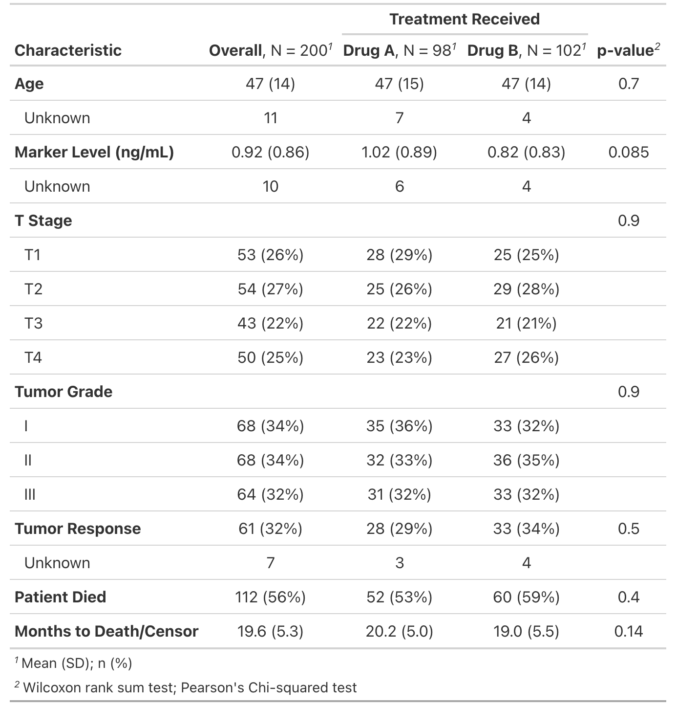
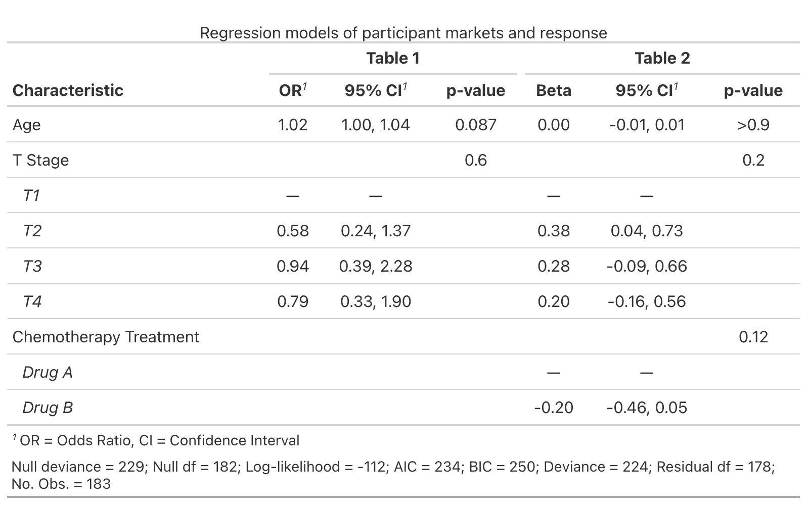
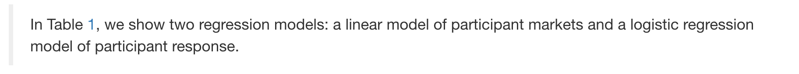

```{r setup, include=FALSE}
options(htmltools.dir.version = FALSE, tibble.max_extra_cols = 6, tibble.width = 60)
knitr::opts_chunk$set(warning = FALSE, message = FALSE, fig.align = "center", dpi = 320)
library(tidyverse)
library(gapminder)
library(here)
library(knitr)
library(broom)
library(gtsummary)
diabetes <- read_csv("diabetes.csv")
# create table_data
table_data <- diabetes %>%
  mutate(
    # create diabetic category based on A1c
    diabetic = case_when(
      glyhb >= 6.5 ~ "Diabetic", glyhb < 6.5 ~ "Healthy",
      NA ~ NA_character_
    ),
    # calculate bmi
    bmi = (weight / height^2) * 703
  )
model_data <- diabetes %>% mutate(bmi = (weight / height^2) * 703)
```

## *Working with descriptive tables*

--

```{r descriptives}
descriptives <- diabetes %>% #<<
  filter(!is.na(glyhb)) %>%
  mutate(
    diabetic = case_when(
      glyhb >= 6.5 ~ "Diabetic", 
      glyhb < 6.5 ~ "Healthy",
      NA ~ NA_character_
    ),
    bmi = (weight / height^2) * 703
  ) %>%
  group_by(diabetic) %>% #<<
  summarise(n = n(), across(c(glyhb, bmi, age), mean, na.rm = TRUE)) #<<
```

---

## *Descriptive statistics table*

### Standard `tibble` display 

```{r view-descriptives}
descriptives
```

---

## *Descriptive statistics table*

### ~~Standard `tibble` display~~

```{r view-descriptives2}
descriptives
```

### *Useful in console, but less so for reports or presentation*

---

# Visual R Markdown tables

--

```{r vme-insert-table.png, echo=FALSE, out.width='30%'}
knitr::include_graphics("img/vme-insert-table.png")
```

---

# Visual R Markdown tables

```{r vme-table-options.png, echo=FALSE, out.width='70%'}
knitr::include_graphics("img/vme-table-options.png")
```

---

## Your turn 1

###  Using Visual R Markdown, create a markdown table that represents these data: 

### The Physicians' Health Study enrolled over 22,000 male physicians to study the effect of low-dose aspirin on myocardial infarctions (heart attacks). Of those who took aspirin, 129 had heart attacks, while 10,898 did not. Of those who took the placebo, 239 had heart attacks and 10,795 did not.

---

background-image: url(img/knitr.png)
background-position: 93% 10%
background-size: 15%


# `knitr::kable()`

<br>

### `kable()` creates formatted tables from rectangular objects (data.frames, matrices, and tibbles)

--

```{r}
kable(descriptives)
```

--

#### Formats include `pipe` ('`|`'), HTML (`html`), LaTeX (`latex`), and reStructuredText (`rst`)

---

## *`kable()`: underlying structure*

### Simple and pipe work in most output document formats

```{r kable-simple, eval=FALSE}
knitr::kable(x = descriptives, format = "simple")
diabetic      n      glyhb        bmi        age
---------  ----  ---------  ---------  --------- #<<
Diabetic     65   9.886615   30.80235   58.43077
Healthy     325   4.730400   28.38114   44.44308
```

```{r kable-pipe, eval=FALSE}
knitr::kable(x = descriptives, format = "pipe")
|diabetic |   n|    glyhb|      bmi|      age|
|:--------|---:|--------:|--------:|--------:| #<<
|Diabetic |  65| 9.886615| 30.80235| 58.43077|
|Healthy  | 325| 4.730400| 28.38114| 44.44308|
```

---

## *`kable()` options: column names*

<br>

### Supply a vector of new names with `col.names` argument

```{r , eval=FALSE}
kable(descriptives,
  col.names = c("Diabetes Status", "N", "A1c", "BMI", "Age") #<<
)
```

--

```{r , echo=FALSE}
kable(descriptives,
  col.names = c("Diabetes Status", "N", "A1c", "BMI", "Age") #<<
)
```

---

## *`kable()` options: number format*

<br>

### Use `digits` for decimal place 

<br>

```{r kable-digits, eval=FALSE}
kable(descriptives,
  digits = 1 #<<
)
```

--

```{r, echo=FALSE}
kable(descriptives, digits = 1)
```

---

## *`kable()` options: add caption*

<br>

### Add caption with `caption` argument

```{r , eval=FALSE}
kable(descriptives,
  caption = "Descriptive statistics" #<<
)
```

--

```{r kable-caption.png, echo=FALSE, out.width='90%'}
knitr::include_graphics("img/kable-caption.png")
```

---


## Your turn 2

#### Using the `tidy()` function from `broom`, turn `response_model` and `marker_model` into dataframes.

#### Bind the two resulting model dataframes on top of each other to create one dataframe

#### Turn the resulting dataframe into a table using `kable()`

#### Knit

```{r}
response_model <- glm(response ~ age + stage, data = trial, 
                      family = binomial)
marker_model <- lm(marker ~ trt + stage + age, data = trial)
```

---


### Your turn 2

```{r}
models <- bind_rows(tidy(response_model), tidy(marker_model))
kable(models)
```

---
background-image: url(img/gtsummary.png)
background-position: 93% 10%
background-size: 20%

# *gtsummary*

<br><br>

--

## Create publication-ready analytic and summary tables


--

## Good support for wide variety of output formats

--

## Built on the larger [`gt` package](https://gt.rstudio.com/index.html) 

---

# `tbl_cross()`

### Creates a **cross-tabulation** of two categorical variables

--

```{r, eval=FALSE}
library(gtsummary)
tbl_cross(
  row = x,
  col = y
)
```

---

# `tbl_cross()`

```{r}
table_data <- diabetes %>% #<<
  mutate(
    # create diabetic category based on A1c and calculate bmi
    diabetic = case_when( #<<
      glyhb >= 6.5 ~ "Diabetic", 
      glyhb < 6.5 ~ "Healthy",
      NA ~ NA_character_
    ), bmi = (weight / height^2) * 703
  ) %>%
  select(diabetic, age, gender, bmi) #<<
```

---

# `tbl_cross()`

```{r, eval = FALSE}
tbl_cross(table_data, row = diabetic, col = gender) #<<
```

---

# `tbl_cross()`

```{r}
tbl_cross(table_data, row = diabetic, col = gender)
```

---

class: middle

# `tbl_cross()` output

```{r tbl_cross.png, echo=FALSE, out.weight='100%'}
knitr::include_graphics("img/tbl_cross.png")
```

---

## *`tbl_cross()`: variable names*

### `gtsummary` uses the [`labelled` package](https://larmarange.github.io/labelled/index.html) to create labels

--

```{r label-vars, eval = FALSE}
library(labelled) 
var_label(table_data$diabetic) <- "Diabetes Status" #<<
var_label(table_data$diabetic)
```

---

## *`tbl_cross()`: variable names*

### `gtsummary` uses the [`labelled` package](https://larmarange.github.io/labelled/index.html) to create labels

```{r label-vars2, highlight.output=1}
library(labelled) 
var_label(table_data$diabetic) <- "Diabetes Status"
var_label(table_data$diabetic) #<<
```

---


## *`tbl_cross()`: variable names*

### Set multiple variable lables with `list()`
```{r tbl_cross-var_label-mult}
var_label(table_data) <- list( 
  gender = "Gender",
  diabetic = "Diabetes Status"
) 
```

---

## *`tbl_cross()`: variable names*

```{r}
tbl_cross(table_data, diabetic, gender)
```


---


## Your turn 3

###  Create a contingency table of `trial` (a dataset from gtsummary) using `tbl_cross()`: set `trt` to the rows and `response` to the columns.

###  Add a p-value with `add_p()`

###  Knit


---


# Your turn 3


```{r}
trial %>%
  tbl_cross(row = trt, col = response) %>%
  add_p()
```


---


# `tbl_summary()`

<br>

### Calculates descriptive statistics 

### Can split calculations by groups (i.e. categorical or dichotomous variables)

### Multiple arguments for table options

<br>

```{r , eval=FALSE}
tbl_summary(data = , by = , statistic = , ...)
```


---


# `tbl_summary()`: basic use

```{r baisc-tbl_summary, eval=FALSE, message=FALSE, warning=FALSE}
table_data %>% tbl_summary()
```


```{r tbl_summary-basic.png, out.width="20%", echo=FALSE}
knitr::include_graphics("img/tbl_summary-basic.png")
```


---


# `tbl_summary()`: basic use

.pull-left[

### Automatically adds header: 

### - *Characteristic* = variable

### - *N* = `nrow(diabetes)`

]

.pull-right[

```{r tbl_summary-header.png, out.width="55%", fig.align='center', echo=FALSE}
knitr::include_graphics("img/tbl_summary-header.png")
```

]

---


# `tbl_summary()`: basic use

.pull-left[

<br><br>

### Missing = *Unknown* 

]

.pull-right[

```{r tbl_summary-missing.png, out.width="55%", echo=FALSE}
knitr::include_graphics("img/tbl_summary-missing.png")
```

]

---


# `tbl_summary()`: basic use

.pull-left[

### Source note lists summary statistics:

### - *n(%)* = `!is.na(var)`/403

### - *Median* = `median(var)` 

### - *IQR* = `IQR(var)`

]

.pull-right[

```{r tbl_summary-footnote.png, out.width="55%", echo=FALSE}
knitr::include_graphics("img/tbl_summary-footnote.png")
```

]


---


## *`tbl_summary()`: variable levels*

.pull-left[

#### Variable levels are indented 

```{r table-diabetic}
table(table_data$diabetic)
table(table_data$gender)
```

]

.pull-right[

```{r tbl_summary-levels.png, out.width="60%", echo=FALSE}
knitr::include_graphics("img/tbl_summary-levels.png")
```

]


---


## *`tbl_summary()`: split by groups*

### Split the summary table by a grouping variable

```{r tbl_summary-by, eval=FALSE}
table_data %>%
  select(diabetic, age, gender, bmi) %>%
  tbl_summary(by = diabetic) #<<
```

```{r tbl_summary-by.png, out.width="40%", echo=FALSE}
knitr::include_graphics("img/tbl_summary-by.png")
```

---


## *`tbl_summary()`: digits*

#### Change number formats with `digits`

```{r digits, eval=FALSE}
table_data %>%
  select(diabetic, age, gender, bmi) %>%
  tbl_summary(
    by = diabetic,
    digits = all_continuous() ~ 1 #<<
  )
```

```{r tbl_summary-digits.png, out.width="43%", echo=FALSE}
knitr::include_graphics("img/tbl_summary-digits.png")
```


---


## *`tbl_summary()`: missing_text*

#### Rename missing value label with `missing_text`

```{r missing_text, eval=FALSE}
table_data %>%
  select(diabetic, age, gender, bmi) %>%
  tbl_summary(
    by = diabetic,
    missing_text = "(Missing)" #<<
  )
```


```{r tbl_summary-missing_text.png, out.width="43%", echo=FALSE}
knitr::include_graphics("img/tbl_summary-missing_text.png")
```

---


## *`tbl_summary()`: tests & p-values*

#### Add tests and p-values (with one function!)

```{r add_p, eval=FALSE}
table_data %>%
  select(diabetic, age, gender, bmi) %>%
  tbl_summary(by = diabetic) %>%
  add_p() #<<
```

```{r tbl_summary-add_p.png, out.width="45%", echo=FALSE}
knitr::include_graphics("img/tbl_summary-add_p.png")
```

---


## *`tbl_summary()`: statistic*

<br>

#### Supply `statistic` arguments in `list()`

#### Access variables by type (`all_continuous()`, `all_categorical()`, `all_dichotomous()`, etc.

#### Access statistic with curly brackets (i.e. `{mean}`, `{sd}`, etc.)

#### Separate with `~`

<br>

```{r , eval=FALSE}
statistic = list(all_continuous() ~ "{mean} ({sd})"),
                 all_categorical() ~ "{n} ({p}%)")
```

---


# Your turn 4

#### Create a summary table of `trial` by the `trt` variable.

#### Modify the label for `grade` to say "Tumor Grade"

#### Add an overall column and a p-value

#### Modify the table to use Mean (SD) and n (%) via the `statistic` argument: `list(all_continuous() ~ "{mean} ({sd})", all_categorical() ~ "{n} ({p}%)")`

#### Bold the labels

####  Modify the header with `modify_spanning_header(c("stat_1", "stat_2") ~ "**Treatment Received**")`

---


# Your Turn 4

```{r table-one, eval=FALSE}
trial %>%
  tbl_summary(
    by = trt,
    label = grade ~ "Tumor Grade",
    statistic = list(
      all_continuous() ~ "{mean} ({sd})",
      all_categorical() ~ "{n} ({p}%)"
    )
  ) %>%
  bold_labels() %>%
  modify_spanning_header(
    c("stat_1", "stat_2") ~ "**Treatment Received**"
  ) %>%
  add_overall() %>%
  add_p()
```

---


## _Your Turn 4_

```{r your-turn-4.png, echo=FALSE, out.width='60%'}

```


---


## Other *`tbl_summary()` arguments*

### See the other options with `??tbl_summary()`

```{r tbl_summary-args,echo=FALSE}
tibble::tribble(
  ~Argument, ~Description,
  "`label=`", "specify the variable labels printed in table",
  "`type=`", "specify the variable type (e.g. continuous, categorical, etc.)",
  "`statistic=`", "change the summary statistics presented",
  "`digits=`", "number of digits the summary statistics will be rounded to",
  "`missing=`", "whether to display a row with the number of missing observations",
  "`missing_text=`", "text label for the missing number row",
  "`sort=`", "change the sorting of categorical levels by frequency",
  "`percent=`", "print column, row, or cell percentages",
  "`include=`", "list of variables to include in summary table"
) %>%
  gt::gt() %>%
  gt::fmt_markdown(columns = Argument)
```

---


# *`tbl_regression()`*

### Create `mod` with `lm()` 

### <i>`mod` = association of BMI and A1c adjusted for age</i>

```{r mod-tbl_regression}
model_data <- diabetes %>% mutate(bmi = (weight / height^2) * 703)
mod <- lm(glyhb ~ bmi + age, data = model_data)
tbl_regression(mod)
```


---


# *`tbl_regression()`: variable labels*

### Add labels just like `tbl_summary()`

```{r tbl_regression-var_label}
var_label(model_data) <- list(bmi = "BMI", glyhb = "A1c", 
                              age = "Age")
mod <- lm(glyhb ~ bmi + age, data = model_data)
tbl_regression(mod)
```

---


# *`tbl_regression()`: other options*

```{r tbl_regression-options, echo=FALSE}
tibble::tribble(
  ~Argument, ~Description,
  "`label=`", "modify variable labels in table",
  "`exponentiate=`", "exponentiate model coefficients",
  "`include=`", "names of variables to include in output. Default is all variables",
  "`show_single_row=`", "By default, categorical variables are printed on multiple rows. If a variable is dichotomous and you wish to print the regression coefficient on a single row, include the variable name(s) here.",
  "`conf.level=`", "confidence level of confidence interval",
  "`intercept=`", "indicates whether to include the intercept",
  "`estimate_fun=`", "function to round and format coefficient estimates",
  "`pvalue_fun=`", "function to round and format p-values",
  "`tidy_fun=`", "function to specify/customize tidier function"
) %>%
  gt::gt() %>%
  gt::fmt_markdown(columns = c(Argument))
```


---


# *`tbl_regression()`: broom::glance()*

### Add the model output from `broom::glance()` as a source note with `add_glance_source_note()`

```{r add_glance_source_note}
tbl_regression(mod) %>% add_glance_source_note()
```

---


# *`tbl_regression()`: other add options*

<br><br>

```{r other-add-options, echo=FALSE}
tibble::tribble(
  ~Function, ~Description,
  "`add_global_p()`", "adds the global p-value for a categorical variables",
  "`add_glance_source_note()`", "adds statistics from `broom::glance()` as source note",
  "`add_vif()`", "adds column of the variance inflation factors (VIF)",
  "`add_q()`", "add a column of q values to control for multiple comparisons"
) %>%
  gt::gt() %>%
  gt::fmt_markdown(columns = c(Function))
```


---


# *`tbl_regression()`: format options*

### Format table contents 

```{r tbl_regression-bold}
tbl_regression(mod) %>%
  add_glance_source_note() %>%
  bold_p() %>%
  bold_labels()
```

---


# *`tbl_regression()`: other format options*

<br><br>

```{r , echo=FALSE}
tibble::tribble(
  ~Function, ~Description,
  "`bold_labels()`", "bold variable labels",
  "`bold_levels()`", "bold variable levels",
  "`italicize_labels()`", "italicize variable labels",
  "`italicize_levels()`", "italicize variable levels",
  "`bold_p()`", "bold significant p-values"
) %>%
  gt::gt() %>%
  gt::fmt_markdown(columns = c(Function))
```


---


## *`tbl_regression()`: modify caption*


### Customize the table title with `modify_caption()`

```{r modify_caption}
tbl_regression(mod) %>%
  add_glance_source_note() %>%
  bold_p() %>%
  bold_labels() %>%
  modify_caption("**Association of BMI and A1c adjusted for age**")
```

---


# *`tbl_regression()`: other modify options*

<br>

```{r other-modify-options, echo=FALSE}
tibble::tribble(
  ~Function, ~Description,
  "`modify_header()`", "update column headers",
  "`modify_footnote()`", "update column footnote",
  "`modify_spanning_header()`", "update spanning headers",
  "`modify_caption()`", "update table caption/title"
) %>%
  gt::gt() %>%
  gt::fmt_markdown(columns = c(Function))
```


---


# Your turn 5

### Create a regression table for `response model`; exponentiate the output with `exponentiate = TRUE`
### Add a global P-value
### Add the model statistics via `add_glance_source_note()`
### Italicize the variable levels
### Merge the table you just made with `marker_table` using `tbl_merge()`

---


# Your turn 5

```{r rebuild-models, echo=FALSE, message=FALSE, warning=FALSE}
response_model <- glm(response ~ age + stage, data = trial, family = binomial)
marker_model <- lm(marker ~ trt + stage + age, data = trial)
```

```{r your-turn-5-no-run, eval=FALSE}
response_table <- response_model %>%
  tbl_regression(
    exponentiate = TRUE
  ) %>%
  add_global_p() %>%
  add_glance_source_note() %>%
  italicize_levels()

marker_table <- marker_model %>%
  tbl_regression() %>%
  add_global_p()

both_tables <- list(response_table, marker_table)
tbl_merge(both_tables)
```


---


# Your turn 5

```{r your-turn-5, echo=FALSE}
response_table <- response_model %>%
  tbl_regression(
    exponentiate = TRUE
  ) %>%
  add_global_p() %>%
  add_glance_source_note() %>%
  italicize_levels()

marker_table <- marker_model %>%
  tbl_regression() %>%
  add_global_p()

both_tables <- list(response_table, marker_table)
tbl_merge(both_tables)
```


---


## Cross-referencing tables

### A bookdown output format 
#### - YAML set to `bookdown::html_document2`  
### A table caption 
#### - `caption = "table title"`, `modify_caption()`, etc.
### A named code chunk  
#### - `{r chunk-name}`  

### Reference with **`\@ref(tab:chunk-name)`**

---


## _Your Turn 6_

### Modify the YAML header to use `bookdown::html_document2` as the output

### Add a caption to the merged table above using `modify_caption()`

### Reference that table below using this format: `\@ref(tab:name-of-chunk)`

#### <i>In Table `_______`, we show two regression models: a linear model of participant markets and a logistic regression model of participant response.</i>


---


# Your turn 6

```{r your-turn-code, eval=FALSE}
tbl_merge(both_tables) %>%
  modify_caption(
    "Regression models of participant markets and response"
  )
```

```{r your-turn-6.png, out.width="70%", echo=FALSE}

```

---


# Your turn 6

```{r your-turn-6.png-2, out.width="70%", echo=FALSE}

```

--

```{r your-turn-6-ref.png, out.width="80%", echo=FALSE}

```

---


# `gtsummary`: Output formats

<br>

```{r supported_formats.png, out.width="70%", echo=FALSE}
knitr::include_graphics("img/supported_formats.png")
```

---


# Also check out the [`gt` package](https://gt.rstudio.com/)!

### *<i>"construct a wide variety of useful tables with a cohesive set of table parts"*</i>

```{r gt_parts_of_a_table.png, out.width="70%", echo=FALSE}
knitr::include_graphics("img/gt_parts_of_a_table.png")
```

---
class: inverse, center

# Resources
## [R Markdown Cookbook: Tables](https://bookdown.org/yihui/rmarkdown-cookbook/tables.html): A series of recipes using `kable()` and friends 
## [gtsummary Website](http://www.danieldsjoberg.com/gtsummary): Many vignettes to learn more about gtsummary
## [gt Website](https://gt.rstudio.com/): Vignettes and a short course on learning gt
