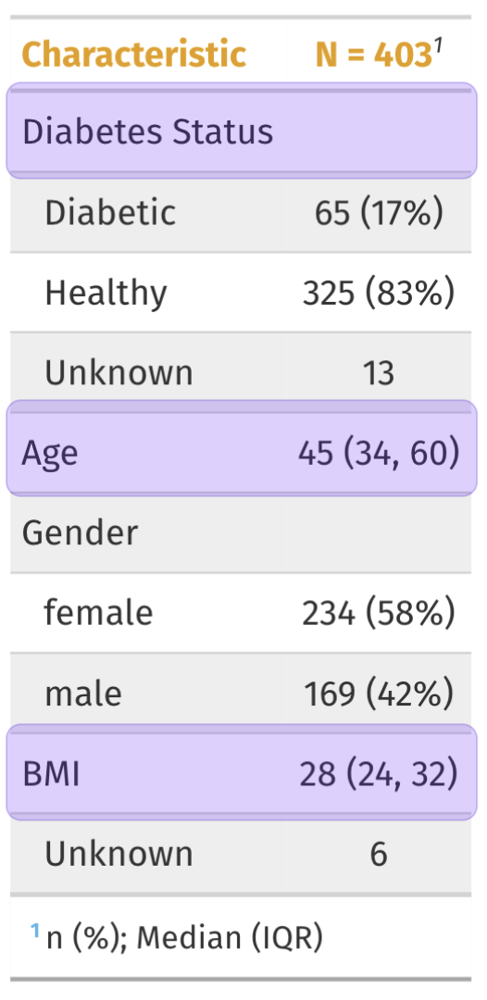

```{r setup, include=FALSE}
options(htmltools.dir.version = FALSE, tibble.max_extra_cols = 6, tibble.width = 60)
knitr::opts_chunk$set(warning = FALSE, message = FALSE, fig.align = "center", dpi = 320)
library(tidyverse)
library(gapminder)
library(here)
diabetes <- read_csv("diabetes.csv")
# create d2
d2 <- diabetes %>% 
  mutate(
    # create diabetic category based on A1c
    diabetic = case_when(
      glyhb >= 6.5 ~ "Diabetic", glyhb < 6.5 ~ "Healthy", 
      NA ~ NA_character_), 
    # calculate bmi
    bmi = (weight / height^2) * 703)
```

```{r xaringan-inf_mr, echo=FALSE, eval=FALSE, include=FALSE, results='hide'}
# i just drop this in so I can develop a little faster :) 
xaringan::inf_mr() # for instant knitting and reviewing
```


background-image: url(img/rmarkdown.png)
background-position: 93% 10%
background-size: 8%

## *RMarkdown* (refresher):

<br><br><br>

### Authoring framework: code and text in same document
### Reproducible: re-run your analysis
### Flexible: Output to different formats easily

---
background-image: url(img/rmarkdown.png)
background-position: 93% 10%
background-size: 8%
class: left, top

# Visual RMarkdown 

## Edit RMarkdown files using either source or _visual mode_

.pull-left[

### - Click on visual icon

]

.pull-right[

```{r visual-icon, out.width="30%", fig.align='left', echo=FALSE}
knitr::include_graphics("img/visual-icon.png")
```

]

<br>

### - Or keyboard shortcut `Cmd/Ctrl+Shift+F4`

---
background-image: url(img/rmarkdown.png)
background-position: 93% 10%
background-size: 8%
class: left, top

# *When to use tables/graphs?*

--

.pull-left[

### - Graphs: _numerical information in visual display_

```{r , out.width="70%", echo=FALSE}
knitr::include_graphics("img/ggplot2.png")
```

]

--

.pull-right[
### - Tables: _make it easy to look up values_

```{r table, out.width="60%", echo=FALSE}
knitr::include_graphics("img/table.png")
```

]


---
background-image: url(img/rmarkdown.png)
background-position: 93% 10%
background-size: 8%
class: left, top

# The `diabetes` data 

<br>

The `diabetes` data were collected as part of a study to estimate the prevalence of obesity, diabetes, and other cardiovascular risk factors in central Virginia for African-Americans.

```{r diabetes, message=FALSE, warning=FALSE}
head(diabetes)
```

---
background-image: url(img/knitr.png)
background-position: 93% 10%
background-size: 8%

## *Descriptive statistics table*

### Create a table with descriptive statistics 

```{r descriptives}
descriptives <- diabetes %>% 
  # remove missing 
  filter(!is.na(glyhb)) %>% 
  mutate(
    # create diabetic category based on A1c
    diabetic = case_when(
      glyhb >= 6.5 ~ "Diabetic", glyhb < 6.5 ~ "Healthy", 
      NA ~ NA_character_), 
    # calculate bmi
    bmi = (weight / height^2) * 703) %>% 
  # group by new variable 
  group_by(diabetic) %>% 
  # get average A1c, BMI, and age 
  summarise(n = n(), across(c(glyhb, bmi, age), mean, na.rm = TRUE))
```

#### See [dplyr slides](https://master-r-epi.netlify.app/02-dplyr_5verbs/dplyr_5verbs.html#1) 

---
background-image: url(img/knitr.png)
background-position: 93% 10%
background-size: 8%

# Descriptive statistics table

### View `descriptives` 

```{r view-descriptives}
descriptives
```

### - Standard `tibble` display 

### - Useful in console, but not for reports or presentation

---
background-image: url(img/knitr.png)
background-position: 93% 10%
background-size: 8%

# `knitr::kable()`

<br>

### - the `kable()` function creates formatted tables from rectangular objects (data.frames, matrices, and tibbles)

### - Formats include `pipe` ('`|`'), HTML (`html`), LaTeX (`latex`), and reStructuredText (`rst`)


---
background-image: url(img/knitr.png)
background-position: 93% 10%
background-size: 8%

# `knitr::kable("simple")`

### Simple format 

```{r , eval=FALSE}
knitr::kable(x = descriptives, format = "simple")
diabetic      n      glyhb        bmi        age 
---------  ----  ---------  ---------  --------- #<<
Diabetic     65   9.886615   30.80235   58.43077
Healthy     325   4.730400   28.38114   44.44308
```

### - Introduces header (`---`) 

### - First column is left-aligned

### - Following columns are right-aligned


---
background-image: url(img/knitr.png)
background-position: 93% 10%
background-size: 8%

# `knitr::kable("pipe")`

### pipe format 

```{r , eval=FALSE}
knitr::kable(x = descriptives, format = "pipe")
|diabetic |   n|    glyhb|      bmi|      age|
|:--------|---:|--------:|--------:|--------:| #<<
|Diabetic |  65| 9.886615| 30.80235| 58.43077|
|Healthy  | 325| 4.730400| 28.38114| 44.44308|
```

### - Similar to `"simple"` (different header)

### - Both `"simple"` and `"pipe"` work in most output document formats

---
background-image: url(img/knitr.png)
background-position: 93% 10%
background-size: 8%

## *`knitr::kable()`: column names*

<br>

### Change column names with `col.names`

<br>

```{r , eval=FALSE}
kable(x = descriptives, format = "pipe", 
      col.names = c("Diabetes Status", "N", "A1c", "BMI", "Age"))

|Diabetes Status |   N|      A1c|      BMI|      Age| #<<
|:---------------|---:|--------:|--------:|--------:|
|Diabetic        |  65| 9.886615| 30.80235| 58.43077|
|Healthy         | 325| 4.730400| 28.38114| 44.44308|
```


---
background-image: url(img/knitr.png)
background-position: 93% 10%
background-size: 8%

## *`knitr::kable()`: add caption*

<br>

### Add caption with `caption`

<br>

```{r , eval=FALSE}
kable(x = descriptives, format = "pipe", 
      caption = c("Diabetes status count; average A1c, BMI & Age "))

Table: Diabetes status count; average A1c, BMI & Age #<<

|diabetic |   n|    glyhb|      bmi|      age|
|:--------|---:|--------:|--------:|--------:|
|Diabetic |  65| 9.886615| 30.80235| 58.43077|
|Healthy  | 325| 4.730400| 28.38114| 44.44308|
```


---
background-image: url(img/knitr.png)
background-position: 93% 10%
background-size: 8%

## *`knitr::kable()`: number format*

<br>

### Use `digits` for decimal place 

<br>

```{r digits, eval=FALSE}
kable(x = descriptives, format = "pipe", digits =  1)

|diabetic |   n| glyhb|  bmi|  age| 
|:--------|---:|-----:|----:|----:|
|Diabetic |  65|   9.9| 30.8| 58.4| #<<
|Healthy  | 325|   4.7| 28.4| 44.4| #<<
```


---
background-image: url(img/knitr.png)
background-position: 93% 10%
background-size: 8%

# Other `knitr::kable()` formats

### reStructuredText format

```{r , eval=FALSE}
knitr::kable(x = descriptives, format = "rst")
========  ===  ========  ========  ======== #<<
diabetic    n     glyhb       bmi       age
========  ===  ========  ========  ======== #<<
Diabetic   65  9.886615  30.80235  58.43077
Healthy   325  4.730400  28.38114  44.44308
========  ===  ========  ========  ======== #<<
```

### - `"rst"` is not as portable as `"simple"` or `"pipe"`  

### - Read more about `html` and `latex` formats  [here](https://bookdown.org/yihui/rmarkdown-cookbook/kable.html)


---
background-image: url(img/gtsummary.png)
background-position: 93% 10%
background-size: 20%

# *gtsummary*

<br><br>

--

## - Built on the larger [`gt` package](https://gt.rstudio.com/index.html) 

--

## - Designed to "*<i>create publication-ready analytical and summary tables</i>*" 

--

## - `tbl_summary()` function contains lots of argument options!

---
background-image: url(img/gtsummary.png)
background-position: 95% 8%
background-size: 12%

# `tbl_summary()`: basic use

```{r , eval=FALSE, message=FALSE, warning=FALSE}
library(gtsummary)
d2 <- diabetes %>% select(diabetic, age, gender, bmi) 
d2 %>% tbl_summary()
```


```{r tbl_summary-basic.png, out.width="20%", echo=FALSE}
knitr::include_graphics("img/tbl_summary-basic.png")
```


---
background-image: url(img/gtsummary.png)
background-position: 95% 8%
background-size: 12%

# `tbl_summary()`: basic use

.pull-left[

### Adds header 

### *Characteristic* = variable

### *N* = `nrow(diabetes)`

]

.pull-right[

```{r tbl_summary-header.png, out.width="55%", fig.align='center', echo=FALSE}
knitr::include_graphics("img/tbl_summary-header.png")
```

]

---
background-image: url(img/gtsummary.png)
background-position: 95% 8%
background-size: 12%

# `tbl_summary()`: basic use

.pull-left[

<br><br>

### Missing = *UNKNOWN* 

]

.pull-right[

```{r tbl_summary-missing.png, out.width="55%", echo=FALSE}
knitr::include_graphics("img/tbl_summary-missing.png")
```

]

---
background-image: url(img/gtsummary.png)
background-position: 95% 8%
background-size: 12%

# `tbl_summary()`: basic use

.pull-left[

### Footnote = summary statistics

### Cells contain:

### - *n(%)* = `!is.na(var)`/403

### - *Median* = `median(var)` 

### - *IQR* = `IQR(var)`

]

.pull-right[

```{r tbl_summary-footnote.png, out.width="55%", echo=FALSE}
knitr::include_graphics("img/tbl_summary-footnote.png")
```

]

---
background-image: url(img/gtsummary.png)
background-position: 95% 8%
background-size: 12%
class: left, top

## *`tbl_summary()`: variable names*

### - `gtsummary` uses the [`labelled` package](https://larmarange.github.io/labelled/index.html)

### - Variable names use the `"label"` attribute

```{r label-vars}
library(labelled) # for var_label()
var_label(d2$diabetic) <- "Diabetes Status"
var_label(d2$diabetic)
```

#### Check with `attr()`

```{r}
attr(d2$diabetic, which = "label")
```


---
background-image: url(img/gtsummary.png)
background-position: 95% 6%
background-size: 12%
class: left, top

## *`tbl_summary()`: variable names*

```{r , include=FALSE}
library(gtsummary)
```

.pull-left[

### Set lables and create table

```{r , eval=FALSE}
var_label(d2$age) <- "Age"
var_label(d2$gender) <- "Gender"
var_label(d2$bmi) <- "BMI"
d2 %>% 
  select(diabetic, age, 
         gender, bmi) %>% 
  tbl_summary()
```

]

--

.pull-right[


```{r tbl_summary-names.png, out.width="55%", echo=FALSE}


```

]

---
background-image: url(img/gtsummary.png)
background-position: 95% 6%
background-size: 12%
class: left, top

## *`tbl_summary()`: variable levels*

.pull-left[

### Variable levels are indented 

```{r table-diabetic}
table(d2$diabetic)
table(d2$gender)
```


]

.pull-right[

```{r tbl_summary-levels.png, out.width="60%", echo=FALSE}
knitr::include_graphics("img/tbl_summary-levels.png")
```

]


---
background-image: url(img/gtsummary.png)
background-position: 95% 6%
background-size: 12%
class: left, top

## *`tbl_summary()`: split by groups*

### Split the summary table by a grouping variable

```{r, eval=FALSE}
d2 %>% 
    select(diabetic, age, gender, bmi) %>% 
    tbl_summary(by = diabetic) #<<
```

```{r tbl_summary-by.png, out.width="40%", echo=FALSE}
knitr::include_graphics("img/tbl_summary-by.png")
```

---
background-image: url(img/gtsummary.png)
background-position: 95% 6%
background-size: 12%
class: left, top

## *`tbl_summary()`: tests & p-values*

### Add tests and p-values with `add_p()`

```{r , eval=FALSE}
d2 %>% 
    select(diabetic, age, gender, bmi) %>% 
    tbl_summary(by = diabetic) %>% 
    add_p() #<<
```

```{r tbl_summary-add_p.png, out.width="45%", echo=FALSE}
knitr::include_graphics("img/tbl_summary-add_p.png")
```

---
background-image: url(img/gtsummary.png)
background-position: 95% 6%
background-size: 12%
class: left, top

## *`tbl_summary()`: statistics*

### Change summary statistics with `statistic =`

```{r , eval=FALSE}
d2 %>% 
    select(diabetic, age, gender, bmi) %>% 
    tbl_summary(
        by = diabetic,
        statistic = all_continuous() ~ "{mean} ({sd})") #<<
```


```{r tbl_summary-statistics.png, out.width="38%", echo=FALSE}
knitr::include_graphics("img/tbl_summary-statistics.png")
```

---
background-image: url(img/gtsummary.png)
background-position: 95% 6%
background-size: 12%
class: left, top

## *`tbl_summary()`: digits*

### Change number formats with `digits =`

```{r , eval=FALSE}
d2 %>% 
    select(diabetic, age, gender, bmi) %>% 
    tbl_summary(by = diabetic,
    digits = all_continuous() ~ 1) #<<
```

```{r tbl_summary-digits.png, out.width="40%", echo=FALSE}
knitr::include_graphics("img/tbl_summary-digits.png")
```


---
background-image: url(img/gtsummary.png)
background-position: 95% 6%
background-size: 12%
class: left, top

## *`tbl_summary()`: missing_text*

### Rename missing values with `missing_text`

```{r , eval=FALSE}
d2 %>% 
    select(diabetic, age, gender, bmi) %>% 
    tbl_summary(by = diabetic,
    missing_text = "(Missing)")
```


```{r tbl_summary-missing_text.png, out.width="40%", echo=FALSE}
knitr::include_graphics("img/tbl_summary-missing_text.png")
```


---
background-image: url(img/gtsummary.png)
background-position: 95% 6%
background-size: 12%
class: left, top

## Other *`tbl_summary()` options*

### See the other options with `??tbl_summary()`

```{r ,echo=FALSE}
tibble::tribble(
  ~Argument,       ~Description,
  "`label=`",       "specify the variable labels printed in table",
  "`type=`",        "specify the variable type (e.g. continuous, categorical, etc.)",
  "`statistic=`",   "change the summary statistics presented",
  "`digits=`",      "number of digits the summary statistics will be rounded to",
  "`missing=`",     "whether to display a row with the number of missing observations",
  "`missing_text=`","text label for the missing number row",
  "`sort=`",        "change the sorting of categorical levels by frequency",
  "`percent=`",     "print column, row, or cell percentages",
  "`include=`",     "list of variables to include in summary table"
) %>%
  gt::gt() %>%
  gt::fmt_markdown(columns = Argument) 
```

---
background-image: url(img/gtsummary.png)
background-position: 95% 6%
background-size: 12%
class: left, top

## *`tbl_regression()`*


---
background-image: url(img/gtsummary.png)
background-position: 95% 8%
background-size: 12%

# Output formats

<br>

```{r, out.width="70%", echo=FALSE}
knitr::include_graphics("img/supported_formats.png")
```


---
class: inverse, center

# Resources
## [R Markdown Cookbook: Tables](https://bookdown.org/yihui/rmarkdown-cookbook/tables.html): A series of recipes using `kable()` and friends 
## [gtsummary Website](http://www.danieldsjoberg.com/gtsummary): Many vignettes to learn more about gtsummary
## [gt Website](https://gt.rstudio.com/): Vignettes and a short course on learning gt
