```{r setup, include=FALSE}
options(htmltools.dir.version = FALSE, tibble.max_extra_cols = 6, tibble.width = 60)
knitr::opts_chunk$set(warning = FALSE, message = FALSE, fig.align = "center", dpi = 320)
library(tidyverse)
library(gapminder)
library(here)
library(knitr)
diabetes <- read_csv("diabetes.csv")
# create table_data
table_data <- diabetes %>%
  mutate(
    # create diabetic category based on A1c
    diabetic = case_when(
      glyhb >= 6.5 ~ "Diabetic", glyhb < 6.5 ~ "Healthy",
      NA ~ NA_character_
    ),
    # calculate bmi
    bmi = (weight / height^2) * 703
  )
model_data <- diabetes %>% mutate(bmi = (weight / height^2) * 703)
```

```{r xaringan-inf_mr, echo=FALSE, eval=FALSE, include=FALSE, results='hide'}
# i just drop this in so I can develop a little faster :)
# xaringan::inf_mr() # for instant knitting and reviewing
```


background-image: url(img/rmarkdown.png)
background-position: 93% 10%
background-size: 15%

## *RMarkdown* (refresher):

<br><br><br>

### Authoring framework: code and text in same document
### Reproducible: re-run your analysis
### Flexible: Output to different formats easily


---
class: left, top

## *Descriptive statistics table*

### Create a table with descriptive statistics 

```{r descriptives}
descriptives <- diabetes %>%
  # remove missing
  filter(!is.na(glyhb)) %>%
  mutate(
    # create diabetic category based on A1c
    diabetic = case_when(
      glyhb >= 6.5 ~ "Diabetic", glyhb < 6.5 ~ "Healthy",
      NA ~ NA_character_
    ),
    # calculate bmi
    bmi = (weight / height^2) * 703
  ) %>%
  # group by new variable
  group_by(diabetic) %>%
  # get average A1c, BMI, and age
  summarise(n = n(), across(c(glyhb, bmi, age), mean, na.rm = TRUE))
```


---
class: left, top

## _Descriptive statistics table_

### Standard `tibble` display 

```{r view-descriptives}
descriptives
```

### Useful in console, but not for reports or presentation

---
class: left, top

# Visual R Markdown tables

### Insert table from toolbar 

```{r vme-insert-table.png, echo=FALSE, out.width='30%'}
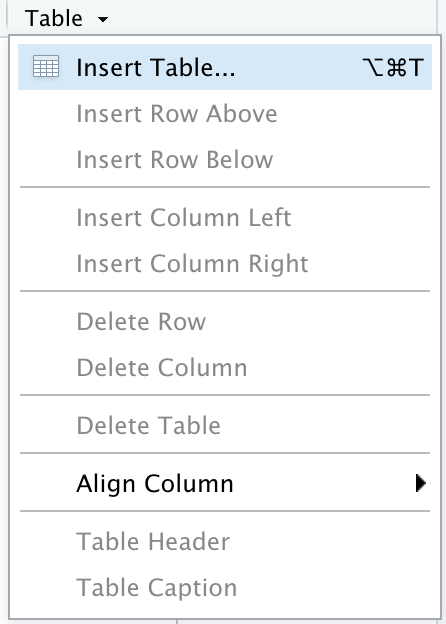
```

---
class: left, top

# Visual R Markdown tables

### Set table options

```{r vme-table-options.png, echo=FALSE, out.width='70%'}
knitr::include_graphics("img/vme-table-options.png")
```

---
class: left, top

# Your turn 1

### Create the table below using `descriptives` and the Visual R Markdown editor

```{r vme-descriptives.png, echo=FALSE, out.width='90%'}
knitr::include_graphics("img/vme-descriptives.png")
```


---
background-image: url(img/knitr.png)
background-position: 93% 10%
background-size: 15%
class: left, top

# `knitr::kable()`

<br>

### `kable()` creates formatted tables from rectangular objects (data.frames, matrices, and tibbles)

```{r}
descriptives %>% kable()
```

#### Formats include `pipe` ('`|`'), HTML (`html`), LaTeX (`latex`), and reStructuredText (`rst`)


---
class: left, top

# Your turn 2

## Use `kable()` to view the `descriptives` table

```{r , eval=FALSE}
descriptives %>% kable()
```

--

```{r , echo=FALSE}
descriptives %>% kable()
```


---
class: left, top

## *`kable()` options: column names*

<br>

### Supply a vector of new names with `col.names` argument

```{r , eval=FALSE}
kable(descriptives,
  col.names = c("Diabetes Status", "N", "A1c", "BMI", "Age")
) #<<
```

--

```{r , echo=FALSE}
kable(descriptives,
  col.names = c("Diabetes Status", "N", "A1c", "BMI", "Age")
) #<<
```

---
class: left, top

## *`kable()` options: number format*

<br>

### Use `digits` for decimal place 

<br>

```{r kable-digits, eval=FALSE}
kable(descriptives,
  digits = 1
) #<<
```

--

```{r , echo=FALSE}
kable(descriptives, digits = 1)
```


---
class: left, top

## *`kable()` options: add caption*

<br>

### Add caption with `caption` argument

```{r , eval=FALSE}
kable(descriptives,
  caption = c("Descriptive statistics")
) #<<
```

--

```{r kable-caption.png, echo=FALSE, out.width='90%'}
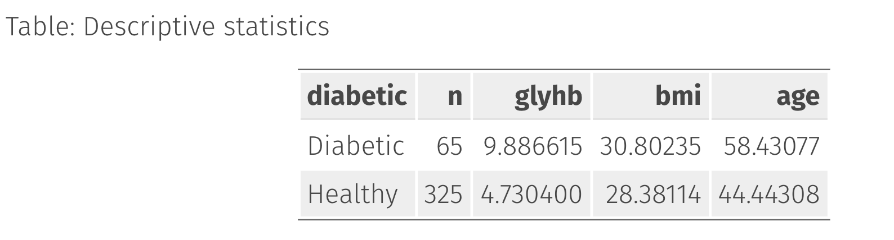
```

---
class: left, top

## *`kable()`: underlying structure*

```{r, eval=FALSE}
kable(descriptives,
  col.names = c("Diabetes Status", "N", "A1c", "BMI", "Age"),
  digits = 1, caption = c("Descriptive statistics")
)
```

```{r kable-html.png, echo=FALSE, out.width='40%'}
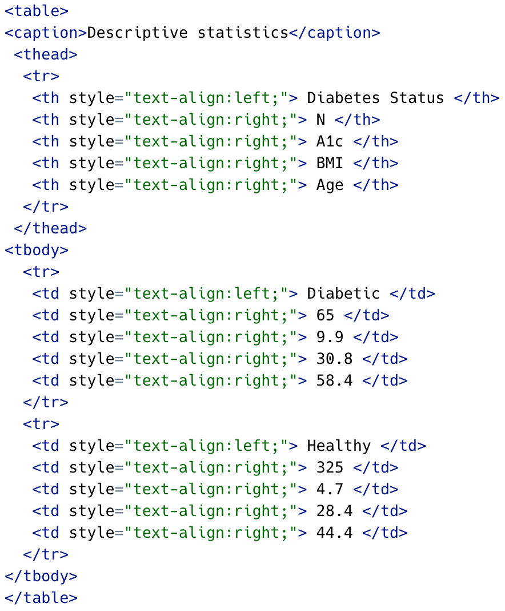
```


---
background-image: url(img/gtsummary.png)
background-position: 93% 10%
background-size: 20%

# *gtsummary*

<br><br>

--

## - Built on the larger [`gt` package](https://gt.rstudio.com/index.html) 

--

## - consistent function names with lots of options (`add_`, `modify_`, `bold_`, etc.)!

--

## - Designed to "*<i>create publication-ready analytical and summary tables</i>*"!

---
class: left, top

# `tbl_cross()`


<br>

### Creates a cross-tabulation of two categorical variables

### Specify `row` and `col` arguments

<br>

```{r, eval=FALSE}
library(gtsummary)
tbl_cross(
  row = `categorical variable`,
  col = `categorical variable`
)
```

---
class: left, top

# Your turn 3

### `table_data` is created below

```{r}
table_data <- diabetes %>%
  mutate(
    # create diabetic category based on A1c and calculate bmi
    diabetic = case_when(
      glyhb >= 6.5 ~ "Diabetic", glyhb < 6.5 ~ "Healthy",
      NA ~ NA_character_
    ), bmi = (weight / height^2) * 703
  ) %>%
  select(diabetic, age, gender, bmi)
```

### Create a cross-tabulation of `diabetic` and `gender` in `table_data`


---
class: left, top

# Your turn 3

### Create a cross-tabulation of `diabetic` and `gender` in `table_data`

--

```{r}
table_data %>% tbl_cross(row = diabetic, col = gender)
```

---
class: left, top

# `tbl_cross()` output

<br>

.pull-left[

### `col` and `row` variable names as headers 

### values as sub-headers 

### `Total` by row and column

### Missing = *Unknown* 

]

.pull-right[

```{r tbl_cross.png, echo=FALSE, out.weight='100%'}
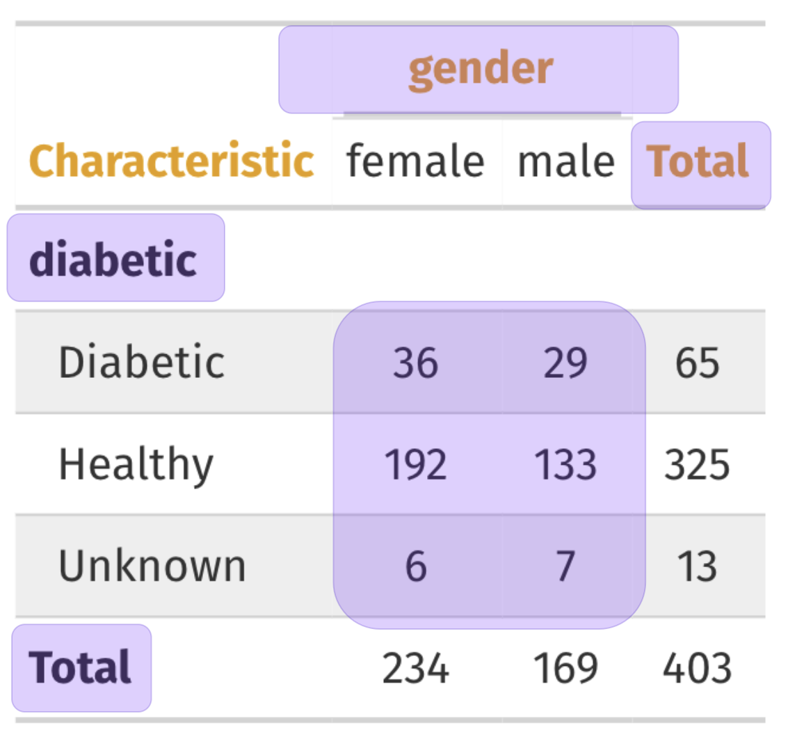
```

]

---
class: left, top

## *`tbl_cross()`: variable names*

### `gtsummary` uses the [`labelled` package](https://larmarange.github.io/labelled/index.html)

#### Variable are named using the `"label"` attribute

```{r label-vars}
library(labelled) # for var_label()
var_label(table_data$diabetic) <- "Diabetes Status"
var_label(table_data$diabetic)
```


---
class: left, top

## *`tbl_cross()`: variable names*

#### Set multiple variable lables with `list()`

```{r tbl_cross-var_label-mult}
var_label(table_data) <- list(
  gender = "Gender",
  diabetic = "Diabetes Status"
)
table_data %>% tbl_cross(row = diabetic, col = gender)
```


---
class: left, top

# `tbl_summary()`

<br>

### Calculates descriptive statistics 

### Returns 'publication ready' output

### Multiple arguments for table options

<br>

```{r , eval=FALSE}
tbl_summary(data = , by = , statistic = , ...)
```


---
class: left, top

# `tbl_summary()`: basic use

```{r baisc-tbl_summary, eval=FALSE, message=FALSE, warning=FALSE}
table_data %>% tbl_summary()
```


```{r tbl_summary-basic.png, out.width="20%", echo=FALSE}
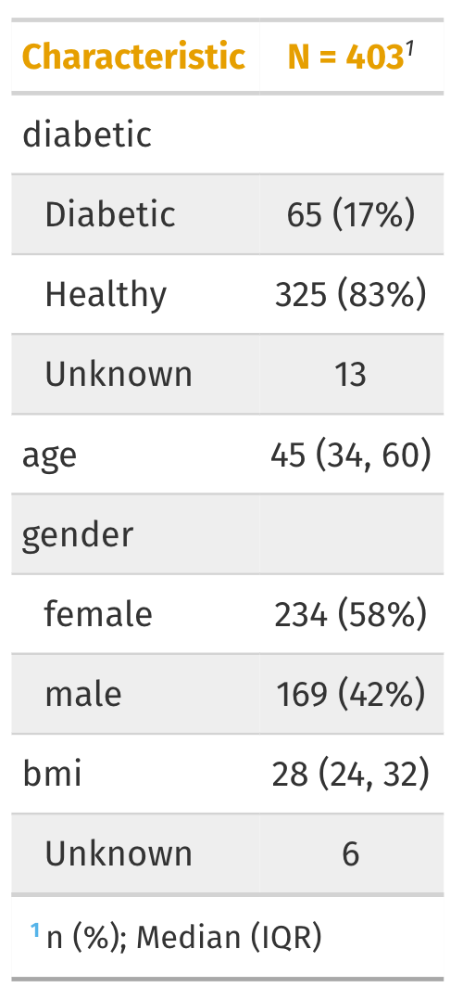
```


---
class: left, top

# `tbl_summary()`: basic use

.pull-left[

### Automatically adds header: 

### - *Characteristic* = variable

### - *N* = `nrow(diabetes)`

]

.pull-right[

```{r tbl_summary-header.png, out.width="55%", fig.align='center', echo=FALSE}
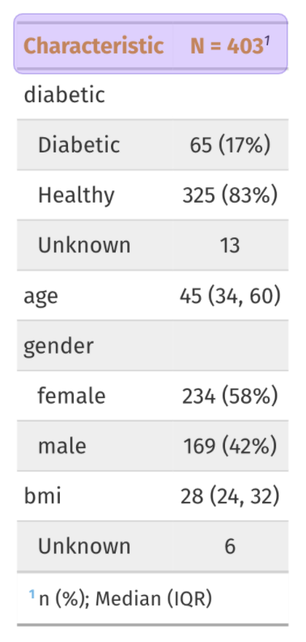
```

]

---
class: left, top

# `tbl_summary()`: basic use

.pull-left[

<br><br>

### Missing = *Unknown* 

]

.pull-right[

```{r tbl_summary-missing.png, out.width="55%", echo=FALSE}
knitr::include_graphics("img/tbl_summary-missing.png")
```

]

---
class: left, top

# `tbl_summary()`: basic use

.pull-left[

### Footnote lists summary statistics:

### - *n(%)* = `!is.na(var)`/403

### - *Median* = `median(var)` 

### - *IQR* = `IQR(var)`

]

.pull-right[

```{r tbl_summary-footnote.png, out.width="55%", echo=FALSE}
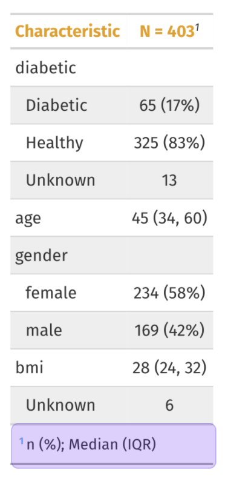
```

]


---
class: left, top

## *`tbl_summary()`: variable levels*

.pull-left[

#### Variable levels are indented 

```{r table-diabetic}
table(table_data$diabetic)
table(table_data$gender)
```

]

.pull-right[

```{r tbl_summary-levels.png, out.width="60%", echo=FALSE}
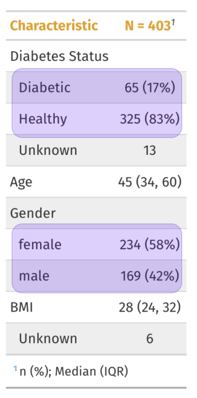
```

]


---
class: left, top

## *`tbl_summary()`: split by groups*

### Split the summary table by a grouping variable

```{r tbl_summary-by, eval=FALSE}
table_data %>%
  select(diabetic, age, gender, bmi) %>%
  tbl_summary(by = diabetic) #<<
```

```{r tbl_summary-by.png, out.width="40%", echo=FALSE}
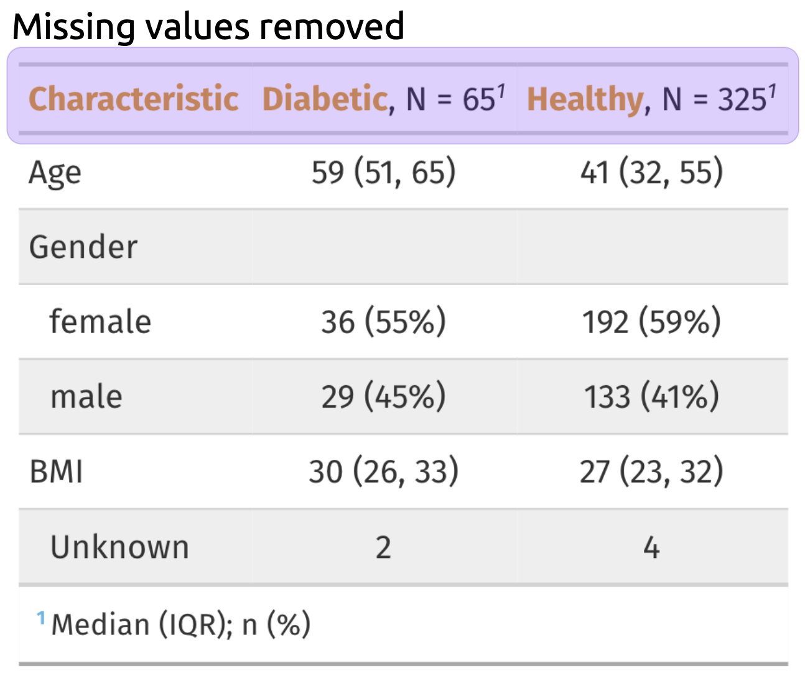
```

---
class: left, top

## *`tbl_summary()`: digits*

#### Change number formats with `digits`

```{r digits, eval=FALSE}
table_data %>%
  select(diabetic, age, gender, bmi) %>%
  tbl_summary(
    by = diabetic,
    digits = all_continuous() ~ 1 #<<
  ) 
```

```{r tbl_summary-digits.png, out.width="43%", echo=FALSE}
knitr::include_graphics("img/tbl_summary-digits.png")
```


---
class: left, top

## *`tbl_summary()`: missing_text*

#### Rename missing value label with `missing_text`

```{r missing_text, eval=FALSE}
table_data %>%
  select(diabetic, age, gender, bmi) %>%
  tbl_summary(
    by = diabetic,
    missing_text = "(Missing)" #<<
  )
```


```{r tbl_summary-missing_text.png, out.width="43%", echo=FALSE}
knitr::include_graphics("img/tbl_summary-missing_text.png")
```

---
class: left, top

## *`tbl_summary()`: tests & p-values*

### Add tests and p-values with one function!

```{r add_p, eval=FALSE}
table_data %>%
  select(diabetic, age, gender, bmi) %>%
  tbl_summary(by = diabetic) %>%
  add_p() #<<
```

```{r tbl_summary-add_p.png, out.width="45%", echo=FALSE}
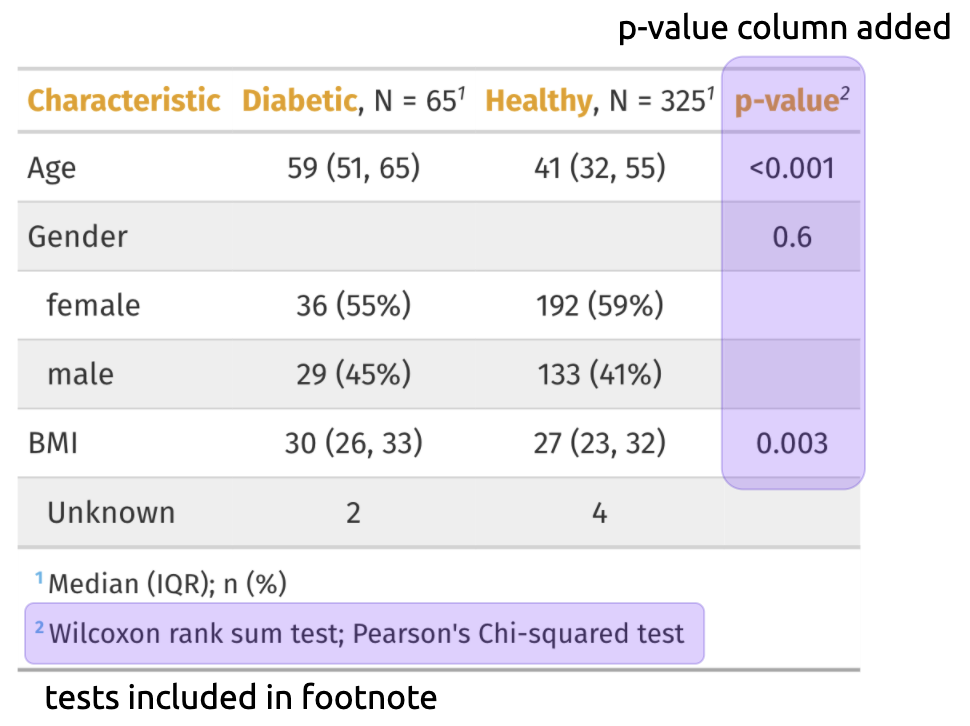
```

---
class: left, top

## *`tbl_summary()`: statistic*

<br>

#### Supply `statistic` arguments in `list()`

#### Access variables by type (`all_continuous()`, `all_categorical()`, `all_dichotomous()`, etc.

#### Access statistic with curly brackets (i.e. `{mean}`, `{sd}`, etc.)

#### Separate with `~`

<br>

```{r , eval=FALSE}
statistic = list(all_continuous() ~ "{mean} ({sd})"),
                 all_categorical() ~ "{n} ({p}%)")
```


```{r statistic, eval=FALSE, include=FALSE}
table_data %>%
  select(diabetic, age, gender, bmi) %>%
  tbl_summary(
    by = diabetic,
    statistic = list( 
      all_continuous() ~ "{mean} ({sd})" #<<
    ), 
    all_categorical() ~ "{n} ({p}%)" #<<
  ) 
```

---
class: left, top

# Your turn 4

### Create the following formats with `statistic` 

### - Mean (SD)

### - N (%)

---
class: left, top

# Your turn 4

```{r , eval=FALSE}
table_data %>%
  select(diabetic, age, gender, bmi) %>%
  tbl_summary(
    by = diabetic,
    statistic = list(
      all_continuous() ~ "{mean} ({sd})" #<<
    ), 
    all_categorical() ~ "{n} ({p}%)" #<<
  ) 
```

--

```{r , echo=FALSE}
table_data %>%
  select(diabetic, age, gender, bmi) %>%
  tbl_summary(
    by = diabetic,
    statistic = list( 
      all_continuous() ~ "{mean} ({sd})" #<<
    ), 
    all_categorical() ~ "{n} ({p}%)" #<<
  ) 
```


---
class: left, top

## Other *`tbl_summary()` arguments*

### See the other options with `??tbl_summary()`

```{r tbl_summary-args,echo=FALSE}
tibble::tribble(
  ~Argument, ~Description,
  "`label=`", "specify the variable labels printed in table",
  "`type=`", "specify the variable type (e.g. continuous, categorical, etc.)",
  "`statistic=`", "change the summary statistics presented",
  "`digits=`", "number of digits the summary statistics will be rounded to",
  "`missing=`", "whether to display a row with the number of missing observations",
  "`missing_text=`", "text label for the missing number row",
  "`sort=`", "change the sorting of categorical levels by frequency",
  "`percent=`", "print column, row, or cell percentages",
  "`include=`", "list of variables to include in summary table"
) %>%
  gt::gt() %>%
  gt::fmt_markdown(columns = Argument)
```

---
class: left, top

## *`tbl_regression()`*

### Create `mod` with `lm()` 

#### <i>`mod` = association of BMI and A1c adjusted for age</i>

```{r mod-tbl_regression}
model_data <- diabetes %>% mutate(bmi = (weight / height^2) * 703)
mod <- lm(glyhb ~ bmi + age, data = model_data)
tbl_regression(mod)
```


---
class: left, top

## *`tbl_regression()`: variable labels*

<br>

#### Add labels just like `tbl_summary()`

```{r tbl_regression-var_label}
var_label(model_data$bmi) <- "BMI"
var_label(model_data$glyhb) <- "A1c"
var_label(model_data$age) <- "Age"
mod <- lm(glyhb ~ bmi + age, data = model_data)
tbl_regression(mod)
```


---
class: left, top

## *`tbl_regression()`: options*

#### Other regression table options

```{r tbl_regression-options, echo=FALSE}
tibble::tribble(
  ~Argument, ~Description,
  "`label=`", "modify variable labels in table",
  "`exponentiate=`", "exponentiate model coefficients",
  "`include=`", "names of variables to include in output. Default is all variables",
  "`show_single_row=`", "By default, categorical variables are printed on multiple rows. If a variable is dichotomous and you wish to print the regression coefficient on a single row, include the variable name(s) here.",
  "`conf.level=`", "confidence level of confidence interval",
  "`intercept=`", "indicates whether to include the intercept",
  "`estimate_fun=`", "function to round and format coefficient estimates",
  "`pvalue_fun=`", "function to round and format p-values",
  "`tidy_fun=`", "function to specify/customize tidier function"
) %>%
  gt::gt() %>%
  gt::fmt_markdown(columns = c(Argument))
```


---
class: left, top

# Your turn 5

<br>

### Combine `tbl_regression()` with the output from `broom::glance()` as a source note

```{r , eval=FALSE}
tbl_regression(mod) %>% add_gla()
```

---
class: left, top

# Your turn 5

<br>

## Just one function! 

<br>

```{r add_glance_source_note}
tbl_regression(mod) %>% add_glance_source_note()
```

---
class: left, top

## *`tbl_regression()`: add options*

<br>

### Other `add_` options

<br>

```{r add-options, echo=FALSE}
tibble::tribble(
  ~Function, ~Description,
  "`add_global_p()`", "adds the global p-value for a categorical variables",
  "`add_glance_source_note()`", "adds statistics from `broom::glance()` as source note",
  "`add_vif()`", "adds column of the variance inflation factors (VIF)",
  "`add_q()`", "add a column of q values to control for multiple comparisons"
) %>%
  gt::gt() %>%
  gt::fmt_markdown(columns = c(Function))
```


---
class: left, top

## *`tbl_regression()`: format options*

<br>

#### Format table contents 

```{r tbl_regression-bold}
tbl_regression(mod) %>%
  add_glance_source_note() %>%
  bold_p() %>%
  bold_labels()
```


---
class: left, top

## *`tbl_regression()`: modify caption*


### Customize the table title with `modify_caption()`

```{r modify_caption}
tbl_regression(mod) %>%
  add_glance_source_note() %>%
  bold_p() %>%
  bold_labels() %>%
  modify_caption("**Association of BMI and A1c adjusted for age**")
```

---
class: left, top

## Cross-referencing tables

### A bookdown output format 
#### - YAML set to `bookdown::html_document2`  
### A table caption 
#### - `caption = "table title"`, `modify_caption()`, etc.
### A named code chunk  
#### - `{r chunk-name}`  

### Reference with **`\@ref(tab:chunk-name)`**

---
class: left, top

# Your turn 6

### Set `YAML` output to `bookdown::html_document2` 

### Add the name `modify-caption` to the code chunk 

```{r unnamed-chunk.png, out.width="80%", echo=FALSE}
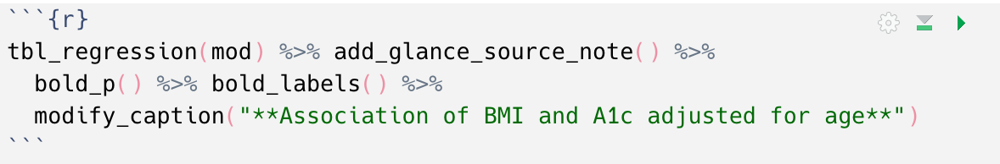
```

### Reference named chunk using **`\@ref(tab:chunk-name)`**

---
class: left, top

# Your turn 6

<br><br>

```{r chunk-label.png, out.width="80%", echo=FALSE}
knitr::include_graphics("img/chunk-label.png")
```

> "I can reference my table using \@ref(tab:modify-caption)"


---
class: left, top

## *`tbl_regression()`: modify options*

<br>

```{r modify-options, echo=FALSE}
tibble::tribble(
  ~Function, ~Description,
  "`modify_header()`", "update column headers",
  "`modify_footnote()`", "update column footnote",
  "`modify_spanning_header()`", "update spanning headers",
  "`modify_caption()`", "update table caption/title",
  "`bold_labels()`", "bold variable labels",
  "`bold_levels()`", "bold variable levels",
  "`italicize_labels()`", "italicize variable labels",
  "`italicize_levels()`", "italicize variable levels",
  "`bold_p()`", "bold significant p-values"
) %>%
  gt::gt() %>%
  gt::fmt_markdown(columns = c(Function))
```


---
class: left, top

# `gtsummary`: Output formats

<br>

```{r supported_formats.png, out.width="70%", echo=FALSE}
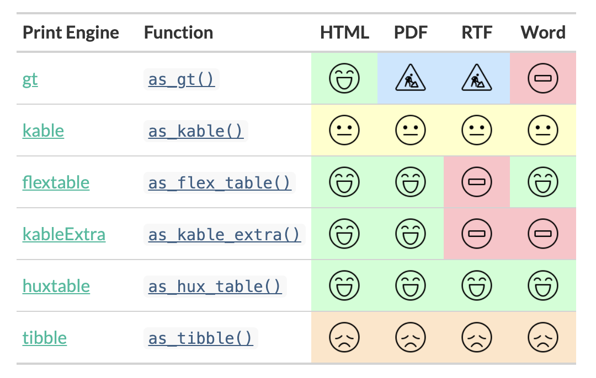
```

---
class: left, top

# Also check out the [`gt` package](https://gt.rstudio.com/)!

### *<i>"construct a wide variety of useful tables with a cohesive set of table parts"*</i>

```{r gt_parts_of_a_table.png, out.width="70%", echo=FALSE}
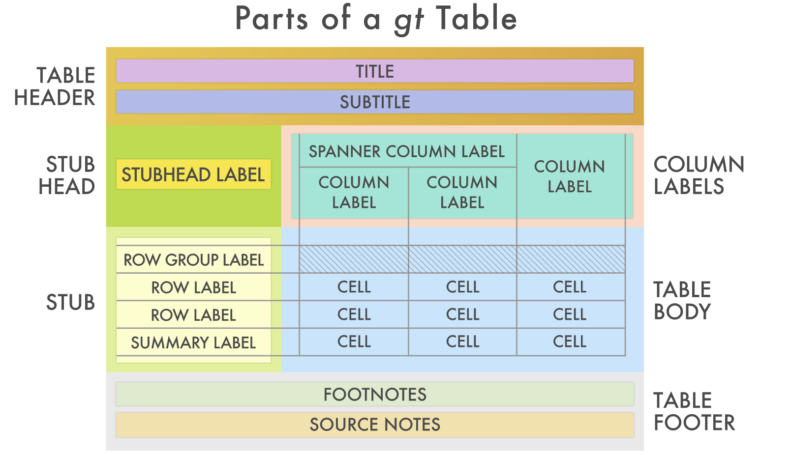
```

---
class: inverse, center

# Resources
## [R Markdown Cookbook: Tables](https://bookdown.org/yihui/rmarkdown-cookbook/tables.html): A series of recipes using `kable()` and friends 
## [gtsummary Website](http://www.danieldsjoberg.com/gtsummary): Many vignettes to learn more about gtsummary
## [gt Website](https://gt.rstudio.com/): Vignettes and a short course on learning gt
