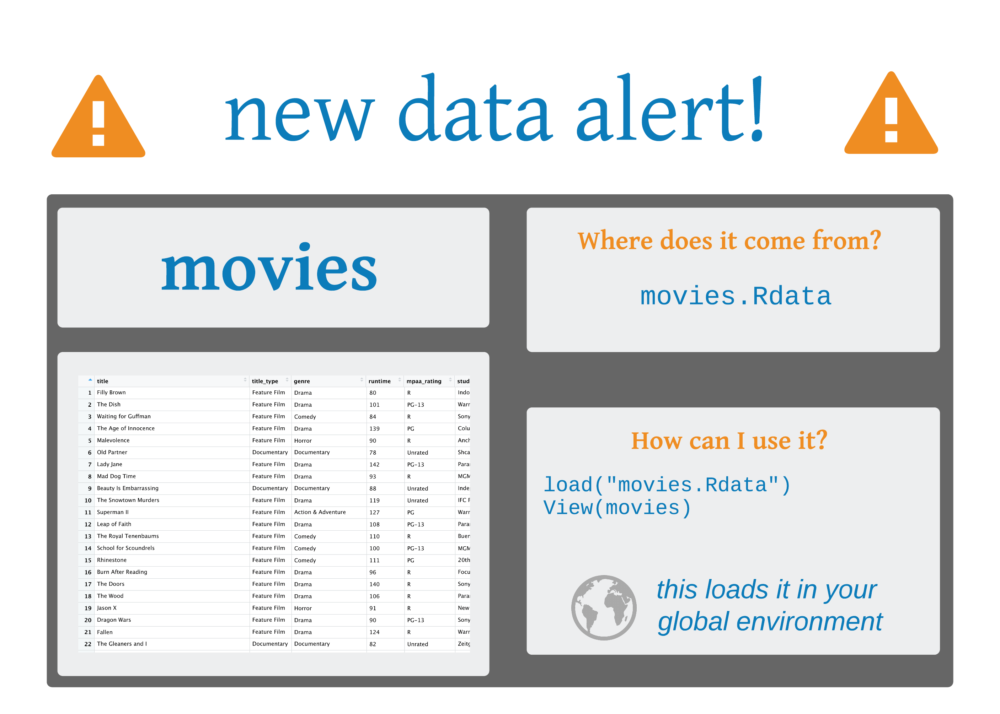

class: middle, center, inverse

```{r setup, include=FALSE}
options(htmltools.dir.version = FALSE, tibble.max_extra_cols = 6, tibble.width = 60)
knitr::opts_chunk$set(warning = FALSE, message = FALSE, fig.align = "center", dpi = 320)
library(tidyverse)
library(shiny)
```


# **`apps/goog-index/app.R`**

---

background-image: url(http://hexb.in/hexagons/shiny.png)
background-position: 90% 10%

## Web apps in R

## **Reactivity**

---

background-image: url(http://hexb.in/hexagons/shiny.png)
background-position: 90% 10%

## Web apps in R

## ~~Reactivity~~
## **Design and User Interface (UI)**

---

background-image: url(http://hexb.in/hexagons/shiny.png)
background-position: 90% 10%

## Web apps in R

## ~~Reactivity~~
## ~~Design and User Interface (UI)~~
## **Dashboards**

---

## Your Turn 1
## Open a new Shiny file (file > New File > Shiny Web App)
## Run the app
## Stop the app from running

---

## Anatomy of a shiny app

```{r, echo=FALSE, out.width="100%", out.height="100%"}
knitr::include_graphics("shiny_skeleton.png")
```

---

## Anatomy of a shiny app

```{r, echo=FALSE, out.width="100%", out.height="100%"}
knitr::include_graphics("shiny_skeleton_ui.png")
```

---

## Anatomy of a shiny app

```{r, echo=FALSE, out.width="100%", out.height="100%"}
knitr::include_graphics("shiny_skeleton_server.png")
```

---

## Anatomy of a shiny app

```{r, echo=FALSE, out.width="100%", out.height="100%"}
knitr::include_graphics("shiny_skeleton_runapp.png")
```

---

```{r, echo=FALSE}

```

---

## Your Turn 2

## Open `apps/movies_01.R`
## Try to identify the components of the app
## Run the app
## Stop the app

---

# `movies_01.R`

```{r, echo=FALSE, out.width="60%", out.height="60%"}
knitr::include_graphics("sidebar.png")
```
.pull-right[Image by Hadley Wickham]

---

## Sidebar layouts

```{r, eval = FALSE}
ui <- fluidPage(
  headerPanel(),
  sidebarLayout(
    sidebarPanel(
      # Inputs
    ),
    mainPanel(
      # Outputs
    )
  )
)
```

---

## Sidebar inputs

```{r, eval = FALSE}
sidebarPanel(
  selectInput(
    inputId = "y", 
    label = "Y-axis:",
    choices = c("..."), 
    selected = "audience_score"
  ),
  selectInput(
    inputId = "x", 
    label = "X-axis:",
    choices = c("..."), 
    selected = "critics_score"
  )
)
```

---

## Sidebar inputs

```{r, eval = FALSE}
sidebarPanel(
  selectInput( #<<
    inputId = "y",  #<<
    label = "Y-axis:",
    choices = c("..."), 
    selected = "audience_score"
  ),
  selectInput( #<<
    inputId = "x",  #<<
    label = "X-axis:",
    choices = c("..."), 
    selected = "critics_score"
  )
)
```


---

## Sidebar inputs

```{r, eval = FALSE}
sidebarPanel(
  selectInput( 
    inputId = "y",  
    label = "Y-axis:",#<<
    choices = c("..."), #<<
    selected = "audience_score" #<<
  ),
  selectInput(
    inputId = "x",  
    label = "X-axis:",
    choices = c("..."), 
    selected = "critics_score"
  )
)
```

---

## Main panel outputs

```{r, eval = FALSE}
mainPanel( #<<
  plotOutput(outputId = "scatterplot")
)
```

---

## Main panel outputs

```{r, eval = FALSE}
mainPanel(
  plotOutput(outputId = "scatterplot") #<<
)
```

---

## Server

```{r, eval = FALSE}
server <- function(input, output) { #<<
  output$scatterplot <- renderPlot({
    ggplot(
      data = movies, 
      aes_string(x = input$x, y = input$y)
    ) +
      geom_point()
  })
}
```

---

## Server

```{r, eval = FALSE}
server <- function(input, output) { 
  output$scatterplot <- renderPlot({ #<<
    ggplot(
      data = movies, 
      aes_string(x = input$x, y = input$y)
    ) +
      geom_point()
  })
}
```

---

## Main panel outputs

```{r, eval = FALSE}
mainPanel(
  plotOutput(outputId = "scatterplot") #<<
)
```

---

## Server

```{r, eval = FALSE}
server <- function(input, output) { 
  output$scatterplot <- renderPlot({ 
    ggplot( #<<
      data = movies, #<<
      aes_string(x = input$x, y = input$y)#<<
    ) + #<<
      geom_point() #<<
  })
}
```

---

## Server

```{r, eval = FALSE}
server <- function(input, output) { 
  output$scatterplot <- renderPlot({ 
    ggplot(
      data = movies, 
      aes_string(x = input$x, y = input$y) #<<
    ) +
      geom_point()
  })
}
```

---

## Sidebar inputs

```{r, eval = FALSE}
sidebarPanel(
  selectInput( 
    inputId = "y",  #<<
    label = "Y-axis:",
    choices = c("..."), 
    selected = "audience_score"
  ),
  selectInput( 
    inputId = "x",  #<<
    label = "X-axis:",
    choices = c("..."), 
    selected = "critics_score"
  )
)
```

---

## Server

```{r, eval = FALSE}
server <- function(input, output) {  #<<
  output$scatterplot <- renderPlot({  #<<
    ggplot(
      data = movies, 
      aes_string(x = input$x, y = input$y) #<<
    ) +
      geom_point()
  })
}
```
---

## Run the app

```{r, eval = FALSE}
shinyApp(ui = ui, server = server)
```

---

## Your Turn 3

### Add new select menu to color the points. Use the following arguments: `inputId = "z"`, `label = "Color by:"`, `choices = c("title_type", "genre", "mpaa_rating", "critics_rating", "audience_rating")`, `selected = "mpaa_rating"`
### Use this variable in the aesthetics of the ggplot function as the color argument
### Run the app in the Viewer Pane

---

## Your Turn 3 (solution: `movies_02.R`)

```{r, eval = FALSE}
# in sidebarPanel()
selectInput(
  inputId = "z", 
  label = "Color by:",
  choices = c("..."), # truncated
  selected = "mpaa_rating"
)
```


```{r, eval = FALSE}
# in server <- function(input, output) {}
output$scatterplot <- renderPlot({
  ggplot(
    data = movies, 
    aes_string(x = input$x, y = input$y, color = input$z)
  ) +
    geom_point()
})
```

---
class: center, middle

.pull-left[
```{r, echo=FALSE, out.width="100%", out.height="100%"}
knitr::include_graphics("cheatsheet.png")
```
]


.pull-right[
```{r, echo=FALSE, out.width="70%", out.height="70%"}
knitr::include_graphics("cheatsheet_inputs.png")
```
]

---

## Your Turn 4

### Add a slider input to control the alpha level of the scatterplot points. Don't forget to label it!
### Set `min` to 0 and `max` to 1. Choose a default for `value`
### Use the value from this input in the plot
### Run the app

---


## Your Turn 4 (solution: `movies_03.R`)

```{r, eval = FALSE}
# in sidebarPanel()
sliderInput(
  inputId = "alpha", 
  label = "Alpha:", 
  min = 0, 
  max = 1, 
  value = 0.5
)
```


```{r, eval = FALSE}
# in server <- function(input, output) {}
output$scatterplot <- renderPlot({
  ggplot(
    data = movies, 
    aes_string(x = input$x, y = input$y, color = input$z)
  ) +
    geom_point(alpha = input$alpha)
})
```


---

class: center, middle

.pull-left[
```{r, echo=FALSE, out.width="100%", out.height="100%"}
knitr::include_graphics("cheatsheet.png")
```
]


.pull-right[
```{r, echo=FALSE, out.width="70%", out.height="70%"}
knitr::include_graphics("cheatsheet_outputs.png")
```
]

---

## Your Turn 5

### Add a new *output* in `server` using `DT::renderDataTable()`. Inside of the render function, create a data table with `DT::datatable()`
### Set `data = movies[, 1:7]`, `options = list(pageLength = 10)`, and `rownames = FALSE`
### Add the output to `mainPanel()` in `ui` using `DT::dataTableOutput()`
### Run the app

---

## Your Turn 5 (solution: `movies_04.R`)

```{r, eval = FALSE}
# in mainPanel()
DT::dataTableOutput(outputId = "moviestable")
```

```{r, eval = FALSE}
# in server <- function(input, output) {}
output$moviestable <- DT::renderDataTable({
  DT::datatable(
    data = movies[, 1:7], 
    options = list(pageLength = 10),
    rownames = FALSE
  )
})
```

---

## Your Turn 6

### Add a title to your app with `headerPanel()`  

### Make the input choices nicer by making the vector named, e.g. `choices = c("IMDB rating" = "imdb_rating", ...)`  

### Clean up your axes titles with:  

#### `str_replace_all()` to replace `_` with `" "`  

#### `str_to_title()` to change to title case 

---

## Your Turn 6 

`str_replace_all()` takes three arguments, 

```{r , eval=FALSE}
str_replace_all(string = , # input variable
                pattern = , # pattern to look for
                replacement = # character vector of replacements
                )
```

`str_to_title()` converts the case of a string to title case.

```{r , eval=FALSE}
str_to_title(string = # string to modify
               )
```


---

## Your Turn 6 (solution: `movies_05.R`)

```{r, eval=FALSE}
# in fluidPage()
headerPanel("Movie browser")
```

```{r, eval=FALSE}
# in sidebarPanel()
selectInput(
  ...,
  choices = c(
    "IMDB rating" = "imdb_rating",
    "IMDB number of votes" = "imdb_num_votes",
    "Critics Score" = "critics_score",
    "Audience Score" = "audience_score",
    "Runtime" = "runtime"
  )
)
```

---

## Your Turn 6 (solution: `movies_05.R`)

```{r, eval=FALSE}
# in server <- function(input, output) {}
output$scatterplot <- renderPlot({
  ggplot(
    data = movies,
    aes_string(x = input$x, y = input$y, color = input$z)) +
    geom_point(alpha = input$alpha) +
    labs(
      x = str_to_title(string = str_replace_all(string = input$x, 
                                       pattern = "_", 
                                       replacement = " ")),
      y = str_to_title(string = str_replace_all(string = input$y, 
                                       pattern = "_", 
                                       replacement = " ")),
      color = str_to_title(string = str_replace_all(string = input$z, 
                                           pattern = "_", 
                                           replacement = " "))
    )
})
```

---

## Directory Structure

```{r, eval=FALSE}
|--name_of_app
    |-- app.R
```

```{r, eval=FALSE}
|--name_of_app
    |-- ui.R
    |-- server.R
    |-- global.R
    |-- www
        |-- image.png
```

---

## Sharing your app

---

## Sharing your app

## **shinyapps.io**

---

## Sharing your app

## ~~shinyapps.io~~
## **Shiny Server**
---

## Sharing your app

## ~~shinyapps.io~~
## ~~Shiny Server~~
## **RStudio Connect or Shiny Server Pro**

---

## Your Turn 7

## Create folder called `movies_app`

## Move any of the (working) app files into this folder, along with `movies.Rdata`

## Go to http://shinyapps.io. Sign up for an account ([instructions](https://docs.rstudio.com/shinyapps.io/getting-started.html#CreateAccount)). 

---

## Your turn 7

### Click on the 'Tokens' option under your username (upper right corner)

```{r tokens.png, out.width="50%", out.height="50%", echo=FALSE}
knitr::include_graphics(path = "tokens.png")
```


---

## Your Turn 7

### Click 'Show' button on the 'Token' page
### Copy this to the clipboard, paste it into the console in the RStudio IDE, hit Enter

```{r tokens2.png, out.width="50%", out.height="50%", echo=FALSE}
knitr::include_graphics(path = "tokens2.png")
```


---

class: inverse, center

# Resources
## [Shiny Website](https://shiny.rstudio.com): A collection of articles on Shiny
## [Mastering Shiny](https://mastering-shiny.org): A Work-in-progress book from Hadley Wickham

