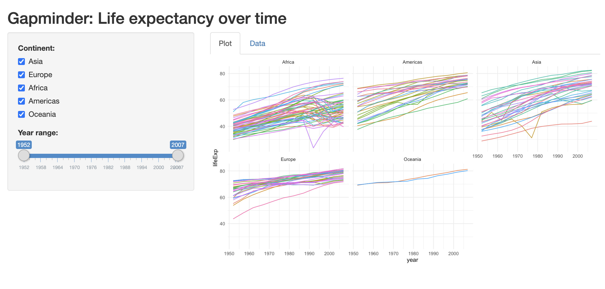

# Assignment

In this assignment, we’ll create a Shiny app for the gapminder dataset using skills from earlier in the course. You’ll also need to learn how to do some new things in Shiny. Not only will you practice the skills we’ve learned so far, but you’ll also practice finding and internalizing new techniques from community resources. The R ecosystem is always growing, and it’s a good habit to start reading some of the excellent material already out there. Here are some that will help you with this assignment:

Chapter 3 of Mastering Shiny: https://mastering-shiny.org/basic-ui.html
Chapter 4 of Mastering Shiny: https://mastering-shiny.org/basic-reactivity.html
Tabsets in Shiny: https://shiny.rstudio.com/articles/tabsets.html

# Shiny app challenge

Create a new Shiny app to show a lineplot of the gapminder and a table of the data. 

Use the sidebar layout approach. Put the plot and data table in separate tabs (we haven't done this yet... read more above!). Make sure your app has a title.

Additionally, this app should:

1. Have a ggplot that:
 * shows life expectancy over time, colored and grouped by country
 * facets by continent
 * whatever else you think you need to do to make the plot look nice (hint: gapminder has 142 countries, which does not make for a practical legend...)
2. Allow the user to filter by continent
3. Allow the user to specify the year range using a slider
4. Have a data table (either using DT or a static table) that shows the data you're using

There are many ways to solve this problem! My solution was just over 60 lines of code and looked like this (press the green play button to see a screenshot). Don't worry if yours doesn't look exactly like mine or if you have more or less lines of code; solve it the way you want to solve it!

```{r}

```

