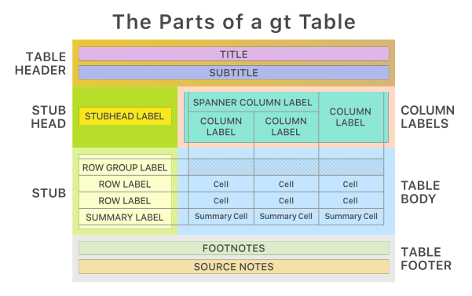
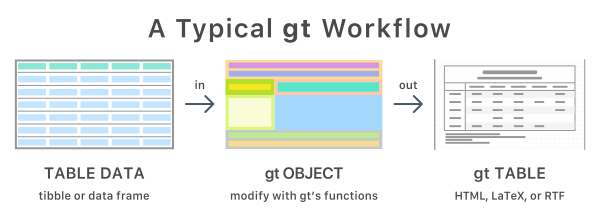
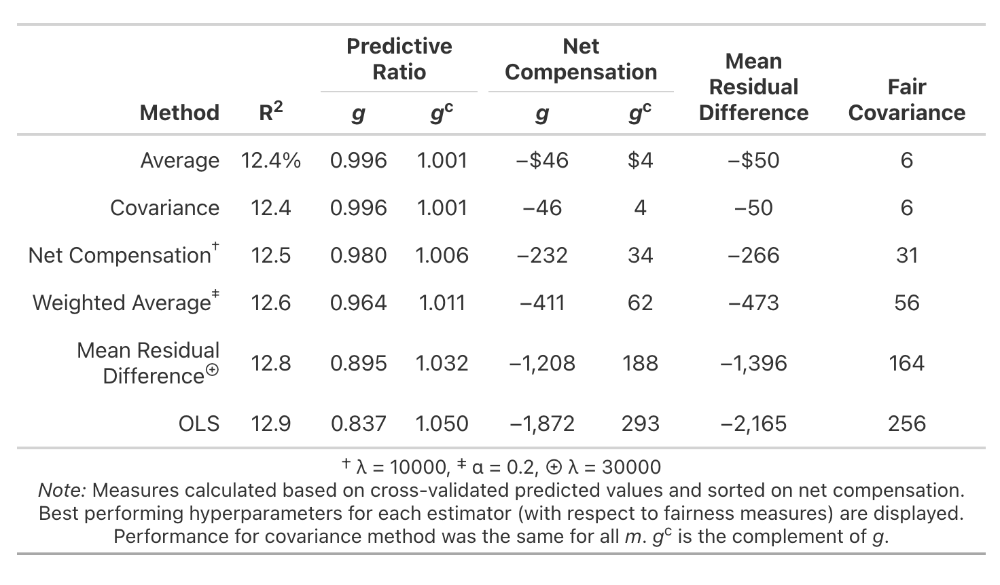

```{r}
#| label: setup
#| include: false
options(
  tibble.max_extra_cols = 6,
  tibble.width = 60
)
reticulate::use_virtualenv(".venv/")
```

# Updates Updates Updates {background-color="#23373B"}

##



##



# Style Guide {background-color="#23373B"}

## Flippers flippers flippers

```{r}
library(gt)

penguins <- palmerpenguins::penguins |>
  tidyr::drop_na()

penguin_summary <- penguins |>
  dplyr::summarize(
    .by = species,
    bill_length = mean(bill_length_mm),
    bill_depth = mean(bill_depth_mm),
    flipper_length = mean(flipper_length_mm),
    body_mass = mean(body_mass_g),
    n = dplyr::n()
  )

penguin_summary
```


## Flippers flippers flippers

```{python}
import polars as pl
from great_tables import GT
from palmerpenguins import load_penguins

penguins = load_penguins().dropna()
penguins_pl = pl.from_pandas(penguins)

penguin_summary = (
    penguins_pl.group_by("species")
    .agg(
        pl.col("bill_length_mm").mean().alias("bill_length"),
        pl.col("bill_depth_mm").mean().alias("bill_depth"),
        pl.col("flipper_length_mm").mean().alias("flipper_length"),
        pl.col("body_mass_g").mean().alias("body_mass"),
        pl.len().alias("n"),
    )
    .sort("species")
)
```

##

::: {.columns}
::: {.column}

```{r}
#| code-line-numbers: "1-4"
gt(
  penguin_summary,
  rowname_col = "species"
)
```
:::
::: {.column}
```{python}
#| code-line-numbers: "1-4"
GT(
  penguin_summary,
  rowname_col="species"
)
```
:::
:::

## Using readable column labels {.small}


::: {.columns}
::: {.column}

```{r}
#| code-line-numbers: "5-12"
penguin_tbl <- gt(
  penguin_summary,
  rowname_col = "species"
) |>
  # Human-readable column labels
  cols_label(
    bill_length = "Length (mm)",
    bill_depth = "Depth (mm)",
    flipper_length = "Length (mm)",
    body_mass = "Mass (g)",
    n = "N"
  )

penguin_tbl
```
:::
::: {.column}
```{python}
#| code-line-numbers: "3-10"
penguin_tbl = (
    GT(penguin_summary, rowname_col="species")
    # Human-readable column labels
    .cols_label(
        bill_length="Length (mm)",
        bill_depth="Depth (mm)",
        flipper_length="Length (mm)",
        body_mass="Mass (g)",
        n="N",
    )
)

penguin_tbl
```
:::
:::

## Use spanners to organize columns {.small}

::: {.columns}
::: {.column}
```{r}
#| code-line-numbers: "2-14"
penguin_tbl <- penguin_tbl |>
  # Group related columns under shared headers
  tab_spanner(
    label = "Bill",
    columns = c(bill_length, bill_depth)
  ) |>
  tab_spanner(
    label = "Flipper",
    columns = flipper_length
  ) |>
  tab_spanner(
    label = "Body",
    columns = body_mass
  )

penguin_tbl
```
:::
::: {.column}
```{python}
#| code-line-numbers: "3-15"
penguin_tbl = (
    penguin_tbl
    # Group related columns under shared headers
    .tab_spanner(
      label="Bill",
       columns=["bill_length", "bill_depth"]
      )
    .tab_spanner(
      label="Flipper",
      columns=["flipper_length"]
    )
    .tab_spanner(
      label="Body",
      columns=["body_mass"]
    )
)

penguin_tbl
```
:::
:::

## Format values {.small}

::: {.columns}
::: {.column}
```{r}
#| code-line-numbers: "2-9"
penguin_tbl <- penguin_tbl |>
  # Group columns with the same precision; use different decimals per type
  fmt_number(
    columns = c(bill_length, bill_depth, flipper_length),
    decimals = 1
  ) |>
  fmt_integer(
    columns = c(body_mass, n)
  )

penguin_tbl
```
:::
::: {.column}
```{python}
#| code-line-numbers: "3-11"
penguin_tbl = (
    penguin_tbl
    # Group columns with the same precision; use different decimals per type
    .fmt_number(
        columns=["bill_length", "bill_depth", "flipper_length"],
        decimals=1
    )
    .fmt_integer(
      columns=["body_mass", "n"]
    )
)

penguin_tbl
```
:::
:::


## Include important information in the table notes {.small}

::: {.columns}
::: {.column}
```{r}
#| code-line-numbers: "2-5"
penguin_tbl <- penguin_tbl |>
  # Define abbreviations and what the numbers represent
  tab_source_note(
    "Values are means. N = number of observations."
  )

penguin_tbl
```
:::
::: {.column}
```{python}
#| code-line-numbers: "3-6"
penguin_tbl = (
    penguin_tbl
    # Define abbreviations and what the numbers represent
    .tab_source_note(
      "Values are means. N = number of observations."
    )
)

penguin_tbl
```
:::
:::


## Style the table {.small}

::: {.columns}
::: {.column}
```{r}
#| code-line-numbers: "2-9"
penguin_tbl <- penguin_tbl |>
  # Remove body gridlines and vertical lines
  tab_options(
    table_body.hlines.width = px(0),
    table_body.vlines.width = px(0),
    column_labels.vlines.width = px(0),
    column_labels.border.bottom.width = px(1),
    stub.border.width = px(0)
  )

penguin_tbl
```
:::
::: {.column}
```{python}
#| code-line-numbers: "3-10"
penguin_tbl = (
    penguin_tbl
    # Remove body gridlines and vertical lines
    .tab_options(
        table_body_hlines_width="0px",
        table_body_vlines_width="0px",
        column_labels_vlines_width="0px",
        column_labels_border_bottom_width="1px",
        stub_border_width="0px"
    )
)

penguin_tbl
```
:::
:::

## Recreation challenge!



## Resources {background-color="#23373B"}

###
