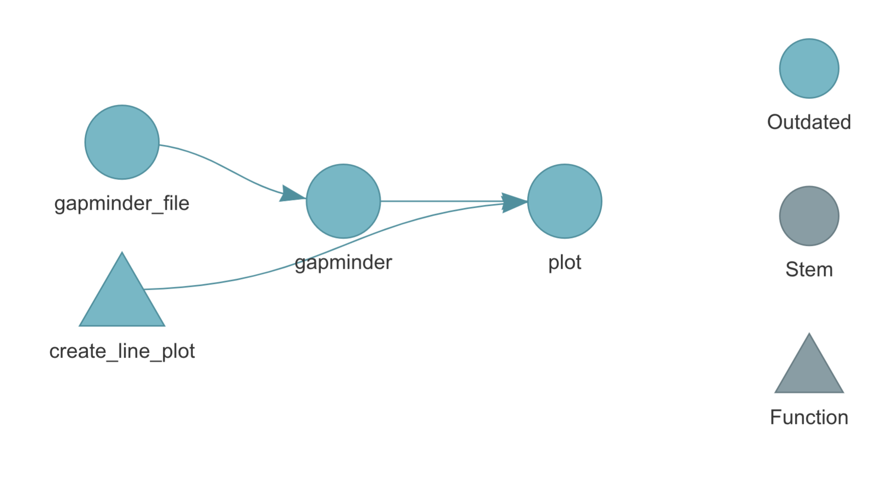
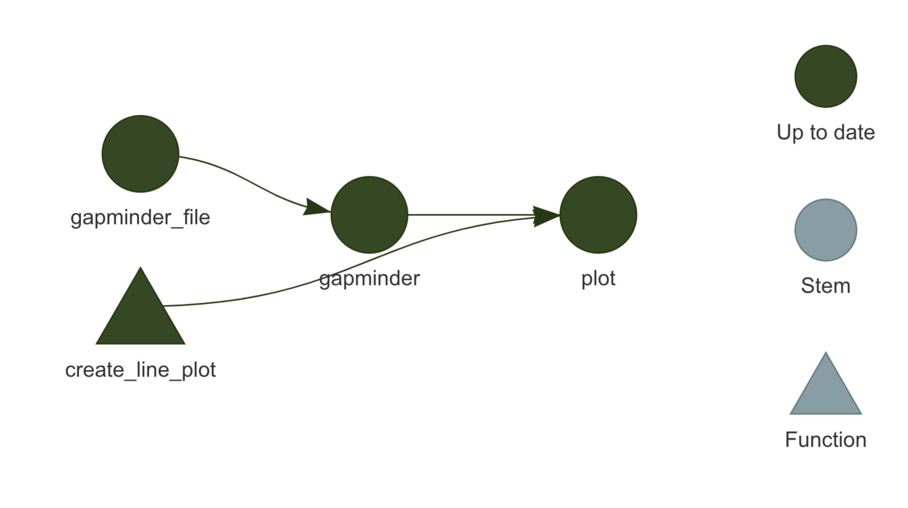
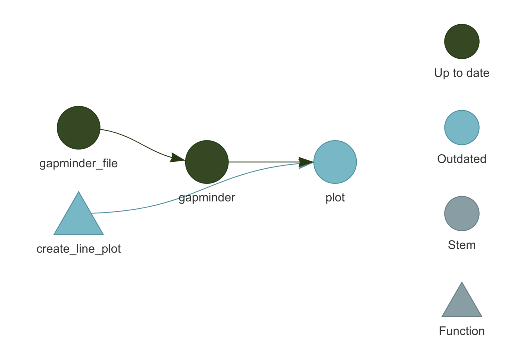
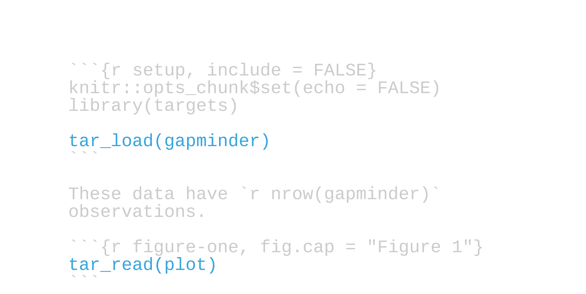
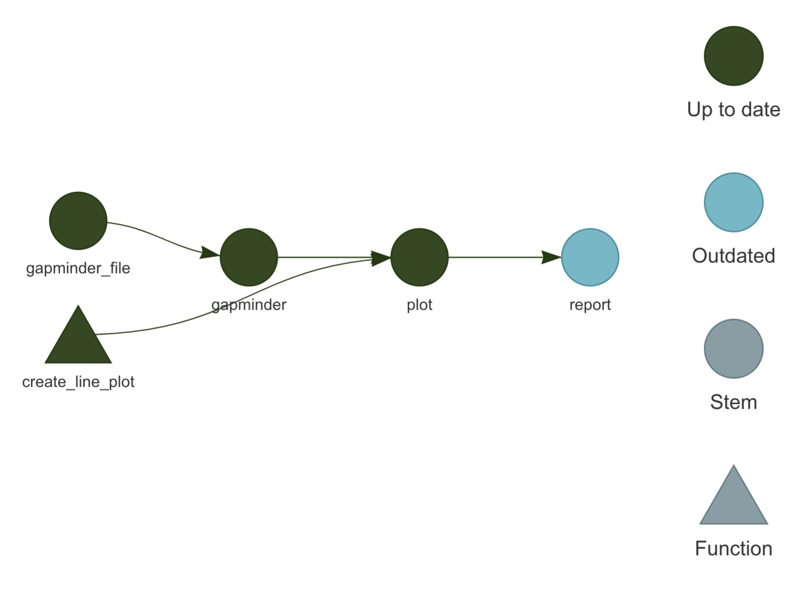

```{r setup, include=FALSE}
options(htmltools.dir.version = FALSE, tibble.max_extra_cols = 6, tibble.width = 60)
knitr::opts_chunk$set(
  warning = FALSE, 
  message = FALSE, 
  dev = "ragg_png",
  dpi = 320,
  out.width = "80%",
  fig.width = 6,
  fig.asp = 0.618,
  fig.retina = 2,
  fig.align = "center",
  fig.show = "hold"
)

library(tidyverse)
library(gapminder)
library(here)
```

## Strategies for reproduciblity

--

```{r, out.width="80%", echo = FALSE}
knitr::include_graphics("img/cracked_setwd.png")
```

### [Project-Oriented Workflows](https://rstats.wtf/project-oriented-workflow.html)

---

## Strategies for reproduciblity

.pull-left[
```{r, out.width="100%", echo = FALSE}
knitr::include_graphics("img/rstudio-workspace.png")
```
]


.pull-right[
```{r, out.width="70%", echo = FALSE}

```
]

### [Use a clean slate; Restart early & often](https://rstats.wtf/save-source.html)
---

## Strategies for reproduciblity

## **R Markdown** for reproducible documents
## **renv** for package version management
## **git/GitHub** for version control

---

## Script-oriented workflows

.large[
```
01-read-data.R
02-clean-data.R
03-decriptive-stats.R
...
n-output.R
report.Rmd
```
]

--

## *Doesn't scale well—in terms of both time and scope*

---

## Script-oriented workflows

.large[
```
01-read-data.R
02-clean-data.R
03-decriptive-stats.R
...
n-output.R
report.Rmd
```
]

## ~~Doesn't scale well—in terms of both time and scope~~
## *Not clear what we can skip*

---

## Function-oriented workflows

--

.large[
```
source("functions.R")
data <- read_data("data.csv") %>% 
  clean_data()
table1 <- create_table(data)
...
ggsave("figure3.png")
rmarkdown::render("report.Rmd")
```
]

---

background-image: url(img/targets_hex.png)
background-position: 50% 15%
background-size: 25%


</br></br></br></br></br></br></br></br></br></br></br></br></br></br>
```{r, out.width="95%", echo = FALSE}
knitr::include_graphics("img/targets_overview.svg")
```

---

## Setting up a pipeline

--

## targets requires a *`_targets.R`* file in the root directory of your project

---

## Setting up a pipeline

## ~~targets requires a `_targets.R` file in the root directory of your project~~
## Create it with *`tar_script()`*; open it with *`tar_edit()`*

---

## `_targets.R`

```{r, eval = FALSE}
library(targets)
options(tidyverse.quiet = TRUE)
tar_option_set(packages = "tidyverse")
source("R/functions.R")

list(
  tar_target(gapminder_file, "gapminder.csv", format = "file"),
  tar_target(gapminder, read_csv(gapminder_file, col_types = cols())),
  tar_target(plot, create_line_plot(gapminder))
)
```

---

## `_targets.R`

```{r, eval = FALSE}
library(targets) #<<
options(tidyverse.quiet = TRUE)
tar_option_set(packages = "tidyverse")
source("R/functions.R")

list(
  tar_target(gapminder_file, "gapminder.csv", format = "file"),
  tar_target(gapminder, read_csv(gapminder_file, col_types = cols())),
  tar_target(plot, create_line_plot(gapminder))
)
```

---

## `_targets.R`

```{r, eval = FALSE}
library(targets) 
options(tidyverse.quiet = TRUE) #<<
tar_option_set(packages = "tidyverse") #<< 
source("R/functions.R")

list(
  tar_target(gapminder_file, "gapminder.csv", format = "file"),
  tar_target(gapminder, read_csv(gapminder_file, col_types = cols())),
  tar_target(plot, create_line_plot(gapminder))
)
```


---

## `_targets.R`

```{r, eval = FALSE}
library(targets) 
options(tidyverse.quiet = TRUE)
tar_option_set(packages = "tidyverse") 
source("R/functions.R") #<< 

list(
  tar_target(gapminder_file, "gapminder.csv", format = "file"),
  tar_target(gapminder, read_csv(gapminder_file, col_types = cols())),
  tar_target(plot, create_line_plot(gapminder))
)
```

--

## *`functions.R`* is common for small projects, but targets doesn't care how or from where you source functions.

---

## `R/functions.R`

```{r, eval = FALSE}
create_line_plot <- function(gapminder) { #<<
  gapminder %>%
    filter(continent != "Oceania") %>%
    ggplot(aes(x = year, y = lifeExp, group = country, color = country)) +
    geom_line(lwd = 1, show.legend = FALSE) +
    facet_wrap(~ continent) +
    theme_minimal(14) +
    theme(strip.text = element_text(size = rel(1.1)))
}

```

---

## `_targets.R`

```{r, eval = FALSE}
library(targets) 
options(tidyverse.quiet = TRUE)
tar_option_set(packages = "tidyverse") 
source("R/functions.R") 

list( #<<
  tar_target(gapminder_file, "gapminder.csv", format = "file"), #<<
  tar_target(gapminder, read_csv(gapminder_file, col_types = cols())), #<<
  tar_target(plot, create_line_plot(gapminder)) #<<
) #<<
```

--

## `_targets.R` **must** end in a list of targets

---

## `tar_visnetwork()`

--

```{r, out.width="80%", echo = FALSE}

```

--

## Run this **in the console**! Don't put it in `_targets.R` or other scripts.

---

## `_targets.R`

```{r, eval = FALSE}
library(targets) 
options(tidyverse.quiet = TRUE)
tar_option_set(packages = "tidyverse") 
source("R/functions.R") 

list( 
  tar_target(gapminder_file, "gapminder.csv", format = "file"), #<<
  tar_target(gapminder, read_csv(gapminder_file, col_types = cols())), 
  tar_target(plot, create_line_plot(gapminder)) 
) 
```

---

## `_targets.R`

```{r, eval = FALSE}
library(targets) 
options(tidyverse.quiet = TRUE)
tar_option_set(packages = "tidyverse") 
source("R/functions.R") 

list( 
  tar_target(gapminder_file, "gapminder.csv", format = "file"), 
  tar_target(gapminder, read_csv(gapminder_file, col_types = cols())), #<<
  tar_target(plot, create_line_plot(gapminder)) 
) 
```

---

## `_targets.R`

```{r, eval = FALSE}
library(targets) 
options(tidyverse.quiet = TRUE)
tar_option_set(packages = "tidyverse") 
source("R/functions.R") #<<

list( 
  tar_target(gapminder_file, "gapminder.csv", format = "file"), 
  tar_target(gapminder, read_csv(gapminder_file, col_types = cols())),
  tar_target(plot, create_line_plot(gapminder)) #<<
) 
```

---

## Building the pipeline

```{r, eval = FALSE}
tar_make()
```

--

.large[
```
• start target gapminder_file
• built target gapminder_file
• start target gapminder
• built target gapminder
• start target plot
• built target plot
• end pipeline
```
]

--

## Run this **in the console**! Don't put it in `_targets.R` or other scripts.

---

## Where's my output?

--

## **`tar_read(`**_`target_name`_**`)`**: return target results
## **`tar_load(`**_`target_name`_**`)`**: load `target_name` into global environment

---

```{r, eval = FALSE}
tar_read(plot)
```

```{r, echo = FALSE}
gapminder %>%
  filter(continent != "Oceania") %>%
  ggplot(aes(x = year, y = lifeExp, group = country, color = country)) +
  geom_line(lwd = 1, show.legend = FALSE) +
  facet_wrap(~ continent) +
  theme_minimal(14) +
  theme(strip.text = element_text(size = rel(1.1)))
```

---

```{r, eval = FALSE}
tar_load(plot) 

plot
```

```{r, echo = FALSE}
gapminder %>%
  filter(continent != "Oceania") %>%
  ggplot(aes(x = year, y = lifeExp, group = country, color = country)) +
  geom_line(lwd = 1, show.legend = FALSE) +
  facet_wrap(~ continent) +
  theme_minimal(14) +
  theme(strip.text = element_text(size = rel(1.1)))
```

---

background-image: url(img/targets_hex.png)
background-position: 50% 15%
background-size: 25%


</br></br></br></br></br></br></br></br></br></br></br></br></br></br>
```{r, out.width="95%", echo = FALSE}
knitr::include_graphics("img/targets_overview.svg")
```

---


## Your Turn 1

### Use `tar_script()` in the console, then open `_targets.R` (you can also use `tar_edit()` in the console to open it for you). Read the resulting script.
### Predict how many targets there are, what they are called, and any other dependencies in your code. Run `tar_visnetwork()` in the console to check if you were right.
### Run `tar_make()` in the console, then run `tar_visnetwork()` again. What's different? Try running `tar_make()` again.

---

## Building our mental model

```{r, eval = FALSE}
tar_target(plot, create_line_plot(gapminder))
```

--

```{r, eval = FALSE}
plot <- create_line_plot(gapminder)
```

--

```{r, eval = FALSE}
list(
  plot = create_line_plot(gapminder)
)
```

---

background-image: url(img/tarchetypes.png)
background-position: 90% 10%
background-size: 18%

## *tarchetypes*

</br></br>

## Collection of target and pipeline archetypes for targets
## Express complicated pipelines with concise syntax
## Need to include `library(tarchetypes)` in `_targets.R`

---

# Plans

```{r, eval = FALSE}
list( 
  tar_target(gapminder_file, "gapminder.csv", format = "file"), 
  tar_target(gapminder, read_csv(gapminder_file, col_types = cols())),
  tar_target(plot, create_line_plot(gapminder)) 
) 
```

---

# Plans

```{r, eval = FALSE}
tar_plan(  #<<
  tar_target(gapminder_file, "gapminder.csv", format = "file"), 
  tar_target(gapminder, read_csv(gapminder_file, col_types = cols())),
  tar_target(plot, create_line_plot(gapminder)) 
) 
```

---

# Plans

```{r, eval = FALSE}
tar_plan(  
  tar_target(gapminder_file, "gapminder.csv", format = "file"), 
  gapminder = read_csv(gapminder_file, col_types = cols()), #<<
  plot = create_line_plot(gapminder) #<<
) 
```

---

## `tar_visnetwork()`

```{r, out.width="80%", echo = FALSE}

```

---

# Files

```{r, eval = FALSE}
tar_plan(  
  tar_file(gapminder_file, "gapminder.csv"), #<<
  gapminder = read_csv(gapminder_file, col_types = cols()),
  plot = create_line_plot(gapminder) 
) 
```

--

## See also `tar_url()`, `tar_parquet()`, and other file formats

---

## Your Turn 2

## Work through Your Turn 2 in `exercises.Rmd`

---

```{r, eval = FALSE}
tar_read(plot)
```

```{r, echo = FALSE}
gapminder %>%
  filter(continent != "Oceania") %>%
  ggplot(aes(x = year, y = lifeExp, group = country, color = country)) +
  geom_line(lwd = 1, show.legend = FALSE) +
  facet_wrap(~ continent) +
  theme_minimal(14) +
  theme(strip.text = element_text(size = rel(1.1)))
```

---

```{r, eval = FALSE}
create_line_plot <- function(gapminder) {
  gapminder %>%
    filter(continent != "Oceania") %>%
    ggplot(aes(
      x = year, 
      y = lifeExp, 
      group = country, 
      color = country
    )) +
    geom_line(lwd = 1, show.legend = FALSE) +
    facet_wrap(~ continent) +
    scale_color_manual(values = country_colors) + #<< 
    theme_minimal(14) +
    theme(strip.text = element_text(size = rel(1.1)))
}
```

---

## `_targets.R`

```{r, eval = FALSE}
library(targets)
library(tarchetypes)
options(tidyverse.quiet = TRUE)
tar_option_set(packages = c("tidyverse", "gapminder")) #<<
source("R/functions.R") 

tar_plan(  
  tar_file(gapminder_file, "gapminder.csv"), #<<
  gapminder = read_csv(gapminder_file, col_types = cols()),
  plot = create_line_plot(gapminder) 
) 
```

---

## `tar_visnetwork()`

```{r, out.width="80%", echo = FALSE}

```

---

## Outdated targets

```{r, eval = FALSE}
tar_outdated()
```

--

```{r, echo = FALSE}
"plot"
```

---

## `tar_make()`
--

.large[
```
✓ skip target gapminder_file
✓ skip target gapminder
• start target plot
• built target plot
• end pipeline
```
]

---

```{r, eval = FALSE}
tar_read(plot)
```

```{r, echo = FALSE}
gapminder %>%
  filter(continent != "Oceania") %>%
  ggplot(aes(x = year, y = lifeExp, group = country, color = country)) +
  geom_line(lwd = 1, show.legend = FALSE) +
    scale_color_manual(values = country_colors) +
  facet_wrap(~ continent) +
  theme_minimal(14) +
  theme(strip.text = element_text(size = rel(1.1)))
```

---

## Your Turn 3

### Change `diabetes_file` to use `diabetes.csv` instead
### Run `tar_outdated()` in the console. What's this telling you? Confirm with `tar_visnetwork()`
### Predict which targets are going to re-run, then run `tar_make()`. Were you right?
### Confirm that `diabetes` has changed by looking at it with `tar_read()`


---

## Building up your pipeline

--

## *Good targets are meaningful units of your analysis or important dependencies like files*

---

## Building up your pipeline


## ~~Good targets are meaningful units of your analysis or important dependencies like files~~
## *Add one or two targets at a time*

---

## Building up your pipeline


## ~~Good targets are meaningful units of your analysis or important dependencies like files~~
## ~~Add one or two targets at a time~~
## *Run `tar_make()` and `tar_visnetwork()` often*

---

## Building up your pipeline


## ~~Good targets are meaningful units of your analysis or important dependencies like files~~
## ~~Add one or two targets at a time~~
## ~~Run `tar_make()` and `tar_visnetwork()` often~~
## *Load all targets: `tar_load(everything())`*

---

# Organizing your functions

--

## `functions.R` only works well for small pipelines, but targets doesn't have a preference for you organize them

---

# Organizing your functions

## ~~`functions.R` only works well for small pipelines, but targets doesn't have a preference for you organize them~~

.large[
> While you’re free to arrange functions into files as you wish, [avoid] the two extremes... don’t put all functions into one file and don’t put each function into its own separate file. —[R Packages, 2nd Ed.](https://r-pkgs.org/r.html)
]

---
class: inverse

## What I like to do
.small[
1. Create an *`R/`* folder
2. Create and open new files in `R/` with *`use_r("file_name")`* from the usethis package
3. In `_targets.R`: *`purrr::walk(fs::dir_ls("R"/), source)`*
]

--

.large[
#### **Remember, you need to `source()` each file in `_targets.R`**
]
---

## Your Turn 4

### Add `source("R/functions.R")` to `_targets.R`
### Create a new target called `table_one` using `create_table_one(diabetes)`
### Run `tar_visnetwork()` and `tar_make()`
### Take a look at the target you just created

---

## Your Turn 5

### Open `R/functions.R` and modify `create_table_one()`: Add the argument `missing_text = "(Missing)"` to `tbl_summary()`. Make sure to save your file after you've made the change.
### Run `tar_outdated()` in the console, then look at `tar_visnetwork()`
### Predict which targets are going to re-run, then run `tar_make()`. Were you right?

---
class: inverse

# Including R Markdown files as targets
1. Create an R Markdown file
2. Use *`tar_read()`* or *`tar_load()`* in the Rmd file to access targets
3. Include *`tar_render(target_name, "file_name.Rmd")`* in your list of targets

---

## `report.Rmd`

```{r, out.width="100%", echo = FALSE}

```

---

## `report.Rmd`

```{r, out.width="100%", echo = FALSE}

```

---

## `_targets.R`

```{r, eval = FALSE}
library(targets)
library(tarchetypes)
options(tidyverse.quiet = TRUE)
tar_option_set(packages = c("tidyverse", "gapminder"))
source("R/functions.R") 

tar_plan(  
  tar_file(gapminder_file, "gapminder.csv"), 
  gapminder = read_csv(gapminder_file, col_types = cols()),
  plot = create_line_plot(gapminder),
  tar_render(report, "report.Rmd") #<<
) 
```

---

## `tar_visnetwork()`

```{r, out.width="80%", echo = FALSE}

```

---

## `tar_make()`

.large[
```
✓ skip target gapminder_file
✓ skip target gapminder
✓ skip target plot
• start target report
• built target report
• end pipeline
```
]

---

## Your Turn 6

## Work through Your Turn 6 in `exercises.Rmd`

---

## The targets cache: `_targets/`

--

## **`tar_destroy()`**: Remove everything in the cache
## **`tar_prune()`**: Remove targets that are no longer part of the pipeline

---

## Your Turn 7

## Confirm that you can reproduce your entire pipeline from scratch. In the console:

### Run `tar_destroy()`
### Run `tar_make()`

---

## Other features of targets

--

## *Automatic parallelization*

---

## Other features of targets

## ~~Automatic parallelization~~
## *Branching*

---

## Other features of targets

## ~~Automatic parallelization~~
## ~~Branching~~
## *Cloud integration*

---

class: inverse, center

# Resources
## [The targets User Manual](https://books.ropensci.org/targets/): A comprehensive but friendly introduction to targets. Free online.
## [The Official targets Short Course](https://github.com/wlandau/targets-tutorial/blob/main/README.md): A free short course available on RStudio Cloud or locally
## [Talks and other targets resources](https://docs.ropensci.org/targets/)
