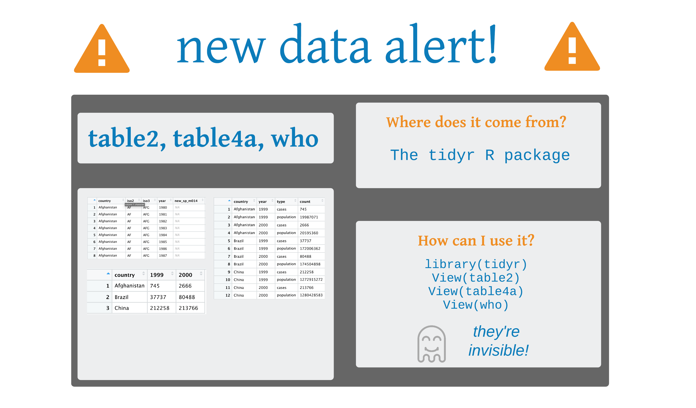

```{r setup, include=FALSE}
options(htmltools.dir.version = FALSE, tibble.max_extra_cols = 6, tibble.width = 60, tibble.print_max = 15)
knitr::opts_chunk$set(warning = FALSE, message = FALSE, fig.align = "center", dpi = 320)
library(tidyverse)
```


```{r, out.height="70%", out.width="70%", echo = FALSE}
knitr::include_graphics("tidyr_spread_gather.png")
```
.pull-right[Art by Allison Horst]

---
background-image: url(http://hexb.in/hexagons/tidyr.png)
background-position: 90% 10%

## **tidyr**

## Functions for tidying data. 
## What is tidy data?
.large[
> “Tidy datasets are all alike, but every messy dataset is messy in its own way.” –– Hadley Wickham
]
---

# Tidy Data
</div>

---

# Tidy Data 
</div>
### .medium[Each **column** is a single *variable*]

---

# Tidy Data
</div>
### ~~.medium[Each column is a single variable]~~
### .medium[Each **row** is a single *observation*]

---

# Tidy Data 
</div>
### ~~.medium[Each column is a single variable]~~
### ~~.medium[Each row is a single observation]~~
### .medium[Each **cell** is a *value*]

---


## `gather()`

```{r, eval=FALSE}
gather(<DATA>, "<KEY>", "<VALUE>", <VARIABLES>)
```

---

## Lord of the Rings

```{r lotr}
lotr <- tribble(
                         ~film,    ~race, ~female, ~male,
  "The Fellowship Of The Ring",    "Elf",   1229L,  971L,
  "The Fellowship Of The Ring", "Hobbit",     14L, 3644L,
  "The Fellowship Of The Ring",    "Man",      0L, 1995L,
              "The Two Towers",    "Elf",    331L,  513L,
              "The Two Towers", "Hobbit",      0L, 2463L,
              "The Two Towers",    "Man",    401L, 3589L,
      "The Return Of The King",    "Elf",    183L,  510L,
      "The Return Of The King", "Hobbit",      2L, 2673L,
      "The Return Of The King",    "Man",    268L, 2459L
)
```

---

## Lord of the Rings

```{r}
lotr
```

---

```{r, out.height="100%", out.width="100%", echo = FALSE}
knitr::include_graphics("new_data_alert_lotr.png")
```

---

## `gather()`

```{r, eval=FALSE}
lotr %>% 
  gather("sex", "words", female:male) #<<
```

---

## `gather()`

```{r, highlight.output = 2}
lotr %>% 
  gather("sex", "words", female:male)
```

---

```{r, out.height="100%", out.width="100%", echo = FALSE}

```

---

## Your Turn 1


### Use `gather()` to reorganize `table4a` into three columns: **country**, **year**, and **cases**.

---

## Your Turn 1


### Use `gather()` to reorganize `table4a` into three columns: **country**, **year**, and **cases**.

```{r}
table4a %>% 
  gather("year", "cases", -country)
```

---

## `spread()`

```{r, eval=FALSE}
spread(<DATA>, <KEY>, <VALUE>)
```

---

## `spread()`

```{r, eval=FALSE}
lotr %>% 
  gather("sex", "words", female:male) %>% #<<
  spread(race, words)
```

---

## `spread()`

```{r, eval=FALSE}
lotr %>% 
  gather("sex", "words", female:male) %>% 
  spread(race, words) #<<
```

---

## `spread()`

```{r, highlight.output=2}
lotr %>% 
  gather("sex", "words", female:male) %>% 
  spread(race, words)
```

---

## Your Turn 2

### Use `spread()` to reorganize `table2` into four columns: **country**, **year**, **cases**, and **population**. 
### Create a new variable called `prevalence` that divides `cases` by `population` multiplied by 100000.
###  Pass the data frame to a ggplot. Make a scatter plot with `year` on the x axis and `prevalence` on the y axis. Set the color aesthetic (`aes()`) to `country`. Use `size = 2` for the points. Add a line geom. 

```{r, eval = FALSE}
table2
```

---

## Your Turn 2

```{r}
table2 %>% 
  spread(type, count) %>% #<<
  mutate(prevalence = (cases/population) * 100000) #<<
```

---

## Your Turn 2

```{r,eval=FALSE}
table2 %>% 
  spread(type, count) %>% 
  mutate(prevalence = (cases/population) * 100000) %>% 
  ggplot(aes(x = year, y = prevalence, color = country)) +  #<<
    geom_point(size = 2) +  #<<
    geom_line() + #<<
    scale_x_continuous(breaks = c(1999L, 2000L)) #<<
```

---

## Your Turn 2

```{r echo=FALSE, fig.width=5.5, out.height="50%", out.width="50%"}
table2 %>% 
  spread(type, count) %>% 
  mutate(prevalence = (cases/population) * 100000) %>% 
  ggplot(aes(x = year, y = prevalence, color = country)) + 
    geom_point(size = 2) + 
    geom_line() + 
    scale_x_continuous(breaks = c(1999L, 2000L))
```

---

class: center, middle

## `gather()` and `spread()`


.pull-right[Animation: Garrick Aden-Buie]

---

## Your Turn 3

### Gather the 5th through 60th columns of `who` into a key column: value column pair named **codes** and **n**. Then select just the `county`, `year`, `codes` and `n` variables.

```{r, eval = FALSE}
who
```

---

## Your Turn 3

```{r, eval=FALSE}
who %>% 
  gather("codes", "n", 5:60) %>% #<<
  select(country, year, codes, n)
```

---

## Your Turn 3

```{r}
who %>%
  gather("codes", "n", 5:60) %>% 
  select(country, year, codes, n)
```

---

## `separate()`/`unite()`

```{r, eval=FALSE}
separate(<DATA>, <VARIABLE>, into = c("<VARIABLE1>", "<VARIABLE2>"))

unite(<DATA>, <VARIABLES>)
```

---

## Your Turn 4

### Use the `cases` data below. Separate the `sex_age` column into **sex** and **age** columns.

```{r, eval = FALSE}
cases <- tribble(
   ~id,     ~sex_age,
   "1",    "male_56",
   "2",  "female_77",    
   "3",  "female_49"
)
separate(_______, _______, into = c("_______", "_______"))
```

---

## Your Turn 4

```{r, eval = FALSE}
cases <- tribble(
   ~id,     ~sex_age,
   "1",    "male_56",
   "2",  "female_77",    
   "3",  "female_49"
)
separate(cases, sex_age, into = c("sex", "age")) #<<
```

---

## Your Turn 4

```{r}
cases <- tribble(
   ~id,     ~sex_age,
   "1",    "male_56",
   "2",  "female_77",    
   "3",  "female_49"
)
separate(cases, sex_age, into = c("sex", "age"))
```

---

## Your Turn 4

```{r, highlight.output = 3}
cases <- tribble(
   ~id,     ~sex_age,
   "1",    "male_56",
   "2",  "female_77",    
   "3",  "female_49"
)
separate(cases, sex_age, into = c("sex", "age"))
```

---

## Your Turn 4

```{r, highlight.output = 3}
cases <- tribble(
   ~id,     ~sex_age,
   "1",    "male_56",
   "2",  "female_77",    
   "3",  "female_49"
)
separate(cases, sex_age, into = c("sex", "age"), convert = TRUE) #<<
```

---

## Your Turn 5: Challenge!

#### There are two CSV files in this folder containing SEER data in breast cancer incidence in white and black women. For both sets of data:

#### Import the data
#### Gather the columns into 2 new columns called `year` and `incidence`
#### Add a new variable called `race`. Remember that each data set corresponds to a single race.
#### Bind the data sets together using `bind_rows()` from the dplyr package. Either save it as a new object or pipe the result directly into the ggplot2 code.
#### Plot the data using the code below. Fill in the blanks to have `year` on the x-axis, `incidence` on the y-axis, and `race` as the color aesthetic. 

---

# Other neat tidyr tools
## Uncounting frequency tables

```{r, eval=FALSE}
lotr %>% 
  gather("sex", "count", female, male) %>% #<<
  uncount(count) #<<
```

---

# Other neat tidyr tools
## Uncounting frequency tables

```{r, echo=FALSE, highlight.output = 1:2}
lotr %>% 
  gather("sex", "count", female, male) %>% 
  uncount(count)
```


---

# Other neat tidyr tools
## Work with data frames
## **`crossing()`** and **`expand()`**
## **`nest()`** and **`unnest()`**

---

# Other neat tidyr tools
## Work with missing data
## **`complete()`**
## **`drop_na()`** and **`replace_na()`**

---
 
# In development: `pivot_longer()`, `pivot_wider()`

```{r, out.height="60%", out.width="60%", echo = FALSE}
knitr::include_graphics("pivot.png")
```

## https://tidyr.tidyverse.org/dev/

---

class: inverse

# Resources
## [R for Data Science](http://r4ds.had.co.nz/): A comprehensive but friendly introduction to the tidyverse. Free online.
## [RStudio Primers](https://rstudio.cloud/learn/primers): Free interactive courses in the Tidyverse
