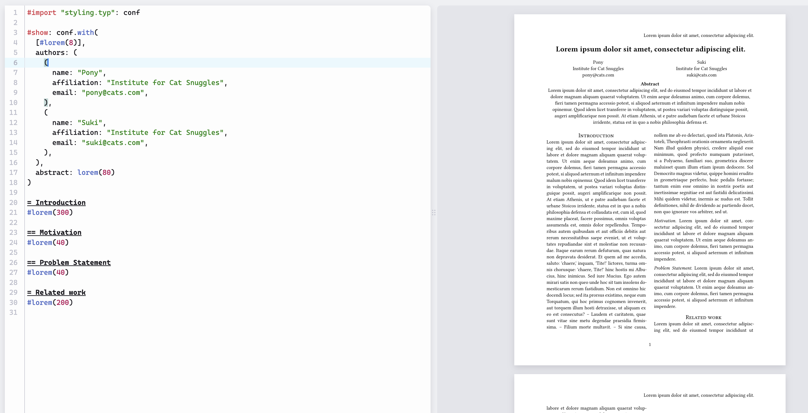
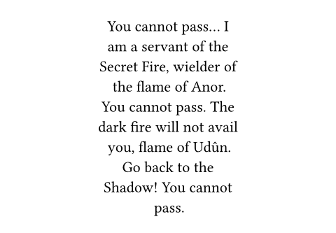
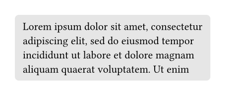
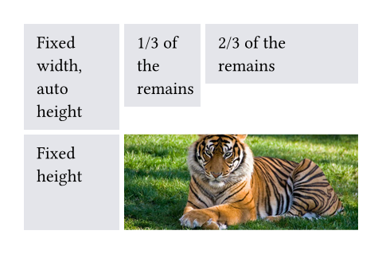
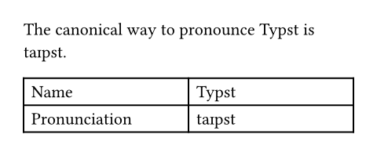
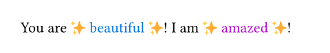
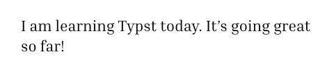
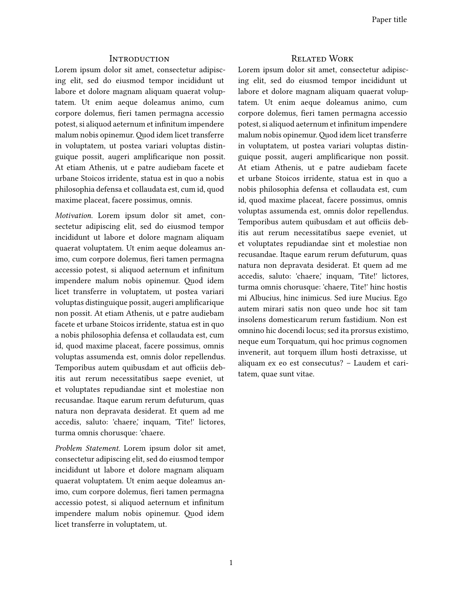
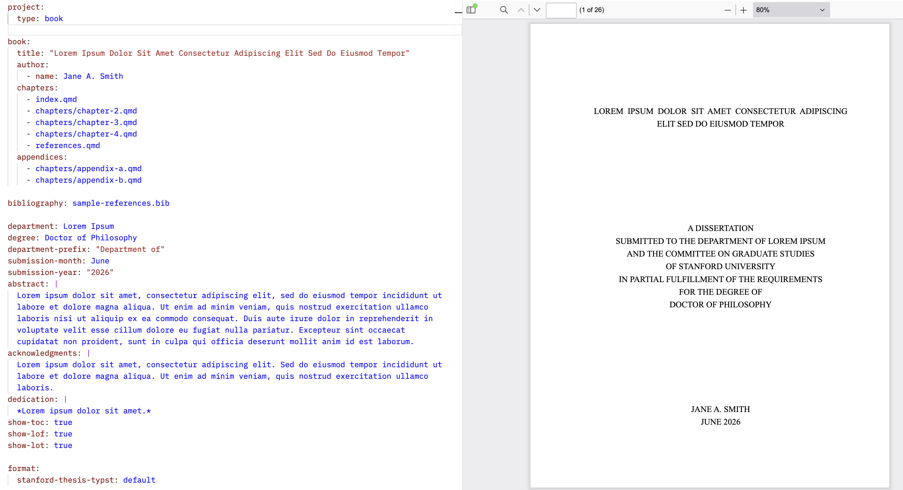
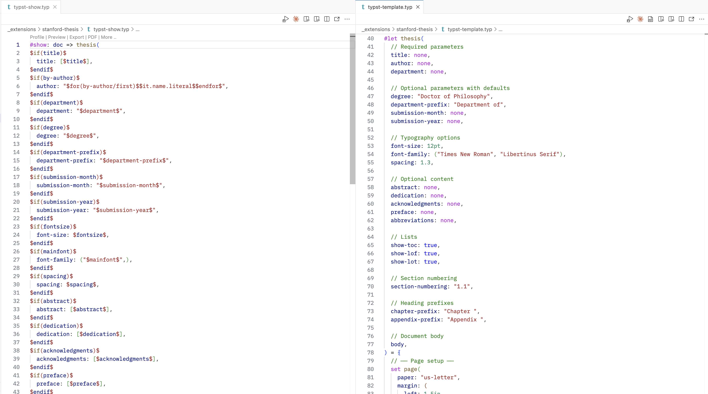

```{r}
#| label: setup
#| include: false
options(
  tibble.max_extra_cols = 6,
  tibble.width = 60
)
```

# Introduction to Typst {background-color="#23373B"}

## Typst



## Markdown vs. Typst {.small}

| Feature | Markdown | Typst |
|---|---|---|
| Heading 1 | `# Title` | `= Title` |
| Heading 2 | `## Title` | `== Title` |
| Bold | `**text**` | `*text*` |
| Italic | `*text*` | `_text_` |
| Ordered list | `1. item` | `+ item` |
| Link | `[text](url)` | `#link("url")[text]` |
| Image | `` | `#image("path")` |
| Blockquote | `> text` | `#quote[text]` |
| Horizontal rule | `---` | `#line(length: 100%)` |
| Strikethrough | `~~text~~` | `#strike[text]` |
| Comment | `<!-- comment -->` | `// comment` |

## Coding vs writing

* Typst has functions that work similar to other languages: `func(arg: value, arg: value)`
* A quirk of Typst is separating **markup mode** from **coding mode**. To use code in markup, we need `#`: `#func(arg: value, arg: value)`
* Conversely, to write markup in code, we need `[]`, e.g. `#func(arg: [Text -- to evaluate])`

## One more quirk

* Typst is a layout tool, so **many functions modify text**
* It's so common, Typst has a special syntax for it: `#func(arg: value)[text to modify]`

## Layout functions {.small}

| Function | Controls | Common Parameters |
|---|---|---|
| `page()` | Page size, margins, headers/footers | `paper`, `margin`, `numbering`, `header`, `footer` |
| `text()` | Font and text appearance | `font`, `size`, `fill`, `weight`, `lang` |
| `par()` | Paragraph spacing and indentation | `justify`, `leading`, `first-line-indent` |
| `heading()` | How headings are numbered and displayed | `numbering`, `outlined` |
| `document()` | PDF metadata | `title`, `author`, `date` |

## local vs global (`set`) vs specific (`show: set`) modification

* `#text(blue, size: 14pt, weight: "bold")[The cat sat on the espresso machine]`
* `#set text(fill: blue, size: 14pt, weight: "bold")`
* `#show heading: set text(fill: blue, size: 14pt, weight: "bold")`

## Show and set

::: {.columns}

::: {.column .small}
```typst
#set quote(block: true)
#show quote: set align(center)
#show quote: set pad(x: 5em)

#quote[
  You cannot pass... I am a servant of the Secret Fire,
  wielder of the flame of Anor. You cannot pass.
  The dark fire will not avail you, flame of Udûn.
  Go back to the Shadow! You cannot pass.
]
```
:::

::: {.column}
::: {.fragment}

:::
:::
:::

## Blocks

::: {.columns}

::: {.column .small}
```typst
#set page(height: 100pt)
#block(
  fill: luma(230),
  inset: 8pt,
  radius: 4pt,
  lorem(30),
)
```
:::

::: {.column}
::: {.fragment}

:::
:::
:::

## Grids

::: {.columns}

::: {.column .small}
```typst
// We use `rect` to emphasize the
// area of cells.
#set rect(
  inset: 8pt,
  fill: rgb("e4e5ea"),
  width: 100%,
)

#grid(
  columns: (60pt, 1fr, 2fr),
  rows: (auto, 60pt),
  gutter: 3pt,
  rect[Fixed width, auto height],
  rect[1/3 of the remains],
  rect[2/3 of the remains],
  rect(height: 100%)[Fixed height],
  grid.cell(
    colspan: 2,
    image("tiger.jpg", width: 100%),
  ),
)
```
:::

::: {.column}
::: {.fragment}

:::
:::
:::


## Rendering Typst documents

* Use the web app: <https://typst.app/>
* Use the cli: `typst compile your_file.typ`
* Use the [Tinymist extension](https://open-vsx.org/extension/myriad-dreamin/tinymist)

## *Your Turn 1*

### Work through Your Turn 1 in `exercises.qmd`

## Creating variables

::: {.columns}

::: {.column .small}
```typst
#let ipa = [taɪpst]

The canonical way to
pronounce Typst is #ipa.

#table(
  columns: (1fr, 1fr),
  [Name], [Typst],
  [Pronunciation], ipa,
)

```
:::

::: {.column}
::: {.fragment}

:::
:::
:::

## Creating functions

::: {.columns}

::: {.column .small}
```typst
#let amazed(term, color: blue) = {
  text(color, box[✨ #term ✨])
}

You are #amazed[beautiful]!
I am #amazed(color: purple)[amazed]!
```
:::

::: {.column}
::: {.fragment}

:::
:::
:::

## *Your Turn 2*

### Work through Your Turn 2 in `exercises.qmd`

## `show` and templates

::: {.columns}

::: {.column .small}
```typst
#let template(doc) = [
  #set text(font: "Inria Serif")
  #show "something cool": [Typst]
  #doc
]

#show: template
I am learning something cool today.
It's going great so far!

```
:::

::: {.column}
::: {.fragment}

:::
:::
:::

## `show` and templates

::: {.columns}

::: {.column .small}
```typst
#let conf(title, doc) = {
  set page(...)
  set par(...)
  set text(...)

  // other styling
  ...

  doc
}

#show: doc => conf(
  [Paper title],
  doc,
)

= Introduction
...
```
:::

::: {.column}
::: {.fragment}

:::
:::
:::

## Importing modules and packages

* `#import "another_file.typ": function_name, other_function`
* `func.with()` simplifies imported show templates: `show: func.with(arg: value)`
* [Typst Universe](https://typst.app/universe/): `#import "@preview/fletcher:0.5.8" as fletcher: diagram, node, edge`

## *Your Turn 3*

### Work through Your Turn 3 in `exercises.qmd`

# Using Typst with Quarto {background-color="#23373B"}

## Writing with the `format: typst`

* Everything we know about writing in Quarto applies to the Typst format!
* **Prefer Quarto syntax** (esp. markdown, cross-references, etc.) over Typst syntax unless there isn't a 1:1 match.

## Styling and metadata

::: {.columns}

::: {.column .small}
```yaml
---
title: Page Layout
format:
  typst:
    papersize: a5
    margin:
      x: 1cm
      y: 1cm
    columns: 2
---
```
:::

::: {.column width="10%"}
:::

::: {.column width="40%"}
::: {.fragment}


:::
:::
:::


## Typst blocks

```verbatim
::: {.block fill="luma(230)" inset="8pt" radius="4pt"}

This is a block with gray background and slightly rounded corners.

:::
```

* Quarto converts this into a `#block()` command

## Raw Typst

````verbatim
```{=typst}
#set par(justify: true)

== Background
...
```
````

## Creating new Quarto extensions

* Create new extensions with `quarto create extension format` and select the base format

## Custom formats based on Typst

* Key files: `template.qmd`, `_extension.yml`, `typst-show.typ`, and `typst-template.typ`
* Quarto takes the YAML from the document, uses a Pandoc template to create a show command with the YAML values injected, and joins that command with the template.

## `typst-template.typ`

* This has, at the very least, the **Typst function definition** that you will call on the document with `show: func.with(...)`

## `typst-show.typ`

* Not actually a Typst file! It's a **Pandoc template** that uses special syntax to inject the Quarto metadata from the YAML into the `show: func.with(...)` command
* Really horrible to read because it's neither Typst nor Quarto but *a secret third thing*

## Bonus: [Stanford Dissertation Template](https://github.com/StanfordHPDS/typst-stanford-thesis/)!



## Bonus: [Stanford Dissertation Template](https://github.com/StanfordHPDS/typst-stanford-thesis/)!



## Detour: Lua filters

* When Quarto renders a file, it sends input to Pandoc, and Pandoc creates output. In between, *Pandoc represents the document as an abstract syntax tree (AST)*
* Pandoc let's you modify the AST with **filters**. Many of Quarto's features are implemented as filters.
* Most filters are written in the **Lua** language

## *Your Turn 4*

### Work through Your Turn 4 in `exercises.qmd`

## Resources {background-color="#23373B" .extra-large}

[Typst documentation](https://typst.app/docs/)

[Quarto documentation on Typst](https://quarto.org/docs/output-formats/typst.html)

[Walkthrough of setting up a Quarto Typst template](https://rfortherestofus.com/2025/11/quarto-typst-pdf)
